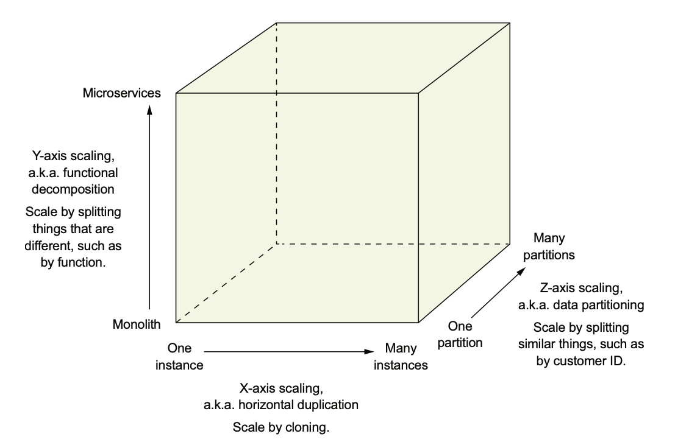
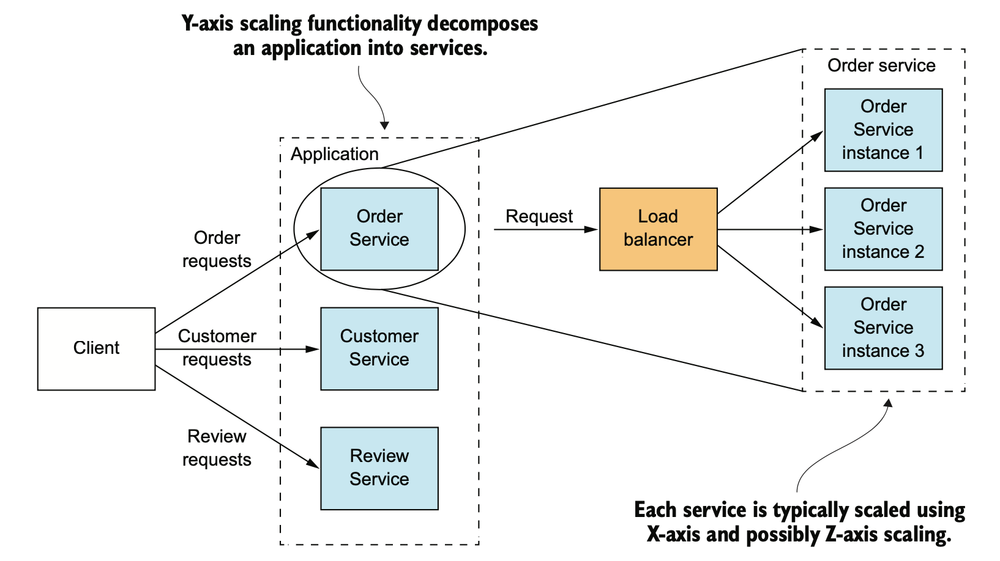
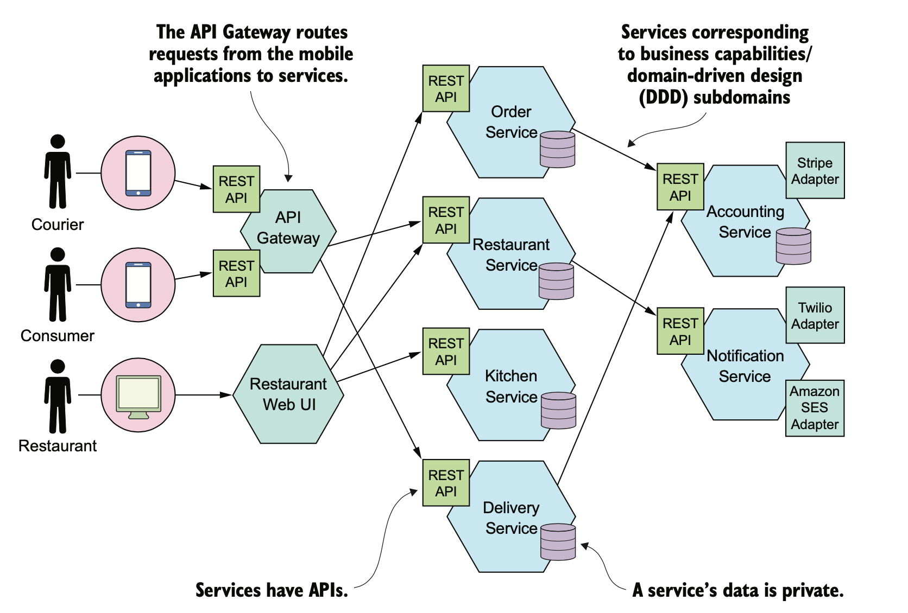
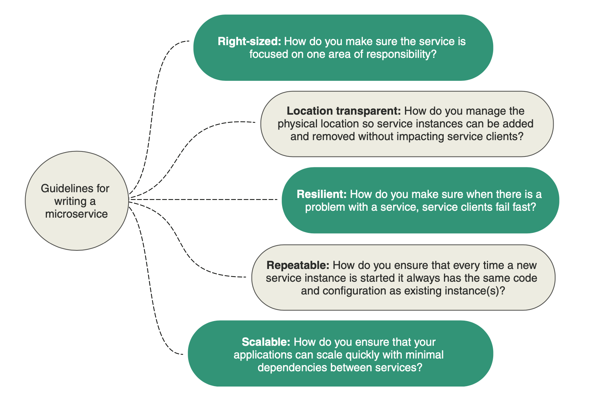
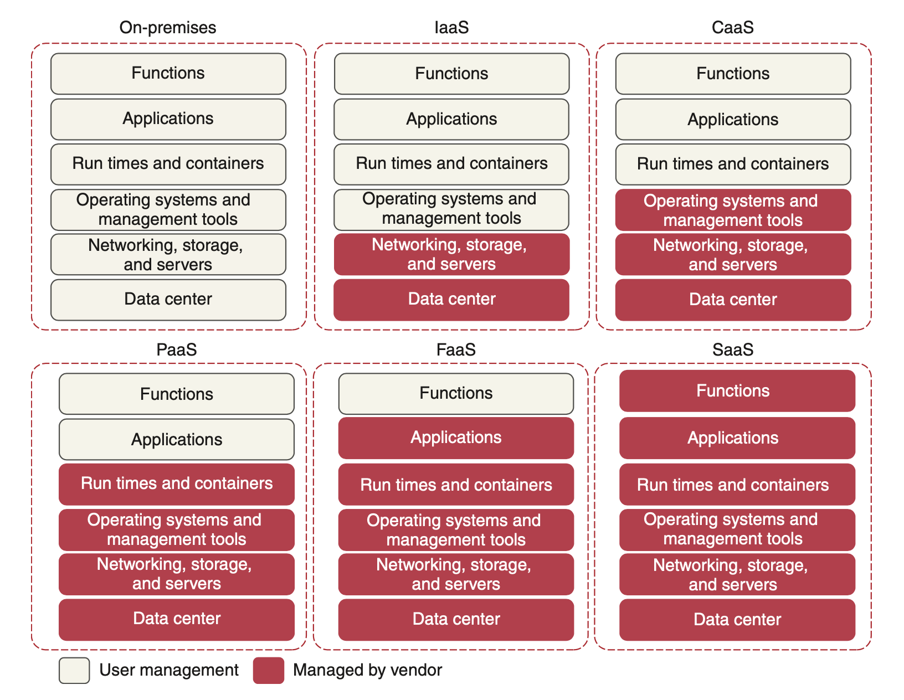

# Introduction to microservices

## Transitioning from monolithic to microservice architecture
### The benefits of the monolithic architecture
When applications are relatively small, the monolithic architecture has lots of benefits:
* **Simple to develop**: IDEs and other developer tools are focused on building a single application.
* **Easy to make radical changes to the application**: You can change the code and the database schema, build, and deploy.
* **Straightforward to test**: The developers wrote end-to-end tests that launched the application, invoked the REST API, and tested the UI with Selenium.
* **Straightforward to deploy**: All a developer had to do was copy the WAR file to a server that had Tomcat installed.
* **Easy to scale**: FTGO ran multiple instances of the application behind a load balancer.

### Living in monolithic hell

Successful applications like the FTGO application have a habit of outgrowing the monolithic architecture. Development is slow and painful. Agile development and deployment is impossible.

* **Development is slow**: Building the application takes a long time. Moreover, the application takes a long time to start up. As a result, the edit-build-run-test loop takes a long time, which badly impacts productivity.
* **Path from commit to deployment is long and arduous**: Updating production more than once a month seems like a distant dream. And adopting continuous deployment seems next to impossible (Amazon deploys every few seconds...).
* **Scaling is difficult**: Different application modules have conflicting resource requirements. However, because these modules are part of the same application, the company must compromise on the server configuration.
* **Delivering a reliable monolith is challenging**: Testing the application thoroughly is difficult, due to its large size. This lack of testability means bugs make their way into production.
* **Locked into increasingly obsolete technology stack**: The monolithic architecture makes it difficult to adopt new frameworks and languages. It would be extremely expensive and risky to rewrite the entire monolithic application so that it would use a new technology. 

### Microservice architecture to the rescue

Software architecture has very little to do with functional requirements. You can implement a set of use cases with any architecture. Architecture matters, however, because of how it affects the so-called quality of service requirements, also called **nonfunctional requirements**, or **quality attributes** 

On the one hand, a disciplined team can slow down the pace of its descent toward monolithic hell. On the other hand, they can’t avoid the issues of a large team working on a single monolithic application. 

Today, the growing consensus is that if you’re building a large, complex application, you should consider using the microservice architecture. Adrian Cockcroft, formerly of Netflix, defines a **microservice architecture as a service-oriented architecture composed of loosely coupled elements that have bounded contexts**.

### The Scale cube

X-axis scaling is a common way to scale a monolithic application. You run multiple instances of the application behind a load balancer. 

Z-axis scaling also runs multiple instances of the monolith application, but unlike X-axis scaling, each instance is responsible for only a subset of the data. An application might, for example, route requests using userId.

X- and Z-axis scaling improve the application’s capacity and availability. But neither approach solves the problem of increasing development and application complexity. To solve those, you need to apply Y-axis scaling, or functional decomposition. A service is a mini application that implements narrowly focused functionality. 

### Microservices as a form of modularity

Modularity is essential when developing large, complex applications. A modern application is too large to be developed by an individual. **Long-lived, monolithic applications usually degenerate into big balls of mud.**

The microservice architecture uses services as the unit of modularity. A service has an API, which is an impermeable boundary that is difficult to violate. **You can’t bypass the API and access an internal class as you can with a Java package**. As a result, it’s much easier to preserve the modularity of the application over time. 

A key characteristic of the microservice architecture is that the services are loosely coupled and communicate only via APIs. **One way to achieve loose coupling is by each service having its own datastore**.

## Benefits and drawbacks of the microservice architecture
The microservice architecture has the following benefits:
* It enables the continuous delivery and deployment of large, complex applications.
* Services are small and easily maintained.
* Services are independently deployable.
* Services are independently scalable.
* The microservice architecture enables teams to be autonomous.
* It allows easy experimenting and adoption of new technologies.
* It has better fault isolation.

The microservice architecture has the following drawbacks:
* Finding the right set of services is challenging.
* Distributed systems are complex, which makes development, testing, and deployment difficult.
* Deploying features that span multiple services requires careful coordination.
* Deciding when to adopt the microservice architecture is difficult.

## Microservices architecture language pattern
The adoption of a technology usually follows the Gartner hype cycle (https://en.wikipedia.org/wiki/Hype_cycle), in which an emerging technology goes through five phases, including the peak of inflated expectations (it rocks), followed by the trough of disillusionment (it sucks), and ending with the plateau of productivity (we now understand the trade-offs and when to use it).

The underlying reason for these polarized and hyped arguments about technology is that humans are primarily driven by their emotions. Jonathan Haidt, in his excellent book *The Righteous Mind: Why Good People Are Divided by Politics and Religion (Vintage, 2013)*, uses the metaphor of an elephant and its rider to describe how the human mind works. The elephant represents the emotion part of the human brain. It makes most of the decisions. The rider represents the rational part of the brain. It can sometimes influence the elephant, but it mostly provides justifications for the elephant’s decisions.

A great way to discuss and describe technology is to use the pattern format, because it’s objective. 

The value of a pattern, however, goes far beyond requiring you to consider the context of a problem. It forces you to describe other critical yet frequently overlooked aspects of a solution. A commonly used pattern structure includes three especially valuable sections:

* Forces
* Resulting context
* Related patterns

**Forces: the issues that you must address when solving a problem**

The forces section of a pattern describes the forces (issues) that you must address when solving a problem in a given context. Forces can conflict, so it might not be possible to solve all of them. Which forces are more important depends on the context. You have to prioritize solving some forces over others. For example, code must be easy to understand and have good performance. Code written in a reactive style has better performance than synchronous code, yet is often more difficult to understand.

**Resulting context: the consequences of applying a pattern**

The resulting context section of a pattern describes the consequences of applying the pattern. It consists of three parts:
* Benefits 
* Drawbacks
* Issues

**Related patterns: the five different types of relationships**

The related patterns section of a pattern describes the relationship between the pattern and other patterns. There are five types of relationships between patterns:
* Predecessor
* Successor
* Alternative
* Generalization
* Specialization

### Application architecture patterns

Which architecture should you choose for an application?

-   [Monolithic architecture](https://microservices.io/patterns/monolithic.html) - architect an application as a single deployable unit
-   [Microservice architecture](https://microservices.io/patterns/microservices.html) - architect an application as a collection of loosely coupled, services

### Decomposition

How to decompose an application into services?

-   [Decompose by business capability](https://microservices.io/patterns/decomposition/decompose-by-business-capability.html) - define services corresponding to business capabilities
-   [Decompose by subdomain](https://microservices.io/patterns/decomposition/decompose-by-subdomain.html) - define services corresponding to DDD subdomains
-   [Self-contained Service](https://microservices.io/patterns/decomposition/self-contained-service.html) - design services to handle synchronous requests without waiting for other services to respond
-   [Service per team](https://microservices.io/patterns/decomposition/service-per-team.html)

### Refactoring to microservices

-   [Strangler Application](https://microservices.io/patterns/refactoring/strangler-application.html)
-   [Anti-corruption layer](https://microservices.io/patterns/refactoring/anti-corruption-layer.html)

### Data management

How to maintain data consistency and implement queries?

-   [Database per Service](https://microservices.io/patterns/data/database-per-service.html) - each service has its own private database
-   [Shared database](https://microservices.io/patterns/data/shared-database.html) - services share a database
-   [Saga](https://microservices.io/patterns/data/saga.html) - use sagas, which a sequences of local transactions, to maintain data consistency across services
-   [Command-side replica](https://microservices.io/patterns/data/command-side-replica.html) - maintain a queryable replica of data in a service that implements a command
-   [API Composition](https://microservices.io/patterns/data/api-composition.html) - implement queries by invoking the services that own the data and performing an in-memory join
-   [CQRS](https://microservices.io/patterns/data/cqrs.html) - implement queries by maintaining one or more materialized views that can be efficiently queried
-   [Domain event](https://microservices.io/patterns/data/domain-event.html) - publish an event whenever data changes
-   [Event sourcing](https://microservices.io/patterns/data/event-sourcing.html) - persist aggregates as a sequence of events

### Transactional messaging

How to publish messages as part of a database transaction?

-   [Transactional outbox](https://microservices.io/patterns/data/transactional-outbox.html)
-   [Transaction log tailing](https://microservices.io/patterns/data/transaction-log-tailing.html)
-   [Polling publisher](https://microservices.io/patterns/data/polling-publisher.html)

### Testing

How to make testing easier?

-   [Consumer-driven contract test](https://microservices.io/patterns/testing/service-integration-contract-test.html) - a test suite for a service that is written by the developers of another service that consumes it
-   [Consumer-side contract test](https://microservices.io/patterns/testing/service-integration-contract-test.html) - a test suite for a service client (e.g. another service) that verifies that it can communicate with the service
-   [Service component sest](https://microservices.io/patterns/testing/service-component-test.html) - a test suite that tests a service in isolation using test doubles for any services that it invokes

### Deployment patterns

How to deploy an application’s services?

-   [Multiple service instances per host](https://microservices.io/patterns/deployment/multiple-services-per-host.html) - deploy multiple service instances on a single host
-   [Service instance per host](https://microservices.io/patterns/deployment/single-service-per-host.html) - deploy each service instance in its own host
-   [Service instance per VM](https://microservices.io/patterns/deployment/service-per-vm.html) - deploy each service instance in its VM
-   [Service instance per Container](https://microservices.io/patterns/deployment/service-per-container.html) - deploy each service instance in its container
-   [Serverless deployment](https://microservices.io/patterns/deployment/serverless-deployment.html) - deploy a service using serverless deployment platform
-   [Service deployment platform](https://microservices.io/patterns/deployment/service-deployment-platform.html) - deploy services using a highly automated deployment platform that provides a service abstraction

### Cross cutting concerns

How to handle cross cutting concerns?

-   [Microservice chassis](https://microservices.io/patterns/microservice-chassis.html) - a framework that handles cross-cutting concerns and simplifies the development of services
-   [Externalized configuration](https://microservices.io/patterns/externalized-configuration.html) - externalize all configuration such as database location and credentials
-   [Service Template](https://microservices.io/patterns/service-template.html) - a template that implements standard cross cutting concerns and is intended to be copied by a developer in order to quickly start developing a new service

### Communication patterns

#### Style

Which communication mechanisms do services use to communicate with each other and their external clients?

-   [Remote Procedure Invocation](https://microservices.io/patterns/communication-style/rpi.html) - use an RPI-based protocol for inter-service communication
-   [Messaging](https://microservices.io/patterns/communication-style/messaging.html) - use asynchronous messaging for inter-service communication
-   [Domain-specific protocol](https://microservices.io/patterns/communication-style/domain-specific.html) - use a domain-specific protocol
-   [Idempotent Consumer](https://microservices.io/patterns/communication-style/idempotent-consumer.html) - ensure that message consumers can cope with being invoked multiple times with the same message

#### External API

How do external clients communicate with the services?

-   [API gateway](https://microservices.io/patterns/apigateway.html) - a service that provides each client with unified interface to services
-   [Backend for front-end](https://microservices.io/patterns/apigateway.html) - a separate API gateway for each kind of client

#### Service discovery

How does the client of an RPI-based service discover the network location of a service instance?

-   [Client-side discovery](https://microservices.io/patterns/client-side-discovery.html) - client queries a service registry to discover the locations of service instances
-   [Server-side discovery](https://microservices.io/patterns/server-side-discovery.html) - router queries a service registry to discover the locations of service instances
-   [Service registry](https://microservices.io/patterns/service-registry.html) - a database of service instance locations
-   [Self registration](https://microservices.io/patterns/self-registration.html) - service instance registers itself with the service registry
-   [3rd party registration](https://microservices.io/patterns/3rd-party-registration.html) - a 3rd party registers a service instance with the service registry

#### Reliability

How to prevent a network or service failure from cascading to other services?

-   [Circuit Breaker](https://microservices.io/patterns/reliability/circuit-breaker.html) - invoke a remote service via a proxy that fails immediately when the failure rate of the remote call exceeds a threshold

### Security

How to communicate the identity of the requestor to the services that handle the request?

-   [Access Token](https://microservices.io/patterns/security/access-token.html) - a token that securely stores information about user that is exchanged between services

### Observability

How to understand the behavior of an application and troubleshoot problems?

-   [Log aggregation](https://microservices.io/patterns/observability/application-logging.html) - aggregate application logs
-   [Application metrics](https://microservices.io/patterns/observability/application-metrics.html) - instrument a service’s code to gather statistics about operations
-   [Audit logging](https://microservices.io/patterns/observability/audit-logging.html) - record user activity in a database
-   [Distributed tracing](https://microservices.io/patterns/observability/distributed-tracing.html) - instrument services with code that assigns each external request an unique identifier that is passed between services. Record information (e.g. start time, end time) about the work (e.g. service requests) performed when handling the external request in a centralized service
-   [Exception tracking](https://microservices.io/patterns/observability/exception-tracking.html) - report all exceptions to a centralized exception tracking service that aggregates and tracks exceptions and notifies developers.
-   [Health check API](https://microservices.io/patterns/observability/health-check-api.html) - service API (e.g. HTTP endpoint) that returns the health of the service and is intended to be pinged, for example, by a monitoring service
-   [Log deployments and changes](https://microservices.io/patterns/observability/log-deployments-and-changes.html)

### UI patterns

How to implement a UI screen or page that displays data from multiple services?

-   [Server-side page fragment composition](https://microservices.io/patterns/ui/server-side-page-fragment-composition.html) - build a webpage on the server by composing HTML fragments generated by multiple, business capability/subdomain-specific web applications
-   [Client-side UI composition](https://microservices.io/patterns/ui/client-side-ui-composition.html) - Build a UI on the client by composing UI fragments rendered by multiple, business capability/subdomain-specific UI components

## Beyond microservices

### Process and organization
For a large, complex application, the microservice architecture is usually the best choice. But in addition to having the right architecture, successful software development requires you to also have organization, and development and delivery processes.

**Team size:** The trouble with large teams is, as Fred Brooks wrote in The Mythical Man-Month, the communication overhead of a team of size N is O(N 2). The solution is to refactor a large single team into a team of teams. Each team is small (10 people), it has a clearly defined business-oriented mission, it is cross-functional and can develop, test, and deploy its services without having to frequently communicate or coordinate with other teams.

**Delivery process:** Using the microservice architecture with a waterfall development process is like driving a horse-drawn Ferrari. If you want to develop an application with the microservice architecture, it’s essential that you adopt agile development and deployment practices such as Scrum or Kanban. Better yet, you should practice continuous delivery/deployment, which is a part of DevOps.

The goal of continuous delivery/deployment (and, more generally, DevOps) is to rapidly yet reliably deliver software. Four useful metrics for assessing software development are as follows:
* Deployment frequency: How often software is deployed into production
* Lead time: Time from a developer checking in a change to that change being deployed
* Mean time to recover: Time to recover from a production problem
* Change failure rate: Percentage of changes that result in a production problem

**Organization structure**: In order to effectively deliver software when using the microservice architecture, you need to take into account [Conway’s law](https://en.wikipedia.org/wiki/Conway%27s_law), which states the following:

*Organizations which design systems [...] are constrained to produce designs which are copies of the communication structures of these organizations. - Melvin Conway*

In other words, your application’s architecture mirrors the structure of the organization that developed it. It’s important, therefore, to apply Conway’s law [in reverse](www.thoughtworks.com/radar/techniques/inverse-conway-maneuver) and design your organization so that its structure mirrors your microservice architecture. By doing so, you ensure that your development teams are as loosely coupled as the services.

### Microservices and Cloud computing
The cloud computing models let the user choose the level of control over the information and services that these provide. These models are known by their acronyms, and are generically referred to as XaaS—an acronym that means anything as a service.

* **Infrastructure as a Service (IaaS):** The vendor provides the infrastructure that lets you access computing resources such as servers, storage, and networks. In this model, the user is responsible for everything related to the maintenance of the infrastructure and the scalability of the application.
* **Container as a Service (CaaS):** An intermediate model between the IaaS and the PaaS, it refers to a form of container-based virtualization. Unlike an IaaS model, where a developer manages the virtual machine to which the service is deployed, with CaaS, you deploy your microservices in a lightweight, portable virtual container (such as Docker) to a cloud provider.
* **Platform as a Service (PaaS):** This model provides a platform and an environment that allow users to focus on the development, execution, and maintenance of the application. The applications can be created with tools that are provided by the vendor (for example, operating system, database management systems, technical support, storage, hosting, network, and more). Users do not need to invest in a physical infrastructure, nor spend time managing it, allowing them to concentrate exclusively on the development of applications.
* **Function as a Service (FaaS):** Also known as serverless architecture, despite the name, this architecture doesn’t mean running specific code without a server. What it means is a way of executing functionalities in the cloud in which the vendor provides all the required servers. Serverless architecture allows us to focus only on the development of services without having to worry about scaling, provisioning, and server administration.
* **Software as a Service (SaaS):** Also known as software on demand, this model allows users to use a specific application without having to deploy or to maintain it. In most cases, the access is through a web browser. Everything is managed by the ser- vice provider: application, data, operating system, virtualization, servers, storage, and network. The user just hires the service and uses the software.

For this course, all the microservices and corresponding service infrastructure will be deployed to a CaaS-based cloud provider using Docker containers:
* **Simplified infrastructure management:** CaaS cloud providers give you the ability to have more control over your services. New services can be started and stopped with simple API calls.
* **Massive horizontal scalability:** CaaS cloud providers allow you to quickly and succinctly start one or more instances of a service. This capability means you can quickly scale services and route around misbehaving or failing servers.
* **High redundancy through geographic distribution:** By necessity, CaaS providers have multiple data centers. By deploying your microservices using a CaaS cloud provider, you can gain a higher level of redundancy beyond using clusters in a data center.

### Microservices and Edge computing
The paradigm of edge computing has formed an innovative scope within the domain of the Internet of Things (IoT) through expanding the services of the cloud to the network edge to design distributed architectures and securely enhance decision-making applications. 

Due to their heterogeneous, distributed, and resource-constrained essence, edge applications are required to be developed as a set of lightweight and interdependent modules. As this concept aligns with the objectives of microservice architecture, effective implementation of microservices-based edge applications within IoT networks has the prospective of fully leveraging edge nodes capabilities. 

Furthermore, advances in Artificial Intelligence (AI) (especially Machine Learning), and the easy access to resources with powerful computing provide opportunities for deriving precise models and developing intelligent applications at the edge of network exploiting the same microservice architecture.

## Resources
- Microservices Patterns (Chapter 1)
- https://microservices.io/patterns/