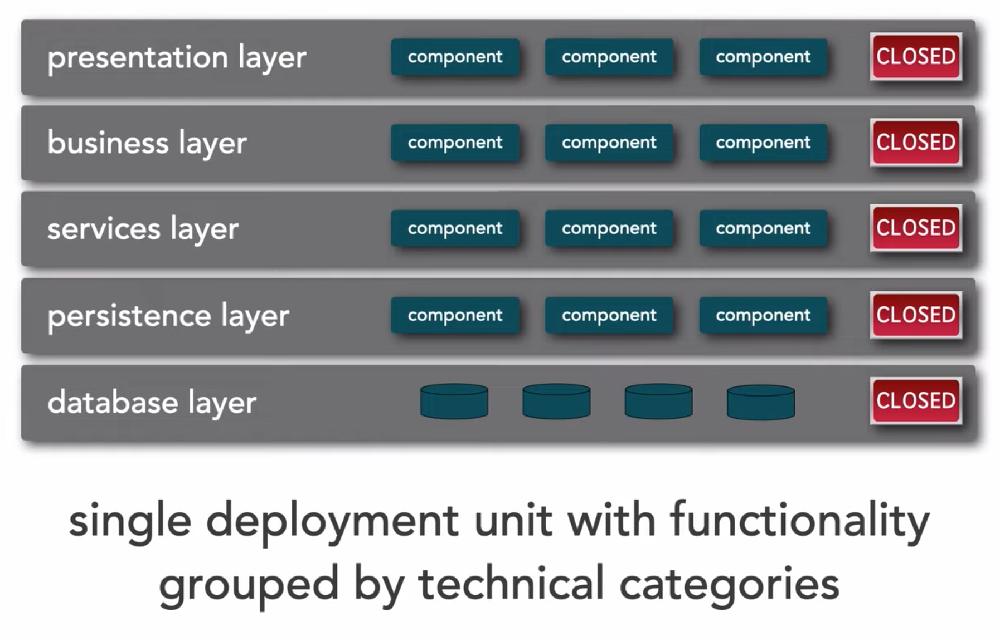
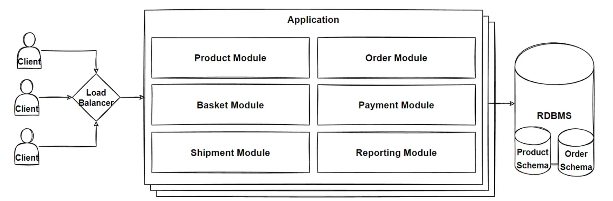
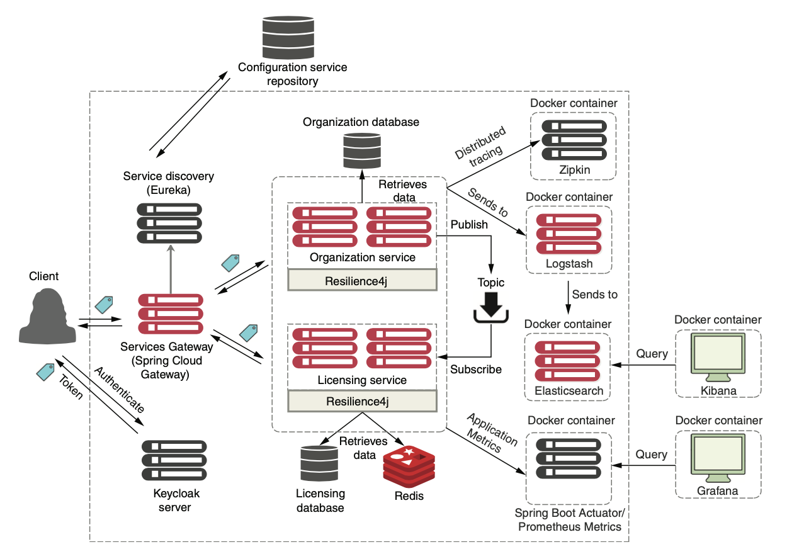

# Architectural styles

Sources: Microservices Patterns (Chapter 2), Fundamentals of Software Architectures (Chapters 9-), Beyond the Twelve-Factor App

## What is software architecture exactly?

There are numerous definitions of [software architecture](https://en.wikiquote.org/wiki/Software_architecture). Software architecture refers to all the fundamental parts that establish the structure, operation, and interaction between the software components. 
* It enables multiple people (or multiple teams) with possibly specialized knowledge to work productively together on an application.
* It defines how the software elements interact.

Len Bass and colleagues defined it as: *The software architecture of a computing system is the set of structures needed to reason about the system, which comprise software elements, relations among them, and properties of both. - Documenting Software Architectures by Bass et al.*

In the physical world, a building’s architecture often follows a particular style, such as Victorian, American Craftsman, or Art Deco. Each style is a package of design decisions that constrains a building’s features and building materials. 

[David Garlan and Mary Shaw - An Introduction to Software Architecture, January 1994](https://www.cs.cmu.edu/afs/cs/project/able/ftp/intro_softarch/intro_softarch.pdf), pioneers in the discipline of software architecture, and defines an **architectural style** as follows: 

*An architectural style, then, defines a family of such systems in terms of a pattern of structural organization. More specifically, an architectural style determines the vocabulary of components and connectors that can be used in instances of that style, together with a set of constraints on how they can be combined.*

### The 4+1 view model of software architecture

Watch: [Visualising software architecture with the C4 model](https://www.youtube.com/watch?v=x2-rSnhpw0g&t=11s)

An application’s architecture can be viewed from multiple perspectives, in the same way that a building’s architecture can be viewed from structural, plumbing, electrical, and other perspectives (www.cs.ubc.ca/~gregor/teaching/papers/4+1view-architecture.pdf). The 4+1 model, defines four different views of a software architecture. Each describes a particular aspect of the architecture and consists of a particular set of software elements and relationships between them.

The 4+1 view model is an excellent way to describe an applications’s architecture. Each view describes an important aspect of the architecture, and the scenarios illustrate how the elements of a view collaborate.

### Why change the way we build applications?
With a broader global customer base also comes worldwide competition. More competition impacts the way developers need to think about building applications. For example:
* **Complexity has gone way up**: Customers expect that all parts of an organization know who they are. But “siloed” applications that talk to a single database and don’t integrate with other applications are no longer the norm. 
* **Customers want faster delivery**: Customers no longer want to wait for the next annual release of a software package. Instead, they expect the features in a soft- ware productDto to be unbundled so that new functionality can be released quickly in a matter of weeks (or even days).
* **Customers also demand reliable performance and scalability**: Global applications make it extremely difficult to predict how many transactions are going to be handled by an application and when that transaction volume is going to hit. Applications need to scale up quickly across multiple servers, then scale back down seamlessly when the volume has passed.
* **Customers expect their applications to be available**: Because customers are one click away from a competitor, a company’s applications must be highly resilient. Failures or problems in one part of the application shouldn’t bring down the entire application.

### Monolithic VS Distributed Architectures

Architecture styles can be classified into two main types: **monolithic** (single deployment unit of all code) and **distributed** (multiple deployment units connected through remote access protocols). 

**Monolithic**
* Big Ball of Mud
* N-Layered architecture
* Clean Architecture
* Pipeline architecture
* Microkernel architecture
* Modular monolithic architecture

**Distributed**
* Service-based architecture
* Event-driven architecture
* Space-based architecture 
* Service-oriented architecture
* Microservices architecture

## Monolithic Architecture

Many small-to-medium web-based applications are built using a monolithic architec- tural style. In a monolithic architecture, an application is delivered as a single deploy- able software artifact. All of the UI, business, and database access logic are packaged together into a unique application and deployed to an application server. 

Although monolithic applications are sometimes described in negative terms by proponents of microservices architecture, these are often a great choice. Monoliths are easier to build and deploy than more complex architectures like n-tier or micro- services. If your use case is well defined and unlikely to change, it can be a good decision to start with a monolith.

**When an application begins to increase in size and complexity, however, monoliths can become difficult to manage**. Each change to a monolith can have a cascading effect on other parts of the application, which may make it time consuming and expensive, especially in a production system. 

### Big Ball of Mud
*A Big Ball of Mud is a haphazardly structured, sprawling, sloppy, duct-tape-and-baling-wire, spaghetti-code jungle. These systems show unmistakable signs of unregulated growth, and repeated, expedient repair. Information is shared promiscuously among distant elements of the system, often to the point where nearly all the important information becomes global or duplicated.*

*The overall structure of the system may never have been well defined.*

*If it was, it may have eroded beyond recognition. Programmers with a shred of architectural sensibility shun these quagmires. Only those who are unconcerned about architecture, and, perhaps, are comfortable with the inertia of the day-to-day chore of patching the holes in these failing dikes, are content to work on such systems.*

*Brian Foote and Joseph Yoder*

Each dot on the perimeter of the circle represents a class, and each line represents connections between the classes, where bolder lines indicate stronger connections. In this code base, any change to a class makes it difficult to predict rippling side effects to other classes, making change a terrifying affair.

### N-Layered architecture

One common type of enterprise architecture is the multi-layered or n-tier architecture. With this design, an applications is divided into multiple layers, each with their own responsibilities and functions, such as UI, services, data, testing, and so forth.

Benefits:
* N-tier applications offer good separation of concerns, making it possible to consider areas like UI (user interface), data, and business logic separately.
* It’s easy for teams to work independently on different components of n-tier applications.
* Because this is a well-understood enterprise architecture, it’s relatively easy to find skilled developers for n-tier projects.

Drawbacks:
* You must stop and restart the entire application when you want to make a change.
* Messages tend to pass up and down through the layers, which can be inefficient.
* Once it’s deployed, refactoring a large n-tier application can be difficult.

When to use:
* When developing simple, small applications, it is advisable to implement a layered architecture because it’s the most simple framework. 
* Can be used for applications that need to be built quickly because it’s easy to learn and implement. It is also good in cases where the developers do not have a lot of knowledge of software architectures or when they are undecided on which one to use.

### Clean Architecture
### Pipeline architecture
### Microkernel architecture
### Modular Monolithic Architecture

Instead of using layered architecture with horizontal logical layers, we can organize our code across vertical slices of business functionality.These slices are determined based on business demands, rather than enforced by technical constraints.When we add or change a feature in an application, our changes are scoped to the area of business concern not technical logical layers.

Modular monolithic architecture divides application logic into independent and isolated modules with business logic, database schema. Each module can follow their own logical separations, layered architecture style or clean architecture. Modules are represents Bounded Context of our application domain and we group features of Domain contexts in modules.

Modules can be a potential microservices when need to independently deployed and scale in the future refactorings our architecture.

Benefits:
* **Encapsulate Business Logic**: Business logics are encapsulated in Modules and it enables high reusability, while data remains consistent and communication patterns simple.
* **Reusable Codes, Easy to Refactor**: For large development teams, developing modular components of an application will increase reusability. Modular components can be reused that can help teams establish a single source of truth.
* **Better-Organized Dependencies**: With modular monoliths architecture, application dependencies will be more organized and visible. This will help developers to easily assess which parts of the application require which dependencies.
* **Better for teams**: Easier for developers to work on different parts of the code. with Modular Monolithic architecture, we can divide our developer teams effectively and implement business requirements with minimum affect to each other.

Drawbacks:
* **Can't diversifying technology**: Modular monoliths don't provide all benefits of microservices. If you need to diversifying technology and language choices, you can't do it with Modular Monolithic Architecture. These types of polyglot technology stacks can't use with Modular Monolithic Architecture.
* **Can't Scale and Deploy Independently**: Since the application is a single unit, it can't be scale separated parts or deploy independently like microservices. And this kind of applications has to move microservices due to reaching out scalability limits and also performance issues.

When to use:
* **Strict Consistency is Mandatory Cases**: For many companies unable to make the move to microservices, due to their database and data not appreciate for distributed architecture. For example if your application store high important data like debit on bank account, then you need strong data consistency that means your data should be correct for every time, if you got any exception you have to rollback immediately.
* **Modernization**: If you already have a big complex monolithic application running, the modular monolith is the perfect architecture to help you refactor your code to get ready for a potential microservices architecture. Instead of jumping into microservices, you can move modular monolithic without effecting your business and get benefits like speed up with a well-factored modular monolith.
* **Green Field Projects**: A modular monolith allow you to learn your domain and pivot your architecture much faster than a microservices architecture. You won't have to worry about things like Kubernetes and a services mesh at day1. Your deployment topology will be drastically simplified.

## Distributed Architecture

### Service-based architecture

### Event-driven architecture

### Space-based architecture

### Service Oriented Architecture

### Microservices Architecture

A microservice is a small, loosely coupled, distributed service. Microservices let you take an extensive application and decompose it into easy-to-manage components with narrowly defined responsibilities. Microservices help combat the traditional problems of complexity in a large codebase by decomposing it down into small, well-defined pieces.
* Microservices are built around business capabilities and independently deployable by fully automated deployment process.
* Microservices architecture decomposes an application into small independent services that communicate over well-defined APIs. Services are owned by small, self-contained teams.
* Microservices architecture is a cloud native architectural approach in which services composed of many loosely coupled and independently deployable smaller components.
* Microservices have their own technology stack, communicate to each other over a combination of REST APIs, are organized by business capability, with the bounded contexts.
* Following Single Responsibility Principle that referring separating responsibilities as per services.

Benefits:
* **Agility, Innovation and Time-to-market**: Microservices architectures make applications easier to scale and faster to develop, enabling innovation and accelerating time-to-market for new features.
* **Flexible Scalability**: Microservices can be scaled independently, so you scale out sub-services that require less resources, without scaling out the entire application.
* **Small and separated code base**: Microservices are not sharing code or data stores with other services, it minimizes dependencies, and that makes easier to adding new features.
* **Easy Deployment**: Microservices enable continuous integration and continuous delivery, making it easy to try out new ideas and to roll back if something doesn’t work.
* **Technology agnostic, Right tool for the job**: Small teams can pick the technology that best fits their microservice and using a mix of technology stacks on their services.
* **Resilience and Fault isolation**: Microservices are fault tolerance and handle faults correctly for example by implementing retry and circuit breaking patterns.
* **Data isolation**: Databases are separated with each other according to microservices design. Easier to perform schema updates, because only a single database is affected.

Drawbacks:
* **Complexity**: Each service is simpler, but the entire system is more complex. Deployments and Communications can be complicated for hundreds of microservices.
* **Network problems and latency**: Microservice communicate with inter-service communication, we should manage network problems. Chain of services increase latency problems and become chatty API calls.
* **Development and testing**: Hard to develop and testing these E2E processes in microservices architectures if we compare to monolithic ones.
* **Data integrity**: Microservice has its own data persistence. Data consistency can be a challenge. Follow eventual consistency where possible.
* **Deployment**: Deployments are challenging. Require to invest in quite a lot of devops automation processes and tools. The complexity of microservices becomes overwhelming for human deployment.
* **Logging & Monitoring**: Distributed systems are required to centralized logs to bring everything together. Centralized view of the system to monitor sources of problems.
* **Debugging**: Debugging through local IDE isn’t an option anymore. It won’t work across dozens or hundreds of services.

When to Use:
* **Make Sure You Have a “Really Good Reason” for Implementing Microservices**: Check if your application can do without microservices. When your application requires agility to time-to-market with zero-down time deployments and updated independently that needs more flexibility.
* **Iterate With Small Changes and Keep the Single-Process Monolith as Your “Default”**: Sam Newman and Martin Fowler offers Monolithic-First approach. Single-process monolithic application comes with simple deployment topology. Iterate and refactor with turning a single module from the monolith into a microservices one by one.
* **Required to Independently Deploy New Functionality with Zero Downtime**: When an organization needs to make a change to functionality and deploy that functionality without affecting rest of the system.
* **Required to Independently Scale a Portion of Application**: Microservice has its own data persistence. Data consistency can be a challenge. Follow eventual consistency where possible.
* **Data Partitioning with different Database Technologies**: Microservices are extremely useful when an organization needs to store and scale data with different use cases. Teams can choose the appropriate technology for the services they will develop over time.
* **Autonomous Teams with Organizational Upgrade**: Microservices will help to evolve and upgrade your teams and organizations. Organizations need to distribute responsibility into teams, where each team makes decisions and develops software autonomously.

When NOT to Use:

* **Don’t do Distributed Monolith**: Make sure that you decompose your services properly and respecting the decoupling rule like applying bounded context and business capabilities principles. Distributed Monolith is the worst case because you increase complexity of your architecture without getting any benefit of microservices.
* **Don’t do microservices without DevOps or cloud services**: Microservices are embrace the distributed cloud-native approaches. And you can only maximize benefits of microservices with following these cloud-native principles.
  * CI/CD pipeline with devops automation
  * Proper deployment and monitoring tools
  * Managed cloud services to support your infrastructure
  * Key enabling technologies and tools like Containers, Docker, and Kubernetes
  * Following async communications using Messaging and event streaming services
* **Limited Team sizes, Small Teams**: If you don’t have a team size that cannot handle the microservice workloads, This will only result in the delay of delivery. For a small team, a microservice architecture can be hard to justify, because team is required just to handle the deployment and management of the microservices themselves.
* **Brand new products or startups**: If you are working on a new startup or brand new productDto which require significant change when developing and iterating your productDto, then you should not start with microservices. Microservices are so expensive when you re-design your business domains. Even if you do become successful enough to require a highly scalable architecture.

## Improve Your Monolith Before Transitioning to Microservices
https://semaphoreci.com/blog/monolith-microservices

## The Twelve Factor App

Watch: [What is 12-Factor App?](https://www.youtube.com/watch?v=1OhmRmMsGdQ)

One of the early pioneers laying claim to territory in the public cloud market was [Heroku](https://www.heroku.com/). It offered to host your application for you, and all you had to do was build your application and push it via git, and then the cloud took over, and your application magically worked online.

The problem was that most people simply had no idea how to build applications in a way that was *cloud friendly*.

To solve this problem (and to increase their own platform adoption), a group of people within Heroku developed the [12 Factors](https://12factor.net/) in 2012. This is essentially a manifesto describing the rules and guide‐lines that needed to be followed to build a cloud-native applications.

### Codebase
One codebase tracked in revision control, many deploys

### Dependencies
Explicitly declare and isolate dependencies

### Configuration
Store configuration in the environment

### Backing Services
Treat backing services as attached resources

### Build, release, run
Strictly separate build and run stages

### Processes
Execute the app as one or more stateless processes

### Port binding
Export services via port binding

### Concurrency
Scale out via the process model

### Disposability
Maximize robustness with fast startup and graceful shutdown

### Dev/prod parity
Keep development, staging, and production as similar as possible

### Logs
Treat logs as event streams

### Admin processes
Run admin/management tasks as one-off processes

## Fallacies of distributed computing

Watch: [Fallacies of Distributed Systems](https://www.youtube.com/watch?v=8fRzZtJ_SLk&list=PL1DZqeVwRLnD3EjyciYAO82dT9Owiq8I5)

### Fallacy #1: The Network is reliable
Developers and architects alike assume that the network is reliable, but it is not. While networks have become more reliable over time, the fact of the matter is that networks still remain generally unreliable.

This is significant for all distributed architectures because all distributed architecture styles rely on the network for communication to and from services, as well as between services.

### Fallacy #2: Latency is zero
Latency in any distributed architecture is not zero, yet most architects ignore this fallacy, insisting that they have fast networks. Ask yourself this question: do you know what the average round-trip latency is for a RESTful call in your production environment? Is it 60 milliseconds? Is it 500 milliseconds?

Assuming an average of 100 milliseconds of latency per request, chaining together 10 service calls to perform a particular business function adds 1,000 milliseconds to the request! Knowing the average latency is important, but even more important is also knowing the 95th to 99th percentile. While an average latency might yield only 60 milliseconds (which is good), the 95th percentile might be 400 milliseconds!

### Fallacy #3: Bandwidth is infinite
Bandwidth is usually not a concern in monolithic architectures, because once processing goes into a monolith, little or no bandwidth is required to process that business request. 

However, once systems are broken apart into smaller deployment units (services) in a distributed architecture such as microservices, communication to and between these services significantly utilizes bandwidth, causing networks to slow down, thus impacting latency (fallacy #2) and reliability (fallacy #1).

### Fallacy #4: The network is secure
Most architects and developers get so comfortable using virtual private networks (VPNs), trusted networks, and firewalls that they tend to forget about this fallacy of distributed computing: the network is not secure. Security becomes much more challenging in a distributed architecture.

### Fallacy #5: The topology never changes
“This fallacy refers to the overall network topology, including all of the routers, hubs, switches, firewalls,networks, and appliances used within the overall network. Architects assume that the topology is fixed and never changes. Of course it changes. It changes all the time!

Architects must be in constant communication with operations and network administrators to know what is changing and when so that they can make adjustments accordingly to reduce the type of surprise previously described. This may seem obvious and easy, but it is not. As a matter of fact, this fallacy leads directly to the next fallacy.

### Fallacy #6: There is only one administrator
Architects all the time fall into this fallacy, assuming they only need to collaborate and communicate with one administrator. There are dozens of network administrators in a typical large company. Who should the architect talk to with regard to latency (“Fallacy #2: Latency Is Zero”) or topology changes (“Fallacy #5: The Topology Never Changes”)? 

This fallacy points to the complexity of distributed architecture and the amount of coordination that must happen to get everything working correctly. Monolithic applications do not require this level of communication and collaboration.

### Fallacy #7: Transport cost is zero
Many software architects confuse this fallacy for latency (“Fallacy #2: Latency Is Zero”). Transport cost here does not refer to latency, but rather to actual cost in terms of money associated with making a “simple RESTful call.” Architects assume (incorrectly) that the necessary infrastructure is in place and sufficient for making a simple RESTful call or breaking apart a monolithic application. It is usually not. 

Distributed architectures cost significantly more than monolithic architectures, primarily due to increased needs for additional hardware, servers, gateways, firewalls, new subnets, proxies, and so on.

### Fallacy #8: The network is homogeneous
Most architects and developers assume a network is homogeneous—made up by only one network hardware vendor. Nothing could be farther from the truth. 

Not all situations, load, and circumstances have been fully tested, and as such, network packets occasionally get lost. This in turn impacts network reliability (“Fallacy #1: The Network Is Reliable”), latency assumptions and assertions (“Fallacy #2: Latency Is Zero”), and assumptions made about the bandwidth (“Fallacy #3: Bandwidth Is Infinite”). 

