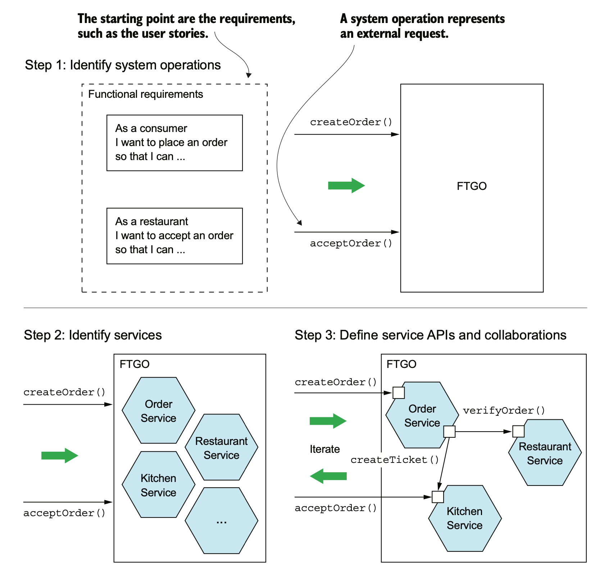
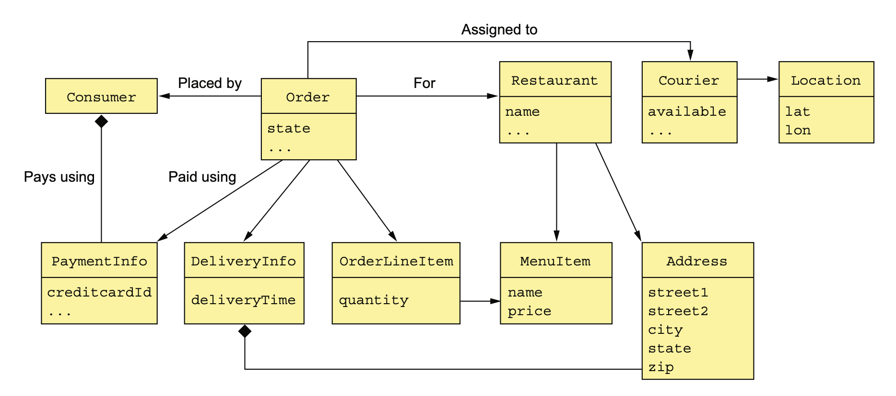

# Decomposition Strategies

Sources: Microservices Patterns (Chapter 2), Spring Microservices in Action (Chapter 3)

## What is a service?
**A service is a standalone, independently deployable software component that implements some useful functionality**. 

A service has an API that provides its clients access to its functionality. There are two types of operations: commands and queries. The API consists of commands, queries, and events. 
* A command, such as createOrder(), performs actions and updates data. 
* A query, such as findOrderById(), retrieves data. 
* A service also publishes events, such as OrderCreated, which are consumed by its clients.

Each service in a microservice architecture has its own architecture and, potentially, technology stack. 


## What is loose coupling?
An important characteristic of the microservice architecture is that the services are [loosely coupled](https://en.wikipedia.org/wiki/Loose_coupling). All interaction with a service happens via its API, which encapsulates its implementation details. 

Loosely coupled services are key to improving an application’s development time attributes, including its maintainability and testability. 

The requirement for services to be loosely coupled and to collaborate only via APIs prohibits services from communicating via a database. You must treat a service’s persistent data like the fields of a class and keep them private. Keeping the data private enables a developer to change their service’s database schema without having to spend time coordinating with developers working on other services.

## The role of shared libraries
Developers often package functionality in a library (module) so that it can be reused by multiple applications without duplicating code. 

On one hand, using a library eliminates code duplication. On the other hand, you would need to simultaneously rebuild and redeploy those services. 

A much better approach would be to implement functionality that’s likely to change, such as Order management, as a service and use libraries for functionality that’s unlikely to change. 

## The size of a service matters?
One problem with the term microservice is that the first thing you hear is **micro**. This suggests that a service should be very small. In reality, size isn’t a useful metric.

A much better goal is to define a well-designed service to be a service capable of being developed by a **small team with minimal lead time and with minimal collaboration with other teams**. 

**A team might only be responsible for a single service**, so that service is by no means micro. If a service requires a large team or takes a long time to test, it probably makes sense to split the team and the service. 

If you constantly need to change a service because of changes to other services or if it’s triggering changes in other services, that’s a sign that it’s not loosely coupled. You might even have built a distributed monolith.

## The architect view

The first step is to determine system operations. A system operation is an abstraction of a request that the application must handle. It’s either a command, which updates data, or a query, which retrieves data. The behavior of each command is defined in terms of an abstract domain model, which is also derived from the requirements. 

The second step is to determine the decomposition into services. There are several strategies to choose from. One strategy, which has its origins in the discipline of business architecture, is to define services corresponding to business capabilities. Another strategy is to organize services around domain-driven design sub-domains. 

The third step in defining the application’s architecture is to determine each service’s API. To do that, you assign each system operation identified in the first step to a service. A service might implement an operation entirely by itself. Alternatively, it might need to collaborate with other services.



### Identify Operations

Place Order story:
```
Given a consumer
  And a restaurant
  And a delivery address/time that can be served by that restaurant
  And an order total that meets the restaurant's order minimum
When the consumer places an order for the restaurant
Then consumer's credit card is authorized
  And an order is created in the PENDING_ACCEPTANCE state
  And the order is associated with the consumer
  And the order is associated with the restaurant
```

Accept Order story:
```
Given an order that is in the PENDING_ACCEPTANCE state
  and a courier that is available to deliver the order
When a restaurant accepts an order with a promise to prepare by a particular
     time
Then the state of the order is changed to ACCEPTED
  And the order's promiseByTime is updated to the promised time
  And the courier is assigned to deliver the order
```



The responsibilities of each class are as follows:
* Consumer: A consumer who places orders.
* Order: An order placed by a consumer. It describes the order and tracks its status.
* OrderLineItem: A line item of an Order.
* DeliveryInfo: The time and place to deliver an order.
* Restaurant: A restaurant that prepares orders for delivery to consumers.
* MenuItem: An item on the restaurant’s menu.
* Courier: A courier who deliver orders to consumers. It tracks the availability of the courier and their current location.
* Address: The address of a Consumer or a Restaurant.
* Location: The latitude and longitude of a Courier.

### Identify Services

#### Decompose by sub-domain pattern
This pattern uses a domain-driven design (DDD) subdomain to decompose monoliths. This approach breaks down the organization’s domain model into separate subdomains that are labeled as core (a key differentiator for the business), supporting (possibly related to business but not a differentiator), or generic (not business-specific). 

This pattern is appropriate for existing monolithic systems that have well-defined boundaries between subdomain-related modules. This means that you can decompose the monolith by repackaging existing modules as microservices but without significantly rewriting existing code. Each subdomain has a model, and the scope of that model is called a bounded context. Microservices are developed around this bounded context.

Advantages	
* Loosely coupled architecture provides scalability, resilience, maintainability, extensibility, location transparency, protocol independence, and time independence.
* Systems become more scalable and predictable.

Disadvantages
* Can create too many microservices, which makes service discovery and integration difficult.
* Business subdomains are difficult to identify because they require an in-depth understanding of the overall business.


#### Decompose by business capability
You can use your organization's business process or capabilities to decompose a monolith. A business capability is what a business does to generate value (for example, sales, customer service, or marketing). Typically, an organization has multiple business capabilities and these vary by sector or industry. Use this pattern if your team has enough insight into your organization's business units and you have subject matter experts (SMEs) for each business unit. 

Advantages
* Generates a stable microservices architecture if the business capabilities are relatively stable.
* Development teams are cross-functional and organized around delivering business value instead of technical features.
* Services are loosely coupled.

Disadvantages
* Application design is tightly coupled with the business model.
* Requires an in-depth understanding of the overall business, because it can be difficult to identify business capabilities and services.


#### Decompose by transactions
In a distributed system, an application typically has to call multiple microservices to complete one business transaction. To avoid latency issues or two-phase commit problems, you can group your microservices based on transactions. This pattern is appropriate if you consider response times important and your different modules do not create a monolith after you package them. The following table explains the advantages and disadvantages of using this pattern.

Advantages	
* Faster response times.
* You don’t need to worry about data consistency.
* Improved availability.

Disadvantages
* Multiple modules can be packaged together, and this can create a monolith.
* Multiple functionalities are implemented in a single microservice instead of separate microservices, which increases cost and complexity.
* Transaction-oriented microservices can grow if the number of business domains and dependencies among them is high.
* Inconsistent versions might be deployed at the same time for the same business domain.


#### Single Responsibility Principle (SRP)

**A class should have only one reason to change - Robert C. Martin**

Each responsibility that a class has is a potential reason for that class to change. If a class has multiple responsibilities that change independently, the class won’t be stable. By following the SRP, you define classes that each have a single responsibility and hence a single reason for change. We can apply SRP when defining a microservice architecture and create small, cohesive services that each have a single responsibility. 

This will reduce the size of the services and increase their stability. 


#### Common Closure Principle (CCP)

**The classes in a package should be closed together against the same kinds of changes. A change that affects a package affects all the classes in that package - Robert C. Martin**

The idea is that if two classes change in lockstep because of the same underlying reason, then they belong in the same package. 

We can apply CCP when creating a microservice architecture and package components that change for the same reason into the same service:
* Minimize the number of services that need to be changed and deployed when some requirement changes
* A change will only affect a single team and a single service. CCP is the antidote to the distributed monolith anti-pattern.

#### Obstacles to decomposing an application into services

On the surface, the strategy of creating a microservice architecture by defining services corresponding to business capabilities or subdomains looks straightforward. You may, however, encounter several obstacles:
* Network latency
* Reduced availability due to synchronous communication
* Maintaining data consistency across services
* Obtaining a consistent view of the data
* God classes preventing decomposition

### Identify Services APIs

## The DevOps view

While DevOps is a rich and emerging IT field, for the DevOps engineer, the design of the microservice is all about managing the service after it goes into production. Writ- ing the code is often the easy part. Keeping it running is the hard part. 

The four principles can be mapped to the following operational lifecycles. 
* **Service assembly**: How you package and deploy your service to guarantee repeatability and consistency so that the same service code and run time are deployed exactly the same way.
* **Service bootstrapping**: How you separate your application and environment-specific configuration code from the run-time code so that you can start and deploy a microservice instance quickly in any environment without human intervention.
* **Service registration/discovery**: When a new microservice instance is deployed, how you make the new service instance discoverable by other application clients.
* **Service monitoring**: In a microservice environment, it’s common for multiple instances of the same service to be running due to high availability needs. You need to monitor microservice instances and ensure that any faults are routed around failing service instances, and that these are taken down.

### Service assembly: Packaging and deploying 

Multiple instances of a microservice can be deployed quickly in response to a changed application environment (for example, a sudden influx of user requests, problems within the infrastructure, and so on). 

**A microservice needs to be packaged and installable as a single artifact with all of its dependencies defined within it.** These dependencies must also include the run-time engine (for example, an HTTP server or application container) that hosts the microservice.


### Service bootstrapping: Managing configuration of your microservices
You might have hundreds or even thousands of microservice instances running. Further complicating this is that the services might be spread across the globe. With a high number of geographically dispersed services, it becomes unfeasible to redeploy your services to pick up new configuration data. Storing the data in a data store external to the service solves this problem.
* Configuration data tends to be simple in structure and is usually read frequently and written infrequently. Relational databases are overkill in this situation.
* Because the data is accessed on a regular basis but changes infrequently, the data must be readable with a low level of latency.
* The data store has to be highly available and close to the services reading the data. A configuration data store can’t go down completely because it would become a single point of failure for your application.


### Service registration and discovery: How clients communicate with your microservices

 Cloud-based services can be started and torn down quickly with an entirely new IP address assigned to the server on which the services are running.

 By insisting that services are treated as short-lived disposable objects, microservice architectures can achieve a high degree of scalability and availability by having multiple instances of a service running. 

 A microservice instance needs to register itself with a third-party agent. This registration process is called service discovery. When a microservice instance registers with a service discovery agent, it tells the discovery agent two things: the physical IP address and a logical name that an application can use to look up the service.


 ### Communicating a microservice’s health

 In a microservice application, you’ll often have multiple instances of a running service. Sooner or later, one of those service instances will fail. The service discovery agent monitors the health of each service instance registered with it and removes any failing service instances from its routing tables to ensure that clients aren’t sent a service instance that has failed.

After a microservice comes up, the service discovery agent will continue to monitor and ping the health check interface to ensure that that service is available. 

