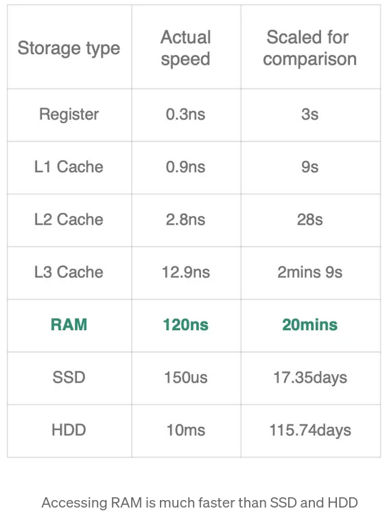
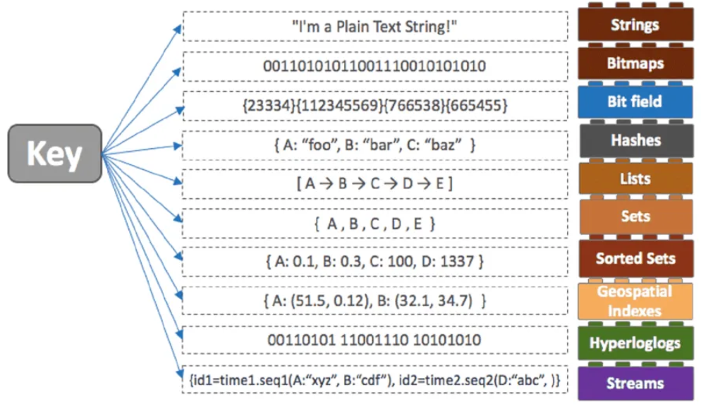
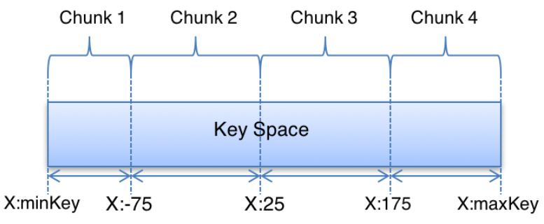
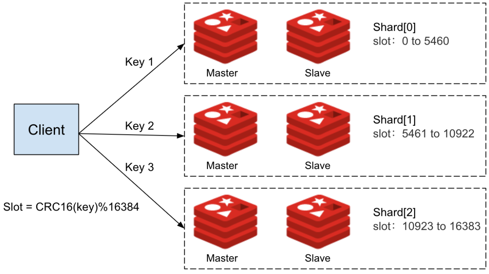
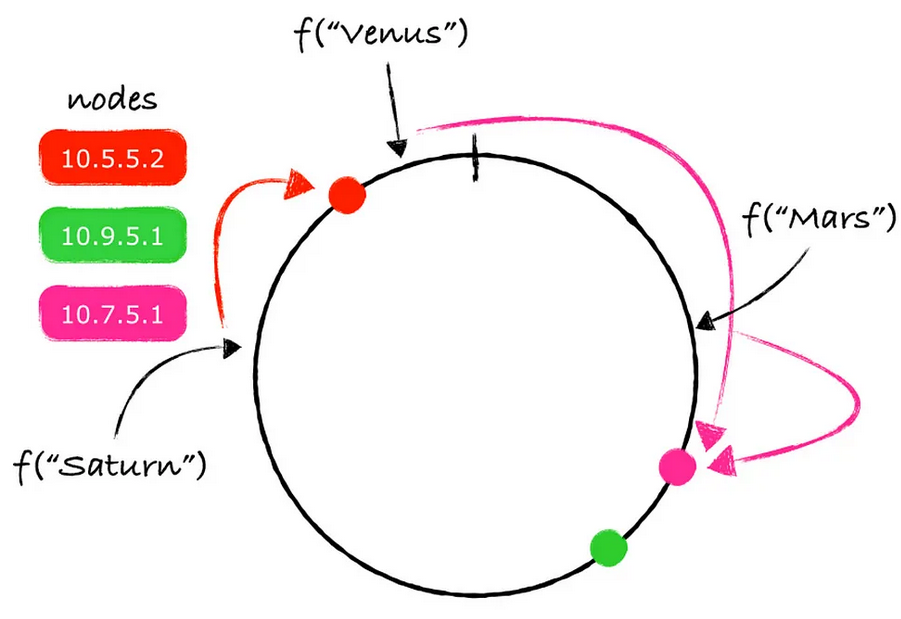

# Distributed Caching

## What is Redis
Redis is an acronym for “Remote Dictionary Server”: it is an **open source in-memory distributed Key-Value** store and so works directly in-memory (RAM) rather than like traditional databases that operate on secondary storage such as SSDs or Hard Disks. For this reason, Redis offers much better performance in terms of data read/write speed, significantly **reducing latency**.



As we will discuss later, Redis is not only used as a **primary storage** (database) but it is also a versatile tool that can be used for **resource caching**, implementing a **publisher/subscriber system** and can operate both on a single device and in a **distributed** manner by utilizing multiple Redis instances that cooperate with each other.

## How does Redis works internally
From a functional point of view, Redis uses a **single-thread** approach. The reason for this implementation choice lies in the fact that in this way, Redis can execute its operations precisely and sequentially, simplifying the process of handling multiple requests from different threads, which could otherwise lead to slowdowns. Specifically, if we consider a multi-thread architecture, the threads need to share the CPU cache; for this reason, if thread-1 has data of interest in the cache but thread-2 replaces it with other data it needs, the thread-1 would encounter a cache-miss and would need to re-read the data from secondary memory.

Working in single-thread mode, one might think that Redis's performance is insufficient for modern needs. What makes it performant is the concept of **I/O Multiplexing**, which makes Redis an event-driven system. Specifically, this mechanism allows Redis not to block on a specific connection while waiting for a future request. Instead, through the use of system calls like *select()* and *poll()*, it waits for an event to occur on any of its connections, thus not blocking on any particular one. As soon as someone makes a request, that request is executed immediately.

## Redis as primary Database or Cache 
As mentioned at the beginning, Redis is an in-memory store which precisely allows data to be salved on RAM. Depending on the configuration you want to create, Redis can be used **both as a database and as a caching** tool. Initially one might think that since RAM is volatile memory, this does not make much sense to associate it with a database that by nature should keep data independent of power; for this reason you will obviously encounter a trade-off between performance and data persistence.

Before going to see when you can use Redis as a cache or as a primary database, you have to go and consider how Redis handles data persistence being a tool that works in RAM and therefore does not maintain any persistence by default:

* **No persistence**: our data is only available while the server is running, and if for some reason the server was terminated or rebooted our data is lost.

* **RDB (Redis Database)**: Redis saves a snapshots of its data at specific time intervals. We can use the snapshot to restore data, but we will lose changes made after the snapshot was created. RDB snapshots provide **good disk space** efficiency.

* **AOF (Append-Only File)**: every write operation to Redis is logged, and the log can be used to reconstruct the data. Depending on the how frequently commands are synced to the log, we can expect decrease in server performance.  AOF is **more durable but can be larger in size**.

* **Hybrid persistence**: Redis allows you to use a combination of RDB and AOF for both efficiency and durability.

Based on which of these configurations you want to use, you are going to specify whether Redis will be used as a cache and therefore without peristance or as a database and therefore with some way of saving data.

* **Cache**: if you want to use Redis as a cache, this means putting it next to a database such as MySQL that goes to use secondary memory as data persistence; in this configuration Redis allows you to increase the performance of applications because you store in RAM the data that are accessed more frequently having them already available in case they are requested again.

* **Database**: if you want to use Redis as your primary storage tool, you must first understand the needs of the application. Specifically, if we are dealing with an application that works with important data such as banking data or in scenarios where the amount of data grows very quickly, obviously Redis cannot be used as a database. However, if we are dealing with a scenario where our application works with constantly changing data, or the amount of data is limited, or data loss is not very significant, then in this case it makes sense to use it as a database, taking advantage of the minimal latency provided by RAM.

## Data Structures in Redis
The data is organized using **key-value pairs**, where keys are unique identifiers, and values can be of different types as we will see later. Data in Redis is accessed by keys, making it a highly efficient and simple data store.



Among the many data types supported by redis, those that are used most are:

* **String**: a String can hold any kind of data like a string, a serialized object, int\float number or even a JPEG image.

* **Lists**: this represents a linked list of strings that can be accessed either by push/pop (complexity O(1)) and by index (complexity O(n)). This are commonly used for building Queues, but can be useful for storing any series of timeline events like a user recently visit pages or application background jobs.

* **Sets**: it is a unique collection of strings and so adding the same item multiple times to a Set will result in having a single copy of this item in the Set. Sets are useful when we need to store only unique items like exception types from our logs.

* **Sorted Sets**: each element is associated with a score and elements are ordered by their Score. Adding new element is expensive operation O(log(N)) since Sets are kept ordered. Sorted sets are commonly used for building leader boards.

* **Hashes**: Map of key-value pairs, similar to Java HashMap, but the value in Redis hash is also a string and cannot hold nested objects. Hashes are commonly use to represent objects like a User, but we won’t be able to store nested objects like a user Profile.

## Atomicity of operations and Transactions
In addition to having a wide range of data types, Redis also allows it to be used from the command line or working with some programming languages. Important note is the fact that since Redis is single-thread, **each individual operation is atomic** and therefore cannot be interrupted by any other, thus going to simplify operation. In particular, among the main operations we have:

### KEY-VALUE operations

* ***SET***: Sets the value of the specified key.

    ```
    SET <key> <value>

    Example:
    SET name "pippo"
    ```

* ***GET***: Retrieves the value associated with the specified key.

    ```
    GET <key>

    Example:
    GET name
    > "pippo"
    ```

* ***EXIST***: Checks if the specified key exists in the database.

    ```
    EXIST <key>

    Example:
    EXIST name
    ```

* ***DEL***: Deletes one or more keys and their associated values.

    ```
    DEL <key> [<key> …]

    Example:
    DEL name
    ```

### LISTS operations

* ***LPUSH***: Adds a new element to the head of a list.

    ```
    LPUSH <key> <element> [<element> ...]

    Example:
    LPUSH bikes:repairs bike:1
    ```

* ***RPUSH***: Adds a new element to the tail of a list.

    ```
    RPUSH <key> <element> [<element> ...]

    Example:
    RPUSH bikes:repairs bike:1
    ```

* ***LPOP***: Removes and returns an element from the head of a list.

    ```
    LPOP <key>

    Example:
    LPUSH bikes:repairs bike:1 bike:2
    LPOP bikes:repairs
    > "bike:2"
    ```

* ***RPOP***: Removes and returns an element from the tail of a list.

    ```
    RPOP <key>

    Example:
    LPUSH bikes:repairs bike:1 bike:2
    RPOP bikes:repairs
    > "bike:1"
    ```

### SETS operations

* ***SADD***: Creates a set, and adds element to it.

    ```
    SADD <set_name> <element> [<element> ...]

    Example:
    sadd SocialMedia Facebook Twitter WhatsApp
    ```

* ***SMEMBERS***: Shows all the elements, present in that set.

    ```
    SMEMBERS <set_name>

    Example:
    SMEMBERS SocialMedia
    > 1) "Facebook" 
    > 2) "Twitter"
    > 3) "WhatsApp"
    ```

* ***SCARD***: Shows number of elements present in that set.

    ```
    SCARD <set_name>

    Example:
    SCARD SocialMedia
    > 3
    ```

### HASHES operations

* ***HSET***: Sets the value of a field in a Hash.

    ```
    HSET <key> <field> <value>

    Example:
    HSET user:123 name “Charlie”
    HSET user:123 country “USA”
    ```

* ***HGETALL***: Retrieves all fields and values of a Hash.
    
    ```
    HGETALL <key>
    
    Example:
    HGETALL user:123
    > 1) “name”
    > 2) “Charlie”
    > 3) “country”
    > 4) “USA”
    ```

* ***HDEL***: Deletes one or more fields from a Hash.

    ```
    HDEL <key> <field1> [<field2> … <fieldN>]

    Example:
    HDEL user:123 country
    HGETALL user:123
    > 1) “name”
    > 2) “Charlie”
    ```

### Transactions

A very interesting feature of Redis is the ability to be able to combine multiple operations and execute them all together as if they were a single atomic operation that will succeed only if they all succeed; this is called **transaction** and this is how it works:

```
MULTI
<Redis commands>
EXEC

Example:
MULTI
SET name “Alice”
HSET user:123 username “Alice”
EXEC
```

Next we are going to look at how to run the following commands ***either through CLI or java***, and all the codes are available in the *'code/spring-with-Redis'* folder.

### Operations with CLI

In case we want to interact with the Redis server, what we need to do is to go and use the Redis docker image and create a *docker-compose.yml* file in which we put the following code in it:

```
services:

  ...

  redis:
    image: redis:latest
    mem_limit: 512m
    ports:
      - "6379:6379"
    healthcheck:
      test: [ "CMD", "redis-cli", "ping" ]
      interval: 5s
      timeout: 2s
      retries: 60
```

afterwards we launch the server and next we go to see the ID of the container we just created:

```
docker compose up -d && docker ps
``` 

```
CONTAINER ID   IMAGE                       COMMAND                  CREATED         STATUS                            PORTS                                       NAMES
4ae21a9327cd   redis:latest                "docker-entrypoint.s…"   5 seconds ago   Up 4 seconds (health: starting)   0.0.0.0:6379->6379/tcp, :::6379->6379/tcp   spring-with-redis-redis-1
...
```

finally via the following command, we are going to interact via command line with the container on which the Redis server is located:

```
docker exec -it 4ae21a9327cd redis-cli
```

Once that was done we could contact Redis and run all the commands seen above:

```
127.0.0.1:6379> ping
PONG
```

In case we want to connect to the Redis server from outside the container, we need to install the *redis-cli* command which is part of the *redis* package;

```
dnf install redis
```

afterwards once we launch the container as seen above, we connect like this:

```
redis-cli -h redis -p 6379
```

and then we can interact with the command-line

```
redis:6379> ping
PONG
```

### Operations with Java

Of course, all these operations with Redis can be done not only from the command line by communicating directly with the Redis server, but also through Java.

What we are going to do is go and create a service that will basically interact with the Redis server and perform a sequence of operations. First we're going to go and create a +docker-compose.yml* file as in the previous example where we'll have our service and Redis:

```
services:

  product:
    build: product-service-end
    mem_limit: 512m
    environment:
      - SPRING_PROFILES_ACTIVE=docker

  redis:
    image: redis:latest
    mem_limit: 512m
    ports:
      - "6379:6379"
    healthcheck:
      test: [ "CMD", "redis-cli", "ping" ]
      interval: 5s
      timeout: 2s
      retries: 60
```

since our service needs to connect to Redis in order to interact, there is a need to introduce the following dependencies in its *pom.xml*:

```
...
<dependency>
	<groupId>redis.clients</groupId>
	<artifactId>jedis</artifactId>
	<version>5.1.2</version>
</dependency>
...

```

finally we can connect to Redis and execute all the commands seen above:

```java
...
import redis.clients.jedis.Jedis;
import redis.clients.jedis.Transaction;

@SpringBootApplication
public class ProductServiceApplication implements CommandLineRunner {
	public static void main(String[] args) {
		SpringApplication.run(ProductServiceApplication.class, args);
	}

	@Override
	public void run(String... args) {

		// connection to the Redis server
		Jedis redis = new Jedis("redis", 6379);

		// KEY-VALUE operations
		System.out.println("-----------------------------KEY-VALUE operation.");
		System.out.println("Insert key 'name'");
		redis.set("name", "pippo");
		System.out.println("The value of 'name' is : " + redis.get("name"));
		System.out.println("Does the key 'name' exist before 'del' operation? : " + redis.exists("name"));
		redis.del("name");
		System.out.println("Does the key 'name' exist after 'del' operation? : " + redis.exists("name"));

		// LISTS operations
		System.out.println("-----------------------------LISTS operation.");
		System.out.println("Insert 'bike:1' to the head");
		redis.lpush("bikes:repairs", "bike:1");
		System.out.println("Insert 'bike:2' to the tail");
		redis.rpush("bikes:repairs", "bike:2");
		System.out.println("Take element from the head : " + redis.lpop("bikes:repairs"));
		System.out.println("Take element from the tail : " + redis.rpop("bikes:repairs"));

		// SETS operations
		System.out.println("-----------------------------SETS operation.");
		System.out.println("Create set 'SocialMedia'");
		redis.sadd("SocialMedia", "Facebook", "Twitter", "Whatsapp");
		System.out.println("The elements of the set are : " + redis.smembers("SocialMedia"));
		System.out.println("The number of elements of the set are : " + redis.scard("SocialMedia"));

		// HASHES operations
		System.out.println("-----------------------------SETS operation.");
		System.out.println("Create hash 'user:123' with 'name' and 'country'");
		redis.hset("user:123", "name", "Charlie");
		redis.hset("user:123", "country", "USA");
		System.out.println("The elements of the hash before 'del country' operation are : " + redis.hgetAll("user:123"));
		redis.hdel("user:123", "country");
		System.out.println("The elements of the hash after 'del country' operation are : " + redis.hgetAll("user:123"));

		// Transactions
		System.out.println("-----------------------------Transactions.");
		System.out.println("Start sequence of operations:");
		Transaction t = redis.multi();
		System.out.println("Create 'set' operatin;");
		t.set("name", "Alice");
		System.out.println("Create 'haset' operatin;");
		t.hset("user:123", "username", "Alice");
		System.out.println("Execute sequence of operations : " + t.exec());
	}
}

```

we can use the following commands to run the program:

```
mvn clean package -Dmaven.test.skip=true
docker compose build
docker compose up
```

and at the end we get the following result:

```
Output:

product-1  | -----------------------------KEY-VALUE operation.
product-1  | Insert key 'name'
product-1  | The value of 'name' is : pippo
product-1  | Does the key 'name' exist before 'del' operation? : true
product-1  | Does the key 'name' exist after 'del' operation? : false
product-1  | -----------------------------LISTS operation.
product-1  | Insert 'bike:1' to the head
product-1  | Insert 'bike:2' to the tail
product-1  | Take element from the head : bike:1
product-1  | Take element from the tail : bike:2
product-1  | -----------------------------SETS operation.
product-1  | Create set 'SocialMedia'
product-1  | The elements of the set are : [Twitter, Facebook, Whatsapp]
product-1  | The number of elements of the set are : 3
product-1  | -----------------------------SETS operation.
product-1  | Create hash 'user:123' with 'name' and 'country'
product-1  | The elements of the hash before 'del country' operation are : {name=Charlie, country=USA}
product-1  | The elements of the hash after 'del country' operation are : {name=Charlie}
product-1  | -----------------------------Transactions.
product-1  | Start sequence of operations:
product-1  | Create 'set' operatin;
product-1  | Create 'haset' operatin;
product-1  | Execute sequence of operations : [OK, 1]
```

## Redis Partitioning
As we said at the beginning, Redis in addition to being used on a single machine, it also lends itself very well to working in **distributed scenarios**. In paticular, what you will have is a cluster of Redis nodes that cooperate with each other (Gossip Protocol) to know which node has certain data and whether all other nodes are available or not. 

Among the advantages of having a cluster of Redis nodes and not a single instance are:

* **Improved Performance**: By spreading the data and workload across multiple Redis nodes, you can distribute the computational load and reduce the memory and CPU pressure on a single instance. This leads to improved response times and lower latencies, ensuring that your Redis-based applications remain responsive even as they grow.

* **Scalability**: As your application’s data and traffic increase, you can easily add more Redis nodes to the cluster to handle the load. Redis partitioning allows you to scale horizontally, which is often more cost-effective and simpler than vertical scaling (upgrading a single, larger server).

* **High Availability**: Redis partitioning enhances fault tolerance. If one node fails, the remaining nodes can continue to serve data, minimizing downtime and ensuring your application remains available.

* **Isolation**: By partitioning your data, you can isolate different types of data or different customers into separate Redis nodes, providing improved security and reducing the risk of data contamination.

Redis partitioning involves dividing your dataset into smaller subsets, known as **shards**, and distributing these shards across multiple Redis nodes. Each shard contains a portion of the keys and data. The partitioning strategy often depends on the use case and the key distribution of your data. Some **common partitioning strategies** include:

* **Range-Based Partitioning**: In range-based partitioning, you define ranges of keys based on some criteria (e.g., key prefixes or key values), and each range is assigned to a specific Redis node. This approach is useful when you can predict the distribution of keys across your dataset.

    

* **Hash-Based Partitioning**: Hash-based partitioning involves applying a hash function to each key to determine which Redis node will store it. This method provides an even distribution of keys across nodes but may require redistributing data when nodes are added or removed.

    

    The naive approach is to hash the key to an integer and do a modulo based on the size of the server set. For a given key, this should return the same, random server from the set every time. This works great if the server set never changes but when you **change the server set**, the modulo value for most of the key hashes changes. This means that client goes to the wrong server, the lookup misses and that expensive operation you are caching needs to be performed again.

* **Consistent Hashing**: Consistent hashing is a popular partitioning method in distributed systems. It minimizes data movement when adding or removing nodes, making it more efficient for **dynamic clusters**.

    

## Publisher/Subscriber
Another point in favor of Redis is the fact that it allows the implementation of a Pub/Sub system in which **asynchronous communications** can take place between one or more publishers and subscribers. The operation consists of publishers sending messages/events to a particular **channel**; on the other side there will be subscribers who have subscribed to the channels they are interested in and once a new message is available, it is immediately sent to them.


Among the main features we have:

* Being that messages get forwarded immediately to their respective subscribers, this makes Redis useful in **Real-Time scenarios**.

* Redis **guarantees the order** in which messages are received by subscribers within the same channel. Messages are delivered in the order they were published.

* Messages in Redis Pub/Sub are **not persistent**. Once a message is sent and received by all subscribers, it is not stored in Redis.

* Redis Pub/Sub is **lightweight and highly scalable**. It can handle a large number of publishers and subscribers efficiently.

To implement a simple pub/sub system we have the following commands:

* ***PUBLISH***: command to send messages to channels.
    
    ```
    PUBLISH <channel> <message>

    Example:
    PUBLISH chat:general “Hello, everyone!”
    ```

* ***SUBSCRIBE***: command to start listening to one or more channels.

    ```
    SUBSCRIBE <channel> [<channel> ...]

    Example:
    SUBSCRIBE chat:general
    ```
    
    When a message arrives, it will contain the channel it comes from and the content.

    ```
    Example:
    messagechannel: chat:general data: “Hello, everyone!”
    ```

* ***UNSUBSCRIBE***: to unsubscribe from specific channels.

    ```
    UNSUBSCRIBE <channel> [<channel> ...]

    Example:
    UNSUBSCRIBE chat:general
    ```

## Resources
* [What is Redis and how does it work internally](https://medium.com/@ayushsaxena823/what-is-redis-and-how-does-it-work-cfe2853eb9a9)
* [Everything You Need to Know About Redis](https://medium.com/codex/7-redis-features-you-might-not-know-bab8c9beb2c)
* [Redis as a database](https://medium.com/wix-engineering/redis-as-a-database-f9df579b09c0)
* [Introduction to Redis](https://www.geeksforgeeks.org/introduction-to-redis-server/)
* [Redis explained](https://architecturenotes.co/p/redis)
* [Redis operations](https://www.tutorialspoint.com/redis/redis_quick_guide.htm)
* [Problem of Hash-based partitioning](http://www.mikeperham.com/2009/01/14/consistent-hashing-in-memcache-client/)
