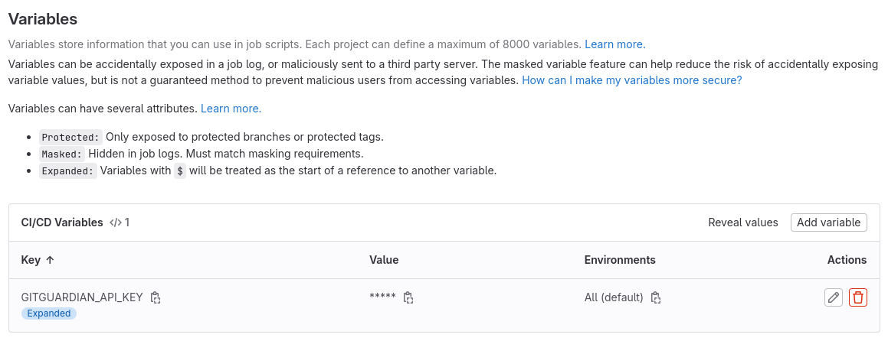
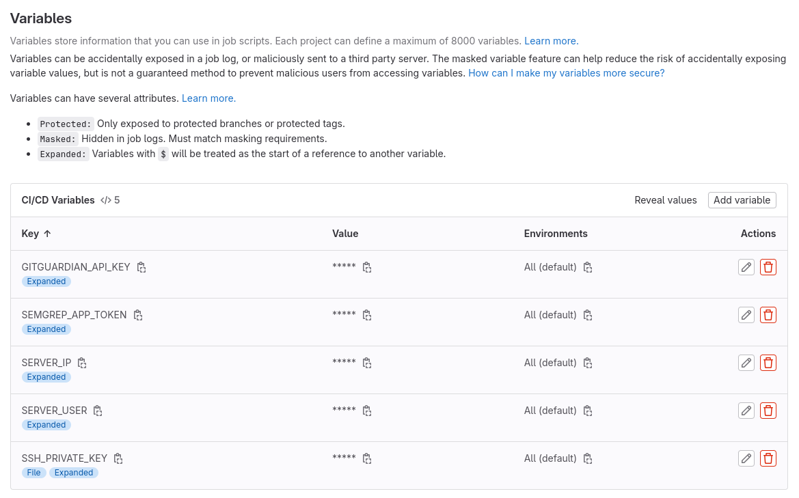

# DevOps, DevSecOps & Pre-commit hooks (GitLab CI, GitGuardian, SemGrep, Trivy, Google Cloud VM)

## Introduction

For this tutorial we will use the [Microservices with Spring Boot and Spring Cloud Third Edition's Chapter 6 code](https://github.com/PacktPublishing/Microservices-with-Spring-Boot-and-Spring-Cloud-Third-Edition/tree/main/Chapter06).

We will impersonate the developing team of the **product-service** microservice and build a **DevSecOps pipeline** for our service.

The entire code will be finally publish inside a **Google Cloud VM** in the deploy stage of our pipeline.

## GitLab CI

In order to complete all the required fundamentals of full CI/CD, many CI platforms rely on integrations with other tools to fulfill those needs. Many organizations have to maintain costly and complicated toolchains in order to have full CI/CD capabilities. This often means maintaining a separate SCM like Bitbucket or GitHub, and connecting to a separate testing tool that connects to their CI tool, that connects to a deployment tool like **Chef** or **Puppet**, that also connects to various security and monitoring tools.

Instead of just focusing on building great software, organizations have to also maintain and manage a complicated toolchain. GitLab is a single application for the entire DevSecOps lifecycle, meaning it fulfill **all the fundamentals** for CI/CD in **one environment**.

In order to build a new GitLab pipeline, we need to create a **.gitlab-ci.yml** file with the list of all stages in order.

```bash
touch .gitlab-ci.yml
```

We can configure a **default** image and service that will run ours task inside a stage.

By default we will use the **docker:latest** image with the **docker:dind** service that allow us to use the docker command inside a container. It is usefull in order to **push** our container image into a **container registry**.

```yml
image: docker:latest
services:
  - docker:dind
```

After that we can define of which stages are composed our pipeline:

```yml
stages:
  - Lint
  - Test
  - Build
  - Package
  - Scan
  - Deploy
```

We can now define tasks that will run on each stages.

All tasks in the same stage will run in **parallel**.

For now, we will only define the task for the **Build** stage and for **Package** stage:

```yml
🛠️ Build:
  stage: Build
  image: gradle:7.6.4-jdk17
  only:
    - main
  script:
    - gradle clean build -x test
  artifacts:
    paths:
      - build/libs/*.jar
    expire_in: 1 week

📦 Package:
  stage: Package
  only:
    - main
  before_script:
    - echo "$CI_REGISTRY_PASSWORD" | docker login $CI_REGISTRY --username $CI_REGISTRY_USER --password-stdin
  script:
    - docker build -t $CI_REGISTRY_IMAGE:$CI_COMMIT_SHA -t $CI_REGISTRY_IMAGE:latest .
    - docker push $CI_REGISTRY_IMAGE --all-tags
```

Inside the **Build** stage, we will build all application's artifacts that we will use it, in the **Package** stage, to build the new container image of the microservice and push it inside the **GitLab Container Registry**.

We can set the **only** tag, in order to specify in which branch this task will be applied.
We can also use **regex** rules to specify the name of the branch.

In our case we will use this tag for **build**, **package** and **deploy** stage.
We want to publish only **stable** version of our code.

## Lint Stage

In order to check the correctness of the style of our code, we can use the [Google Java Formatter](https://github.com/google/google-java-format) tool.

We can now integrate this script in our **GitLab pipeline** by creating a **new task** for the **Lint stage**:

```yml
🔎 Lint:
  stage: Lint
  image: gradle:7.6.4-jdk17
  before_script:
    - wget https://github.com/google/google-java-format/releases/download/v1.22.0/google-java-format-1.22.0-all-deps.jar
  script:
    - java -jar google-java-format-1.22.0-all-deps.jar --set-exit-if-changed --dry-run `git ls-files -z  '*.java' | xargs -0`
```

Now the style will be verified, based on the **Google Java Style Rules**, on each commit.

## DevSecOps operations

Inside the **Test** stage we can add some security checks for our DevSecOps pipeline.

In this case we will use [GitGuardian](#gitguardian), [Semgrep](#semgrep) and [Trivy](#trivy).

### GitGuardian

Focuses on securing your software development process by identifying and preventing **leaks** of **secrets** (like **passwords**) and **sensitive data**, as well as **misconfigurations** in code. It emphasizes developer-friendly features for early detection and mitigation of these issues.

#### Installation

Create a service account from the API section of your GitGuardian workspace (or a [personal access token](https://dashboard.gitguardian.com/api/personal-access-tokens) if you are on the Free plan).

Add this API key to the **GITGUARDIAN_API_KEY** environment variable in your project settings.



Add a new step using **ggshield** to your GitLab project's pipeline.

```yml
🦉 GitGuardian:
  image: gitguardian/ggshield:latest
  stage: Test
  script:
    - ggshield secret scan ci
```

### Semgrep

Acts as a code scanner to pinpoint **vulnerabilities** within your application code. It can be integrated throughout the development lifecycle to identify potential security flaws during various stages.

#### Installation

Create a [new API token](https://semgrep.dev/orgs/-/setup/gitlab/manual) in the Semgrep dashboard.

Add this API key to the **SEMGREP_APP_TOKEN** environment variable in your project settings.

Add a new step using **semgrep ci** to your GitLab project's pipeline.

```yaml
🐞 Semgrep:
  image: semgrep/semgrep:latest
  stage: Test
  script:
    - semgrep ci
```

### Trivy

Specializes in vulnerability scanning for **containers** and **software artifacts**. It can detect vulnerabilities in operating system **packages**, **libraries**, and other **components** used to build your software.

#### Installation

We need to add a Trivy scan for the **repository** in the **Test** stage:

```yaml
🛡️ Trivy Repository:
  stage: Test
  image:
    name: docker.io/aquasec/trivy:latest
    entrypoint: [""]
  variables:
    GIT_STRATEGY: none
    TRIVY_USERNAME: "$CI_REGISTRY_USER"
    TRIVY_PASSWORD: "$CI_REGISTRY_PASSWORD"
    TRIVY_AUTH_URL: "$CI_REGISTRY"
    FULL_IMAGE_NAME: $CI_REGISTRY_IMAGE:$CI_COMMIT_REF_SLUG
  script:
    - trivy --version
    # cache cleanup is needed when scanning images with the same tags, it does not remove the database
    - trivy image --clear-cache
    - echo "Scanning Current Repository"
    - trivy fs --cache-dir .trivycache/ --severity HIGH,CRITICAL $CI_PROJECT_DIR
  cache:
    paths:
      - .trivycache/
```

We can use Trivy, another time, to make a scan of the **pushed container image**, in order to check all **image layers** to find some vulnerabilities, in the **Scan** stage:

```yaml
🛡️ Trivy Image:
  stage: Scan
  image:
    name: docker.io/aquasec/trivy:latest
    entrypoint: [""]
  variables:
    GIT_STRATEGY: none
    TRIVY_USERNAME: "$CI_REGISTRY_USER"
    TRIVY_PASSWORD: "$CI_REGISTRY_PASSWORD"
    TRIVY_AUTH_URL: "$CI_REGISTRY"
    FULL_IMAGE_NAME: $CI_REGISTRY_IMAGE:$CI_COMMIT_SHA
  script:
    - trivy --version
    # cache cleanup is needed when scanning images with the same tags, it does not remove the database
    - trivy image --clear-cache
    - echo "Scanning Current Repository"
    - trivy image --cache-dir .trivycache/ --severity HIGH,CRITICAL --scanners vuln $FULL_IMAGE_NAME -f json -o gl-container-scanning-report.json
  cache:
    paths:
      - .trivycache/
  artifacts:
    reports:
      container_scanning: gl-container-scanning-report.json
```

Now if **Trivy** will find vulnerabilities on some libraries version, it will write it on the **report file**.

## Deploy to Google Cloud Platform (VM)

### Create a new Google Cloud VM

For the **Deploy** stage we will use the **Google Cloud Platform** to host a virtual machine that will run our services.

Enable the **Compute Engine API** on your Google Cloud project.

Create a new **VM instance**.

### Create SSH key pair

Connect with **ssh** of Google Cloud to the **VM** and **create** a new **ssh key pair**:

```bash
ssh-keygen -f key
```

Insert the public key into **authorized_keys** file:

```bash
mkdir ~/.ssh; echo -n 'ssh-rsa AAAAB3NzaC1yc2EAAAADAQABAAABgQC8SmoD3FAVc65S23jTue6iFf2dpUZmMJLmgCdVCCDH46fKJNn4BptL6nGMkGA3qx+3iTUsN9WJHHe1g2Zb+BuFU2eB7BpJGbrrsIzglU4b2NFvoph9nQIg/VJXFHAqLe6RJUmzi27T8Cn8wZ06KCg7kqjfKfkhesd5E8TvlNtn1VEETucrFlihcrahydrZRszdqLdzgsNX4fkFsvBjqIRC7mE0gHclFC4QeDdgPiU61s2S27c1dgyrkUt/occgAHgD624z0tYaMeiB97MGbIVdwHYPWOe/oaoyazWNvbyoMcFLJaQYrWeDx1AlhELZ81tXITmzoIeYM03Ajba+HojgEPqnzhRox+oft28JptkQgqymMAMDPQZZ9mXz5zt7niKKR3jhyym8j0Aez8rmh1NxxepxxYEpHWJzcIoVUUAdkwhrabItMm475CdebjYemKwEOp+B8S7neBq3el7oskCffQbY9pFR7Y0mHjz5ByWyh4kAUbhjx6qUA81y9zpsiAk= michele@vivobook' >> ~/.ssh/authorized_keys
```

We can now connect with **ssh** usign our private key:

```bash
ssh -i key michele_mosca026@34.89.80.17
```

### Install Docker and Docker Compose

We need to setup our **VM** by install **docker** and **docker-compose**, so first run this command:

```bash
for pkg in docker.io docker-doc docker-compose podman-docker containerd runc; do sudo apt-get remove $pkg; done
```

Now we can install **docker**:

```bash
curl -fsSL https://get.docker.com -o get-docker.sh
sudo sh get-docker.sh
```

Create the **docker group**:

```bash
sudo groupadd docker
sudo usermod -aG docker $USER
```

### Upload production Docker Compose file

Create an **app** directory inside the **VM**:

```bash
mkdir ~/app
```

Create the **.env** file with db credentials:

```bash
MYSQL_ROOT_PASSWORD=rootpwd
MYSQL_DATABASE=review-db
MYSQL_USER=user
MYSQL_PASSWORD=pwd
```

We can now copy our **.env** file inside the **VM**:

```bash
scp -i key .env michele_mosca026@34.89.80.17:app/
```

Copy this **docker-compose** file with our container image as product's image:

```yml
services:
  product:
    image: registry.gitlab.com/michelemosca/devsecops-pipeline-development:latest
    mem_limit: 512m
    environment:
      - SPRING_PROFILES_ACTIVE=docker
    depends_on:
      mongodb:
        condition: service_healthy

  recommendation:
    build: microservices/recommendation-service
    mem_limit: 512m
    environment:
      - SPRING_PROFILES_ACTIVE=docker
    depends_on:
      mongodb:
        condition: service_healthy

  review:
    build: microservices/review-service
    mem_limit: 512m
    environment:
      - SPRING_PROFILES_ACTIVE=docker
    depends_on:
      mysql:
        condition: service_healthy

  product-composite:
    build: microservices/product-composite-service
    mem_limit: 512m
    ports:
      - "8888:8080"
    environment:
      - SPRING_PROFILES_ACTIVE=docker

  mongodb:
    image: mongo:6.0.4
    mem_limit: 512m
    ports:
      - "27017:27017"
    command: mongod
    healthcheck:
      test: "mongostat -n 1"
      interval: 5s
      timeout: 2s
      retries: 60

  mysql:
    image: mysql:8.0.32
    mem_limit: 512m
    ports:
      - "3306:3306"
    environment:
      - MYSQL_ROOT_PASSWORD=${MYSQL_ROOT_PASSWORD}
      - MYSQL_DATABASE=${MYSQL_DATABASE}
      - MYSQL_USER=${MYSQL_USER}
      - MYSQL_PASSWORD=${MYSQL_PASSWORD}
    healthcheck:
      test: "/usr/bin/mysql --user=${MYSQL_USER} --password=${MYSQL_PASSWORD} --execute \"SHOW DATABASES;\""
      interval: 5s
      timeout: 2s
      retries: 60
```

We can now **run** our application on production environment:

```bash
docker compose -f ~/app/docker-compose.yml --env-file ~/app/.env up -d
```

We can test it using the [test-em-all.bash](https://github.com/PacktPublishing/Microservices-with-Spring-Boot-and-Spring-Cloud-Third-Edition/blob/main/Chapter06/test-em-all.bash) script:

```bash
HOST=34.89.80.17 PORT=8888 ./test-em-all.bash
```

With this results:

```
Start Tests: ven 12 lug 2024, 19:09:16, CEST
HOST=34.89.80.17
PORT=8888
Wait for: curl -X DELETE http://34.89.80.17:8888/product-composite/13... DONE, continues...
Test OK (HTTP Code: 200)
Test OK (HTTP Code: 200)
Test OK (HTTP Code: 200)
Test OK (HTTP Code: 200)
Test OK (actual value: 1)
Test OK (actual value: 3)
Test OK (actual value: 3)
Test OK (HTTP Code: 404, {"timestamp":"2024-07-12T17:09:29.597755125Z","path":"/product-composite/13","message":"No product found for productId: 13","status":404,"error":"Not Found"})
Test OK (actual value: No product found for productId: 13)
Test OK (HTTP Code: 200)
Test OK (actual value: 113)
Test OK (actual value: 0)
Test OK (actual value: 3)
Test OK (HTTP Code: 200)
Test OK (actual value: 213)
Test OK (actual value: 3)
Test OK (actual value: 0)
Test OK (HTTP Code: 422, {"timestamp":"2024-07-12T17:09:30.4671667Z","path":"/product-composite/-1","message":"Invalid productId: -1","status":422,"error":"Unprocessable Entity"})
Test OK (actual value: "Invalid productId: -1")
Test OK (HTTP Code: 400, {"timestamp":"2024-07-12T17:09:30.720+00:00","path":"/product-composite/invalidProductId","status":400,"error":"Bad Request","message":"Type mismatch.","requestId":"01afc491-16"})
Test OK (actual value: "Type mismatch.")
Swagger/OpenAPI tests
Test OK (HTTP Code: 302, )
Test OK (HTTP Code: 200)
Test OK (HTTP Code: 200)
Test OK (HTTP Code: 200)
Test OK (actual value: 3.0.1)
Test OK (actual value: http://34.89.80.17:8888)
Test OK (HTTP Code: 200)
End, all tests OK: ven 12 lug 2024, 19:09:27, CEST
```

### Create the Deploy Stage

Create a new **Project Access Tokens** and save it as **token** file, in order to use the GitLab Container Registry and make the login:

```bash
docker login registry.gitlab.com -u michele_mosca026 -p `cat token`
```

Add into **GitLab Variables** the following variables:

- **SERVER_USER**
- **SERVER_IP**

And add the **ssh private key** as **file**:

- **SSH_PRIVATE_KEY**

We can now setup the **deploy stage** in our **.gitlab-ci.yml** file:

```yml
🚀 Deploy:
  stage: Deploy
  only:
    - main
  script:
    - chmod 600 $SSH_PRIVATE_KEY
    - ssh -i $SSH_PRIVATE_KEY -o StrictHostKeyChecking=no $SERVER_USER@$SERVER_IP "docker login -u $CI_REGISTRY_USER -p $CI_JOB_TOKEN $CI_REGISTRY"
    - ssh -i $SSH_PRIVATE_KEY -o StrictHostKeyChecking=no $SERVER_USER@$SERVER_IP "docker compose -f ~/app/docker-compose.yml --env-file ~/app/.env pull"
    - ssh -i $SSH_PRIVATE_KEY -o StrictHostKeyChecking=no $SERVER_USER@$SERVER_IP "docker compose -f ~/app/docker-compose.yml --env-file ~/app/.env up -d --build --no-deps product"
```

We can now use our GitLab pipeline to **upload newver version** of our microservice in the production environment.

## Our GitLab Variables

The **Variables** tabs of our GitLab project will be like this:



## Our .gitlab-ci.yml file

Our **.gitlab-ci.yml** file will be like this:

```yml
image: docker:latest
services:
  - docker:dind

stages:
  - Lint
  - Test
  - Build
  - Package
  - Scan
  - Deploy

🔎 Lint:
  stage: Lint
  image: gradle:7.6.4-jdk17
  before_script:
    - wget https://github.com/google/google-java-format/releases/download/v1.22.0/google-java-format-1.22.0-all-deps.jar
  script:
    - java -jar google-java-format-1.22.0-all-deps.jar --set-exit-if-changed --dry-run `git ls-files -z  '*.java' | xargs -0`

🦉 GitGuardian:
  image: gitguardian/ggshield:latest
  stage: Test
  script:
    - ggshield secret scan ci

🐞 Semgrep:
  image: semgrep/semgrep:latest
  stage: Test
  script:
    - semgrep ci

🛡️ Trivy Repository:
  stage: Test
  image:
    name: docker.io/aquasec/trivy:latest
    entrypoint: [""]
  variables:
    GIT_STRATEGY: none
    TRIVY_USERNAME: "$CI_REGISTRY_USER"
    TRIVY_PASSWORD: "$CI_REGISTRY_PASSWORD"
    TRIVY_AUTH_URL: "$CI_REGISTRY"
    FULL_IMAGE_NAME: $CI_REGISTRY_IMAGE:$CI_COMMIT_REF_SLUG
  script:
    - trivy --version
    # cache cleanup is needed when scanning images with the same tags, it does not remove the database
    - trivy clean --all
    - echo "Scanning Current Repository"
    - trivy fs --cache-dir .trivycache/ --severity HIGH,CRITICAL $CI_PROJECT_DIR
  cache:
    paths:
      - .trivycache/

🛠️ Build:
  stage: Build
  image: gradle:7.6.4-jdk17
  only:
    - main
  script:
    - gradle clean build -x test
  artifacts:
    paths:
      - build/libs/*.jar
    expire_in: 1 week

📦 Package:
  stage: Package
  only:
    - main
  before_script:
    - echo "$CI_REGISTRY_PASSWORD" | docker login $CI_REGISTRY --username $CI_REGISTRY_USER --password-stdin
  script:
    - docker build -t $CI_REGISTRY_IMAGE:$CI_COMMIT_SHA -t $CI_REGISTRY_IMAGE:latest .
    - docker push $CI_REGISTRY_IMAGE --all-tags

🛡️ Trivy Image:
  stage: Scan
  image:
    name: docker.io/aquasec/trivy:latest
    entrypoint: [""]
  variables:
    GIT_STRATEGY: none
    TRIVY_USERNAME: "$CI_REGISTRY_USER"
    TRIVY_PASSWORD: "$CI_REGISTRY_PASSWORD"
    TRIVY_AUTH_URL: "$CI_REGISTRY"
    FULL_IMAGE_NAME: $CI_REGISTRY_IMAGE:$CI_COMMIT_SHA
  script:
    - trivy --version
    # cache cleanup is needed when scanning images with the same tags, it does not remove the database
    - trivy clean --all
    - echo "Scanning Current Repository"
    - trivy image --cache-dir .trivycache/ --severity HIGH,CRITICAL --scanners vuln $FULL_IMAGE_NAME -f json -o gl-container-scanning-report.json
  cache:
    paths:
      - .trivycache/
  artifacts:
    reports:
      container_scanning: gl-container-scanning-report.json

🚀 Deploy:
  stage: Deploy
  only:
    - main
  script:
    - chmod 600 $SSH_PRIVATE_KEY
    - ssh -i $SSH_PRIVATE_KEY -o StrictHostKeyChecking=no $SERVER_USER@$SERVER_IP "docker login -u $CI_REGISTRY_USER -p $CI_JOB_TOKEN $CI_REGISTRY"
    - ssh -i $SSH_PRIVATE_KEY -o StrictHostKeyChecking=no $SERVER_USER@$SERVER_IP "docker compose -f ~/app/docker-compose.yml --env-file ~/app/.env pull"
    - ssh -i $SSH_PRIVATE_KEY -o StrictHostKeyChecking=no $SERVER_USER@$SERVER_IP "docker compose -f ~/app/docker-compose.yml --env-file ~/app/.env up -d --build --no-deps product"
```

## Our GitLab DevSecOps Pipeline

The final version of our **GitLab DevSecOps Pipeline**, will be like this:


## Pre-commit hooks

To make the work production more **efficient** we can implement some **pre-commit** operations, in order to fix some issues without waiting for pipeline errors.

**Git hook** scripts are useful for identifying simple issues **before** submission to code review.

So, we need to install the **pre-commit package**:

```bash
pip install pre-commit
```

Now we can auto-generate a configuration:

```bash
pre-commit sample-config
```

With this results:

```yml
# See https://pre-commit.com for more information
# See https://pre-commit.com/hooks.html for more hooks
repos:
-   repo: https://github.com/pre-commit/pre-commit-hooks
    rev: v3.2.0
    hooks:
    -   id: trailing-whitespace
    -   id: end-of-file-fixer
    -   id: check-yaml
    -   id: check-added-large-files
```

Now write inside a **.pre-commit-config.yaml** file our pre-commit configuration, by adding also the **Google Java Formatter** script:

```yml
# See https://pre-commit.com for more information
# See https://pre-commit.com/hooks.html for more hooks
repos:
-   repo: https://github.com/pre-commit/pre-commit-hooks
    rev: v3.2.0
    hooks:
    -   id: trailing-whitespace
    -   id: end-of-file-fixer
    -   id: check-yaml
        args: [--allow-multiple-documents]
    -   id: check-added-large-files
-   repo: https://github.com/macisamuele/language-formatters-pre-commit-hooks
    rev: v2.14.0
    hooks:
    -   id: pretty-format-java
        args: [--autofix, --google-java-formatter-version=1.22.0]
```

To apply all modification of the **pre-commit** file, run the command:

```bash
pre-commit install
```

Now **pre-commit** will run on every git commit.