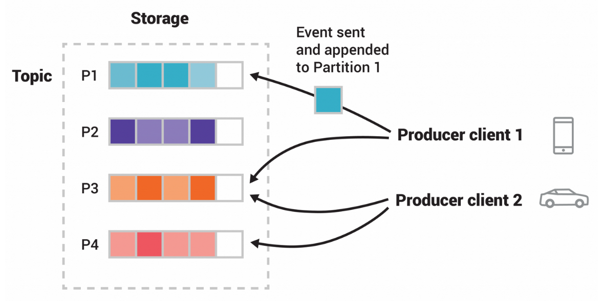
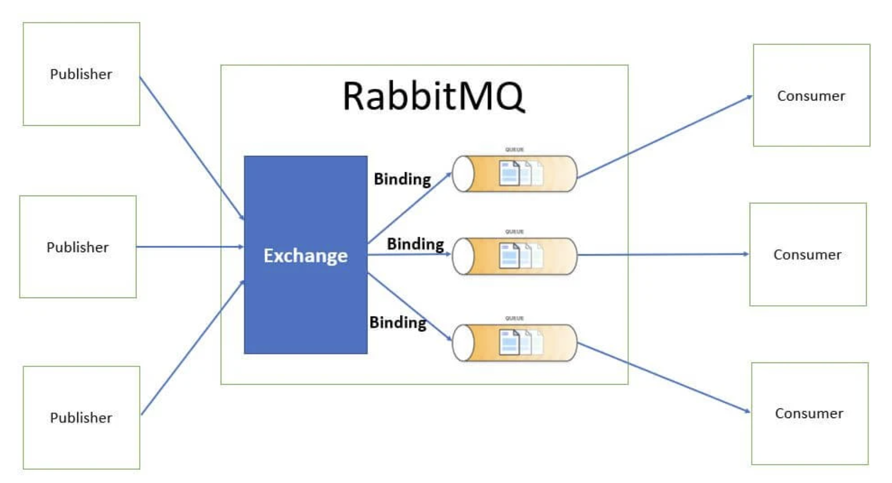

# Communication styles


In a monolithic application running on a single process, components invoke one another using language-level method or function calls. These can be strongly coupled if you're creating objects with code (for example, new ClassName()), or can be invoked in a decoupled way if you're using Dependency Injection by referencing abstractions rather than concrete object instances. Either way, the objects are running within the same process. **The biggest challenge when changing from a monolithic application to a microservices-based application lies in changing the communication mechanism. A direct conversion from in-process method calls into RPC calls to services will cause a chatty and not efficient communication that won't perform well in distributed environments.**

The challenges of designing distributed system properly are well enough known that there's even a canon known as the [Fallacies of distributed computing](M1.4%20-%20Fallacies%20of%20distributed%20computing.md) that lists assumptions that developers often make when moving from monolithic to distributed designs.

The microservice community promotes the philosophy of **smart endpoints and dumb pipes** encouraging a design that's as decoupled as possible between microservices, and as cohesive as possible within a single microservice.

### Message formats

#### Text-based formats
The first category is text-based formats such as JSON and XML. An advantage of these formats is that not only are they human-readable, they’re self describing. They also enable consumers to pick out the values of interest and ignore the rest. Consequently, many changes to the message schema can easily be backward-compatible.

A downside of using a text-based messages format is that the messages tend to be verbose and imply the overhead of parsing text. Consequently, **if efficiency and performance are important, you may want to consider using a binary format**.

#### Binary formats
There are several different binary formats to choose from. Popular formats include [Protocol Buffers](https://developers.google.com/protocol-buffers/docs/overview) and [Avro](https://avro.apache.org). Both formats provide a typed IDL for defining the structure of your messages.

Several tests, for example [this one](https://softwaremill.com/data-serialization-tools-comparison-avro-vs-protobuf/), show that Protobuf is better when it comes to speed of serialization and deserialization. On the other hand, Avro provides with little bit more compacted serialized data. If performance is a critical concern, then Protobuf's speed and efficiency may make it a better choice. If you need more complex data structures or built-in compression options, then Avro may be a better fit.


### Interaction styles
There are a variety of client-service interaction styles, they can be categorized in two dimensions. The first dimension is whether the interaction is **one-to-one** or **one-to-many**:

* **One-to-one**: Each client request is processed by exactly one service.
* **One-to-many**: Each request is processed by multiple services.

The second dimension is whether the interaction is **synchronous** or **asynchronous**:

* **Synchronous**: The client expects a timely response from the service and might even block while it waits. 
* **Asynchronous**: The client doesn't block, and the response, if any, isn’t necessarily sent immediately.

The following are the different types of main interactions:
* **Request/response**: (one-to-one, sync) A service client makes a request to a service and waits for a response. The client expects the response to arrive in a timely fashion. This is an interaction style that generally results in services being tightly coupled.
* **Asynchronous request/response**: (one to one, async) A service client sends a request to a service, which replies asynchronously. The client doesn't block while waiting, because the service might not send the response for a long time.
* **Publish/subscribe**: (one-to-many, async) A client publishes a notification message, which is consumed by zero or more interested services. 
* **Publish/async responses**: (one-to-many, async) A client publishes a request message and then waits for a certain amount of time for responses from interested services.

### Evolving APIs
APIs invariably change over time as new features are added, existing features are changed, and (perhaps) old features are removed. In a monolithic application, it’s relatively straightforward to change an API and update all the callers.

In a microservices-based application, changing a service’s API is a lot more difficult.
* A service’s clients are other services, which are often developed by other teams.
* The clients may even be other applications outside the organization.
* Modern applications are usually never down for maintenance, you’ll typically perform a rolling upgrade of your service, so both old and new versions of a service will be running simultaneously.

**It’s important to have a strategy for dealing with API changes**.

>The Semantic Versioning specification (http://semver.org) is a useful guide to versioning APIs. It’s a set of rules that specify how version numbers are used and incremented. Semantic versioning was originally intended to be used for versioning of software packages, but you can use it for versioning APIs in a distributed system.


## Synchronous communications

When a client uses request/response communication, it sends a request to a service, then the service processes the request and sends back a response. Request/response communication is especially well suited for querying data for a real-time UI (a live user interface) from client apps. 

Therefore, in a microservice architecture you’ll probably use this communication mechanism for most queries. When a client uses request/response communication, it assumes that the response will arrive in a short time, typically less than a second. 

A popular architectural style for request/response communication is REST. This approach is based on the HTTP protocol, embracing HTTP verbs like GET, POST, and PUT. REST is the most commonly used architectural communication approach when creating services. 

There’s additional value when using HTTP REST services as your interface definition language. For instance, if you use Swagger metadata to describe your service API, you can use tools that generate client stubs that can directly discover and consume your services.


## Issues of synchronous communications

### Chattiness
A common problem when designing a REST API is how to enable the client to retrieve multiple related objects in a single request. As shown above, imagine that a REST client wanted to retrieve an Order and the Order's Consumer. A pure REST API would require the client to make at least two requests, one for the Order and another for its Consumer. A more complex scenario would require even more round-trips and suffer from excessive latency.

One solution to this problem is for an API to allow the client to retrieve related resources when it gets a resource:

```
GET /orders/order-id-1345?expand=consumer
```

The query parameter specifies the related resources to return with the Order. This approach works well in many scenarios, but it’s often insufficient for more complex scenarios. It’s also potentially time-consuming to implement. **This has led to the increasing popularity of alternative (still synchronous) technologies such as [GraphQL](http://graphql.org)**.

### Availability
REST is an extremely popular IPC mechanism. You may be tempted to use it for inter-service communication. The problem with REST, though, is that it’s a synchronous protocol: an HTTP client must wait for the service to send a response. **Whenever services communicate using a synchronous protocol, the availability of the application is reduced**.

In the example above, the Order Service has a REST API for creating an Order. It invokes the Consumer Service and the Restaurant Service to validate the Order. Both of those services also have REST APIs.

Because these services use HTTP, they must all be simultaneously available to process the CreateOrder request. Mathematically speaking, **the availability of an operation is the product of the availability of the services that are invoked by that operation**. If the Order Service and the two services that it invokes are 99.5% available, the overall availability is 99.5 x 3 = 98.5%, which is significantly less. Each additional service that participates in handling a request further reduces availability.

This problem isn’t specific to REST-based communication. **Availability is reduced whenever a service can only respond to its client after receiving a response from another service**. If you want to maximize availability, you must minimize the amount of synchronous communication.

### Temporal coupling
Temporal coupling happens when a service - the caller - expects an instantaneous response from another - the callee - before it can resume processing. Since any delay in the response time of the callee would adversely affect the response time of the caller, the callee has to be always up and responsive. This situation usually happens when services use synchronous communication.

**Latency adds up**: The longer it takes for Consumer and Restaurant to prepare the data, the longer Order has to wait before responding to its clients. 

**Cascading failures is also another possibility**: If Consumer fails to respond, Orders will eventually time out and fail responding as well. If Consumer continues to be slow or unresponsive for a while, Orders might end up with a lot of open connections to Consumer, and eventually run out of memory, and fail!

### Code Flexibility
With the synchronous model, if we had another service that was required to fill an Order, we’d need to manually add another call from the Order service to the other service. This means a code change and redeployment.

**If we use the synchronous, request-response model, we start to see a web-like pattern of dependency between our services. The centers of these webs become our major points of failure within our application.**

## Asynchronous communications
When using messaging, services communicate by asynchronously exchanging messages:
* a messaging-based application typically uses a message broker, which acts as an intermediary between the services 
* a service client makes a request to a service by sending it a message. Because the communication is asynchronous, the client doesn't block waiting for a reply. Instead, the client is written assuming that the reply won’t be received immediately.

### Messages
A message consists of a header and a message body. The header is a collection of name-value pairs, metadata that describes the data being sent. The message body is the data being sent, in either text or binary format. There are several different kinds of messages:

* **Command** A message that’s the equivalent of an RPC request. It specifies the operation to invoke and its parameters.
* **Document** A generic message that contains only data. The receiver decides how to interpret it. The reply to a command is an example of a document message.
* **Event** A message indicating that something notable has occurred in the sender. An event is often a domain event, which represents a state change of a domain object such as an Order, or a Customer.


### Message channels
Messages are exchanged over channels. A message channel is an abstraction of the messaging infrastructure. There are two kinds of channels:
* A **point-to-point channel** delivers a message to exactly one of the consumers that is reading from the channel. Services use point-to-point channels for the one-to-one interaction styles. For example, a command message is often sent over a point-to-point channel.
* A **publish-subscribe channel** delivers each message to all the attached consumers. Services use publish-subscribe channels for the one-to-many interaction styles. For example, an event message is usually sent over a publish-subscribe channel.
  
### Implementing the interaction styles using messaging

**One-way notifications**: Implementing one-way notifications is straightforward using asynchronous messaging. The client sends a message, typically a command message, to a point-to-point channel owned by the service. The service subscribes to the channel and processes the message. it doesn't send back a reply.

**Asynchronous request/response**: **Messaging is inherently asynchronous, so only provides asynchronous request/response**. With asynchronous request/response there is no expectation of an immediate reply: the client must tell the service where to send a reply message and must match reply messages to requests.


**Publish/subscribe**: Messaging has built-in support for the publish/subscribe style of interaction. A client publishes a message to a publish-subscribe channel that is read by multiple consumers. 


The service that publishes the domain events owns a publish-subscribe channel, whose name is derived from the domain class. For example, the Order Service publishes Order events to an Order channel, and the Delivery Service publishes Delivery events to a Delivery channel. A service that’s interested in a particular domain object’s events only has to subscribe to the appropriate channel.

**Publish/async responses**: The publish/async responses interaction style is a higher-level style of interaction that’s implemented by combining elements of publish/subscribe and request/response. A client publishes a message that specifies a reply channel header to a publish-subscribe channel. A consumer writes a reply message containing a correlation id to the reply channel. The client gathers the responses by using the correlation id to match the reply messages with the request.

## Asynchronous messaging systems


### Broker-based messaging
A message broker is an intermediary through which all messages flow. A sender writes the message to the message broker, and the message broker delivers it to the receiver.

There are many message brokers to chose from:
* RabbitMQ (https://www.rabbitmq.com)
* Apache Kafka (http://kafka.apache.org)
* ActiveMQ (http://activemq.apache.org)
* AWS Kinesis (https://aws.amazon.com/kinesis/)
* AWS SQS (https://aws.amazon.com/sqs/)

**Advantages of Broker Messaging Queues**
* **Loose coupling**: By using a message broker, services can communicate with each other without having direct dependencies on each other. This allows for increased flexibility and easier maintenance, as services can be added, removed, or modified without affecting other services.
* **Scalability**: A message broker can handle message distribution and load balancing, allowing for horizontal scaling of services. This means that as the number of services or the workload increases, the message broker can distribute the load across multiple instances of the service, ensuring efficient resource utilization.
* **Reliability**: A message broker can provide reliable message delivery by implementing features such as message persistence and guaranteed delivery. This ensures that messages are not lost in case of failures or network issues.
* **Centralized control**: A message broker acts as a central hub, allowing for easier management, monitoring, and administration of messages and communication between services.
* **Message transformation and routing**: Brokers often provide powerful routing capabilities, allowing messages to be transformed and directed to the appropriate destinations based on various criteria.

**Disadvantages of Broker Messaging Queues**
* **Single point of failure**: Since all messages pass through a central message broker if the broker fails, it can disrupt the entire messaging system.
* **Increased complexity**: Setting up and configuring a message broker can be more complex compared to brokerless messaging approaches.
* **Potential performance impact**: The additional overhead of routing messages through a broker can introduce some latency and potentially impact performance.

### Brokerless messaging
Brokerless messaging architectures are based on libraries allowing services to communicate with one another directly.

There are many message brokers to chose from:
* ZeroMQ (https://zeromq.org/)
* NanoMsg (https://nanomsg.org/)

**Advantages of Brokerless Messaging Queues**
* **Simplicity**: Brokerless messaging eliminates the need for a central message broker, reducing the complexity of the system.
* **Improved performance**: Without the need to route messages through a broker, brokerless messaging can offer lower latency and higher throughput, especially for local communication between services.
* **No single point of failure**: They eliminate the possibility of the message broker being a performance bottleneck or a single point of failure.

**Disadvantages of Brokerless Messaging Queues**
* **Spatial coupling**: Services need to know about each other’s locations and must therefore use one of the discovery mechanisms.
* **Time coupling**: Because both the sender and receiver of a message must be available while the message is being exchanged.
* **Scalability limitations**: Brokerless messaging may not scale as well as broker-based messaging for large-scale deployments, as the responsibility for message distribution and load balancing lies with individual services.
* **No built-in guaranteed delivery**: Brokerless messaging may require additional effort to implement reliable message delivery, as there is no inherent mechanism provided by a central broker.


## Issues of asynchronous communications
Message-based applications make it more difficult to reason through its business logic because its code is no longer processed in a linear fashion with a simple block request-response model.

### Message-handling semantics
Using messages in a microservice-based application requires more than understanding how to publish and consume messages. It requires that we understand how our application will behave based on the order in which messages are consumed and what happens if a message is processed out of order. For example, if we have strict requirements that all orders from a single customer must be processed in the order they are received, we’ll need to set up and structure our message handling differently than if every message can be consumed independently of one another.

*If a message fails, do we retry processing the error or do we let it fail? How do we handle future messages related to that customer if one of the customer’s messages fails?* These are important questions to think through.

### Message choreography
Using messages in microservices often means a mix of synchronous service calls and asynchronous service processing. The asynchronous nature of messages means they might not be received or processed in proximity to when the message is published or consumed. Having things like correlation IDs for tracking a user’s transactions across service invocations is critical to understanding and debugging what’s going on in our application.

Also, debugging message-based applications can involve wading through the logs of several different services, where user transactions can be executed out of order and at different times.

## Overview of RabbitMQ and Apache Kafka

### Apache Kafka
**Apache Kafka** is an `open-source distributed event streaming platform` used by thousands of companies for high-performance data pipelines, streaming analytics, data integration, and mission-critical applications.

**Event streaming** is the practice of capturing data in real-time from event sources like databases, sensors, mobile devices, cloud services, and software applications in the form of streams of events; storing these event streams durably for later retrieval; manipulating, processing, and reacting to the event streams in real-time as well as retrospectively; and routing the event streams to different destination technologies as needed. Event streaming thus ensures a continuous flow and interpretation of data so that the right information is at the right place, at the right time.

Kafka combines three key capabilities:

1. To **publish** (write) and **subscribe to** (read) streams of events, including continuous import/export of your data from other systems.
2. To **store** streams of events durably and reliably for as long as you want.
3. To **process** streams of events as they occur or retrospectively.

Kafka can be deployed on bare-metal hardware, virtual machines, and containers, and on-premises as well as in the cloud. You can choose between self-managing your Kafka environments and using fully managed services offered by a variety of vendors.

Kafka is a distributed system consisting of servers and clients that communicate via a high-performance TCP network protocol:

- **Servers**: Kafka is run as a cluster of one or more servers that can span multiple datacenters or cloud regions. Some of these servers form the storage layer, called the brokers. Other servers run Kafka Connect to continuously import and export data as event streams to integrate Kafka with your existing systems such as relational databases as well as other Kafka clusters. To let you implement mission-critical use cases, a Kafka cluster is highly scalable and fault-tolerant: if any of its servers fails, the other servers will take over their work to ensure continuous operations without any data loss.
- **Clients**: They allow you to write distributed applications and microservices that read, write, and process streams of events in parallel, at scale, and in a fault-tolerant manner even in the case of network problems or machine failures. Kafka ships with some such clients included, which are augmented by dozens of clients provided by the Kafka community: clients are available for Java and Scala including the higher-level Kafka Streams library, for Go, Python, C/C++, and many other programming languages as well as REST APIs.

An `event` records the fact that "something happened" in the world or in your business. When you read or write data to Kafka, you do this in the form of events. Conceptually, an event has a key, value, timestamp, and optional metadata headers.

`Producers` are those client applications that publish (write) events to Kafka, and consumers are those that subscribe to (read and process) these events. In Kafka, producers and consumers are fully decoupled and agnostic of each other, which is a key design element to achieve the high scalability that Kafka is known for. For example, producers never need to wait for consumers. Kafka provides various guarantees such as the ability to process events exactly-once.

Events are organized and durably stored in `topics`. Very simplified, a topic is similar to a folder in a filesystem, and the events are the files in that folder.  Topics in Kafka are always **multi-producer** and **multi-subscriber**: a topic can have zero, one, or many producers that write events to it, as well as zero, one, or many consumers that subscribe to these events. Events in a topic can be read as often as needed—unlike traditional messaging systems, events are not deleted after consumption. Instead, you define for how long Kafka should retain your events through a per-topic configuration setting, after which old events will be discarded. Kafka's performance is effectively constant with respect to data size, so storing data for a long time is perfectly fine.

Topics are partitioned, meaning a topic is spread over a number of "buckets" located on different Kafka brokers. This distributed placement of your data is very important for scalability because it allows client applications to both read and write the data from/to many brokers at the same time. When a new event is published to a topic, it is actually appended to one of the topic's partitions. Events with the same event key (e.g., a customer or vehicle ID) are written to the same partition, and Kafka guarantees that any consumer of a given topic-partition will always read that partition's events in exactly the same order as they were written.



*This example topic has four partitions P1–P4. Two different producers are publishing new events to the topic by writing events over the network to the topic's partitions. Events with the same key (denoted by their color in the figure) are written to the same partition. Note that both producers can write to the same partition if appropriate.*

To make your data fault-tolerant and highly-available, every topic can be **replicated**, even across geo-regions or datacenters, so that there are always multiple brokers that have a copy of the data just in case things go wrong, you want to do maintenance on the brokers, and so on. A common production setting is a replication factor of 3, i.e., there will always be three copies of your data. This replication is performed at the level of topic-partitions.

Kafka **use cases**:
1. `Messaging`: in comparison to most messaging systems Kafka has better throughput, built-in partitioning, replication, and fault-tolerance which makes it a good solution for large scale message processing applications.<br>
   Messaging uses are often comparatively low-throughput, but may require low end-to-end latency and often depend on the strong durability guarantees Kafka provides.<br>
   In this domain Kafka is comparable to traditional messaging systems such as ActiveMQ or RabbitMQ.
2. `Website Activity Tracking`: the original use case for Kafka was to be able to rebuild a user activity tracking pipeline as a set of real-time publish-subscribe feeds. This means site activity (page views, searches, or other actions users may take) is published to central topics with one topic per activity type.<br>
   These feeds are available for subscription for a range of use cases including real-time processing, real-time monitoring, and loading into Hadoop or offline data warehousing systems for offline processing and reporting.<br>
   Activity tracking is often very high volume as many activity messages are generated for each user page view.
3. `Metrics`: often used for operational monitoring data. This involves aggregating statistics from distributed applications to produce centralized feeds of operational data.
4. `Stream Processing`: many users of Kafka process data in processing pipelines consisting of multiple stages, where raw input data is consumed from Kafka topics and then aggregated, enriched, or otherwise transformed into new topics for further consumption or follow-up processing.
5. `Event Sourcing`: is a style of application design where state changes are logged as a time-ordered sequence of records. Kafka's support for very large stored log data makes it an excellent backend for an application built in this style.
6. `Commit Log`: Kafka can serve as a kind of external commit-log for a distributed system. The log helps replicate data between nodes and acts as a re-syncing mechanism for failed nodes to restore their data. The log compaction feature in Kafka helps support this usage.

### RabbitMQ
RabbitMQ is a reliable and mature messaging and streaming broker, which is easy to deploy on cloud environments, on-premises, and on your local machine. It is currently used by millions worldwide.

One of RabbitMQ's main strengths is its adherence to the `Advanced Message Queuing Protocol` (AMQP). This standardized protocol was designed to ensure that messages are reliably delivered between applications, regardless of their location or the platform they are running on. AMQP defines precise rules for message formatting, delivery, and acknowledgment, ensuring that every message sent through an AMQP-based system, such as RabbitMQ, reaches its destination as expected.

Distinctive features of RabbitMQ:
1. **Reliable Messaging**: RabbitMQ ensures that sent messages are not lost, thanks to its persistence and delivery confirmations.
2. **Advanced Routing**: with multiple exchange types, RabbitMQ can precisely determine how and where a message should be delivered, enabling complex routing scenarios.
3. **Persistence**: messages in RabbitMQ can be saved to disk, ensuring that they are not lost even in the event of system failures.
4. **Extended Features**: RabbitMQ is not limited to the AMQP protocol. With the use of plugins, it can support other protocols such as MQTT and STOMP, making it extremely versatile.



The **RabbitMQ architecture** includes:

- `Publisher`: is the entity or component responsible for sending messages to RabbitMQ. It can be an application, a service or any other system that needs to transmit data.<br>
  It takes care of initiating the communication and does not worry about how or where the message will be delivered, it simply sends it to the appropriate exchange.
- `Consumer`: it is the entity that actively listens to one or more queues waiting for messages to be processed.<br>
  Once a message arrives in a queue to which the consumer is subscribed, the consumer picks it up, processes it, and, if necessary, sends a confirmation of receipt or processing.
- `Exchange`: is a crucial component in RabbitMQ that acts as a router for messages sent by producers.<br>
  It does not hold messages, but relies on rules and criteria (such as the routing key) to determine which queue to forward a message to. There are several types of exchanges in RabbitMQ that determine how messages are forwarded:
    - **Direct Exchange**: it acts as a unique router for messages based on a routing key.
      When a producer sends a message to a Direct Exchange, it specifies a routing key. The exchange then forwards the message to the queue that has a binding to that specific routing key. This ensures targeted and precise delivery of the message.
    - **Fanout Exchange**: it is the equivalent of a broadcast in terms of messaging. It does not take into account routing keys or other message attributes.
      When a message arrives at a Fanout Exchange, it is forwarded to all queues connected to that exchange, without discrimination. It is ideal for scenarios where you want a message to reach as many consumers as possible.
    - **Topic Exchange**: it offers greater flexibility than Direct Exchange, allowing messages to be forwarded based on routing key schemes rather than exact keys.
      Routing keys in a Topic Exchange can contain special characters, such as * (matching one word) and # (matching zero or more words). This allows you to create complex patterns that can correspond to multiple queues, making message delivery more dynamic and flexible.
    - **Headers Exchange**: unlike other exchanges that rely on routing keys, the Headers Exchange uses message header attributes to determine delivery.
      When a message is sent to a Headers Exchange, the exchange evaluates the message headers and compares them to the binding criteria of the attached queues. If the headers match the criteria, the message is forwarded to the appropriate queue. This type of exchange offers a level of granularity and complexity in message delivery based on multiple attributes.
- `Queue`: it is essentially a buffer that holds messages until they are consumed by a consumer.<br>
  Every message sent through RabbitMQ is held in a queue waiting to be processed. Queues ensure that messages are not lost and are processed in order.
- `Binding`: is a rule or set of instructions that determines how a message should be forwarded from the exchange to the queue.<br>
  It serves as a bridge between exchange and queue, ensuring that messages are forwarded correctly based on the needs of the application.

RabbitMQ **use cases**:
1. `Application integration`: refers to RabbitMQ's ability to act as a bridge between different applications or systems.
   Applications can communicate with each other without directly depending on each other (**decoupling**). RabbitMQ provides a uniform interface for sending and receiving messages, regardless of the platform or programming language of the integrated applications (**uniformity**).
2. `Distributed processing`: refers to RabbitMQ's ability to distribute tasks or jobs to different workers or nodes for parallel processing: optimization of resources and reduction of processing times.
3. `Buffering`: refers to its ability to temporarily hold messages awaiting processing. In the event of traffic spikes or system overload, RabbitMQ ensures that messages are not lost (**resiliency**). Messages can be processed when resources become available, ensuring smooth, uninterrupted processing (**delayed processing**).
4. `Logs and monitoring`: can be used to track and monitor activities or events within an application or system.

### Comparison between RabbitMQ and Kafka
RabbitMQ and Apache Kafka move data from producers to consumers in different ways:
- RabbitMQ is a general-purpose message broker that prioritizes end-to-end message delivery;
- Kafka is a distributed event streaming platform that supports the real-time exchange of continuous big data.

In RabbitMQ, the broker ensures that consumers receive the message. The consumer application takes a passive role and waits for the RabbitMQ broker to push the message into the queue. For example, a banking application might wait for SMS alerts from central transaction processing software.

Kafka consumers, however, are more proactive in reading and monitoring information. As messages are added to physical log files, Kafka consumers track the last message read and update their offset tracker accordingly. An offset tracker is a counter that is incremented each time a message is read. With Kafka, the producer is unaware of message retrieval by consumers.

A RabbitMQ broker routes the message to the destination queue. Once read, the consumer sends an acknowledgment response (ACK) to the broker, who then deletes the message from the queue.

Unlike RabbitMQ, Apache Kafka adds the message to a log file, which remains until the retention period expires. This way, consumers can reprocess the streamed data at any time within the stipulated period.

**Key differences:**

|                                   | RabbitMQ                                                                                              | Kafka                                                                                                                                                                 |
|-----------------------------------|-------------------------------------------------------------------------------------------------------|-----------------------------------------------------------------------------------------------------------------------------------------------------------------------|
| Architecture                      | complex message routing, push model, producers send messages to consumers with different rules.       | partition-based design for real-time, high-throughput stream processing, pull model, producers publish messages to topics and partitions that consumers subscribe to. |
| Message management                | monitor message consumption, delete messages after they are consumed, and support message priorities. | consumers track message retrieval with an offset tracker, Kafka retains messages based on the retention policy and there is no priority for messages.                 |
| Performance                       | low latency, sends thousands of messages per second.                                                  | transmits up to millions of messages per second in real time.                                                                                                         |
| Programming language and protocol | supports a wide range of legacy languages ​​and protocols.                                            | it has a limited choice of programming languages ​​and uses the binary protocol over TCP for data transmission.                                                       |

**When to use:**

| Use case                      | Technology   | Why                                                                                                                                                                                                                                                         |
|-------------------------------|--------------|-------------------------------------------------------------------------------------------------------------------------------------------------------------------------------------------------------------------------------------------------------------|
| Replay of the event stream    | **Kafka**    | Kafka is suitable for applications that need to re-analyze the received data. You can process streaming data multiple times during the retention period or collect log files for analysis.                                                                  |
| Real-time data processing     | **Kafka**    | Kafka transmits messages with very low latency and is suitable for analyzing streaming data in real time.                                                                                                                                                   |
| Complex routing architecture  | **RabbitMQ** | RabbitMQ offers great flexibility to customers with vague requirements or complex routing scenarios.                                                                                                                                                        |
| Effective message delivery    | **RabbitMQ** | RabbitMQ adopts the push model, which ensures that the producer is notified when a client application has consumed a message. It is suitable for applications that must meet specific sequences and delivery guarantees when exchanging and analyzing data. |
| Language and protocol support | **RabbitMQ** | Developers use RabbitMQ for customer applications that require compatibility with legacy protocols such as MQTT and STOMP.                                                                                                                                  |

## Resources
- Microservices Patterns (Chapter 3)
- Microservices with SpringBoot3 and SpringCloud (Chapter 7)
- [The Many Meanings of Event-Driven Architecture](https://www.youtube.com/watch?v=STKCRSUsyP0)
- https://softwaremill.com/data-serialization-tools-comparison-avro-vs-protobuf/

