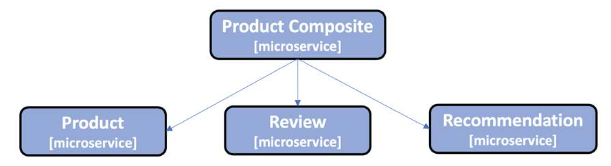

# Creating a Set of Cooperating Microservices

In this chapter, we will build our first microservices. We will learn how to create cooperating microservices with minimalistic functionality with a RESTful API exposed by a composite microservice. The composite microservice will call three other microservices using their RESTful APIs to create an aggregated response.

## Introducing the microservice landscape



To keep the source code examples in this book easy to understand, they have a minimal amount of business logic. The information model for the business objects they process is kept minimal for the same reason. 

We will set up a separate project where we can place our API definitions. We will use Java interfaces in order to describe our RESTful APIs and model classes to describe the data that the API uses in its requests and responses. To describe what types of errors can be returned by the API, a number of exception classes are also defined. Describing a RESTful API in a Java interface instead of directly in the Java class is a good way of separating the API definition from its implementation.

>It is debatable whether it is a good practice to store API definitions for a group of microservices in a common API module. It could potentially cause undesired dependencies between the microservices, resulting in monolithic characteristics, for example, causing a more complex and slow development process. To me, microservices within the same bounded context need to have API definitions that are based on a common information model, so storing these API definitions in the same API module doesn’t add any undesired dependencies.

We will create a util project that can hold some helper classes that are shared by our microservices, for example, for handling errors in a uniform way.

> From a DevOps perspective, it would be preferable to build all the projects in their own build pipeline and have version-controlled dependencies for the api and util projects in the microservice projects, that is, so that each microservice can choose what versions of the api and util projects to use. But to keep the build and deployment steps simple in the context of this book, we will make the api and util projects part of the multi-project build.

#### The product service
The product service manages product information and describes each product with the following attributes:
* Product ID
* Name
* Weight

#### The review service
The review service manages product reviews and stores the following information about each review:
* Product ID
* Review ID
* Author 
* Subject 
* Content

#### The recommendation service
The recommendation service manages product recommendations and stores the following information about each recommendation:
* Product ID
* Recommendation ID
* Author
* Rate
* Content

#### The product composite service
The product composite service aggregates information from the three core services and presents information about a product as follows:

* Product information, as described in the product service
* A list of product reviews for the specified product, as described in the review service
* A list of product recommendations for the specified product, as described in the recommen- dation service

## Using Spring Initializr to generate skeleton code
To get started with developing our microservices, we will use _Spring Initializr_ to generate skeleton code for us. Spring Initializr is provided by the Spring team and can be used to configure and generate new Spring Boot applications. It can either be invoked from a web browser using the URL https://start.spring.io/ or using a command-line tool, spring init. To make it easier to reproduce the creation of the microservices, we will use the command-line tool.

For each microservice, we will create a Spring Boot project that does the following:
* Uses Gradle as a build tool
* Generates code for Java 8
* Packages the project as a fat JAR file
* Brings in dependencies for the Actuator and WebFlux Spring modules
* Is based on Spring Boot

You can refer to create-projects.sh

```
spring init \
--boot-version="$VERSION" \
--type=maven-project \
--java-version=17 \
--packaging=jar \
--name=product-service \
--package-name=com.nbicocchi.microservices.core.product \
--groupId=com.nbicocchi.microservices.core.product \
--dependencies=actuator,webflux \
--version=1.0.0-SNAPSHOT \
product-service
```

We can build and each microservice separately with the following command:

```
$ cd microservices/name
$ mvn compile
$ mvn spring-boot:run
```

To make it a bit simpler to build all the microservices with one command, we can set up a multi-project build by placing the following `pom.xml` file in the root directory of the project:

```
<project xmlns:xsi="http://www.w3.org/2001/XMLSchema-instance" xmlns="http://maven.apache.org/POM/4.0.0"
         xsi:schemaLocation="http://maven.apache.org/POM/4.0.0 http://maven.apache.org/xsd/maven-4.0.0.xsd">
    <modelVersion>4.0.0</modelVersion>
    <description>creating-a-set-of-microservices</description>
    <name>creating-a-set-of-microservices</name>

    <groupId>com.nbicocchi</groupId>
    <artifactId>lcreating-a-set-of-microservices</artifactId>
    <version>1.0.0-SNAPSHOT</version>
    <packaging>pom</packaging>

    <modules>
        <module>api</module>
        <module>util</module>
        <module>microservices/product-service</module>
        <module>microservices/review-service</module>
        <module>microservices/recommendation-service</module>
        <module>microservices/product-composite-service</module>
    </modules>

</project>
```

Refer to [this guide](https://spring.io/guides/gs/multi-module/) for further details.

Now, we can build/clean/etc. all the microservices with one command:

```
$ mvn compile
$ mvn clean
``` 

#### The api project

The api project will be packaged as a library; that is, it won’t have its own main application class. Unfortunately, Spring Initializr does not support the creation of library projects. Instead, a library project has to be created manually from scratch.

The structure of a library project is the same as for an application project, except that we no longer have the main application class, as well as some minor differences in the `pom.xml file. 

To tell Maven to not build an executable jar for the Library project, you must remove the following block from the `pom.xml` created by the Spring Initializr:

```
<build>
  <plugins>
    <plugin>
      <groupId>org.springframework.boot</groupId>
      <artifactId>spring-boot-maven-plugin</artifactId>
    </plugin>
  </plugins>
</build>
```


 
