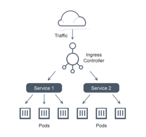

# Introduction to Kubernetes
Kubernetes is a *portable, extensible, open source platform for managing containerized workloads and services, that facilitates both declarative configuration and automation*. It has a large, rapidly growing ecosystem. Kubernetes services, support, and tools are widely available.

The name Kubernetes originates from Greek, meaning helmsman or pilot. 
*K8s* as an abbreviation results from counting the eight letters between the "K" and the "s". Google open-sourced the Kubernetes project in 2014.

Containers are an excellent method for bundling and running your applications. However, in a production environment, it's crucial to manage these containers effectively to ensure **continuous availability** and **minimize downtime**. 

**Kubernetes offers a robust framework for running distributed systems with high resilience.** It handles the scaling and failover of your applications, facilitates seamless deployments, and provides a variety of deployment strategies to ensure your applications run smoothly and efficiently.

### What Kubernetes can do?
* **Service Discovery and Load Balancing**: Kubernetes can expose containers either through DNS names or their own IP addresses. When traffic to a container is high, Kubernetes can load balance and distribute the network traffic to ensure the deployment remains stable and responsive.

* **Storage Orchestration**: Kubernetes makes it easy to automatically mount the storage system of your choice, whether it's local storage or a public cloud provider. This flexibility allows you to manage storage needs efficiently without manual intervention.

* **Automated Rollouts and Rollbacks**: With Kubernetes, you can *define the desired state for your deployed containers*. Kubernetes will then gradually adjust the actual state to match your desired state. This means you can automate the process of creating new containers for your deployment, removing old ones, and reallocating resources to the new containers seamlessly.

* **Automatic Bin Packing**: Kubernetes optimizes resource usage by fitting containers onto your cluster nodes based on their CPU and memory requirements. By specifying how much CPU and RAM each container needs, Kubernetes ensures efficient use of your available resources.

* **Self-Healing**: Kubernetes enhances the reliability of your applications by *automatically restarting containers that fail, replacing them, and killing containers that don't respond to health checks*. It also delays advertising containers to clients until they are fully ready to serve, ensuring a smoother user experience.

* **Secret and Configuration Management**: Kubernetes offers a secure way to store and manage sensitive information like passwords, OAuth tokens, and SSH keys. You can deploy and update these secrets and configurations without needing to rebuild your container images or expose sensitive data in your configuration files.

* **Batch Execution**: Kubernetes isn't just for services; it also handles batch and CI workloads efficiently. It can manage these tasks, ensuring that any containers that fail are promptly replaced.

* **Horizontal Scaling**: Scaling your applications up or down is straightforward with Kubernetes. You can do this with a simple command, through a user interface, or automatically based on CPU usage, ensuring your applications can handle varying loads.

* **IPv4/IPv6 Dual-Stack**: Kubernetes supports the allocation of both IPv4 and IPv6 addresses to Pods and Services, providing flexibility in network configuration.

* **Designed for Extensibility**: Kubernetes is built to be extensible, allowing you to add new features to your cluster without changing the core upstream source code. This means you can customize and extend your Kubernetes environment to meet your specific needs.

## Object in Kubernetes
Kubernetes objects are persistent entities that represent the state of your cluster. They describe:
* What containerized applications are running (and on which nodes)
* The resources available to those applications
* Policies governing application behavior (restart policies, upgrades, fault-tolerance)

A Kubernetes object is a "*record of intent*." Once created, Kubernetes ensures that the object exists as specified. **By creating an object, you define your cluster's desired state**.

To work with Kubernetes objects (create, modify, or delete), you use the **Kubernetes API**. The **kubectl** command-line interface makes the necessary API calls, but you can also interact with the API directly using Client Libraries.

### Spec and Status
Most Kubernetes objects have two key fields: the object spec and the object status.

* **Spec**: Describes the desired state of the object (set when you create the object).
* **Status**: Describes the current state of the object (updated by the Kubernetes system).

Kubernetes continuously works to match the actual state of an object to its desired state.

### Describing a Kubernetes object
When creating a Kubernetes object, you provide its spec and basic information (such as a name). This information is usually provided in a manifest file (YAML or JSON format). **kubectl** converts the manifest into JSON and makes the API request.

```
apiVersion: apps/v1
kind: Deployment
metadata:
  name: nginx-deployment
spec:
  selector:
    matchLabels:
      app: nginx
  replicas: 2 # tells deployment to run 2 pods matching the template
  template:
    metadata:
      labels:
        app: nginx
    spec:
      containers:
      - name: nginx
        image: nginx:1.14.2
        ports:
        - containerPort: 80
```

To create the deployment, use:
```
$ kubectl apply -f https://k8s.io/examples/application/deployment.yaml
```

### Required fields
* **apiVersion**: Version of the Kubernetes API you're using.
* **kind**: Type of object you want to create.
* **metadata**: Identifies the object (name, UID, optional namespace).
* **spec**: Describes the desired state of the object.
  * *replicas* refers to **ReplicaSet**, a parameter that ensures a specified number of identical pod instances are actively running at all times.

## Kubernetes components

A Kubernetes cluster is composed of *multiple worker machines*, known as **nodes**, which run containerized applications. Each cluster has at least one worker node.

These worker nodes host the **Pods** that constitute the components of an application's workload. The *control plane* oversees the worker nodes and the Pods within the cluster.

### Control Plane Components
The control plane's components are responsible for *global decisions about the cluster*, such as scheduling, and responding to cluster events, like starting a new pod when necessary. These components can run on any machine in the cluster, but typically run on the same machine for simplicity.

* **kube-apiserver**: The API server exposes the Kubernetes API and serves as the front end for the control plane. The main implementation is kube-apiserver, which scales horizontally by deploying multiple instances and balancing traffic between them.

* **etcd**: A consistent and highly-available key-value store used as the backing store for all cluster data. It's crucial to have a backup plan for the data stored in etcd.

* **kube-scheduler**: This component watches for newly created Pods without assigned nodes and selects nodes for them based on resource requirements, constraints, affinity specifications, data locality, inter-workload interference, and deadlines.

* **kube-controller-manager**: Runs controller processes. Each controller is logically separate but compiled into a single binary for simplicity.

* **cloud-controller-manager**: Handles cloud-specific control logic, integrating the cluster with cloud provider APIs. It runs controllers specific to the cloud provider, such as:
  * **Node controller**: Checks if a node has been deleted in the cloud.
  * **Route controller**: Sets up routes in the cloud infrastructure.
  * **Service controller**: Manages cloud provider load balancers.

### Node Components
Node components run on every node, *maintaining running pods and providing the Kubernetes runtime environment*.

* **kubelet**: An agent running on each node, ensuring containers described in PodSpecs are running and healthy. It doesn't manage containers not created by Kubernetes.

* **kube-proxy**: A network proxy running on each node, implementing the Kubernetes Service concept by maintaining network rules for communication with Pods.

* **Container runtime**: Manages the execution and lifecycle of containers within Kubernetes. Supported runtimes include containerd, CRI-O, and other implementations of the Kubernetes Container Runtime Interface (CRI).

* **Pod**: Pods are basic units in Kubernetes for deploying containers. *They can host one or more containers that share storage and network resources within a shared context*. Pods act as logical hosts for applications, similar to how multiple applications might run on a single machine in traditional setups.Kubernetes manages Pods as entities, handling their lifecycle and resources.
Pods serve two main roles in Kubernetes:

  * **Single-container Pods**: These Pods typically run a single application container, managed by Kubernetes for lifecycle and resource needs.

  * **Multi-container Pods**: These Pods contain multiple tightly coupled containers that share resources and dependencies. This approach is more advanced and used when containers need close integration.

  Pods are usually managed indirectly through higher-level workload resources like Deployments or StatefulSets, ensuring scalability, fault tolerance, and efficient management of applications in Kubernetes.

## Kubernetes API
At the core of Kubernetes' control plane lies the API server. This essential component exposes an **HTTP API** that facilitates *communication among users, different parts of the cluster, and external components*.

These objects include essential entities such as Pods, Namespaces, ConfigMaps, and Events, which are crucial to defining and maintaining the cluster's configuration and operational state.

The primary interface for interacting with the Kubernetes API is the **kubectl** command-line tool, alongside other utilities like **kubeadm**. These tools leverage the API server to execute commands, retrieve real-time data, and orchestrate cluster operations efficiently. Alternatively, developers can access the API directly via **RESTful calls**, utilizing Kubernetes' client libraries to build custom applications and integrate with external systems.

*Each Kubernetes cluster publishes its API specifications*, ensuring consistency and facilitating interoperability across different tools and environments. This standardized approach enables utilities such as kubectl to fetch and cache API specifications dynamically.


## Service and Ingress
A **Service** in Kubernetes provides a stable network endpoint that *allows connections to one or more Pods*. It's assigned an IP address and a DNS name within the cluster's internal network, maintaining this identity throughout its lifetime. *Requests directed to a Service are load balanced among available Pods using round-robin distribution*. By default, Services are accessible only within the cluster via a cluster IP.

For external access, Services can be exposed either directly on each node's port or through an external load balancer that integrates with Kubernetes. This setup enables automatic provisioning of public IP addresses and DNS names for Services, particularly supported by cloud providers offering Kubernetes as a Service.

**Ingress**, on the other hand, *manages external access to Services based on HTTP or HTTPS protocols*. It routes traffic to underlying Services based on URL paths or HTTP headers such as hostname. Instead of exposing individual Services externally using node ports or load balancers, setting up an Ingress is generally more convenient. An Ingress controller within the cluster handles the configuration and routing defined by Ingress objects.



Regarding **Deployment**, it is used in Kubernetes to deploy and upgrade Pods. Deployments delegate the responsibility of creating and monitoring Pods to a ReplicaSet. Initially, when creating a Deployment, its role is primarily to create the ReplicaSet object. However, during a rolling upgrade of a Deployment, its role becomes more involved in managing the transition and ensuring the desired state of the application is maintained seamlessly.


## Resources
- https://kubernetes.io/docs/concepts/
- https://avinetworks.com/glossary/kubernetes-ingress-services/
- Cloud Native DevOps with Kubernetes (Chapter 4)