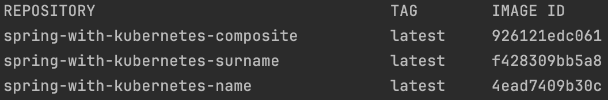

# Service discovery (Kubernetes)

Service discovery is a fundamental problem in microservices architecture. In a distributed system, services need to discover and communicate with each other without relying on static configurations. Kubernetes addresses this problem through the concepts of **Service** and **internal DNS**. Each service registered in Kubernetes has a DNS name and an endpoint that other services can use to communicate with it. This mechanism simplifies scalability and management of microservices.

Kubernetes provides built-in service discovery using two main approaches:

1. **Environment Variables**: Kubernetes injects environment variables into pods that contain information about other services. However, this method is limited as environment variables are only set when the pod starts.

2. **DNS-Based Service Discovery**: Kubernetes sets up an internal DNS service that automatically creates DNS records for each service. This allows services to use DNS names to refer to other services, making it easy to change service instances without affecting the clients.

Service discovery in Kubernetes ensures that services can scale dynamically and be resilient to failures, as the **system can automatically discover and route to available instances** without manual intervention.

## Minikube
`Minikube` is a tool that enables developers to run a _single-node Kubernetes cluster_ on their local machine. It is particularly useful for development, testing, and learning purposes, allowing users to experiment with Kubernetes concepts without needing a full-blown multi-node cluster. Minikube supports a variety of hypervisors, including VirtualBox, VMware, and Docker, making it versatile and adaptable to different environments.

### Purpose and Benefits
Minikube serves several key purposes:

- **Local Development**: It provides a convenient environment for developing and testing Kubernetes applications locally.
- **Learning and Experimentation**: It allows new users to familiarize themselves with Kubernetes commands and concepts in a controlled, local environment.
- **Continuous Integration**: It can be used in CI/CD pipelines to test Kubernetes deployments and configurations.

### Setup and Usage
Minikube can be set up using different drivers depending on the operating system and the preferred virtualization technology. For example, on macOS and Windows with Docker Desktop, the Docker driver can be used to run Minikube in a container.
[Here](https://minikube.sigs.k8s.io/docs/start/) the documentation to download and install Minikube.

## kubectl
`kubectl` is the command-line interface (CLI) tool used to interact with Kubernetes clusters. It allows users to execute commands for deploying applications, inspecting and managing cluster resources, and viewing logs. Kubectl is an essential tool for Kubernetes administrators and developers who want to work directly with Kubernetes.

### Purpose and Benefits
Kubectl offers numerous advantages:

- **Resource Management**: It allows you to create, update, and delete Kubernetes resources such as pods, services, deployments, configmaps, and secrets.
- **Cluster Inspection**: It provides detailed information about the state of cluster resources, application logs, and cluster events.
- **Automation and Scripting**: It can be used in scripts to automate Kubernetes operations, making it a powerful tool for CI/CD pipelines.
- **Debugging and Troubleshooting**: It helps in diagnosing and resolving issues within the cluster by providing access to logs, events, and resource statuses.

### Common Commands
- **Get Information**:
  ```
  kubectl get nodes
  kubectl get pods
  kubectl get services
  ```

- **Describe Resources**:
  ```
  kubectl describe pod <pod-name>
  kubectl describe service <service-name>
  ```

- **Delete Resources**:
  ```
  kubectl delete pod <pod-name>
  kubectl delete -f <resource-file.yaml>
  ```

- **View Logs**:
  ```
  kubectl logs <pod-name>
  ```

- **Execute Commands in a Pod**:
  ```
  kubectl exec -it <pod-name> -- /bin/bash
  ```

### Setup and Usage
To use kubectl, you need to have it installed and configured to communicate with a Kubernetes cluster.
You can download and install kubectl from the official Kubernetes [installation guide](https://kubernetes.io/docs/tasks/tools/install-kubectl/).

## Configuration of Name and Surname services
For each service, provide details on their Kubernetes configurations.

### Name service
#### Deployment.yaml
```yaml
apiVersion: apps/v1
kind: Deployment
metadata:
  name: name-service-end
  labels:
    app: name-service-end
spec:
  replicas: 1
  selector:
    matchLabels:
      app: name-service-end
  template:
    metadata:
      labels:
        app: name-service-end
    spec:
      containers:
        - name: name-service-end
          image: spring-with-kubernetes-name:latest
          imagePullPolicy: IfNotPresent
          ports:
            - containerPort: 9001
```
The deployment configuration for the `name` service in Kubernetes defines how this service will be deployed, managed, and scaled within the cluster. Below is a detailed explanation of the key components of the deployment YAML file for the name service.
- **apiVersion**: Specifies the version of the Kubernetes API to use for this deployment.
- **kind**: Indicates that this resource is a Deployment, which manages a set of replica Pods.
- **metadata**: Contains data that helps uniquely identify the Deployment object, including a name and optional namespace.
- **spec**: Defines the desired state of the Deployment, including the number of replicas, the selector for the Pods, and the template for creating new Pods.
- **replicas**: Specifies the number of Pod replicas that should be running at any given time. You can scale the number of replicas up or down to handle more or less traffic.
- **selector**: Defines how the Deployment finds which Pods to manage. It uses a matchLabels field to select Pods with a specific label.
- **template**: Describes the Pods that will be created by this Deployment. It includes the Pod metadata and the Pod spec.
  - In this section we also define the **spec**, which defines the specification of the containers within the Pod. This includes the container image, ports, and other settings.

#### service.yaml
```yaml
apiVersion: v1
kind: Service
metadata:
  name: name-service-end
spec:
  selector:
    app: name-service-end
  ports:
    - protocol: TCP
      port: 80
      targetPort: 9001
```
The Service configuration for the `name` service in Kubernetes defines how the service is exposed within the cluster and, optionally, to the outside world.

#### NameController.java
```java
@RestController
public class NameController {

    private static final List<String> NAMES = Arrays.asList(
            "Luca", "Marco", "Giulia", "Francesca", "Matteo",
            "Elena", "Davide", "Silvia", "Alessandro", "Chiara"
    );
    private static final Random RND = new Random();

    @GetMapping(value = "/name")
    public Mono<String> name() throws InterruptedException {
        String randomName = NAMES.get(RND.nextInt(NAMES.size()));
        return Mono.just(randomName)
                .delayElement(Duration.ofMillis(RND.nextInt(1000)));
    }
}
```
The **NameController** class is a Spring Boot REST controller that provides an endpoint to generate and return a random name from a predefined list. The names are served with a random delay to simulate a realistic service response time.

### Surname service
#### deployment.yaml
```yaml
apiVersion: apps/v1
kind: Deployment
metadata:
  name: surname-service-end
  labels:
    app: surname-service-end
spec:
  replicas: 1
  selector:
    matchLabels:
      app: surname-service-end
  template:
    metadata:
      labels:
        app: surname-service-end
    spec:
      containers:
        - name: surname-service-end
          image: spring-with-kubernetes-surname:latest
          imagePullPolicy: IfNotPresent
          ports:
            - containerPort: 9002
```
The deployment configuration for the `surname` service in Kubernetes is similar to the configuration for the name service, but with different names and container specifics.

#### service.yaml
```yaml
apiVersion: v1
kind: Service
metadata:
  name: surname-service-end
spec:
  selector:
    app: surname-service-end
  ports:
    - protocol: TCP
      port: 80
      targetPort: 9002
```

#### SurnameController.java
```java
@RestController
public class SurnameController {
    private static final List<String> SURNAMES = Arrays.asList(
            "Rossi", "Bianchi", "Russo", "Ferrari", "Esposito",
            "Bianchi", "Romano", "Colombo", "Conti", "Moretti"
    );
    private static final Random RND = new Random();

    @GetMapping(value = "/surname")
    public Mono<String> surname() throws InterruptedException {
        String randomSurname = SURNAMES.get(RND.nextInt(SURNAMES.size()));
        return Mono.just(randomSurname)
                .delayElement(Duration.ofMillis(RND.nextInt(1000)));
    }
}
```
Same logic as the NameController, but this time using surnames.

## Composite service
### Deployment.yaml
```yaml
apiVersion: apps/v1
kind: Deployment
metadata:
  name: composite-service-end
spec:
  replicas: 1
  selector:
    matchLabels:
      app: composite-service-end
  template:
    metadata:
      labels:
        app: composite-service-end
    spec:
      containers:
        - name: composite-service-end
          image: spring-with-kubernetes-composite:latest
          imagePullPolicy: IfNotPresent
          ports:
            - containerPort: 8080
```

### service.yaml
```yaml
apiVersion: v1
kind: Service
metadata:
  name: composite-service-end
spec:
  type: NodePort
  selector:
    app: composite-service-end
  ports:
    - protocol: TCP
      port: 8080
      targetPort: 8080
      nodePort: 30080
```
The NodePort service configuration in Kubernetes exposes the composite-service-end service on each node's IP address at a static port.

### CompositeController.java
```java
@RestController
public class CompositeController {
    private WebClient webClient;

    public CompositeController(WebClient.Builder builder) {

        webClient = builder.build();
    }

    @GetMapping("/test")
    public Mono<String> getTest() {
        return Mono.just("Test OK");
    }

    @GetMapping("/full-name")
    public Mono<String> getCompleteName() throws Exception {
        String urlName = "http://name-service-end/name";
        String urlSurname = "http://surname-service-end/surname";

        Mono<String> nameMono = webClient.get().uri(urlName).retrieve().bodyToMono(String.class);
        Mono<String> surnameMono = webClient.get().uri(urlSurname).retrieve().bodyToMono(String.class);

        return Mono.zip(nameMono, surnameMono, (name, surname) -> name + " " + surname);
    }
}
```
The composite service integrates functionalities from multiple services, such as the name and surname services, to provide a unified functionality.

## Project setup
### Minikube
Begin by starting Minikube to create a single-node Kubernetes cluster on your local machine:
```bash
minikube start
```

Configure your Docker client to communicate with the Minikube Docker daemon, which allows you to build Docker images directly inside Minikube:
```bash
eval $(minikube docker-env)
```

### Build
Navigate to the root directory of the project and run the following command to clean and package the application:
```bash
mvn clean package
```

### Docker
Build the Docker images for each service (`name`, `surname`, and `composite`). Use the following Docker Compose command to build all images:
```
docker compose build
```
After building the images, you can list all the Docker images present in your Docker environment using the following command:

```bash
docker images
```
As shown in the image, you should see the three images for the services (name, surname, and composite) listed among other available images.



### Deploy services to Kubernetes
Apply the Kubernetes deployment and service configurations for each application:
```bash
kubectl apply -f composite-service-end/kubernetes/deployment.yaml
kubectl apply -f composite-service-end/kubernetes/service.yaml

kubectl apply -f name-service-end/kubernetes/deployment.yaml
kubectl apply -f name-service-end/kubernetes/service.yaml

kubectl apply -f surname-service-end/kubernetes/deployment.yaml
kubectl apply -f surname-service-end/kubernetes/service.yaml
```

Now, using the command 
```bash
kubectl get all
```
We can see everything present in the Kubernetes cluster. As shown in the figure below, the various services, deployments, and associated pods that we have applied to the cluster are listed.


Expose the composite-service-end using Minikube's service command, which will open a browser window pointing to the service endpoint:
```bash
minikube service composite-service-end
```
The browser page will automatically open at the (tunnel) address of the `composite` service. By adding _/full-name_ to the URL, we can see the random name generated by the two underlying services, `name` and `surname`.


### Minikube dashboard
Use the Minikube dashboard to visualize and manage your Kubernetes cluster. This dashboard provides an easy-to-use interface for monitoring your deployments, pods, services, and more:
```bash
minikube dashboard
```


### Test replicaset functionality
To test the ReplicaSet functionality, delete a pod and observe how Kubernetes automatically creates a new one to maintain the desired state:
```bash
kubectl delete pod <pod-name>
```
You can find the pod names using the following command:
```bash
kubectl get pods
```
After deleting a pod, use 
```bash
kubectl get pods 
```
Again to verify that a new pod is created, or you can simply use the minikube dashboard.

