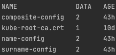
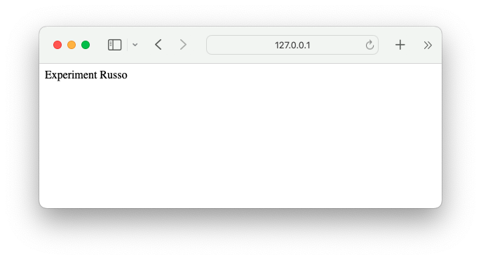

# Centralized configuration (Kubernetes)
In the ever-evolving landscape of cloud-native applications and microservices, the concept of configuration management has become not only essential but pivotal. As applications increase in complexity and scale, managing their configuration efficiently and securely is crucial for sustaining operational excellence and maintaining the agility needed to respond to changing demands. One of the key paradigms that have emerged to address these challenges is **Configuration as Data**. 

This innovative approach emphasizes the separation of configuration data from the application code, promoting its externalization to a _centralized management_ system. By treating configuration as an independent entity, organizations can unlock a myriad of benefits that are indispensable for modern, scalable, and secure applications operating in dynamic environments such as Kubernetes.

## Benefits of centralized configuration
### Abstraction
One of the fundamental principles behind `Configuration as Data` is the abstraction of configuration details from the application containers. 

In a Kubernetes environment, this means that *configuration data is stored and managed outside the application pods*. This abstraction allows Kubernetes to manage the lifecycle of pods independently of their configuration. 

*Pods can be destroyed and recreated without losing their configuration state*, as the configuration is maintained separately. This separation of concerns enhances the resilience and flexibility of applications, enabling seamless updates and scaling operations without disrupting the configuration.

### Reusability
Centralized configuration management facilitates reusability. Instead of embedding configuration data within individual containers, which could lead to duplication and inconsistencies, *the same configuration can be shared across multiple pods*. 

This approach is particularly beneficial in scenarios where multiple instances of an application or different applications require the same configuration settings. By externalizing configuration, organizations can ensure consistency and reduce the overhead of managing configuration changes across numerous containers. 

This also simplifies the process of maintaining and updating configurations, as changes need to be made only once in the central configuration store.

### Service discovery
In a microservices architecture, services need to communicate with each other and often with external services. `Configuration as Data` can be leveraged for service discovery, helping services locate each other within and outside the cluster. By centralizing the configuration, services can dynamically retrieve the necessary information about other services, such as URLs, ports, and authentication details. 

This dynamic configuration capability is essential for maintaining the connectivity and functionality of services in a distributed environment, where services may scale up or down and their network addresses might change frequently.

### Data protection
Protecting sensitive information is a paramount concern in any application deployment. Configuration often includes sensitive data such as passwords, API keys, and certificates. *By externalizing configuration data and storing it securely within the cluster, organizations can keep sensitive information out of container images*. 

This practice significantly enhances security, as container images can be shared publicly without exposing confidential data. Additionally, Kubernetes provides mechanisms such as `Secrets` to securely manage sensitive configuration data, ensuring that it is encrypted at rest and in transit, and accessed only by authorized components.

## How to inject configuration data in a Pod

We have two ways
- `ConfigMap`
- `Secret`

### ConfigMap
ConfigMaps are Kubernetes objects that encapsulate key-value properties, which can be used within containers via the filesystem or environment variables.
There are two main ways to create ConfigMaps in Kubernetes.
#### Imperative approach
Using _literals_ we have 2 different ways:
- Create a new ConfigMap named _my-config_ with a single key-value pair:
```bash
kubectl create configmap my-config --from-literal=key1=config1
```

- Create a new ConfigMap named _my-config_ with multiple key-value pairs:

```bash
kubectl create configmap my-config --from-literal=key1=config1 --from-literal=key2=config2
```

Using an _environment file_ we can create a new ConfigMap named _my-config_ using key-value pairs from _config.txt_:
```bash
kubectl create configmap my-config --from-env-file=config.txt
```

We can also create a ConfigMap from a _file or directory_ named _my-config_:
```bash
kubectl create configmap my-config --from-file=config.txt
```

#### Declarative approach
In Kubernetes, the declarative approach involves defining configuration resources in YAML files. This method is preferred for managing ConfigMaps as it provides a clear, version-controlled specification of desired configurations.
An example of ConfigMap is:
```yaml
apiVersion: v1
kind: ConfigMap
metadata:
  name: my-config
data:
  key1: "example1"
  key2: "example2"
```
To apply this YAML file as a ConfigMap, we have to run the following command:
```bash
kubectl apply -f my-config.yaml
```

#### Mount/consume a ConfigMap
ConfigMaps in Kubernetes can be consumed by pods in two primary ways: 
- As environment variables
- As volumes mounted to the filesystem

This flexibility allows applications to access configuration data seamlessly without hardcoding it into container images.

### Secret
In Kubernetes, Secrets are specialized objects designed to securely store sensitive information such as passwords, OAuth tokens, and SSH keys. Unlike ConfigMaps which store data in plain text, Secrets ensure that sensitive data is stored in an encoded and encrypted format. 

This approach enhances security by minimizing exposure of confidential information within your cluster.

#### Imperative approach
Using *literals*

```bash
kubectl create secret generic db-secret --from-literal=pwd=admin
```
This command creates a Secret named db-secret with the key pwd and value admin.

Using *environment variables*
```bash
kubectl create secret generic db-secret --from-env-file=secret.env
```
This command reads values from secret.env file and creates a Secret named db-secret.

Using *SSH keys*
```bash
kubectl create secret generic ssh-key-secret --from-file=ssh-privatekey=/path/to/.ssh/id_rsa
```
Here, ssh-privatekey is the key name, and */path/to/.ssh/id_rsa* is the path to the SSH private key file.

#### Declarative approach
For a more controlled and repeatable approach, you can create Secrets declaratively using YAML configuration files. Before applying the YAML, ensure sensitive data is base64-encoded:
```bash
echo -n 'admin' | base64
```
This command outputs YWRtaW4= which is the base64-encoded value of admin.

Now we create the *secret.yaml* file to define the Secret:
```yaml
apiVersion: v1
kind: Secret
metadata:
  name: my-secret
data:
  pwd: YWRtaW4=
```

We pass the values of the Secret file in the *deployment.yaml* file as a environment variable of the container.

## Project setup
To implement an example of centralized configuration, let's start by modifying the project [spring-with-kubernetes](../code/spring-with-kubernetes).
Since in the previous example there are no sensitive data, the centralized configuration will be performed using **ConfigMaps**.

### Name service
#### configmap.yaml
```yaml
apiVersion: v1
kind: ConfigMap
metadata:
  name: name-config
data:
  names: |-
    Luca, Marco, Giulia, Francesca, Matteo, Elena, Davide, Silvia, Alessandro, Chiara
  delayMillis: "1000"
```
This YAML configuration defines a ConfigMap named _name-config_. It includes two data entries:
- `names`: A multiline string containing a list of names separated by commas.
- `delayMillis`: A string representing the delay time in milliseconds, set to 1000.

These entries can be referenced and used within Kubernetes pods or deployments to configure application behavior dynamically _without changing the application's container image_.

#### deployment.yaml
```yaml
apiVersion: apps/v1
kind: Deployment
metadata:
  name: name-service-end
  labels:
    app: name-service-end
spec:
  replicas: 1
  selector:
    matchLabels:
      app: name-service-end
  template:
    metadata:
      labels:
        app: name-service-end
    spec:
      containers:
        - name: name-service-end
          image: spring-with-kubernetes-configmap-name:latest
          imagePullPolicy: IfNotPresent
          ports:
            - containerPort: 9001
          env:
            - name: names
              valueFrom:
                configMapKeyRef:
                  name: name-config
                  key: names
            - name: delayMillis
              valueFrom:
                configMapKeyRef:
                  key: delayMillis
                  name: name-config
      volumes:
        - name: config-volume
          configMap:
            name: name-config

```
In the **env** section we specify the environment variables to be injected into the container.
- `names`: This environment variable is assigned the value of the variable _names_ in the file _name-config_, which is the ConfigMap of the _Name_ service.
- `delayMillis`: This is another variable, also retrieved from the _name-config_ file.

In the **volumes** section we define volumes that can be mounted into the pod.
This deployment configuration includes a volume named _config-volume_ that sources its content from a ConfigMap named _name-config_, enabling the pod to access the entire ConfigMap data as mounted files at a specified path.

#### NameController.java
```java
@RestController
public class NameController {

    @Value("${names}")
    private String names;
    private List<String> NAMES;

    @Value("${delayMillis}")
    private int delay;

    private static final Random RND = new Random();

    @GetMapping(value = "/name")
    public Mono<String> name() throws InterruptedException {
        initializeNamesList();
        String randomName = NAMES.get(RND.nextInt(NAMES.size()));
        return Mono.just(randomName)
                .delayElement(Duration.ofMillis(delay));
    }

    private void initializeNamesList() {
        if (NAMES == null) {
            NAMES = Arrays.asList(names.split(",\\s*"));
        }
    }
}
```
These annotations `@Value("${names}")` and `@Value("${delayMillis}")` inject values from Spring's environment into the corresponding fields names and delay. These values are retrieved from the ConfigMap defined in the Kubernetes cluster.

### Surname service
The surname service follows the same logic as the name service, but it operates with surnames instead.

#### configmap.yaml
```yaml
apiVersion: v1
kind: ConfigMap
metadata:
  name: surname-config
data:
  surnames: |-
    Rossi, Bianchi, Russo, Ferrari, Esposito, Bianchi, Romano, Colombo, Conti, Moretti
  delayMillis: "1000"
```

#### deployment.yaml
```yaml
apiVersion: apps/v1
kind: Deployment
metadata:
  name: surname-service-end
  labels:
    app: surname-service-end
spec:
  replicas: 1
  selector:
    matchLabels:
      app: surname-service-end
  template:
    metadata:
      labels:
        app: surname-service-end
    spec:
      containers:
        - name: surname-service-end
          image: spring-with-kubernetes-configmap-surname:latest
          imagePullPolicy: IfNotPresent
          ports:
            - containerPort: 9002
          env:
            - name: surnames
              valueFrom:
                configMapKeyRef:
                  name: surname-config
                  key: surnames
            - name: delayMillis
              valueFrom:
                configMapKeyRef:
                  key: delayMillis
                  name: surname-config
      volumes:
        - name: config-volume
          configMap:
            name: surname-config
```

#### SurnameController.java
```java
@RestController
public class SurnameController {

    @Value("${surnames}")
    private String surnames;
    private List<String> SURNAMES;

    @Value("${delayMillis}")
    private int delay;
    private static final Random RND = new Random();

    @GetMapping(value = "/surname")
    public Mono<String> surname() throws InterruptedException {
        initializeSurnamesList();
        String randomSurname = SURNAMES.get(RND.nextInt(SURNAMES.size()));
        return Mono.just(randomSurname)
                .delayElement(Duration.ofMillis(delay));
    }

    private void initializeSurnamesList() {
        if (SURNAMES == null) {
            SURNAMES = Arrays.asList(surnames.split(",\\s*"));
        }
    }
}
```

### Composite service
#### configmap.yaml
```yaml
apiVersion: v1
kind: ConfigMap
metadata:
  name: composite-config
data:
  name-service-url: "http://name-service-end/name"
  surname-service-url: "http://surname-service-end/surname"
```
This ConfigMap defines two variables, `name-service-url` and `surname-service-url`, which contain the URLs used to call the name and surname services respectively.

#### deployment.yaml
```yaml
apiVersion: apps/v1
kind: Deployment
metadata:
  name: composite-service-end
spec:
  replicas: 1
  selector:
    matchLabels:
      app: composite-service-end
  template:
    metadata:
      labels:
        app: composite-service-end
    spec:
      containers:
        - name: composite-service-end
          image: spring-with-kubernetes-configmap-composite:latest
          imagePullPolicy: IfNotPresent
          ports:
            - containerPort: 8080
          env:
            - name: name-service-url
              valueFrom:
                configMapKeyRef:
                  name: composite-config
                  key: name-service-url
            - name: surname-service-url
              valueFrom:
                configMapKeyRef:
                  name: composite-config
                  key: surname-service-url
      volumes:
        - name: config-volume
          configMap:
            name: composite-config
```
As we saw in the previous microservices, we mount the _config-volume_ and declare the two environment variables.

#### CompositeController.java
```java
@RestController
public class CompositeController {
    private WebClient webClient;
    private String nameServiceUrl;
    private String surnameServiceUrl;

    public CompositeController(WebClient.Builder builder,
                               @Value("${name-service-url}") String nameServiceUrl,
                               @Value("${surname-service-url}") String surnameServiceUrl) {

        webClient = builder.build();
        this.nameServiceUrl = nameServiceUrl;
        this.surnameServiceUrl = surnameServiceUrl;
    }

    @GetMapping("/test")
    public Mono<String> getTest() {
        return Mono.just("Test OK");
    }

    @GetMapping("/full-name")
    public Mono<String> getCompleteName() throws Exception {

        Mono<String> nameMono = webClient.get().uri(nameServiceUrl).retrieve().bodyToMono(String.class);
        Mono<String> surnameMono = webClient.get().uri(surnameServiceUrl).retrieve().bodyToMono(String.class);

        return Mono.zip(nameMono, surnameMono, (name, surname) -> name + " " + surname);
    }
}
```

### Running the project
```bash
minikube start
eval $(minikube docker-env)
```

To clean and package the project, we can run this command:
```bash
mvn clean package -Dmaven.test.skip=true 
```
We need to skip the tests. Otherwise, Maven tests fail to find the variables that controllers should fetch from the ConfigMap.

To create the container images:
```bash
docker compose build
```

Now, we have to apply the different ConfigMaps before deployment. Otherwise, the deployment can't find the variables declared in the ConfigMap.
```bash
kubectl apply -f composite-service-end/kubernetes/configmap.yaml
kubectl apply -f name-service-end/kubernetes/configmap.yaml
kubectl apply -f surname-service-end/kubernetes/configmap.yaml
```

We can see the three ConfigMaps with the command:
```bash
kubectl get configmap
```


Now we can apply the Kubernetes deployment and service configurations for each application:
```bash
kubectl apply -f composite-service-end/kubernetes/deployment.yaml
kubectl apply -f composite-service-end/kubernetes/service.yaml

kubectl apply -f name-service-end/kubernetes/deployment.yaml
kubectl apply -f name-service-end/kubernetes/service.yaml

kubectl apply -f surname-service-end/kubernetes/deployment.yaml
kubectl apply -f surname-service-end/kubernetes/service.yaml
```

Expose the composite-service-end using Minikube's service command, which will open a browser window pointing to the service endpoint:
```bash
minikube service composite-service-end
```
The browser page will automatically open at the (tunnel) address of the `composite` service. By adding _/full-name_ to the URL, we can see the random name generated by the two underlying services, `name` and `surname`.


## Updating ConfigMaps and observing changes
If you need to modify any data within the ConfigMaps for any reason, it can be done seamlessly. ConfigMaps are designed to be easily updatable. 

After making the desired changes to the ConfigMap, you can simply restart the pod that uses this configuration. Upon restarting the pod, it will start using the updated values from the ConfigMap. 

This capability allows for flexible management of application configurations without needing to reconfigure or republish the entire container image.

For example, let's try modifying the list of names and observe if the outcome changes.

### Modify the configmap.yaml for the Name service
```yaml
apiVersion: v1
kind: ConfigMap
metadata:
  name: name-config
data:
  names: |-
    Test, Experiment, Examination
  delayMillis: "1000"
```
```bash
kubectl apply -f name-service-end/kubernetes/configmap.yaml
```

Now we need to restart the pod. The simplest way is to delete it, and thanks to the replicaset, it restarts immediately.
```bash
kubectl delete pod <pod-name>
```

Again, expose the composite-service-end using Minikube's service command, which will open a browser window pointing to the service endpoint:
```bash
minikube service composite-service-end
```

