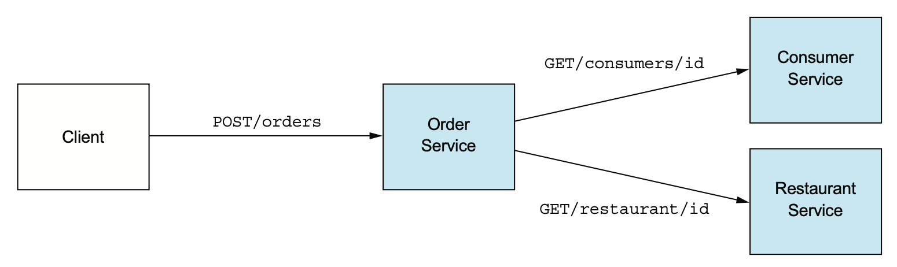
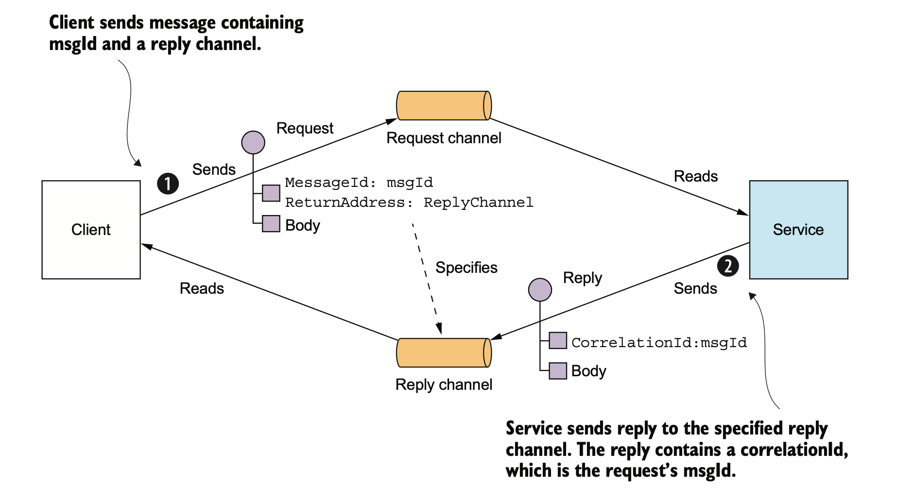
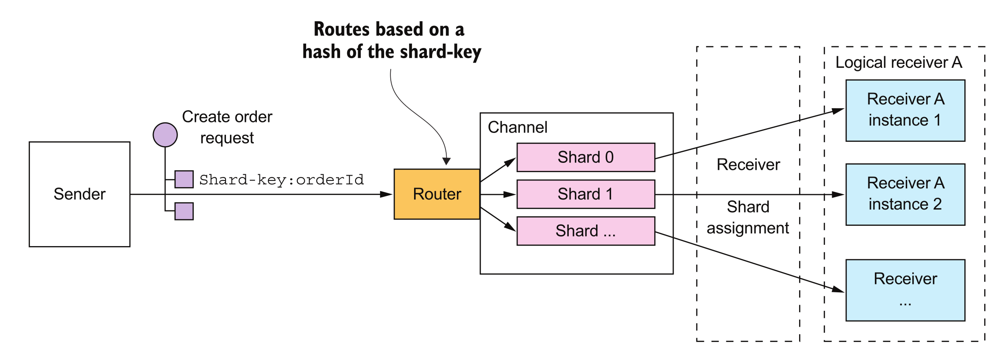
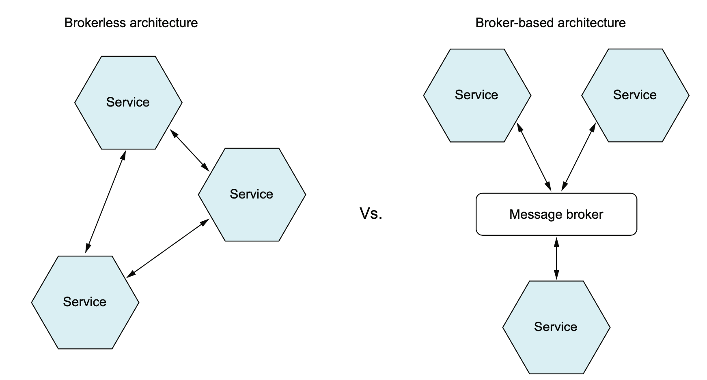

# Event-driven architecture

## Overview of interprocess communication in a microservice architecture

There are lots of different IPC technologies to choose from. Services can use synchronous request/response-based communication mechanisms, such as HTTP-based REST or gRPC. Alternatively, they can use asynchronous, message-based communication mechanisms such as [AMQP](https://it.wikipedia.org/wiki/Advanced_Message_Queuing_Protocol) or [STOMP](https://en.wikipedia.org/wiki/Streaming_Text_Oriented_Messaging_Protocol). 

### Message formats

#### Text-based formats
The first category is text-based formats such as JSON and XML. An advantage of these formats is that not only are they human-readable, they’re self describing. They also enable consumers to pick out the values of interest and ignore the rest. Consequently, many changes to the message schema can easily be backward-compatible.

A downside of using a text-based messages format is that the messages tend to be verbose and imply the overhead of parsing text. Consequently, **if efficiency and performance are important, you may want to consider using a binary format**. You can read [here](https://blog.shiftasia.com/grpc-vs-rest-speed-comparation/) an interesting article benchmarking REST (text) against Protocol Buffers (binary).

#### Binary formats
There are several different binary formats to choose from. Popular formats include [Protocol Buffers](https://developers.google.com/protocol-buffers/docs/overview) and [Avro](https://avro.apache.org). Both formats provide a typed IDL for defining the structure of your messages.

Several tests, for example [this one](https://softwaremill.com/data-serialization-tools-comparison-avro-vs-protobuf/), show that Protobuf is better when it comes to speed of serialization and deserialization. On the other hand, Avro provides with little bit more compacted serialized data. If performance is a critical concern, then Protobuf's speed and efficiency may make it a better choice. If you need more complex data structures or built-in compression options, then Avro may be a better fit.


### Interaction styles
There are a variety of client-service interaction styles, they can be categorized in two dimensions. The first dimension is whether the interaction is **one-to-one** or **one-to-many**:

* **One-to-one**: Each client request is processed by exactly one service.
* **One-to-many**: Each request is processed by multiple services.

The second dimension is whether the interaction is **synchronous** or **asynchronous**:

* **Synchronous**: The client expects a timely response from the service and might even block while it waits. 
* **Asynchronous**: The client doesn't block, and the response, if any, isn’t necessarily sent immediately.

The following are the different types of main interactions:
* **Request/response**: (one-to-one, sync) A service client makes a request to a service and waits for a response. The client expects the response to arrive in a timely fashion. This is an interaction style that generally results in services being tightly coupled.
* **Asynchronous request/response**: (one to one, async) A service client sends a request to a service, which replies asynchronously. The client doesn't block while waiting, because the service might not send the response for a long time.
* **Publish/subscribe**: (one-to-many, async) A client publishes a notification message, which is consumed by zero or more interested services. 
* **Publish/async responses**: (one-to-many, async) A client publishes a request message and then waits for a certain amount of time for responses from interested services.

### Evolving APIs
APIs invariably change over time as new features are added, existing features are changed, and (perhaps) old features are removed. In a monolithic application, it’s relatively straightforward to change an API and update all the callers.

In a microservices-based application, changing a service’s API is a lot more difficult.
* A service’s clients are other services, which are often developed by other teams.
* The clients may even be other applications outside the organization.
* Modern applications are usually never down for maintenance, you’ll typically perform a rolling upgrade of your service, so both old and new versions of a service will be running simultaneously.

**It’s important to have a strategy for dealing with API changes**.

>The Semantic Versioning specification (http://semver.org) is a useful guide to versioning APIs. It’s a set of rules that specify how version numbers are used and incremented. Semantic versioning was originally intended to be used for versioning of software packages, but you can use it for versioning APIs in a distributed system.


## Issues of synchronous communications

### Chattiness
A common problem when designing a REST API is how to enable the client to retrieve multiple related objects in a single request. For example, imagine that a REST client wanted to retrieve an Order and the Order's Consumer. 



A pure REST API would require the client to make at least two requests, one for the Order and another for its Consumer. A more complex scenario would require even more round-trips and suffer from excessive latency.

One solution to this problem is for an API to allow the client to retrieve related resources when it gets a resource:

```
GET /orders/order-id-1345?expand=consumer
```

The query parameter specifies the related resources to return with the Order. This approach works well in many scenarios, but it’s often insufficient for more complex scenarios. It’s also potentially time-consuming to implement. **This has led to the increasing popularity of alternative API technologies such as [GraphQL](http://graphql.org) and [Netflix Falcor](http://netflix.github.io/falcor/), which are designed to support efficient data fetching**.


### Availability
REST is an extremely popular IPC mechanism. You may be tempted to use it for inter-service communication. The problem with REST, though, is that it’s a synchronous protocol: an HTTP client must wait for the service to send a response. **Whenever services communicate using a synchronous protocol, the availability of the application is reduced**.


In the example above, the Order Service has a REST API for creating an Order. It invokes the Consumer Service and the Restaurant Service to validate the Order. Both of those services also have REST APIs.

Because these services use HTTP, they must all be simultaneously available in order for the FTGO application to process the CreateOrder request. Mathematically speaking, **the availability of an operation is the product of the availability of the services that are invoked by that operation**. If the Order Service and the two services that it invokes are 99.5% available, the overall availability is 99.5 x 3 = 98.5%, which is significantly less. Each additional service that participates in handling a request further reduces availability.

This problem isn’t specific to REST-based communication. **Availability is reduced whenever a service can only respond to its client after receiving a response from another service**. If you want to maximize availability, you must minimize the amount of synchronous communication.

### Temporal coupling
Temporal coupling happens when a service - the caller - expects an instantaneous response from another - the callee - before it can resume processing. Since any delay in the response time of the callee would adversely affect the response time of the caller, the callee has to be always up and responsive. This situation usually happens when services use synchronous communication.

**Latency adds up**: The longer it takes for Consumer and Restaurant to prepare the data, the longer Order has to wait before responding to its clients. 

**Cascading failures is also another possibility**: If Consumer fails to respond, Orders will eventually timeout and fail responding as well. If Consumer continues to be slow or unresponsive for a while, Orders might end up with a lot of open connections to Consumer, and eventually run out of memory, and fail!

### Code Flexibility
With the synchronous model, if we had another service that was required to fill an Order, we’d need to manually add another call from the Order service to the other service. This means a code change and redeployment.

**If we use the synchronous, request-response model, we start to see a web-like pattern of dependency between our services. The centers of these webs become our major points of failure within our application.**

## Asynchronous messaging
When using messaging, services communicate by asynchronously exchanging messages:
* a messaging-based application typically uses a message broker, which acts as an intermediary between the services 
* a service client makes a request to a service by sending it a message. Because the communication is asynchronous, the client doesn't block waiting for a reply. Instead, the client is written assuming that the reply won’t be received immediately.

### Messages
A message consists of a header and a message body. The header is a collection of name-value pairs, metadata that describes the data being sent. The message body is the data being sent, in either text or binary format. There are several different kinds of messages:

* **Command** A message that’s the equivalent of an RPC request. It specifies the operation to invoke and its parameters.
* **Document** A generic message that contains only data. The receiver decides how to interpret it. The reply to a command is an example of a document message.
* **Event** A message indicating that something notable has occurred in the sender. An event is often a domain event, which represents a state change of a domain object such as an Order, or a Customer.


### Message channels
Messages are exchanged over channels. A message channel is an abstraction of the messaging infrastructure. There are two kinds of channels:
* A **point-to-point channel** delivers a message to exactly one of the consumers that is reading from the channel. Services use point-to-point channels for the one-to-one interaction styles. For example, a command message is often sent over a point-to-point channel.
* A **publish-subscribe channel** delivers each message to all the attached consumers. Services use publish-subscribe channels for the one-to-many interaction styles. For example, an event message is usually sent over a publish-subscribe channel.
  
### Implementing the interaction styles using messaging

**One-way notifications**: Implementing one-way notifications is straightforward using asynchronous messaging. The client sends a message, typically a command message, to a point-to-point channel owned by the service. The service subscribes to the channel and processes the message. it doesn't send back a reply.

**Asynchronous request/response**: **Messaging is inherently asynchronous, so only provides asynchronous request/response**. With asynchronous request/response there is no expectation of an immediate reply: the client must tell the service where to send a reply message and must match reply messages to requests.



**Publish/subscribe**: Messaging has built-in support for the publish/subscribe style of interaction. A client publishes a message to a publish-subscribe channel that is read by multiple consumers. 



The service that publishes the domain events owns a publish-subscribe channel, whose name is derived from the domain class. For example, the Order Service publishes Order events to an Order channel, and the Delivery Service publishes Delivery events to a Delivery channel. A service that’s interested in a particular domain object’s events only has to subscribe to the appropriate channel.

**Publish/async responses**: The publish/async responses interaction style is a higher-level style of interaction that’s implemented by combining elements of publish/subscribe and request/response. A client publishes a message that specifies a reply channel header to a publish-subscribe channel. A consumer writes a reply message containing a correlation id to the reply channel. The client gathers the responses by using the correlation id to match the reply messages with the request.

## Asynchronous messaging systems



### Broker-based messaging
A message broker is an intermediary through which all messages flow. A sender writes the message to the message broker, and the message broker delivers it to the receiver.

There are many message brokers to chose from:
* RabbitMQ (https://www.rabbitmq.com)
* Apache Kafka (http://kafka.apache.org)
* ActiveMQ (http://activemq.apache.org)
* AWS Kinesis (https://aws.amazon.com/kinesis/)
* AWS SQS (https://aws.amazon.com/sqs/)

**Advantages of Broker Messaging Queues**
* **Loose coupling**: By using a message broker, services can communicate with each other without having direct dependencies on each other. This allows for increased flexibility and easier maintenance, as services can be added, removed, or modified without affecting other services.
* **Scalability**: A message broker can handle message distribution and load balancing, allowing for horizontal scaling of services. This means that as the number of services or the workload increases, the message broker can distribute the load across multiple instances of the service, ensuring efficient resource utilization.
* **Reliability**: A message broker can provide reliable message delivery by implementing features such as message persistence and guaranteed delivery. This ensures that messages are not lost in case of failures or network issues.
* **Centralized control**: A message broker acts as a central hub, allowing for easier management, monitoring, and administration of messages and communication between services.
* **Message transformation and routing**: Brokers often provide powerful routing capabilities, allowing messages to be transformed and directed to the appropriate destinations based on various criteria.

**Disadvantages of Broker Messaging Queues**
* **Single point of failure**: Since all messages pass through a central message broker if the broker fails, it can disrupt the entire messaging system.
* **Increased complexity**: Setting up and configuring a message broker can be more complex compared to brokerless messaging approaches.
* **Potential performance impact**: The additional overhead of routing messages through a broker can introduce some latency and potentially impact performance.

### Brokerless messaging
Brokerless messaging architectures are based on libraries allowing services to communicate with one another directly.

There are many message brokers to chose from:
* ZeroMQ (https://zeromq.org/)
* NanoMsg (https://nanomsg.org/)

**Advantages of Brokerless Messaging Queues**
* **Simplicity**: Brokerless messaging eliminates the need for a central message broker, reducing the complexity of the system.
* **Improved performance**: Without the need to route messages through a broker, brokerless messaging can offer lower latency and higher throughput, especially for local communication between services.
* **No single point of failure**: They eliminate the possibility of the message broker being a performance bottleneck or a single point of failure.

**Disadvantages of Brokerless Messaging Queues**
* **Spatial coupling**: Services need to know about each other’s locations and must therefore use one of the discovery mechanisms.
* **Time coupling**: Because both the sender and receiver of a message must be available while the message is being exchanged.
* **Scalability limitations**: Brokerless messaging may not scale as well as broker-based messaging for large-scale deployments, as the responsibility for message distribution and load balancing lies with individual services.
* **No built-in guaranteed delivery**: Brokerless messaging may require additional effort to implement reliable message delivery, as there is no inherent mechanism provided by a central broker.


## Issues of asynchronous communications
Message-based applications make it more difficult to reason through its business logic because its code is no longer processed in a linear fashion with a simple block request-response model.

### Message-handling semantics
Using messages in a microservice-based application requires more than understanding how to publish and consume messages. It requires that we understand how our application will behave based on the order in which messages are consumed and what happens if a message is processed out of order. For example, if we have strict requirements that all orders from a single customer must be processed in the order they are received, we’ll need to set up and structure our message handling differently than if every message can be consumed independently of one another.

*If a message fails, do we retry processing the error or do we let it fail? How do we handle future messages related to that customer if one of the customer’s messages fails?* These are important questions to think through.

### Message choreography
Using messages in microservices often means a mix of synchronous service calls and asynchronous service processing. The asynchronous nature of messages means they might not be received or processed in close proximity to when the message is published or consumed. Having things like correlation IDs for tracking a user’s transactions across service invocations is critical to understanding and debugging what’s going on in our application.

Also, debugging message-based applications can involve wading through the logs of several different services, where user transactions can be executed out of order and at different times.


## Resources
- Microservices Patterns (Chapter 3)
- Microservices with SpringBoot3 and SpringCloud (Chapter 7)
- [The Many Meanings of Event-Driven Architecture](https://www.youtube.com/watch?v=STKCRSUsyP0)
- https://softwaremill.com/data-serialization-tools-comparison-avro-vs-protobuf/

