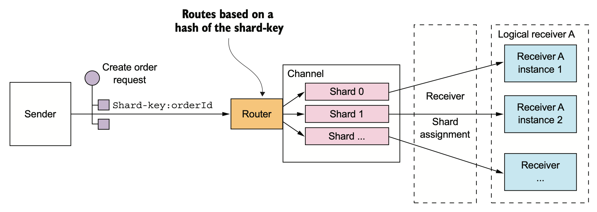

# Event-driven async microservices

Sources: Microservices Patterns (Chapter 3)

## Overview of interprocess communication in a microservice architecture

There are lots of different IPC technologies to choose from. Services can use synchronous request/response-based communication mechanisms, such as HTTP-based REST or gRPC. Alternatively, they can use asynchronous, message-based communication mechanisms such as AMQP or STOMP. 

There are also a variety of different messages formats. Services can use human-readable, text-based formats such as JSON or XML. Alternatively, they could use a more efficient binary format such as Avro or Protocol Buffers.

### Interaction styles
There are a variety of client-service interaction styles, they can be categorized in two dimensions. The first dimension is whether the interaction is **one-to-one** or **one-to-many**:

* One-to-one: Each client request is processed by exactly one service.
* One-to-many: Each request is processed by multiple services.

The second dimension is whether the interaction is **synchronous** or **asynchronous**:

* Synchronous: The client expects a timely response from the service and might even block while it waits. 
* Asynchronous: The client doesn’t block, and the response, if any, isn’t necessarily sent immediately.

The following are the different types of main interactions:

* **Request/response**: A service client makes a request to a service and waits for a response. The client expects the response to arrive in a timely fashion. This is an interaction style that generally results in services being tightly coupled.
* **Asynchronous request/response**: A service client sends a request to a service, which replies asynchronously. The client doesn’t block while waiting, because the service might not send the response for a long time.
* **Publish/subscribe**: A client publishes a notification message, which is consumed by zero or more interested services. 
* **Publish/async responses**: A client publishes a request message and then waits for a certain amount of time for responses from interested services.

### Evolving APIs
APIs invariably change over time as new features are added, existing features are changed, and (perhaps) old features are removed. In a monolithic application, it’s relatively straightforward to change an API and update all the callers. 

In a microservices-based application, changing a service’s API is a lot more difficult. 
* A service’s clients are other services, which are often developed by other teams. 
* The clients may even be other applications outside of the organization.
* Modern applications are usually never down for maintenance, you’ll typically perform a rolling upgrade of your service, so both old and new versions of a service will be running simultaneously.

It’s important to have a strategy for dealing with these challenges.

>The Semantic Versioning specification (http://semver.org) is a useful guide to versioning APIs. It’s a set of rules that specify how version numbers are used and incremented. Semantic versioning was originally intended to be used for versioning of software packages, but you can use it for versioning APIs in a distributed system.

### Message formats

#### Text-based formats
The first category is text-based formats such as JSON and XML. An advantage of these formats is that not only are they human-readable, they’re self describing. A JSON message is a collection of named properties. 

Similarly, an XML message is effectively a collection of named elements and values. This format enables a consumer of a message to pick out the values of interest and ignore the rest. Consequently, many changes to the message schema can easily be backward-compatible.

A downside of using a text-based messages format is that the messages tend to be verbose, especially XML. Another drawback is the overhead of parsing text, especially when messages are large. Consequently, *if efficiency and performance are important, you may want to consider using a binary format*.

#### Binary formats
There are several different binary formats to choose from. Popular formats include Protocol Buffers (https://developers.google.com/protocol-buffers/docs/overview) and Avro (https://avro.apache.org). Both formats provide a typed IDL for defining the structure of your messages. 

One difference between these two binary formats is that Protocol Buffers uses tagged fields, whereas an Avro consumer needs to know the schema in order to interpret messages. As a result, handling API evolution is easier with Protocol Buffers than with Avro. 

#### Fetching multiple resources in a single request
REST resources are usually oriented around business objects, such as Consumer and Order. Consequently, a common problem when designing a REST API is how to enable the client to retrieve multiple related objects in a single request. 

For example, imagine that a REST client wanted to retrieve an Order and the Order's Consumer. A pure REST API would require the client to make at least two requests, one for the Order and another for its Consumer. A more complex scenario would require even more round-trips and suffer from excessive latency.

One solution to this problem is for an API to allow the client to retrieve related resources when it gets a resource:

```
GET /orders/order-id-1345?expand=consumer
```

The query parameter specifies the related resources to return with the Order. This approach works well in many scenarios but it’s often insufficient for more complex scenarios. It’s also potentially time-consuming to implement. This has led to the increasing popularity of alternative API technologies such as GraphQL (http://graphql.org) and Netflix Falcor (http://netflix.github.io/falcor/), which are designed to support efficient data fetching.

## Synchronous communication reduces availability
REST is an extremely popular IPC mechanism. You may be tempted to use it for inter-service communication. The problem with REST, though, is that it’s a synchronous protocol: an HTTP client must wait for the service to send a response. **Whenever services communicate using a synchronous protocol, the availability of the application is reduced**.


The Order Service has a REST API for creating an Order. It invokes the Consumer Service and the Restaurant Service to validate the Order. Both of those services also have REST APIs.

Because these services use HTTP, they must all be simultaneously available in order for the FTGO application to process the CreateOrder request. The FTGO application couldn’t create orders if any one of these three services is down. Mathematically speaking, the availability of a system operation is the product of the availability of the services that are invoked by that operation. If the Order Service and the two services that it invokes are 99.5% available, the overall availability is 99.5%3 = 98.5%, which is significantly less. Each additional service that participates in handling a request fur- ther reduces availability.

This problem isn’t specific to REST-based communication. Availability is reduced whenever a service can only respond to its client after receiving a response from another service. If you want to maximize availability, you must minimize the amount of synchronous communication.

## Communicating using the Asynchronous messaging pattern
When using messaging, services communicate by asynchronously exchanging messages. A messaging-based application typically uses a message broker, which acts as an intermediary between the services, although another option is to use a brokerless architecture, where the services communicate directly with each other. 

A service client makes a request to a service by sending it a message. If the service instance is expected to reply, it will do so by sending a separate message back to the client. 

Because the communication is asynchronous, the client doesn’t block waiting for a reply. Instead, the client is written assuming that the reply won’t be received immediately.

### Messages
A message consists of a header and a message body. The header is a collection of name-value pairs, metadata that describes the data being sent. The message body is the data being sent, in either text or binary format. There are several different kinds of messages:

* **Document** A generic message that contains only data. The receiver decides how to interpret it. The reply to a command is an example of a document message.
* **Command** A message that’s the equivalent of an RPC request. It specifies the operation to invoke and its parameters.
* **Event** A message indicating that something notable has occurred in the sender. An event is often a domain event, which represents a state change of a domain object such as an Order, or a Customer.


### Message channels
Messages are exchanged over channels. The business logic in the sender invokes a sending port interface, which encapsulates the underlying communication mechanism. The sending port is implemented by a message sender adapter class, which sends a message to a receiver via a message channel. A message channel is an abstraction of the messaging infrastructure. A message handler adapter class in the receiver is invoked to handle the message. It invokes a receiving port interface implemented by the consumer’s.

There are two kinds of channels: **point-to-point** and **publish-subscribe**:
* A point-to-point channel delivers a message to exactly one of the consumers that is reading from the channel. Services use point-to-point channels for the one- to-one interaction styles described earlier. For example, a command message is often sent over a point-to-point channel.
* A publish-subscribe channel delivers each message to all of the attached consum- ers. Services use publish-subscribe channels for the one-to-many interaction styles described earlier. For example, an event message is usually sent over a publish-subscribe channel.
  
### Implementing the interaction styles using messaging

#### Implementing request/response and asynchronous request/response
When a client and service interact using either request/response or asynchronous request/response, the client sends a request and the service sends back a reply. The difference between the two interaction styles is that with request/response the client expects the service to respond immediately, whereas with asynchronous request/response there is no such expectation. Messaging is inherently asynchronous, so only provides asynchronous request/response. But a client could block until a reply is received.

Regarding async communications, the client must tell the service where to send a reply message and must match reply messages to requests. Fortunately, solving these two problems isn’t that difficult. The client sends a command message that has a reply channel header. The server writes the reply message, which contains a correlation id that has the same value as message identifier, to the reply channel. The client uses the correlation id to match the reply message with the request.


#### Implementing one-way notifications
Implementing one-way notifications is straightforward using asynchronous messaging. The client sends a message, typically a command message, to a point-to-point channel owned by the service. The service subscribes to the channel and processes the message. it doesn’t send back a reply.

#### Implementing publish/subscribe
Messaging has built-in support for the publish/subscribe style of interaction. A client publishes a message to a publish-subscribe channel that is read by multiple consumers. 

The service that publishes the domain events owns a publish-subscribe channel, whose name is derived from the domain class. For example, the Order Service publishes Order events to an Order channel, and the Delivery Service publishes Delivery events to a Delivery channel. A service that’s interested in a particular domain object’s events only has to subscribe to the appropriate channel.

#### Implementing publish/async responses
The publish/async responses interaction style is a higher-level style of interaction that’s implemented by combining elements of publish/subscribe and request/response. A client publishes a message that specifies a reply channel header to a publish-subscribe channel. A consumer writes a reply message containing a correlation id to the reply channel. The client gathers the responses by using the correlation id to match the reply messages with the request.

## Overview of brokerless messaging

A messaging-based application typically uses a message broker, an infrastructure service through which the service communicates. But a broker-based architecture isn’t the only messaging architecture. You can also use a brokerless-based messaging architecture, in which the services communicate with one another directly. The two approaches, have different trade-offs, but usually a broker-based architecture is a better approach.


The brokerless architecture has some benefits:
* Allows lighter network traffic and better latency, because messages go directly from the sender to the receiver, instead of having to go from the sender to the message broker and from there to the receiver.
* Eliminates the possibility of the message broker being a performance bottleneck or a single point of failure.
* Features less operational complexity, because there is no message broker to set up and maintain.

As appealing as these benefits may seem, brokerless messaging has significant drawbacks:
* Services need to know about each other’s locations and must therefore use one of the discovery mechanisms.
* It offers reduced availability, because both the sender and receiver of a message must be available while the message is being exchanged.
* Implementing mechanisms, such as guaranteed delivery, is more challenging.

## Overview of broker-based messaging
A message broker is an intermediary through which all messages flow. A sender writes the message to the message broker, and the message broker delivers it to the receiver. An important benefit of using a message broker is that the sender doesn’t need to know the network location of the consumer. Another benefit is that a message broker buffers messages until the consumer is able to process them.

There are many message brokers to chose from:
* ActiveMQ (http://activemq.apache.org)
* RabbitMQ (https://www.rabbitmq.com)
* Apache Kafka (http://kafka.apache.org)
* AWS Kinesis (https://aws.amazon.com/kinesis/)
* AWS SQS (https://aws.amazon.com/sqs/)

Almost all the message brokers described here support both point-to-point and publish-subscribe channels. The one exception is AWS SQS, which only supports point-to-point channels.

There are many advantages to using broker-based messaging:
* **Loose coupling** A client makes a request by simply sending a message to the appropriate channel. The client is completely unaware of the service instances. It doesn’t need to use a discovery mechanism to determine the location of a service instance. 
* **Message buffering** The message broker buffers messages until they can be processed. With a synchronous request/response protocol such as HTTP, both the client and service must be available for the duration of the exchange. 
* **Flexible communication** Messaging supports all the interaction styles described earlier.
* **Explicit interprocess communication** RPC-based mechanism attempts to make invoking a remote service look the same as calling a local service. But due to the laws of physics and the possibility of partial failure, they’re in fact quite different. Watch [Fallacies of Distributed Systems #2: Latency is Zero](https://www.youtube.com/watch?v=fgu5hM4CI6g)!

There are some downsides to using messaging:
* **Potential performance bottleneck** There is a risk that the message broker could be a performance bottleneck. Fortunately, many modern message brokers are designed to be highly scalable.
* **Potential single point of failure** It’s essential that the message broker is highly available—otherwise, system reliability will be impacted. Fortunately, most modern brokers have been designed to be highly available.
* **Additional operational complexity** The messaging system is yet another system component that must be installed, configured, and operated.

### Competing receivers and message ordering
One challenge is how to scale out message receivers while preserving message ordering. It’s a common requirement to have multiple instances of a service in order to process messages concurrently. But the challenge with processing messages concurrently is ensuring that each message is processed once and in order. 

For example, imagine that there are three instances of a service reading from the same channel and that a sender publishes Order Created, Order Updated, and Order Cancelled event messages sequentially. In theory, a service instance might process the Order Cancelled message before another service processes the Order Created message!

A common solution, used by modern message brokers is to use sharded (partitioned) channels.  The sender specifies a shard key in the message’s header, which is typically an arbitrary string or sequence of bytes. The message broker uses a shard key to assign the message to a particular shard/partition. 



### Handling duplicate messages
Very detailed, only if interested (see book section 3.3.6)


## Resources
- https://softwaremill.com/data-serialization-tools-comparison-avro-vs-protobuf/

