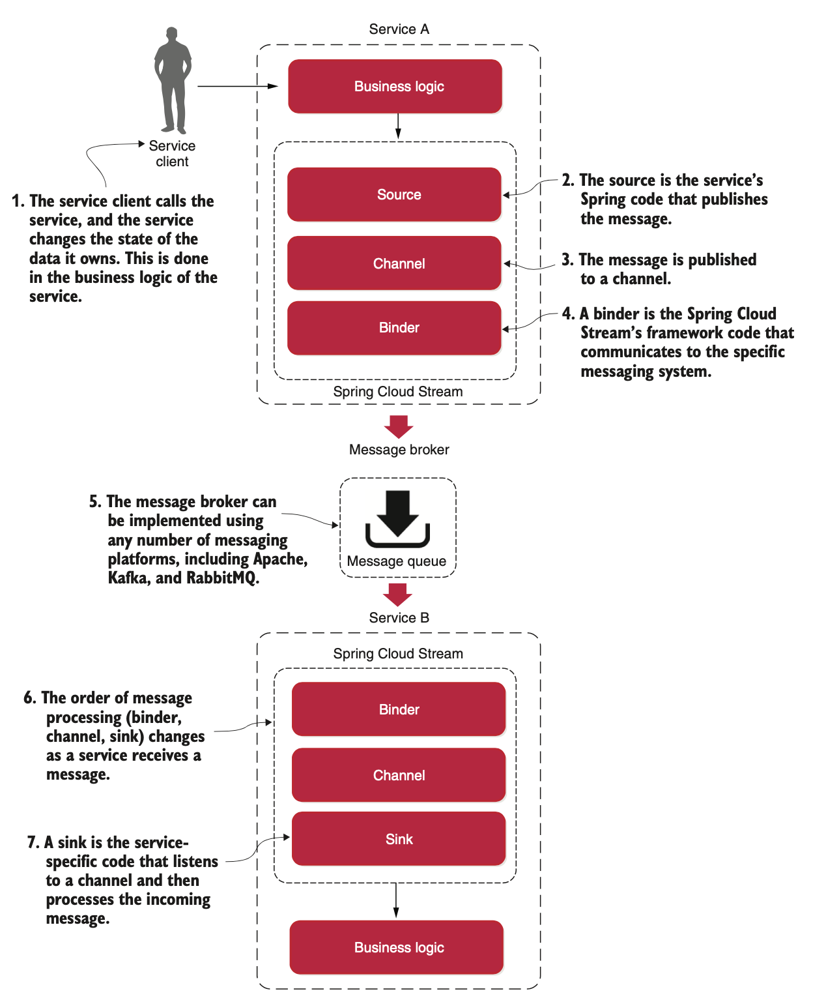
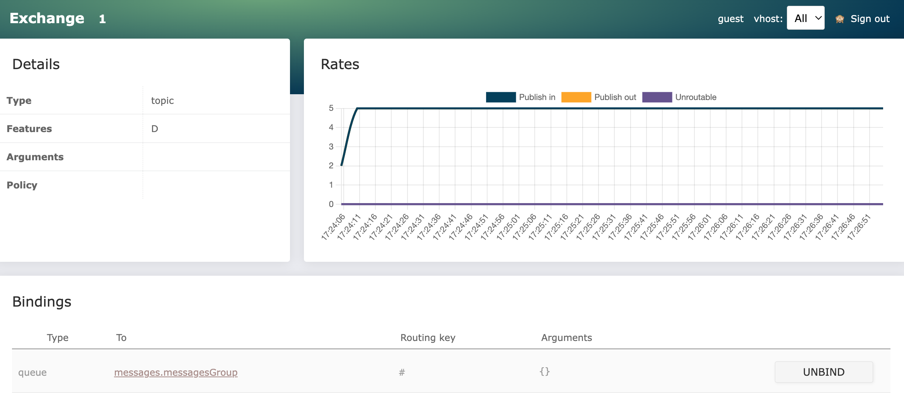
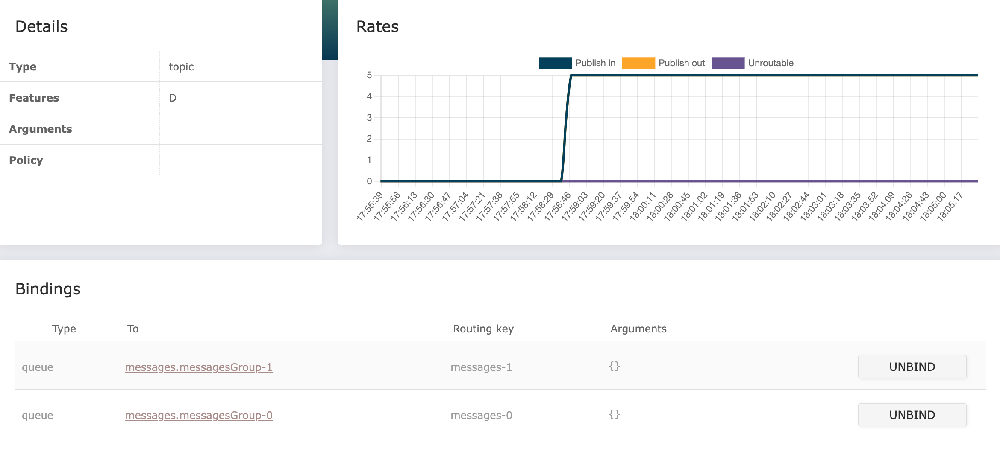

# Event-driven architecture (Spring Cloud Stream)

## Introducing Spring Cloud Stream
Spring Cloud makes it easy to integrate messaging into our Spring-based microservices. It does this through the [Spring Cloud Stream project](https://spring.io/projects/spring-cloud-stream), which is an annotation-driven framework that allows us to easily build message publishers and consumers in our Spring applications.

Spring Cloud Stream also allows us to abstract away the implementation details of the messaging platform that we’re using. We can use multiple message platforms, including Apache Kafka and RabbitMQ, and the platform’s implementation-specific details are kept out of the application code. The implementation of message publication and consumption in your application is done through platform-neutral Spring interfaces.

Let’s begin our discussion by looking at the Spring Cloud Stream architecture through the lens of two services communicating via messaging. One service is the message publisher, and one service is the message consumer.



When a service gets ready to publish a message, it will publish the message using a **source**. A source is a Spring-annotated interface that takes a Plain Old Java Object (POJO), which represents the message to be published. The source takes the message, serializes it (the default serialization is JSON), and publishes the message to a channel.

A **channel** is an abstraction over the queue that’s going to hold the message after it’s published by a message producer or consumed by a message consumer. A channel name is always associated with a target queue name, but that queue name is never directly exposed to the code, which means that we can switch the queues the channel reads or writes from by changing the application’s configuration, not the application’s code.

The **binder** is the Spring code that talks to a specific message platform. The binder part of the Spring Cloud Stream framework allows us to work with messages without having to be exposed to platform-specific libraries and APIs for publishing and consuming messages.

When a service receives a message from a queue, it does it through a **sink**. A sink listens to a channel for incoming messages and deserializes the message back into a POJO object. From there, the message can be processed by the business logic of the Spring service.

## Programming model
The programming model is based on a functional paradigm, where functions implementing one of the functional interfaces *Supplier*, *Function*, or *Consumer* in the *java.util.function* package can be chained together to perform decoupled event-based processing. To trigger such functional-based processing externally, from non-functional code, the helper class *StreamBridge* can be used.

For example, to publish the body of an HTTP request to a topic, we only have to write the following:

```
@Autowired
private StreamBridge streamBridge;

@PostMapping
void sampleCreateAPI(@RequestBody String body) {
    streamBridge.send("topic", body); 
}
```

A function that consumes events from a topic (not creating new events) can be defined by implementing the functional interface *java.util.function.Consumer* as:

```
@Bean
public Consumer<String> mySubscriber() {
   return s -> System.out.println("ML RECEIVED: " + s);
}
```


## Defining events
Messaging systems handle messages that typically consist of headers and a body. An event is a message that describes something that has happened. For events, the message body can be used to describe the type of event, the event data, and a timestamp for when the event occurred.

An event could be defined by the following:
* The type of event, for example, a create or delete event
* A key that identifies the data, for example, a product ID
* A data element, that is, the actual data in the event
* A timestamp, which describes when the event occurred

```
public class Event<K, T> {
    public enum Type {CREATE, DELETE, UPDATE}
    private Type eventType;
    private K key;
    private T data;
    private ZonedDateTime eventCreatedAt;

    public Event() {
    }

    public Event(Type eventType, K key, T data) {
        this.eventType = eventType;
        this.key = key;
        this.data = data;
        this.eventCreatedAt = ZonedDateTime.now();
    }
    
    public Type getEventType() {
        return eventType;
    }

    public K getKey() {
        return key;
    }

    public T getData() {
        return data;
    }

    public ZonedDateTime getEventCreatedAt() {
        return eventCreatedAt;
    }

    @Override
    public String toString() {
        return "Event{" + "eventType=" + eventType + ", key=" + key + ", data=" + data + ", eventCreatedAt=" + eventCreatedAt + '}';
    }
}
```


## Publishing events

To bring in Spring Cloud Stream and its binders for RabbitMQ and Kafka, we need to add *spring-cloud-stream* and at least one between *spring-cloud-starter-stream-rabbit* or *spring-cloud-starter-stream-kafka*.

```
    <dependencies>
        ...
		<dependency>
			<groupId>org.springframework.cloud</groupId>
			<artifactId>spring-cloud-stream</artifactId>
		</dependency>
		<dependency>
			<groupId>org.springframework.cloud</groupId>
			<artifactId>spring-cloud-starter-stream-rabbit</artifactId>
		</dependency>
		...
	</dependencies>
	<dependencyManagement>
		<dependencies>
			<dependency>
				<groupId>org.springframework.cloud</groupId>
				<artifactId>spring-cloud-dependencies</artifactId>
				<version>${spring-cloud.version}</version>
				<type>pom</type>
				<scope>import</scope>
			</dependency>
		</dependencies>
	</dependencyManagement>
```

To publish an event in the integration layer, we need to:
* Create a Message object where the Event object is used as the payload and the key field in the Event object is used as the partition key in the header
* Use the helper class *StreamBridge* to publish the event on the desired topic

```
@Component
public class MessageSender {
    private static final RandomGenerator RANDOM = RandomGenerator.getDefault();
    private static final Logger LOG = LoggerFactory.getLogger(MessageSender.class);
    private final StreamBridge streamBridge;

    public MessageSender(StreamBridge streamBridge) {
        this.streamBridge = streamBridge;
    }

    @Scheduled(fixedRate = 1000)
    public void randomMessage() {
        int index = RANDOM.nextInt(Event.Type.class.getEnumConstants().length);
        Event<String, Integer> event = new Event(
                Event.Type.class.getEnumConstants()[index],
                UUID.randomUUID().toString(),
                RANDOM.nextInt(100)
        );
        sendMessage("message-out-0", event);
    }

    private void sendMessage(String bindingName, Event<String, Integer> event) {
        LOG.debug("Sending message {} to {}", event, bindingName);
        for (int i = 0; i < 5; i++) {
            Message<Event<String, Integer>> message = MessageBuilder.withPayload(event)
                    .setHeader("partitionKey", event.getKey())
                    .build();
            streamBridge.send(bindingName, message);
        }
    }
}
```

We also need to set up the configuration for the messaging system, to be able to publish events. In particular, we need to provide RabbitMQ as the default messaging system, JSON as the default content type, RabbitMQ connectivity information, and which topics should be used.

```
server.port: 8081

spring.rabbitmq:
  host: 127.0.0.1
  port: 5672
  username: guest
  password: guest

spring.cloud.stream:
  defaultBinder: rabbit
  default.contentType: application/json
  bindings:
    message-out-0:
      destination: messages
```

## Receiving events

To be able to consume events, we need to do the following:
* Declare message processors that consume events published on specific topics
* Add configuration required for consuming events

The message receiver (frequently called *processor*) is declared as below. From the code, we can see that:
* The class is annotated with *@Configuration*, telling Spring to look for Spring beans in the class.
* We declare a Spring bean that implements the functional interface *Consumer*, accepting an event as an input parameter of type Event<String,Integer>.

```
@Configuration
public class MessageReceiver {

    private static final Logger LOG = LoggerFactory.getLogger(MessageReceiver.class);

    @Bean
    public Consumer<Event<String, Integer>> messageProcessor() {
        return event -> LOG.info(String.format("--> %s", event));
    }
}
```

The preceding implementation does the following:
* It takes an event of type Event<String,Integer> as an input parameter
* Using a switch statement, based on the event type, it will create/delete/delete an entity 
* If the event type is not supported, an exception will be thrown

We also need to set up a configuration for the messaging system to be able to consume events. To do this, we need to complete the following steps:

```
server.port: 8082

spring.rabbitmq:
  host: 127.0.0.1
  port: 5672
  username: guest
  password: guest

spring.cloud.function.definition: messageProcessor

spring.cloud.stream:
  defaultBinder: rabbit
  default.contentType: application/json
  bindings.messageProcessor-in-0:
    destination: messages
```

## Trying out the messaging system


### Using RabbitMQ without using partitions

In this section, we will test the microservices together with RabbitMQ but without using partitions. The default *docker-compose.yml* Docker Compose file is used for this configuration. 

```
version: '2.1'

services:
  producer:
    build: producer-end
    mem_limit: 512m
    environment:
      - SPRING_PROFILES_ACTIVE=docker
    depends_on:
      lavinmq:
        condition: service_healthy

  consumer-0:
    build: consumer-end
    mem_limit: 512m
    environment:
      - SPRING_PROFILES_ACTIVE=docker
    depends_on:
      lavinmq:
        condition: service_healthy

  consumer-1:
    build: consumer-end
    mem_limit: 512m
    environment:
      - SPRING_PROFILES_ACTIVE=docker
    depends_on:
      lavinmq:
        condition: service_healthy

  lavinmq:
    image: cloudamqp/lavinmq:latest
    mem_limit: 512m
    ports:
      - 5672:5672
      - 15672:15672
    healthcheck:
      test: [ "CMD", "lavinmqctl", "status" ]
      interval: 5s
      timeout: 2s
      retries: 60

```

Start the system landscape with the following commands:

```
$ mvn clean package -Dmaven.test.skip=true 
$ docker compose build
$ export COMPOSE_FILE=docker-compose-groups.yml
$ docker compose up -d
```

Using the [web interface](http://localhost:15672/) of LavinMQ/RabbitMQ it is possible to observe that the messages exchange receives 5 events/s and publishes the same events on two separate (anonymous) queues. The output rate is, as a consequence, 10 events/s.


To go back to default docker compose configuration use:
```
$ unset COMPOSE_FILE
```


### Using RabbitMQ with consumer groups
The problem is, if we scale up the number of instances of a message consumer, for example, if we start two instances of the product microservice, both instances of the product microservice will consume the same messages. We can avoid this issue by making use of consumer groups.

```
  ...
  consumer-0:
    build: consumer-end
    mem_limit: 512m
    environment:
      - SPRING_PROFILES_ACTIVE=docker,groups
    depends_on:
      lavinmq:
        condition: service_healthy

  consumer-1:
    build: consumer-end
    mem_limit: 512m
    environment:
      - SPRING_PROFILES_ACTIVE=docker,groups
    depends_on:
      lavinmq:
        condition: service_healthy
  ...
```

The *groups* profile, enabled on the consumers add the following configurations in both the consumers:

```
spring.config.activate.on-profile: groups
spring.cloud.stream:
  bindings:
    messageProcessor-in-0:
      group: messagesGroup
```

Start the system landscape with the following commands:

```
$ mvn clean package -Dmaven.test.skip=true 
$ docker compose build
$ export COMPOSE_FILE=docker-compose-groups.yml
$ docker compose up -d
```

Using the [web interface](http://localhost:15672/) of LavinMQ/RabbitMQ it is possible to observe that the messages exchange receives 5 events/s and publishes the same events on one (named) queue. Each event is consumed once by only one consumer. Thus, the output rate is 5 events/s.



### Guaranteed orders and partitions

The problem is, each event is received by only one consumer. However, we do have any guarantee that all the messages concerning the same ID (e.g. the same product) reach the same consumer instance. This might lead to misbehaviour. To solve this issue, we can use partitions.

```
  ...
  producer:
    build: producer-end
    mem_limit: 512m
    environment:
      - SPRING_PROFILES_ACTIVE=docker,partitioned
    depends_on:
      lavinmq:
        condition: service_healthy

  consumer-0:
    build: consumer-end
    mem_limit: 512m
    environment:
      - SPRING_PROFILES_ACTIVE=docker,groups,partitioned,partitioned_instance_0
    depends_on:
      lavinmq:
        condition: service_healthy

  consumer-1:
    build: consumer-end
    mem_limit: 512m
    environment:
      - SPRING_PROFILES_ACTIVE=docker,groups,partitioned,partitioned_instance_1
    depends_on:
      lavinmq:
        condition: service_healthy
  ...
```

The *partitioned* profile, add the following configurations.

Producer-side:
```
spring.config.activate.on-profile: partitioned

spring.cloud.stream.bindings.message-out-0.producer:
  partition-key-expression: headers['partitionKey']
  partition-count: 2
```

Consumer-side:
```
spring.config.activate.on-profile: partitioned
spring.cloud.stream:
  bindings:
    messageProcessor-in-0:
      consumer:
        partitioned: true
        instanceCount: 2

---
spring.config.activate.on-profile: partitioned_instance_0
spring.cloud.stream.bindings.messageProcessor-in-0.consumer:
  instanceIndex: 0

---
spring.config.activate.on-profile: partitioned_instance_1
spring.cloud.stream.bindings.messageProcessor-in-0.consumer:
  instanceIndex: 1
```

Start the system landscape with the following commands:

```
$ mvn clean package -Dmaven.test.skip=true 
$ docker compose build
$ export COMPOSE_FILE=docker-compose-partitions.yml
$ docker compose up -d
```

Using the [web interface](http://localhost:15672/) of LavinMQ/RabbitMQ it is possible to observe that the messages exchange receives 5 events/s and publishes the same events on one (named) queue. Each event is consumed once by only one consumer. Thus, the output rate is 5 events/s. However, by checking the logs, it is possible to observe how each consumer receive *all* five messages pertaining to same ID.



### Retries and dead-letter queues
...


