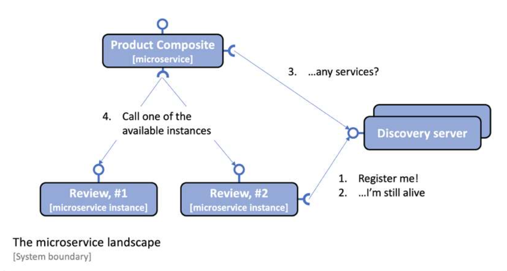
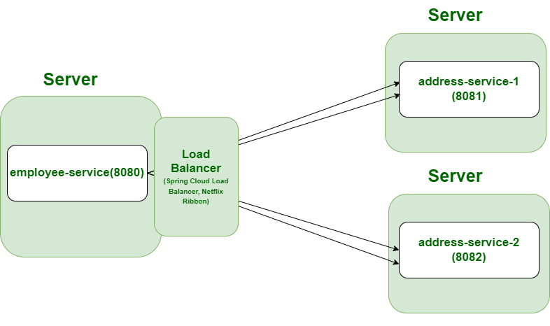
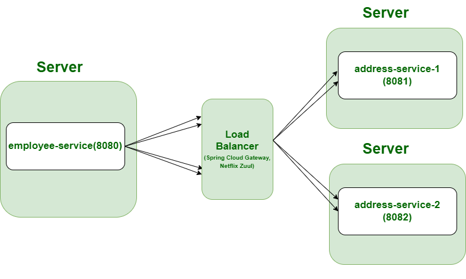
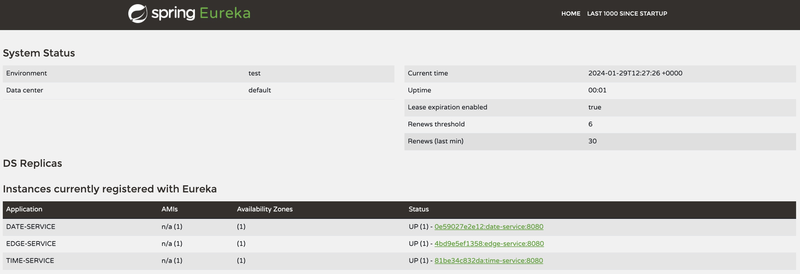

# Spring Cloud Netflix

Service discovery is probably the most important support function required to make a landscape of cooperating microservices production-ready. Netflix Eureka was the first discovery server supported by Spring Cloud.

## The problem with DNS-based service discovery
**Why can’t we simply start new instances of a microservice and rely on round-robin DNS?**

The idea behind round-robin DNS is that each instance of a microservice registers its IP address under the same name in a DNS server. When a client asks for IP addresses for the DNS name, the DNS server will return a list of IP addresses for the registered instances. The client can use this list of IP addresses to send requests to the microservice instances in a round-robin fashion, using the IP addresses one after another.

Unfortunately, neither a typical DNS server implementation nor the DNS protocol itself is well suited for handling volatile microservice instances that come and go all the time. Because of this, even though DNS-based round-robin is appealing in theory, it is not very practical to use for the service discovery of microservice instances.

We must take the following into consideration when we’re keeping track of many small moving parts (i.e., microservice instances):

* New instances can start up at any point in time.
* Existing instances can stop responding and eventually crash at any point in time.
* Some of the failing instances might be okay after a while and should start to receive traffic again, while others will not and should be removed from the service registry.
* Some microservice instances might take some time to start up; that is, just because they can receive HTTP requests doesn’t mean that traffic should be routed to them.
* Unintended network partitioning and other network-related errors can occur at any time.

## Netflix Eureka in Spring Cloud

Netflix Eureka implements client-side service discovery, meaning that the clients run software that talks to the discovery server, Netflix Eureka, to get information about the available microservice instances.



The process is as follows:
* Whenever a microservice instance starts up – for example, the Review service – it registers itself to one of the Eureka servers.
* On a regular basis, each microservice instance sends a heartbeat message to the Eureka server, telling it that the microservice instance is okay and is ready to receive requests.
* Clients – for example, the Product Composite service – use a client library that regularly asks the Eureka service for information about available services.
* When the client needs to send a request to another microservice, it already has a list of available instances in its client library and can pick one of them without asking the discovery server. Typically, available instances are chosen in a round-robin fashion; that is, they are called one after another before the first one is called once more.

Spring Cloud comes with an abstraction of how to communicate with a discovery service called _DiscoveryClient_. Implementations of the _DiscoveryClient_ interface are also capable of automatically registering a Spring Boot application with the discovery server. We only need to bring in a dependency on the corresponding implementation to connect to a discovery server. In our case, _spring-cloud-starter-netflix-eureka-client_.

Spring Cloud also comes with an abstraction – the _LoadBalancerClient_ interface – for clients that want to make requests through a load balancer to registered instances in the discovery service. The standard reactive HTTP client, _WebClient_, can be configured to use the _LoadBalancerClient_ implementation. By adding the _@LoadBalanced_ annotation to a _@Bean_ declaration that returns a _WebClient_.

## Client-side and Server-side Load Balancing
Taking about the general definition, Load Balancer is a network device that sits between a set of backend servers and clients. It distributes the incoming traffic to multiple servers to reduce the load. Load Balancers typically use various algorithms, such as round-robin to determine which server to send incoming traffic to. Please refer to the below image and observe how the above problem is fixed by Load Balancer.

If you want to use Load Balancer then Spring Cloud provides us with some already developed options. There are two ways to load balance the request:
* Client-Side Load Balancer
* Server-Side Load Balancer

### Client-Side Load Balancer
If you are keeping the load balancer on the client side and giving the load balancing responsibility to the client, then it’s called Client-Side Load Balancing. In Client-side Load Balancing the instances of the microservice are deployed on several servers. The logic of Load Balancer is part of the client itself and it carries the list of servers and determines to which server a particular request must be directed based on some algorithm.



* No more single point of failure in Client Side Load Balancer.
* Less network latency as the client can directly call the backend servers. 
* Cost Reduction as there is no need for server-side load balancing. 
* Additional complexity because microservice code is combined with the load balancer's logic. 
* **Spring Cloud Load Balancer, Netflix Ribbon**

### Server-Side Load Balancer
If you are keeping the load balancer on the server side and giving the load balancing responsibility to the server, then it’s called Server-Side Load Balancing. In Server-side load balancing, the instances of the service are deployed on multiple servers and then a load balancer is placed in front of them. Firstly, all the incoming requests come to the load balancer which acts as a middle component. Then it determines to which server a particular request must be directed based on some algorithm.



* Single point of failure.
* Network latency rises in Server-Side Load Balancing.
* The cost is high to implement Server-Side Load Balancing in comparison to Client-Side Load Balancing.
* **Spring Cloud Gateway, Netflix Zuul**


## Setting up a Netflix Eureka server
Setting up a Netflix Eureka server using Spring Cloud is really easy:
* Create a Spring Boot project using Spring Initializr to generate skeleton code section.
* Add a dependency to _spring-cloud-starter-netflix-eureka-server_.

```
	<properties>
		<java.version>21</java.version>
		<spring-cloud.version>2023.0.0</spring-cloud.version>
	</properties>
	
	<dependencies>
	...
		<dependency>
			<groupId>org.springframework.cloud</groupId>
			<artifactId>spring-cloud-starter-netflix-eureka-server</artifactId>
		</dependency>
	...
	</dependencies>
	<dependencyManagement>
		<dependencies>
			<dependency>
				<groupId>org.springframework.cloud</groupId>
				<artifactId>spring-cloud-dependencies</artifactId>
				<version>${spring-cloud.version}</version>
				<type>pom</type>
				<scope>import</scope>
			</dependency>
		</dependencies>
	</dependencyManagement>
```

* Add the _@EnableEurekaServer_ annotation to the application class.
* Add a _Dockerfile_ to containerize the application.
* Add the Eureka server to Docker Compose files.

```
eureka:
  build: spring-cloud/eureka-server
  mem_limit: 512m
  ports:
    - "8761:8761"
```

* Finally, add configuration (see next section). 

To actually make use of Eureka Server, add the needed dependencies on clients as well.

```
    <properties>
		<java.version>21</java.version>
		<spring-cloud.version>2023.0.0</spring-cloud.version>
	</properties>
	<dependencies>
...
		<dependency>
			<groupId>org.springframework.cloud</groupId>
			<artifactId>spring-cloud-starter-netflix-eureka-client</artifactId>
		</dependency>
...
	</dependencies>
	<dependencyManagement>
		<dependencies>
			<dependency>
				<groupId>org.springframework.cloud</groupId>
				<artifactId>spring-cloud-dependencies</artifactId>
				<version>${spring-cloud.version}</version>
				<type>pom</type>
				<scope>import</scope>
			</dependency>
		</dependencies>
	</dependencyManagement>
```

### Setting up the configuration for development use

Netflix Eureka is a highly configurable discovery server that can be set up for a number of different use cases, and it provides robust, resilient, and fault-tolerant runtime characteristics. 

One downside of this flexibility and robustness is that it has an almost overwhelming number of configuration options.

Fortunately, Netflix Eureka comes with good default values for most of the configurable parameters – at least when it comes to using them in a production environment.

To configure the Eureka server for use in a development environment, the following configuration can be used:

```
server:
  port: 8761
  
eureka:
  instance:
    hostname: localhost
  client:
    registerWithEureka: false
    fetchRegistry: false
    serviceUrl:
      defaultZone: http://${eureka.instance.hostname}:${server.port}/eureka/
  server:
    waitTimeInMsWhenSyncEmpty: 0
    response-cache-update-interval-ms: 5000
```

The first part of the configuration, for a Eureka instance and client, is a standard configuration for a standalone Eureka server. For more details, refer to: 

* For Eureka server parameters, look at the _org.springframework.cloud.netflix.eureka. server.EurekaServerConfigBean_ class for default values and the _com.netflix.eureka. EurekaServerConfig_ interface for the relevant documentation.
* For Eureka client parameters, look at the _org.springframework.cloud.netflix.eureka. EurekaClientConfigBean_ class for the default values and documentation.
* For Eureka instance parameters, look at the _org.springframework.cloud.netflix.eureka. EurekaInstanceConfigBean_ class for default values and documentation.

The last two parameters used for the Eureka server, waitTimeInMsWhenSyncEmpty and response-cache-update-interval-ms, are used to minimize the startup time.

Client microservices have the following configuration:

```
eureka:
  client:
    serviceUrl:
      defaultZone: http://localhost:8761/eureka/
    initialInstanceInfoReplicationIntervalSeconds: 5
    registryFetchIntervalSeconds: 5
  instance:
    leaseRenewalIntervalInSeconds: 5
    leaseExpirationDurationInSeconds: 5
 
---
spring.config.activate.on-profile: docker
eureka.client.serviceUrl.defaultZone: http://eureka:8761/eureka/
```

## Using Netflix Eureka
To actually use the service it is enough to mention our microservices by name as reported in Spring Eureka Dashboard. In our example, the edge service connects to _TIME-SERVICE_ and _DATE-SERVICE_ as reported below.

```
    @GetMapping(value = "/datetime")
    public Mono<LocalDateTime> dateTime() throws InterruptedException {
        String urlTime = "http://TIME-SERVICE/time";
        String urlDate = "http://DATE-SERVICE/date";

        LOG.info("Calling time API on URL: {}", urlTime);
        Mono<LocalTime> localTimeMono = webClient.get().uri(urlTime).retrieve().bodyToMono(LocalTime.class);

        LOG.info("Calling time API on URL: {}", urlDate);
        Mono<LocalDate> localDateMono = webClient.get().uri(urlDate).retrieve().bodyToMono(LocalDate.class);

        return Mono.zip(localDateMono, localTimeMono,
                (localDate, localTime) -> LocalDateTime.of(localDate, localTime));
    }
```

Once everything is setup, we can run the example project with:

```
$ mvn clean package -Dmaven.test.skip=true  
$ docker-compose up --build --force-recreate
```

After startup, we can connect to the Spring Eureka Dashboard at http://localhost:8761/.




## Resources
* https://www.baeldung.com/spring-cloud-netflix-eureka
* https://www.baeldung.com/eureka-self-preservation-renewal