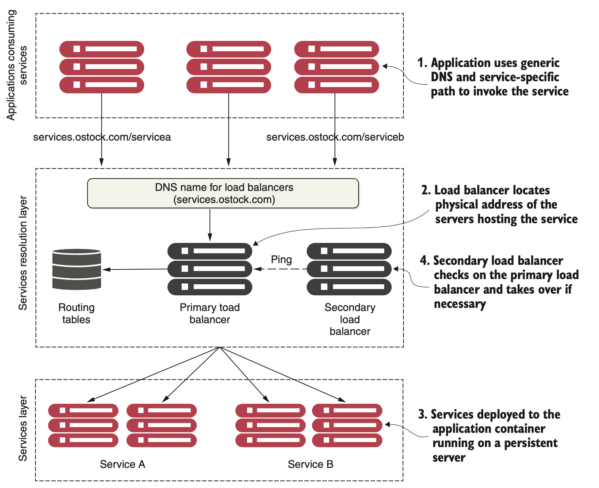
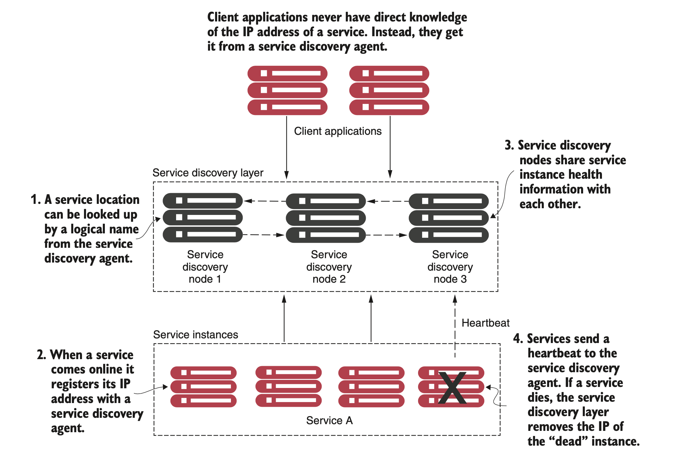
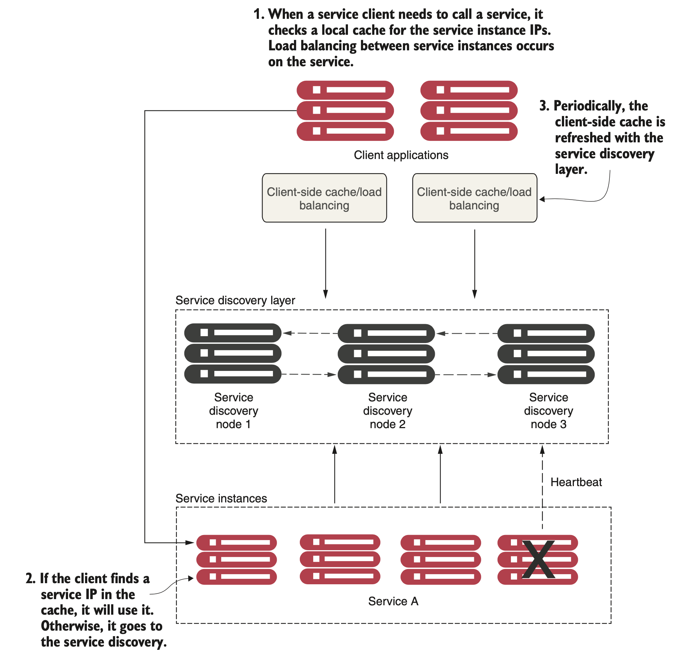

# Service Discovery

In any distributed architecture, we need to find the hostname or IP address of where a machine is located. This concept has been around since the beginning of distributed computing and is known formally as *service discovery*.

Service discovery is critical to microservices for two key reasons:
* **Horizontal scaling** Microservice architectures need adjustments in the application architecture, such as adding more instances of a service inside a cloud service and more containers.
* **Resiliency** Microservice architectures need to be extremely sensitive to preventing a problem in a single service (or service instance) from cascading up and out to the consumers of the service.


## The problem with DNS-based service discovery
If you have an application that calls resources spread across multiple servers, it needs to find the physical location of those resources. In the non-cloud world, service location resolution was often solved through a combination of a DNS and a network load balancer.



While this type of model works well with applications with a relatively small number of services running on a group of static servers, but doesn't work well for cloud-based microservice applications. The reasons for this include the following:
* While the load balancer can be made highly available, it’s a single point of failure for your entire infrastructure. 
* Centralizing your services into a single cluster of load balancers limits your ability to scale horizontally your load-balancing infrastructure across multiple servers (1 load balancer, 1 fail-over). 
* Most traditional load balancers are statically managed. They aren’t designed for fast registration and deregistration of services. 
* In a traditional load balancer scenario, the registration of new service instances is not done when a new service instance starts.


## The architecture of service discovery

The solution for a cloud-based microservice environment is to use a service discovery mechanism that’s
* **Highly available** Service discovery needs to be able to support a “hot” clustering environment where service lookups can be shared across multiple nodes in a service discovery cluster. If a node becomes unavailable, other nodes in the cluster should be able to take over.
* **Peer-to-peer** Each node in the service discovery cluster shares the state of a service instance.
* **Load balanced** Service discovery needs to dynamically load balance requests across all service instances. This ensures that the service invocations are spread across all the service instances managed by it.
* **Resilient** The service discovery’s client should cache service information locally. Local caching allows for gradual degradation of the service discovery feature so that if the service discovery service becomes unavailable, applications can still function and locate the services based on the information maintained in their local cache.
* **Fault tolerant** Service discovery needs to detect when a service instance isn't healthy and remove that instance from the list of available services that can take client requests. It should detect these faults with services and take action without human intervention.



The principal objective of service discovery is to have an architecture where our services indicate where they are physically located instead of having to manually configure their location. Key steps are:
* As service instances start, they’ll register their physical location, path, and port that one or more service discovery instances can use to access the instances. 
* A service usually only registers with one service discovery service instance. Most service discovery implementations use a peer-to-peer model of data propagation, where the data around each service instance is communicated to all the other nodes in the cluster. 
* Finally, each service instance pushes to or pulls from its status by the service discovery service. Any services failing to return a good health check are removed from the pool of available service instances. 

There are two ways to load balance requests to services:
* Client-Side Load Balancer
* Server-Side Load Balancer

### Client-Side Load Balancer
If you are keeping the load balancer on the client side and giving the load balancing responsibility to the client, then it’s called **Client-Side Load Balancing**. In Client-side Load Balancing, the logic of Load Balancer is part of the client itself, and it carries the list of services and determines to which service a particular request must be directed based on some algorithm.



* No more single point of failure in Client Side Load Balancer.
* Less network latency as the client can directly call the backend servers.
* Cost Reduction as there is no need for server-side load balancing.
* Additional complexity because microservice code is combined with the load balancer logic.
* **Spring Cloud Load Balancer, Netflix Ribbon**

### Server-Side Load Balancer
If you are keeping the load balancer on the server side, then it’s called **Server-Side Load Balancing**. In Server-side load balancing, the instances of the service are deployed on multiple locations and then a load balancer is placed in front of them. Firstly, all the incoming requests come to the load balancer which acts as a middle component. Then it determines to which server a particular request must be directed based on some algorithm.

* Single point of failure.
* Network latency rises in Server-Side Load Balancing.
* The cost is high to implement Server-Side Load Balancing in comparison to Client-Side Load Balancing.
* **Spring Cloud Gateway, Netflix Zuul**


## Netflix Eureka in Spring Cloud


### Netflix Eureka server
Setting up a Netflix Eureka server using Spring Cloud is really easy:
* Create a Spring Boot project using Spring Initializr to generate skeleton code section.
* Add a dependency to _spring-cloud-starter-netflix-eureka-server_.

```
	<properties>
		<java.version>21</java.version>
		<spring-cloud.version>2023.0.0</spring-cloud.version>
	</properties>
	
	<dependencies>
	...
		<dependency>
			<groupId>org.springframework.cloud</groupId>
			<artifactId>spring-cloud-starter-netflix-eureka-server</artifactId>
		</dependency>
	...
	</dependencies>
	<dependencyManagement>
		<dependencies>
			<dependency>
				<groupId>org.springframework.cloud</groupId>
				<artifactId>spring-cloud-dependencies</artifactId>
				<version>${spring-cloud.version}</version>
				<type>pom</type>
				<scope>import</scope>
			</dependency>
		</dependencies>
	</dependencyManagement>
```

* Add the _@EnableEurekaServer_ annotation to the application class.

```
@EnableEurekaServer
@SpringBootApplication
public class EurekaServerApplication {
	public static void main(String[] args) {
		SpringApplication.run(EurekaServerApplication.class, args);
	}
}
```

* Add a _Dockerfile_ to containerize the application and a _docker-compose.yml_ file to run the microservice ecosystem.

```
eureka:
  build: spring-cloud/eureka-server
  mem_limit: 512m
  ports:
    - "8761:8761"
```

* Finally, add configuration (see next section). 

### Netflix Eureka configuration

Netflix Eureka is a highly configurable discovery server that can be set up for a number of different use cases, and it provides robust, resilient, and fault-tolerant runtime characteristics. One downside of this flexibility and robustness is that it has an almost overwhelming number of configuration options. Fortunately, Netflix Eureka comes with good default values for most of the configurable parameters – at least when it comes to using them in a production environment. 

The Eureka server does not have a back end store, but the service instances in the registry all have to send heartbeats to keep their registrations up to date (so this can be done in memory). Clients also have an in-memory cache of Eureka registrations (so they do not have to go to the registry for every request to a service).

By default, every Eureka server is also a Eureka client and requires (at least one) service URL to locate a peer. If you do not provide it, the service runs and works, but it fills your logs with a lot of noise about not being able to register with the peer.

The combination of the two caches (client and server) and the heartbeats make a standalone Eureka server fairly resilient to failure, as long as there is some sort of monitor or elastic runtime (such as [Cloud Foundry](https://www.cloudfoundry.org/)) keeping it alive. 

In standalone mode, you might prefer to switch off the client side behavior so that it does not keep trying and failing to reach its peers. The following example shows how to switch off the client-side behavior:

```
server:
  port: 8761
  
eureka:
  instance:
    hostname: localhost
  client:
    registerWithEureka: false
    fetchRegistry: false
    serviceUrl:
      defaultZone: http://${eureka.instance.hostname}:${server.port}/eureka/
  server:
    waitTimeInMsWhenSyncEmpty: 0
    response-cache-update-interval-ms: 5000
```

The last two parameters used for the Eureka server, waitTimeInMsWhenSyncEmpty and response-cache-update-interval-ms, are used to minimize the startup time (useful for development). Refer to [this guide](https://cloud.spring.io/spring-cloud-netflix/reference/html/) for more details on the configuration.

After startup, we can connect to the Spring Eureka Dashboard at http://localhost:8761/. There are no registered clients!


### Netflix Eureka clients

Spring Cloud comes with an abstraction of how to communicate with a discovery service called _DiscoveryClient_. Implementations of the _DiscoveryClient_ interface are also capable of automatically registering a Spring Boot application with the discovery server. We only need to bring in a dependency on the corresponding implementation to connect to a discovery server. In our case, _spring-cloud-starter-netflix-eureka-client_.

```
    <properties>
		<java.version>21</java.version>
		<spring-cloud.version>2023.0.0</spring-cloud.version>
	</properties>
	<dependencies>
...
		<dependency>
			<groupId>org.springframework.cloud</groupId>
			<artifactId>spring-cloud-starter-netflix-eureka-client</artifactId>
		</dependency>
...
	</dependencies>
	<dependencyManagement>
		<dependencies>
			<dependency>
				<groupId>org.springframework.cloud</groupId>
				<artifactId>spring-cloud-dependencies</artifactId>
				<version>${spring-cloud.version}</version>
				<type>pom</type>
				<scope>import</scope>
			</dependency>
		</dependencies>
	</dependencyManagement>
```

Client microservices have the following configuration:

```
eureka:
  client:
    serviceUrl:
      defaultZone: http://localhost:8761/eureka/
    initialInstanceInfoReplicationIntervalSeconds: 5
    registryFetchIntervalSeconds: 5
  instance:
    leaseRenewalIntervalInSeconds: 5
    leaseExpirationDurationInSeconds: 5
 
---
spring.config.activate.on-profile: docker
eureka.client.serviceUrl.defaultZone: http://eureka:8761/eureka/
```

Spring Cloud also comes with an abstraction – the _LoadBalancerClient_ interface – for clients that want to make requests through a load balancer to registered instances in the discovery service. The standard reactive HTTP client, _WebClient_, can be configured to use the _LoadBalancerClient_ implementation. By adding the _@LoadBalanced_ annotation to a _@Bean_ declaration that returns a _WebClient_.

```
@SpringBootApplication
public class CompositeApplication {

	@Bean
	@LoadBalanced
	public WebClient.Builder loadBalancedWebClientBuilder() {
		return WebClient.builder();
	}

	public static void main(String[] args) {
		SpringApplication.run(CompositeApplication.class, args);
	}
}
```

To actually use the service it is enough to mention our microservices by name as reported in Spring Eureka Dashboard. In our example, the edge service connects to _TIME-SERVICE_ and _DATE-SERVICE_ as reported below.

```
    @GetMapping(value = "/datetime")
    public Mono<LocalDateTime> dateTime() throws InterruptedException {
        String urlTime = "http://TIME-SERVICE/time";
        String urlDate = "http://DATE-SERVICE/date";

        LOG.info("Calling time API on URL: {}", urlTime);
        Mono<LocalTime> localTimeMono = webClient.get().uri(urlTime).retrieve().bodyToMono(LocalTime.class);

        LOG.info("Calling time API on URL: {}", urlDate);
        Mono<LocalDate> localDateMono = webClient.get().uri(urlDate).retrieve().bodyToMono(LocalDate.class);

        return Mono.zip(localDateMono, localTimeMono,
                (localDate, localTime) -> LocalDateTime.of(localDate, localTime));
    }
```

Once everything is set up, we can run the example project with:

```
$ mvn clean package -Dmaven.test.skip=true  
$ docker-compose up --build --force-recreate
```

Now, we can connect to the Spring Eureka Dashboard at http://localhost:8761/ to observe the registred services.


## Resources
- Spring Microservices in Action (Chapter 6)
- Microservices with SpringBoot3 and SpringCloud (Chapter 9)
- https://cloud.spring.io/spring-cloud-netflix/reference/html/
- https://www.baeldung.com/spring-cloud-netflix-eureka
- https://www.baeldung.com/eureka-self-preservation-renewal