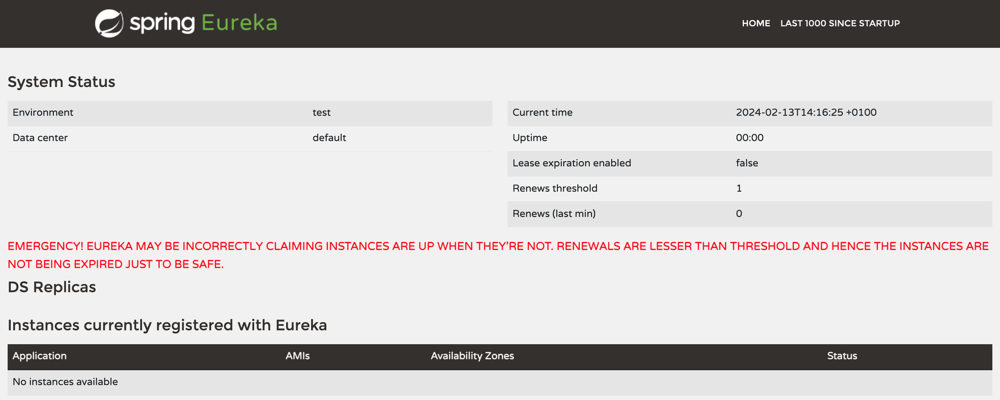

# Service Discovery

## Netflix Eureka in Spring Cloud

Netflix Eureka is a highly configurable discovery server that can be set up for a number of different use cases, and it provides robust, resilient, and fault-tolerant runtime characteristics. One downside of this flexibility and robustness is that it has an almost overwhelming number of configuration options. Fortunately, Netflix Eureka comes with good default values for most of the configurable parameters – at least when it comes to using them in a production environment.

The Eureka server does not have a back end store, but the service instances in the registry all have to send heartbeats to keep their registrations up to date (so this can be done in memory). Clients also have an in-memory cache of Eureka registrations (so they do not have to go to the registry for every request to a service).

## Netflix Eureka server

### Maven dependencies

To include Netflix Eureka in our project, we need to add the *spring-cloud-starter-netflix-eureka-server* dependency as shown below.

```
	<properties>
		<java.version>21</java.version>
		<spring-cloud.version>2023.0.0</spring-cloud.version>
	</properties>
	
	<dependencies>
	...
		<dependency>
			<groupId>org.springframework.cloud</groupId>
			<artifactId>spring-cloud-starter-netflix-eureka-server</artifactId>
		</dependency>
	...
	</dependencies>
	<dependencyManagement>
		<dependencies>
			<dependency>
				<groupId>org.springframework.cloud</groupId>
				<artifactId>spring-cloud-dependencies</artifactId>
				<version>${spring-cloud.version}</version>
				<type>pom</type>
				<scope>import</scope>
			</dependency>
		</dependencies>
	</dependencyManagement>
```

### Server code
Add the _@EnableEurekaServer_ annotation to the application main class.

```
@EnableEurekaServer
@SpringBootApplication
public class EurekaServerApplication {
	public static void main(String[] args) {
		SpringApplication.run(EurekaServerApplication.class, args);
	}
}
```

### Configuration
By default, every Eureka server is also a Eureka client and requires (at least one) service URL to locate a peer. If you do not provide it, the service runs and works, but it fills your logs with a lot of noise about not being able to register with the peer.

The combination of the two caches (client and server) and the heartbeats make a standalone Eureka server fairly resilient to failure, as long as there is some sort of monitor or elastic runtime (such as [Cloud Foundry](https://www.cloudfoundry.org/)) keeping it alive. 

In standalone mode, you might prefer to switch off the client side behavior so that it does not keep trying and failing to reach its peers. The following example shows how to switch off the client-side behavior:

```
server:
  port: 8761
  
eureka:
  instance:
    hostname: localhost
  client:
    registerWithEureka: false
    fetchRegistry: false
    serviceUrl:
      defaultZone: http://${eureka.instance.hostname}:${server.port}/eureka/
  server:
    waitTimeInMsWhenSyncEmpty: 0
    response-cache-update-interval-ms: 5000
```

The last two parameters used for the Eureka server, waitTimeInMsWhenSyncEmpty and response-cache-update-interval-ms, are used to minimize the startup time (useful for development). Refer to [this guide](https://cloud.spring.io/spring-cloud-netflix/reference/html/) for more details on the configuration.

After startup, we can connect to the Spring Eureka Dashboard at http://localhost:8761/. There are no registered clients!



### Docker configuration
Add a _Dockerfile_ to containerize the service and edit the _docker-compose.yml_ file to include the service within your ecosystem.

```
    eureka:
      build: spring-cloud/eureka-server
      mem_limit: 512m
      ports:
        - "8761:8761"
```

## Netflix Eureka clients

Spring Cloud comes with an abstraction of how to communicate with a discovery service called _DiscoveryClient_. Implementations of the _DiscoveryClient_ interface are capable of registering a Spring Boot application with the discovery server. 

### Maven dependencies
We only need to bring in a dependency on the corresponding implementation to connect to a discovery server. In our case, _spring-cloud-starter-netflix-eureka-client_.

```
    <properties>
		<java.version>21</java.version>
		<spring-cloud.version>2023.0.0</spring-cloud.version>
	</properties>
	<dependencies>
...
		<dependency>
			<groupId>org.springframework.cloud</groupId>
			<artifactId>spring-cloud-starter-netflix-eureka-client</artifactId>
		</dependency>
...
	</dependencies>
	<dependencyManagement>
		<dependencies>
			<dependency>
				<groupId>org.springframework.cloud</groupId>
				<artifactId>spring-cloud-dependencies</artifactId>
				<version>${spring-cloud.version}</version>
				<type>pom</type>
				<scope>import</scope>
			</dependency>
		</dependencies>
	</dependencyManagement>
```

### Client code
Spring Cloud comes with an abstraction called _LoadBalancerClient_ allowing clients to make requests (to registered services) through a client-side load balancer. The standard reactive HTTP client, _WebClient_, can be configured to use a _LoadBalancerClient_ implementation. This function can be enabled by adding the _@LoadBalanced_ annotation to a _@Bean_ declaration that returns a _WebClient_.

```
@SpringBootApplication
public class CompositeApplication {

	@Bean
	@LoadBalanced
	public WebClient.Builder loadBalancedWebClientBuilder() {
		return WebClient.builder();
	}

	public static void main(String[] args) {
		SpringApplication.run(CompositeApplication.class, args);
	}
}
```

To actually make a request to a registered service, it is enough to mention the services *by name* as reported in the Spring Eureka Dashboard. In our example, the *composite-service* in the example below connects to both a _TIME-SERVICE_ and a _DATE-SERVICE_.

```
    @GetMapping(value = "/datetime")
    public Mono<LocalDateTime> dateTime() throws InterruptedException {
        String urlTime = "http://TIME-SERVICE/time";
        String urlDate = "http://DATE-SERVICE/date";

        LOG.info("Calling time API on URL: {}", urlTime);
        Mono<LocalTime> localTimeMono = webClient.get().uri(urlTime).retrieve().bodyToMono(LocalTime.class);

        LOG.info("Calling time API on URL: {}", urlDate);
        Mono<LocalDate> localDateMono = webClient.get().uri(urlDate).retrieve().bodyToMono(LocalDate.class);

        return Mono.zip(localDateMono, localTimeMono,
                (localDate, localTime) -> LocalDateTime.of(localDate, localTime));
    }
```

### Configuration
Client microservices have the following configuration:

```
server.port: 8080
spring.application.name: service-name

eureka:
  client:
    serviceUrl:
      defaultZone: http://localhost:8761/eureka/
    initialInstanceInfoReplicationIntervalSeconds: 5
    registryFetchIntervalSeconds: 5
  instance:
    leaseRenewalIntervalInSeconds: 5
    leaseExpirationDurationInSeconds: 5

---
spring.config.activate.on-profile: docker
server.port: 8080
eureka.client.serviceUrl.defaultZone: http://eureka:8761/eureka/
```

### Docker configuration
Add a _Dockerfile_ to containerize the service and edit the _docker-compose.yml_ file to include the service within your ecosystem.

```
  composite:
    build: composite-service-end
    mem_limit: 512m
    ports:
      - "8080:8080"
    environment:
      - SPRING_PROFILES_ACTIVE=docker

  date:
    build: date-service-end
    mem_limit: 512m
    environment:
      - SPRING_PROFILES_ACTIVE=docker

  time:
    build: time-service-end
    mem_limit: 512m
    environment:
      - SPRING_PROFILES_ACTIVE=docker
```

Once everything is set up, we can run the example project with:

```
$ mvn clean package -Dmaven.test.skip=true  
$ docker-compose up --build --force-recreate
```

Now, we can connect to the Spring Eureka Dashboard at http://localhost:8761/ to observe the registred services.


## Trying out service discovery
TODO: experiments with adding and removing instances of time/date service

## Resources
- https://cloud.spring.io/spring-cloud-netflix/reference/html/
- https://www.baeldung.com/spring-cloud-netflix-eureka
- https://www.baeldung.com/eureka-self-preservation-renewal