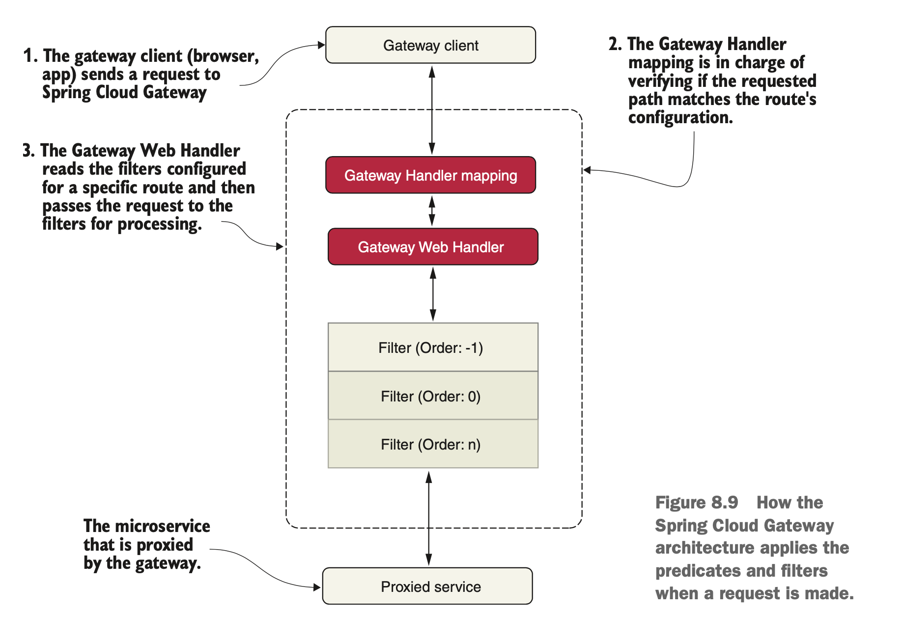

# Service Routing

In a distributed architecture like a microservice, there will come a point where we’ll need to ensure that critical behaviors such as security, logging, and tracking users across multiple service calls occur. To implement this functionality, we’ll want these attributes to be consistently enforced across all of our services without the need for each individual development team to build their own solution. While it’s possible to use a common library or framework to assist with building these capabilities directly in an individual service, doing so has these implications:

* It’s challenging to implement these capabilities in each service consistently. 
* Pushing the responsibilities to implement cross-cutting concerns like security and logging down to the individual development teams greatly increases the odds that someone will not implement them properly or will forget to do them. 
* It’s possible to create a hard dependency across all our services. The more capabilities we build into a common framework shared across all our services, the more difficult it is to change or add behavior in our common code without having to recompile and redeploy all our services. Suddenly an upgrade of core capabilities built into a shared library becomes a long migration process.

To solve this problem, we need to abstract these cross-cutting concerns into a service that can sit independently and act as a filter and router for all the microservice calls in our architecture. We call this service a *gateway*. Our service clients no longer directly call a microservice. Instead, all calls are routed through the service gateway, which acts as a single *Policy Enforcement Point (PEP)*, and are then routed to a final destination.

The use of a centralized PEP means that cross-cutting service concerns can be carried out in a single place without the individual development teams having to implement those concerns. Examples of cross-cutting concerns that can be implemented in a service gateway:
* **Static routing** A service gateway places all service calls behind a single URL and API route. This simplifies development as we only have to know about one ser- vice endpoint for all of our services.
* **Dynamic routing** A service gateway can inspect incoming service requests and, based on the data from the incoming request, perform intelligent routing for the service caller. For instance, customers participating in a beta program might have all calls to a service routed to a specific cluster of services that are running a different version of code from what everyone else is using.
* **Authentication and authorization** Because all service calls route through a ser- vice gateway, the service gateway is a natural place to check whether the callers of a service have authenticated themselves.
* **Metric collection and logging** A service gateway can be used to collect metrics and log information as a service call passes through it. You can also use the service gateway to confirm that critical pieces of information are in place for user requests, thereby ensuring that logging is uniform. 

## Setting up Spring Cloud Gateway
* Create a Spring Boot project using *Spring Initializr*.
* Add a dependency on *spring-cloud-starter-gateway*.

```
	<dependencies>
		<dependency>
			<groupId>org.springframework.boot</groupId>
			<artifactId>spring-boot-starter</artifactId>
		</dependency>
		<dependency>
			<groupId>org.springframework.boot</groupId>
			<artifactId>spring-boot-starter-actuator</artifactId>
		</dependency>
		<dependency>
			<groupId>org.springframework.cloud</groupId>
			<artifactId>spring-cloud-starter-netflix-eureka-client</artifactId>
		</dependency>
		<dependency>
			<groupId>org.springframework.cloud</groupId>
			<artifactId>spring-cloud-starter-gateway</artifactId>
		</dependency>
		...
	</dependencies>
	<dependencyManagement>
		<dependencies>
			<dependency>
				<groupId>org.springframework.cloud</groupId>
				<artifactId>spring-cloud-dependencies</artifactId>
				<version>${spring-cloud.version}</version>
				<type>pom</type>
				<scope>import</scope>
			</dependency>
		</dependencies>
	</dependencyManagement>
```

* Add a _Dockerfile_ to containerize the application and a _docker-compose.yml_ file to run the microservice ecosystem.

```
  gateway:
    build: gateway-service-end
    mem_limit: 512m
    ports:
      - "8080:8080"
    environment:
      - SPRING_PROFILES_ACTIVE=docker
```

* Finally, add configuration (see next section).

## Configuring Spring Cloud Gateway

### Basic configuration
When it comes to configuring Spring Cloud Gateway, the most important thing is setting up the routing rules. We also need to set up a few other things in the configuration:

```
server.port: 8080
spring.application.name: gateway-service
app.eureka-server: localhost

eureka:
  client:
    serviceUrl:
      defaultZone: http://${app.eureka-server}:8761/eureka/
    initialInstanceInfoReplicationIntervalSeconds: 5
    registryFetchIntervalSeconds: 5
  instance:
    leaseRenewalIntervalInSeconds: 5
    leaseExpirationDurationInSeconds: 5
```

* Since Spring Cloud Gateway will use Netflix Eureka to find the microservices it will route traffic to, **it must be configured as a Eureka client**.
* Configure Spring Boot Actuator for development usage.

```
management.endpoint.gateway.enabled: true
management.endpoint.health.show-details: "ALWAYS"
management.endpoints.web.exposure.include: "*"
```

* Configure log levels so that we can see log messages from interesting parts of the internal processing in Spring Cloud Gateway, for example, how it decides where to route incoming requests to:

```
logging:
  level:
    root: INFO
    org.springframework.cloud.gateway.route.RouteDefinitionRouteLocator: INFO
    org.springframework.cloud.gateway: TRACE
```

### Routing rules
Setting up routing rules can be done in two ways: programmatically, using a Java DSL, or by configuration. Using a Java DSL to set up routing rules programmatically can be useful in cases where the rules are stored in external storage, such as a database, or are given at runtime, for example, via a RESTful API or a message sent to the gateway. 

In more static use cases, it is convenient to declare the routes in the configuration file, src/main/resources/application.yml. Separating the routing rules from the Java code makes it possible to update the routing rules without having to deploy a new version of the microservice.

A route is defined by the following:
* **An ID**, the name of the route
* **A destination URI**, which describes where to send a request
* **Predicates**, which select a route based on information in the incoming HTTP request
* **Filters**, which can modify both the request and/or the response



Clients make requests to Spring Cloud Gateway. If the Gateway Handler Mapping determines that a request matches a route, it is sent to the Gateway Web Handler. This handler runs the request through a filter chain that is specific to the request. The reason the filters are divided by the dotted line is that filters can run logic both before and after the proxy request is sent. All “pre” filter logic is executed. Then the proxy request is made. After the proxy request is made, the “post” filter logic is run.

### Routing requests to the composite-service API
```
spring.cloud.gateway.routes:
  - id: composite-service
    uri: lb://composite-service
    predicates:
      - Path=/datetime/**
```

Some points to note from the preceding code:
* **id**: composite-service: The name of the route is composite-service.
* **uri**: lb://composite-service: If the route is selected by its predicates, the request will be routed to the service that is named composite-service in the discovery service. The protocol *lb://* is used to direct Spring Cloud Gateway to use the client-side load balancer to look up the destination in the discovery service.
* **predicates**: Path=/datetime/** is used to specify what requests this route should match. ** matches zero or more elements in the path.

### Routing requests to the date and time services APIs

```
spring.cloud.gateway.routes:
  - id: time-service
    uri: lb://time-service
    predicates:
      - Path=/time/**
  - id: date-service
    uri: lb://date-service
    predicates:
      - Path=/date/**
```

Despite this practice should be avoided in production, it could be useful during development and testing to expose individual services through the gateway. With the above configuration the time and date services are exposed via the */time* and */date* endpoints.

### Routing requests to the Eureka server’s web page
```
spring.cloud.gateway.routes:
  - id: eureka-web-start
    uri: http://${app.eureka-server}:8761
    predicates:
      - Path=/eureka/web
    filters:
      - SetPath=/
  - id: eureka-web-other
    uri: http://${app.eureka-server}:8761
    predicates:
      - Path=/eureka/**
```

Eureka exposes both an API and a web page for its clients. In this case, requests sent to the edge server with the path starting with /eureka/web/ should be handled as a call to the Eureka web page and routed to http://${app.eureka-server}:8761. 

The web page will also load several web resources, such as .js, .css, and .png files. These requests will be routed to http://${app. eureka-server}:8761/eureka. 

### Routing requests with predicates and filters
To learn a bit more about the routing capabilities in Spring Cloud Gateway, we will try out host-based routing, where Spring Cloud Gateway uses the hostname of the incoming request to determine where to route the request. We will use a website for testing HTTP codes: http://httpstat.us/.

A call to http://httpstat.us/${CODE} returns a response with the ${CODE} HTTP code and a response body, also containing the HTTP code, and a corresponding descriptive text. For example:

```
curl http://httpstat.us/200 -i
HTTP/1.1 200 OK
Content-Length: 6
Content-Type: text/plain
Date: Wed, 14 Feb 2024 08:31:30 GMT
Server: Kestrel
...

200 OK%   
```

Assume that we want to route calls to http://${hostname}:8080/headerrouting as follows:
* Calls from the i.feel.lucky host should return 200 OK
* Calls from the im.a.teapot host should return 418 I'm a teapot
* Calls from all other hostnames should return 501 Not Implemented

To implement these routing rules in Spring Cloud Gateway, we can use the Host route predicate to select requests with specific hostnames, and the SetPath filter to set the desired HTTP code in the request path. This can be done as follows:

```
spring.cloud.gateway.routes:
    - id: host_route_200
      uri: http://httpstat.us
      predicates:
      - Host=i.feel.lucky
      - Path=/headerrouting/**
      filters:
      - SetPath=/200
    - id: host_route_418
      uri: http://httpstat.us
      predicates:
      - Host=im.a.teapot
      - Path=/headerrouting/**
      filters:
      - SetPath=/418
    - id: host_route_501
      uri: http://httpstat.us
      predicates:
      - Path=/headerrouting/**
      filters:
      - SetPath=/501
```

Refer to the official documentation for the full list of [predicates](https://cloud.spring.io/spring-cloud-gateway/reference/html/#gateway-request-predicates-factories) and [filters](https://cloud.spring.io/spring-cloud-gateway/reference/html/#gatewayfilter-factories).

If we want to see the routes managed by the Gateway server, we can list the routes via the *actuator/gateway/routes* endpoint on the Gateway server. This will return a:

```
curl http://localhost:8080/actuator/gateway/routes | jq

[
  {
    "predicate": "Paths: [/datetime/**], match trailing slash: true",
    "route_id": "composite-service",
    "filters": [],
    "uri": "lb://composite-service",
    "order": 0
  },
  {
    "predicate": "Paths: [/time/**], match trailing slash: true",
    "route_id": "time-service",
    "filters": [],
    "uri": "lb://time-service",
    "order": 0
  },
  {
    "predicate": "Paths: [/date/**], match trailing slash: true",
    "route_id": "date-service",
    "filters": [],
    "uri": "lb://date-service",
    "order": 0
  },
  ...
```

### Enabling docker support
From the preceding configuration, we can take the following notes. The *${app.eureka-server}* property is resolved by Spring’s property mechanism, depending on what Spring profile is activated:

* When running the services on the same host without using Docker, for example, for debugging purposes, the property will be translated to localhost using the default profile.
* When running the services as Docker containers, the Eureka server will run in a con- tainer with the DNS name eureka. Therefore, the property will be translated into eureka using the docker profile.

The relevant parts in the application.yml file that define this translation look like this:

```
server.port: 8080
app.eureka-server: localhost
---
spring.config.activate.on-profile: docker
app.eureka-server: eureka
```


## Trying out the edge server

### Dynamically reloading route configuration
The next thing we’ll look at when configuring routes in Spring Cloud Gateway is how to dynamically refresh routes. The ability to dynamically reload routes is useful because it allows us to change the mapping of routes without having to restart the Gateway server(s). 

When using a configuration server, if we want to add new route mappings on the fly, all we have to do is commit those changes to the Git repository where Spring Cloud Config pulls its configuration data and call the *actuator/gateway/refresh*, that will cause it to reload its route configuration. 

...

## Resources
- Spring Microservices in Action (Chapter 8)
- Microservices with SpringBoot3 and SpringCloud (Chapter 10)