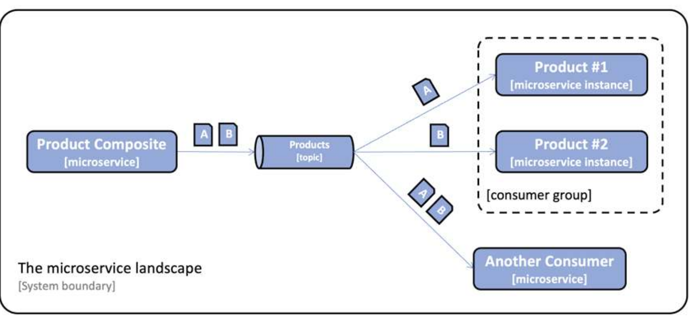

# Developing Reactive Microservices

In this lesson, we will learn how to develop reactive microservices, that is, how to develop non-block- ing synchronous REST APIs and asynchronous event-driven services. We will also learn how to choose between these two alternatives. Finally, we will see how to create and run manual and automated tests of a reactive microservice landscape.

The foundation for reactive systems is that they are message-driven, and use asynchronous communication. This enables them to be elastic, in other words, scalable and resilient, meaning that they are tolerant of failures. Elasticity and resilience together enable a reactive system to be responsive.

The relevant module for this lesson is: [developing-reactive-microservices](../code/developing-reactive-microservices)

## A very high-level introduction to nonblocking programming
When we talk about _nonblocking programming_ we are describing a programming technique that enables developers to do multiple operations concurrently without blocking a certain thread. To understand what it means, let's define what "blocking" means first: an operation is blocking when it blocks (preempts from the CPU) the thread.

There are scenarios where blocking is the right way to approach a problem, for example when dealing with shared resources (using a _mutex_ blocks the thread), however, blocking usually limits the throughput of our application.

Imagine this scenario: we have a server application that accepts connections from clients on a given socket.

 ```
void main(){
    Socket s = new Socket(3000);
    
    while(true){
        Connection c = s.accept();
        bytes[] b = c.read(100);
        // do some stuff with the bytes
        // ...
    }
}
```

So far so good, right? We accept the request, we process it, and we are ready to accept more requests.
This solution has some problems: 

- what happens if no data is available on the socket? The thread gets **blocked**, because read is a **blocking operation**;
- what happens if another connection arrives while I'm "doing some stuff with the bytes"? The connection has to **wait**, because we can't process it yet.

 
### First solution: multithreading
The naive solution would be spawn a new thread for each connection we receive. This is what many web frameworks do (and what Spring Boot does by default). So our pseudo-code changes:
 ```
void main(){
    Socket s = new Socket(3000);
    
    while(true){
        Connection c = s.accept();
        Thread.spawn(processConnection(c));
    }
}

void processConnection(Connection c){
    bytes[] b = conn.read(100);
    // do some stuff with the bytes
    // ...  
}
```

Well, that's nice, we solved all the issues we mentioned before! We can serve up N requests **in parallel** (where N is the number of CPUs)! We also introduced _new_ issues, though: what happens if my server receives 400.000 simultaneous connections? The application spawns 400.000 threads! That's _a lot_ of threads, RAM and CPU usage! How can we solve this problem?

### Second solution: nonblocking programming
What if there was another solution that could accept more requests **within the same thread**? Let's imagine we could change the code to something like this:
 ```
async void main(){
    Socket s = new Socket(3000);
    
    while(true){
        Connection c = s.accept();
        await processConnection(c);
    }
}

async void processConnection(Connection c){
    bytes[] b = await conn.read(100);
    // do some stuff with the bytes
    // ...  
}

```

In our example, we changed the function signatures to be `async` and we call those functions with the `await` keyword. Async functions are implemented in many different ways, but all implementations share one common feature: **an async runtime**.

The async runtime is generally composed by a (small) set of threads - a pool - that can receive async tasks. These tasks contain some work that can be stopped and resumed at any time. In our example, the task is created when `await`ing on `processConnection(c)`. 

When a task is inserted inside the async runtime, a snapshot of its state is  memorized inside the executor. This snapshot will be used when the runtime executes the task itself.

Inserting the task inside the runtime yields the control back to the calling thread, so when we call `await` from a certain thread, the execution of the function in that thread terminates immediately (in our case, the thread goes instantly back "at the top" of the while loop). From now on, the execution of the function is no longer our thread's concern, because the executor is taking care of it.

In our example, when a connection hits our server, a task representing the execution of the `processConnection` function will be created inside the runtime, and it will run until completion. Running a task until completion means that, if the function doesn't get suspended again (with another _await_), it will run until its return point.

In our case, we have a **nonblocking** read (`await conn.read`), so this spawns another async task the same way we described before. Our read could terminate instantly (because maybe there's data already) or not: if it doesn't, the executor will temporarily drop the task and come back later, when the read _could_ be completed (thus, not running until the completion of the task).

The main concept, here, is that many tasks get decomposed in smaller chunks that can be executed concurrently by the runtime itself, enabling, with a small thread-pool, applications to scale up to millions of concurrent requests.

An important takeoff from this brief explanation is that **async programming doesn't make blocking code magically async!** If you write blocking code inside an async function, that function **will block the executor's thread**, making your async function completely useless! That's why you need to keep your async functions "as-async-as-possible". 

For example:

 ```
async void megaLoop(){
    for(int i = 0; i < 1000000; i++){
        print("heyyyy");
    }

}
...
async void main(){
    Socket s = new Socket(3000);
    
    while(true){
        Connection c = s.accept();
        await processConnection(c);
    }
}

async void processConnection(Connection c){
    bytes[] b = await conn.read(100);
    await megaLoop();
    // do some stuff with the bytes
    // ...  
}

```

Since `megaLoop` doesn't contain any async code, that function will run **until completion**! So any executor thread that picks `megaLoop` up will have to run the for loop to its fullest before returning!


## Non-blocking synchronous APIs and event-driven asynchronous services
When developing reactive microservices, it is not always obvious when to use non-blocking synchro- nous APIs and when to use event-driven asynchronous services. In general, to make a microservice robust and scalable, it is important to make it as autonomous as possible, for example, by minimizing its runtime dependencies. This is also known as **loose coupling**. Therefore, the asynchronous mes- sage passing of events is preferable over synchronous APIs. This is because the microservice will only depend on access to the messaging system at runtime, instead of being dependent on synchronous access to a number of other microservices.

There are, however, a number of cases where synchronous APIs could be favorable. For example:
* For read operations where an end user is waiting for a response
* Where the client platforms are more suitable for consuming synchronous APIs, for example, mobile apps or SPA web applications 
* Where the clients will connect to the service from other organizations – where it might be hard to agree on a common messaging system to use across organizations

For the system landscape we are developing, we will use the following:

* The create, read, and delete services exposed by the product composite microservice will be based on non-blocking synchronous APIs. The composite microservice is assumed to have clients on both web and mobile platforms, as well as clients coming from other organizations rather than the ones that operate the system landscape. Therefore, synchronous APIs seem like a natural match.

* The _read_ services provided by the core microservices will also be developed as non-blocking synchronous APIs since there is an end user waiting for their responses. The _create_ and _delete_ services provided by the core microservices will be developed as event-driven asynchronous services, meaning that they will listen for create and delete events on topics dedicated to each microservice.

The synchronous APIs provided by the composite microservices to create and delete aggregated product information will publish create and delete events on these topics. If the publish operation succeeds, it will return with a 202 (Accepted) response; otherwise, an error response will be returned. The 202 response differs from a normal 200 (OK) response – it indicates that the request has been accepted, but not fully processed. Instead, the processing will be completed asynchronously and independently of the 202 response.


## Developing non-blocking synchronous REST APIs
To make things nonblocking, Spring Boot leverages Project Reactor, an async runtime used to deal with async requests. 

Up until now, when we created a REST controller, every request we made to that controller would spawn a new thread, as described in a previous section.

As already mentioned, this model isn't suited for applications that have to sustain a large number of requests (i.e. microservices!), so we need an async runtime to leverage the power of nonblocking programming. This way, requests will be served in an async fashion, using the minimum amount of threads needed to concurrently handle connections.

### Project Reactor
Project Reactor bases its foundations on two core datatype: `Flux` and `Mono`. A `Flux` object is used to process a stream of 0...n elements whereas a `Mono` object is used to process a stream that either is empty or returns at most one element. In other terms, we use `Flux` when we want to return a **collection** of items from a nonblocking function, whereas use `Mono` when we want to return a **single** object.

To tell Project Reactor to `await` on a task we use the `.block()` method, available on both the `Flux` and the `Mono` objects. From now on, "nonblocking" and "reactive" will be used as synonyms. _Reactive_ programming is essentially Spring Boot's way to implement nonblocking programming.

As a short introduction, let's look at the following code:

```
@Test
void testFlux() {
  List<Integer> list = Flux.just(1, 2, 3, 4)
    .filter(n -> n % 2 == 0)
    .map(n -> n * 2)
    .log()
    .collectList().block();
  assertThat(list).containsExactly(4, 8);
}
```

- We initiate the stream with the integers 1, 2, 3, and 4 using the static helper method `Flux.just()`.
- Next, we filter out the odd numbers – we only allow even numbers to proceed through the stream. In this test, these are 2 and 4.
- Next, we transform (or map) the values in the stream by multiplying them by 2, so they become 4 and 8.
- Then, we log the data that flows through the stream after the map operation.
- We use the `collectList` method to collect all items from the stream into a `List`, emitted once
the stream completes.
- So far, we have only declared the processing of a stream. To actually get the stream processed, we need someone to subscribe to it. The final call to the `.block()` method will register a subscriber that waits for the processing to complete.
- The resulting list is saved in a member variable named `list`.

### Non-blocking persistence using Spring Data for MongoDB
Spring Boot's persistence layer does not fully support reactive programming, in particular only MongoDB-enabled microservices can leverage nonblocking methods "natively". We can change the repository code to the following to enable nonblocking features on our database layer:
 ```
public interface ProductRepository extends ReactiveCrudRepository <ProductEntity, String> {
    Mono<ProductEntity> findByProductId(int productId);
}

public interface RecommendationRepository extends ReactiveCrudRepository<RecommendationEntity, String> {
    Flux<RecommendationEntity> findByProductId(int productId);
}
```

When returning from API mappings that consume an async persistence layer (such as the MongoDB one) we can let Spring Boot decide when and “where” (i.e. on which thread of the async executor) to run our async operation.

We just need to map the return value to a reactive datatype, and we’re done! Our old method becomes:

```
public Mono<Product> getProduct(int productId) {
    if (productId < 1) {
        throw new InvalidInputException("Invalid productId: " + productId);
    }

    return repository.findByProductId(productId)
        .switchIfEmpty(Mono.error(new NotFoundException("No product found for productId: " + productId)))
        .log(LOG.getName(), FINE)
        .map(e -> mapper.entityToApi(e))
        .map(e -> setServiceAddress(e));
}
```

- The method will return a `Mono` object, since there will be just ONE product. The processing is triggered by the web framework, Spring WebFlux (which is based on Project Reactor), subscribing to the `Mono` object once it receives a request to this service (in a similar way as we mentioned before, the execution of the query to the persistence layer is “given” to Reactor);
- We use `switchIfEmpty` to return “early” from an async operation if a certain condition is met (here, if the query returns an empty set);
- We map the entity we got from the database to the actual model we want to return;
- We use `setServiceAddress()`, to set the DNS name and IP address of the microservices that processed the request in the serviceAddress field of the model object.

### Dealing with blocking endpoints
Since JPA is not reactive by nature, we need to change the code a little bit more when dealing with controllers that access blocking repositories. We can’t just set the return types of our handlers to a different datatype (`Mono`/`Flux`) and let the magic happen just like the previous case.

This is because JPA is a thread-based library by default, meaning that when we execute a query to the database, a new thread is created because the non-blocking approach is not supported.

Since we want control over the thread we create, and we don’t want JPA to saturate the microservice, Spring Boot can offer a separate thread-pool in which JPA-related threads can be run. This pool is **hard-limited**, meaning that the number of concurrent threads running inside the pool is capped at a certain amount.

Let’s see how this can be set up in the following steps (taking as an example the ReviewServiceApplication because it contains blocking logic):

1. First, we configure a scheduler bean and its thread pool in the main class ReviewServiceApplication, as follows:

```
    @Autowired
    public ReviewServiceApplication(
        @Value("${app.threadPoolSize:10}") Integer threadPoolSize,
        @Value("${app.taskQueueSize:100}") Integer taskQueueSize) {
            this.threadPoolSize = threadPoolSize;
            this.taskQueueSize = taskQueueSize;
    }

    @Bean
    public Scheduler jdbcScheduler() {
        return Schedulers.newBoundedElastic(threadPoolSize, taskQueueSize, "jdbc-pool");
    }
```

We create a `Bean` called `jdbcScheduler` and we configure it to support up to `threadPoolSize` threads. The variable `taskQueueSize` specifies the max number of tasks that are allowed to be placed in a queue waiting for available threads.

2. We inject the bean inside our controller

     ```
    @RestController
    public class ReviewServiceImpl implements ReviewService {
        private final Scheduler jdbcScheduler;
        
        @Autowired
        public ReviewServiceImpl(
            @Qualifier("jdbcScheduler") Scheduler jdbcScheduler, ...) {
                this.jdbcScheduler = jdbcScheduler;
            }
        )
    }
    ```

3. Finally, we use the scheduler’s thread pool in the reactive implementation of the getReviews()
method, like so:

```
    @Override
    public Flux<Review> getReviews(int productId) {
        if (productId < 1) {
            throw new InvalidInputException("Invalid productId: " + productId);
        }
   
        LOG.info("Will get reviews for product with id={}",
        productId);
            return Mono.fromCallable(() -> internalGetReviews(productId))
            .flatMapMany(Flux::fromIterable)
            .log(LOG.getName(), FINE)
            .subscribeOn(jdbcScheduler);
    }
   
    private List<Review> internalGetReviews(int productId) {
        List<ReviewEntity> entityList = repository.findByProductId(productId);
        List<Review> list = mapper.entityListToApiList(entityList);
        list.forEach(e -> e.setServiceAddress(serviceUtil.
        getServiceAddress()));
        LOG.debug("Response size: {}", list.size());
        return list;
     }
```

The blocking `internalGetReviews` method gets wrapped inside `Mono.fromCallable` and the execution of the former gets dispatched inside the thread-pool using the `subscribeOn` method.

### Non-blocking composite service
We need to modify the source code of the composite service too, because we want to take full advantage of the nonblocking model.

We need to make the controllers async **and** the HTTP requests async.

Making the controllers async is easily achieved by changing the return types of the methods inside each controller to `Mono`/`Flux`. We also need to parallelize async operation using the `zip` method.

Taking for example the `getProduct` method inside the composite service, we need to query three different microservices “in parallel” and get the responses accordingly.

To do so, we can use the `Mono.zip` method, that runs three async tasks concurrently and offers a way to map their returning values to a single Mono instance.

```
public Mono<ProductAggregate> getProduct(int productId) {
    
    return Mono.zip(
    	
        values -> createProductAggregate(
            (Product) values[0],
            (List<Recommendation>) values[1],
            (List<Review>) values[2],
            serviceUtil.getServiceAddress()),
            
        integration.getProduct(productId),
        integration.getRecommendations(productId).collectList(),
        integration.getReviews(productId).collectList())
        
        .doOnError(ex ->
            LOG.warn("getCompositeProduct failed: {}",
            ex.toString()))
        .log(LOG.getName(), FINE);
}
```

- The first parameter of the `zip` method is a lambda function that will receive the responses in
an array, named `values`. The array will contain a `Product`, a list of `Recommendation` objects, and a
list of `Review` objects. The actual aggregation of the responses from the three API calls is handled by
the same helper method as before, `createProductAggregate()`, without any changes.
- The parameters after the lambda function are a list of the requests that the `zip` method will
call in parallel, one `Mono` object per request. In our case, we send in three `Mono` objects that
were created by the methods in the integration class, one for each request that is sent to each
core microservice.

### Async HTTP requests
To make async HTTP requests, we need to swap the blocking `RestTemplate` with its non-blocking equivalent: `WebClient`.

To create a WebClient instance, a builder pattern is used. If customization is required, for example, setting up common headers or filters, it can be done using the builder. For the available configuration options, see https://docs.spring.io/spring/docs/current/spring-framework-reference/web-reactive.html#webflux-client-builder.

 ```
public class ProductCompositeIntegration implements ProductService, RecommendationService, ReviewService {
    private final WebClient webClient;

    @Autowired
    public ProductCompositeIntegration(WebClient.Builder webClient, ...) {
        this.webClient = webClient.build();
    }
}
```

- Next, we use the `WebClient` instance to make our non-blocking requests for calling the product
service:

 ```
@Override
public Mono<Product> getProduct(int productId) {
    String url = productServiceUrl + "/product/" + productId;
    return webClient.get().uri(url).retrieve()
        .bodyToMono(Product.class)
        .log(LOG.getName(), FINE)
        .onErrorMap(WebClientResponseException.class,
            ex -> handleException(ex)
        );
}
```

This way, though, our microservice will fail completely if one of the three requests fails, and we don’t want that! <br>
To suppress the exception invocation we can simply return an empty response by replacing the `onErrorMap` with `onErrorResume(error -> empty())`.

The `error` variable will represent the type of error we got back (if any) and we can decide to propagate it or not by using `Mono.error(…)` when needed.
```
    @Override
    public Mono<Product> getProduct(int productId) {
        String url = productServiceUrl + "/product/" + productId;
        return webClient.get().uri(url).retrieve()
            .bodyToMono(Product.class)
            .log(LOG.getName(), FINE)
            .onErrorResume(error -> empty());
    }
```

## Developing event-driven asynchronous services
Asynchronous services are used when we don’t want to wait for the “callee” service to reply with data.
In this scenario a message is passed between services using a **topic**, to which multiple services can subscribe to and listen to/publish events.<br>
Spring Boot offers a very simple mechanism that abstract whichever implementation we want to use (Kafka/RabbitMQ) with a production-ready API based on the functional interfaces already present in the Java language (`Supplier`, `Function`, `Consumer`).<br>
Publishing a message on a given topic is pretty straightforward: 

 ```
@Autowired
private StreamBridge streamBridge;
@PostMapping
void sampleCreateAPI(@RequestBody String body) {
	streamBridge.send("topic", body);
}
```

And consuming one too: 

 ```
@Bean
public Consumer<String> mySubscriber() {
	return s -> System.out.println("ML RECEIVED: " + s);
}
```

Spring Cloud offers three different mechanism to deal with the complexity of this type of communication between services:
- Consumer groups
- Retries and dead-letter queues
- Guaranteed orders and partitions

### Consumer groups
What happens if we scale the current scenario to multiple replicas of a certain consumer subscribed to a topic?<br>
The messages published on that particular topic will get processed for every replica we made: this could be something we don’t want to happen.
Spring Boot can abstract **consumer groups**, a way to make different consumers (replicas) process different messages inside the topic.<br>


*Without consumer groups*


*With consumer groups*

Enabling consumer groups in Spring Boot is pretty easy:
```yaml
spring.cloud.stream:
	bindings.mySubscriber-in-0:
		destination: products
		group: productsGroup
```

This way, we’re instructing Spring Boot to forward messages sent on the `products` topic to the `mySubscriber` function. The microservice configured with this file will be added to the `productsGroup` consumer group. The suffix `-0` specifies that the function `mySubscriber` will take **one** argument.

### Retries and dead-letter queues
Not all messages get consumed without problems. Certain messages can be malformed or some parts of our architecture might be unavailable at a certain point in time, causing failures to happen when processing messages.<br>
Failing to process a message inside a topic causes **re-queueing** of such message inside the latter, because we might want to retry processing it.<br>
To avoid this kind of faults to cramp up our infrastructure (e.g. faulty messages fabricated by a third party could be injected inside the system to trigger retries and make the whole architecture unable to process new messages) we can configure how often retries are performed, preferably with an
increasing length of time between each retry. 

```yaml
spring.cloud.stream.bindings.messageProcessor-in-0.consumer:
	maxAttempts: 3
	backOffInitialInterval: 500
	backOffMaxInterval: 1000
	backOffMultiplier: 2.0

spring.cloud.stream.rabbit.bindings.messageProcessor-in-0.consumer:
	autoBindDlq: true
	republishToDlq: true

spring.cloud.stream.kafka.bindings.messageProcessor-in-0.consumer:
	enableDlq: true
```
Dead-letter queues are, in the end, the place where messages that get re-queued more times than specified in the configuration are placed. This way, "suspicious" messages can be further analysed by the infrastructure administrators.

### Guaranteed order and partitions

To guarantee FIFO messaging between services we can enable **partitions**. To place a message in a certain partition we use a **key**, specified on the message. Messages with the same **key** will be placed in the same partition and will be delivered in the same order they arrive to the messaging system. 

```yaml
spring.cloud.stream.bindings.products-out-0.producer:
	partition-key-expression: headers['partitionKey']
	partition-count: 2
```
We can specify where to take the partition key from: in this case in the message headers. We can also specify the number of partitions.

```yaml
spring.cloud.stream.bindings.messageProcessor-in-0:
	destination: products
	group: productsGroup
	consumer:
		partitioned: true
		instance-index: 0
```

The consumer has to specify which partition it wants to consume messages from (through the `message-index` property).