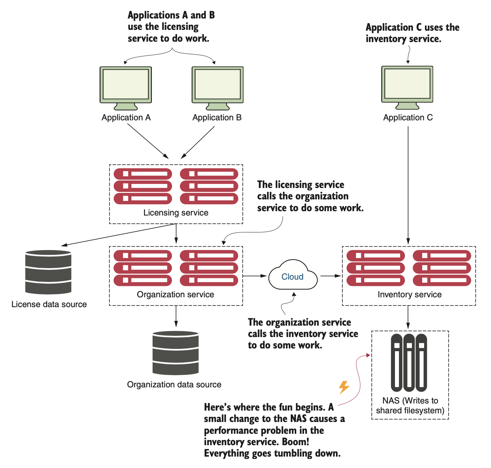
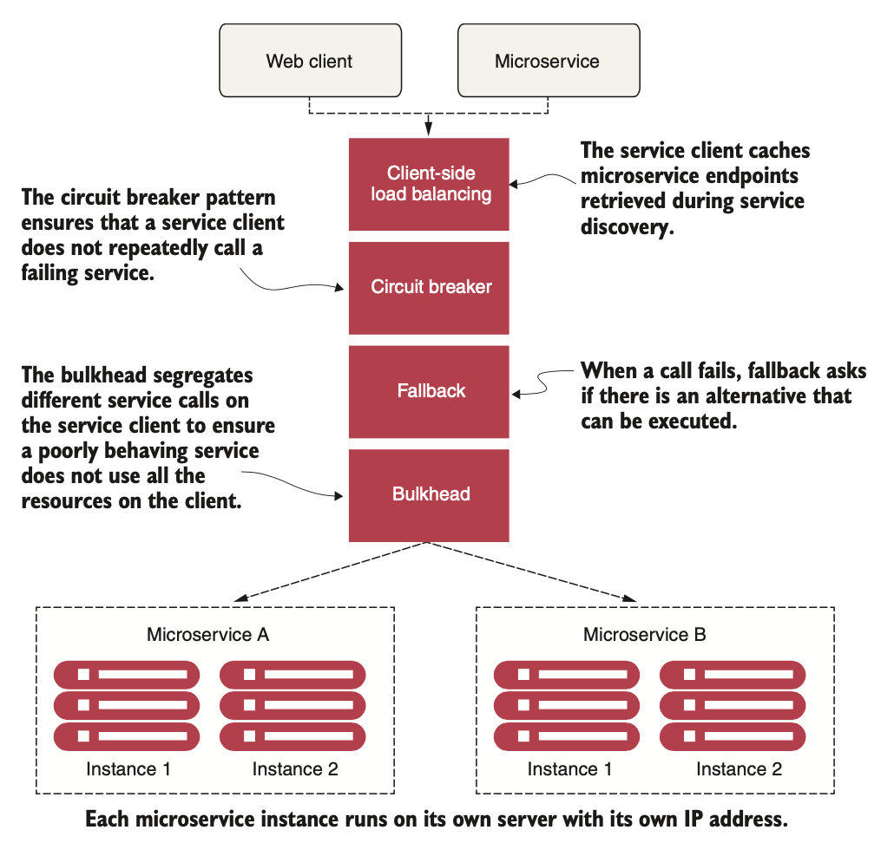
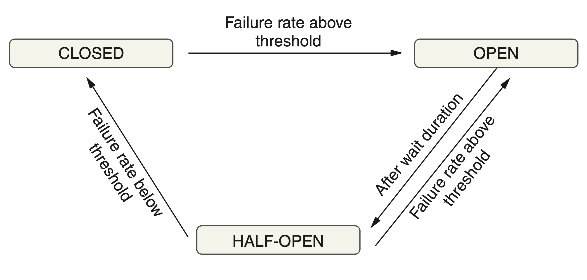

# Spring Boot Resilience4j

## What is Resilience?
Microservices are distributed in nature. When you work with distributed systems, always remember this number one rule **anything could happen**. We might be dealing with network issues, service unavailability, application slowness etc. An issue with one system might affect another system behavior/performance. Ability of the system to recover from such failures and remain functional makes the system more resilient. It also avoids any cascading failures to the downstream services.

### Understanding the Importance of Resiliency
When it comes to building resilient systems, most software engineers only take into account the complete failure of a piece of infrastructure or critical service. **They focus on building redundancy into each layer of their application using techniques such as clustering key servers, load balancing between services, and segregating infrastructure into multiple locations**.

However, when a service is running slow, detecting that poor performance and routing around it is extremely difficult. Let’s look at some reasons why:
* Service degradation can start out as intermittent and then build momentum. Service degradation might also occur only in small bursts. **The first signs of failure might be a small group of users complaining about a problem until suddenly, the application container exhausts its thread pool and collapses completely.**
* Calls to remote services are usually synchronous and don’t cut short a long-running call. The application developer normally calls a service to perform an action and waits for the service to return. **The caller has no concept of a timeout to keep the service call from hanging.**
* **Applications are often designed to deal with complete failures of remote resources, not partial degradations**. Often, as long as the service has not entirely failed, an application will continue to call a poorly behaving service and won’t fail fast. In this case, the calling application or service can degrade gracefully or, more likely, crash because of resource exhaustion. 

What’s insidious about problems caused by **poorly performing remote services is that they are not only difficult to detect but can trigger a cascading effect that can ripple throughout an entire application ecosystem**. Without safeguards in place, a single, poorly performing service can quickly take down multiple applications. 



Resiliecy key features:
* **Enhanced User Experience**: Resilient applications continue functioning and serving users even when failures occur, ensuring a seamless user experience.
* **Business Continuity**: By handling failures gracefully, resilient applications ensure business continuity and minimize the impact of disruptions on critical operations.
* **Scalability and Performance**: Resilient applications are designed to scale and handle varying loads, enabling them to meet user demands efficiently.
* **System Stability**: Resilient systems are better equipped to recover from failures, reducing downtime and enhancing overall system stability.

## Client-side resiliency patterns
Client-side resiliency software patterns focus on protecting a client of a remote resource (another microservice call or database lookup) from crashing when the remote resource fails because of errors or poor performance. These patterns allow the client to fail fast and not consume valuable resources, such as database connections and thread pools. 



**Client-side load balancing**

Client-side load balancing involves having the client look up all of a service’s individual instances from a service discovery agent (like Netflix Eureka) and then caching the physical location of said service instances.

When a service consumer needs to call a service instance, the client-side load balancer returns a location from the pool of service locations it maintains. Because the client-side load balancer sits between the service client and the service consumer, the load balancer can detect if a service instance is throwing errors or behaving poorly. If the client-side load balancer detects a problem, it can remove that service instance from the pool of available service locations and prevent any future calls from hitting that service instance.

**Circuit breaker**

The Circuit Breaker pattern is a crucial pattern in making synchronous communication in microservices more resilient. It acts as a safety mechanism that monitors the availability and responsiveness of dependent services. The Circuit Breaker maintains a state based on the success or failure of previous requests.

When a service makes a request to a dependent service, the Circuit Breaker evaluates the response. If the response indicates a failure, such as a timeout or an error, the Circuit Breaker "trips" and opens the circuit, preventing further requests from being sent to the failing service. This avoids overwhelming the failing service and reduces the risk of cascading failures throughout the system.

**Retry**

The Retry pattern is a valuable technique for making synchronous communication in microservices more resilient by automatically retrying failed operations. When a service encounters a transient failure, such as a network error or a temporary unavailability of a dependent service, the Retry pattern allows the service to attempt the operation again.

When a request fails, the Retry pattern initiates a retry mechanism, which can be configured with a certain number of retries and backoff strategies. The backoff strategy determines the time delay between each retry, often using exponential backoff, where the delay increases exponentially with each retry. This approach prevents overwhelming the failing service with repeated requests and allows it time to recover.

One very important restriction on the use of the retry mechanism is that the services that it retries must be idempotent, that is, calling the service one or many times with the same request parameters gives the same result. 

**Timeout**

It introduces a time limit for synchronous operations, ensuring that requests do not wait indefinitely for a response.

When a service makes a request to a dependent service, a timeout value is set. If a response is not received within the specified time, the operation is considered failed, and appropriate actions can be taken. By setting appropriate timeouts, services can avoid getting stuck in unresponsive states and prevent bottlenecks in the system.

The Timeout pattern provides several benefits. First, it improves system responsiveness by ensuring that services do not waste valuable resources waiting for responses that may never arrive. It allows services to move on to other tasks or handle other requests quickly.

It is crucial to set appropriate timeout values that balance responsiveness and allow sufficient time for the dependent service to respond. By fine-tuning timeouts based on the characteristics of the interactions and considering network latency and service performance, the Timeout pattern ensures that synchronous operations in microservices remain resilient and efficient and maintain high system availability.

**Bulkheads**

When using the bulkhead pattern, you break the calls to remote resources into their own thread pools and reduce the risk that a problem with one slow remote resource call will take down the entire application.

The thread pools act as the bulkheads for your service. Each remote resource is segregated and assigned to a thread pool. If one service is responding slowly, the thread pool for that type of service call can become saturated and stop processing requests. Assigning services to thread pools helps to bypass this type of bottleneck so that other services won’t become saturated.

**Fallback processing**

With the fallback pattern, when a remote service call fails, rather than generating an exception, the service consumer executes an alternative code path and tries to carry out the action through another means. 

For instance, let’s suppose you have an e-commerce site that monitors your user’s behavior and gives them recommendations for other items they might want to buy. If the preference service fails, your fallback might be to retrieve a more general list of preferences that are based on all user purchases from a different service and data source.

**Caching**

The Caching pattern is a valuable technique for improving the performance and scalability of microservices in synchronous communication. It involves storing frequently accessed data or computation results in a cache, which is a high-speed storage system, to serve subsequent requests more quickly.

By caching data, microservices can reduce the need for repeated, expensive operations, such as retrieving data from a database or performing complex computations. Instead, the cached results can be directly served, significantly improving response times and overall system performance.

Caching also helps improve scalability by offloading the workload from backend systems. By serving cached data, microservices can handle more requests without overloading the underlying resources, ensuring that the system remains responsive even under high traffic conditions.

Furthermore, the Caching pattern reduces the dependency on external services. By caching data locally, microservices can continue to serve requests even if the backend systems or data sources are temporarily unavailable. This improves fault tolerance and ensures that the system can gracefully handle disruptions.

**Rate Limiting**

The Rate Limiting pattern is a powerful technique for making synchronous communication in microservices more resilient by controlling the rate at which requests are made to a service. It sets limits on the number of requests that can be processed within a specific time period, ensuring that a service is not overwhelmed by excessive traffic.

By implementing rate limiting, microservices can protect themselves from being overloaded, prevent resource exhaustion, and maintain optimal performance. It allows services to handle requests within their capacity and ensures fair distribution of resources among clients.

Rate limiting also enhances the security of microservices. It helps mitigate the risk of malicious attacks, such as Distributed Denial of Service (DDoS) attacks, by imposing restrictions on the number of requests that can be made from a specific source within a given time frame.

When implementing the Rate Limiting pattern, it is crucial to consider factors such as the maximum allowed requests per unit of time and different rate-limiting strategies, such as fixed windows or sliding windows. The careful configuration ensures that the rate limits are appropriate for the service's capabilities and the expected load.

## Resilience4j
Resilience4j is a lightweight fault tolerance library designed for functional programming. Resilience4j provides higher-order functions (decorators) to enhance any functional interface, lambda expression or method reference with a Circuit Breaker, Rate Limiter, Retry or Bulkhead. 

You can stack more than one decorator on any functional interface, lambda expression or method reference. The advantage is that you have the choice to select the decorators you need and nothing else.

```
Supplier<String> supplier = () -> service.sayHelloWorld(param1);

String result = Decorators.ofSupplier(supplier)
  .withBulkhead(Bulkhead.ofDefaults("name"))
  .withCircuitBreaker(CircuitBreaker.ofDefaults("name"))
  .withRetry(Retry.ofDefaults("name"))
  .withFallback(asList(CallNotPermittedException.class, BulkheadFullException.class),  
      throwable -> "Hello from fallback")
  .get()
```

To use the library as an integration in Spring Boot add the following dependencies:

```
		<dependency>
			<groupId>org.springframework.boot</groupId>
			<artifactId>spring-boot-starter-aop</artifactId>
		</dependency>
		<dependency>
			<groupId>org.springframework.boot</groupId>
			<artifactId>spring-boot-starter-actuator</artifactId>
		</dependency>
		<dependency>
			<groupId>org.springframework.cloud</groupId>
			<artifactId>spring-cloud-starter-circuitbreaker-reactor-resilience4j</artifactId>
		</dependency>
```

### Circuit Breaker

The key features of a circuit breaker are as follows:

* If a circuit breaker detects too many faults, it will open its circuit, that is, not allow new calls. 
* When the circuit is open, a circuit breaker will perform fail-fast logic. This means that it doesn’t wait for a new fault, for example, a timeout, to happen on subsequent calls. Instead, it directly redirects the call to a fallback method. 
* After a while, the circuit breaker will be half-open, allowing new calls to see whether the issue that caused the failures is gone. If new failures are detected by the circuit breaker, it will open the circuit again and go back to the fail-fast logic. Otherwise, it will close the circuit and go back to normal operation. 



Resilience4j exposes information about circuit breakers at runtime in a number of ways:
* The current state of a circuit breaker can be monitored using the microservice’s actuator health endpoint, **/actuator/health**.
* The circuit breaker also publishes events on an actuator endpoint, for example, state transitions and **/actuator/circuitbreakerevents**.

To control the logic in a circuit breaker, Resilience4j can be configured using standard Spring Boot configuration files. We will use the following configuration parameters:

```
resilience4j.circuitbreaker:
  instances:
    time:
      allowHealthIndicatorToFail: false
      registerHealthIndicator: true
      slidingWindowType: COUNT_BASED
      slidingWindowSize: 5
      failureRateThreshold: 50
      waitDurationInOpenState: 10000
      permittedNumberOfCallsInHalfOpenState: 3
      automaticTransitionFromOpenToHalfOpenEnabled: true
      ignoreExceptions:
```

* **allowHealthIndicatorToFail**: tells Resilience4j not to affect the status of the health endpoint. This means that the health endpoint will still report "UP" even if one of the component’s circuit breakers is in an open or half-open state. It is very important that the health state of the component is not reported as "DOWN" just because one of its circuit breakers is not in a closed state.
* **registerHealthIndicator**: enables Resilience4j to fill in the health endpoint with information regarding the state of its circuit breakers.
* **slidingWindowType**: To determine if a circuit breaker needs to be opened, Resilience4j uses a sliding window, counting the most recent events to make the decision. The sliding windows can either be based on a fixed number of calls or a fixed elapsed time.
* **slidingWindowSize**: The number of calls in a closed state, which are used to determine whether the circuit should be opened. We will set this parameter to 5.
* **failureRateThreshold**: The threshold, in percent, for failed calls that will cause the circuit to be opened. We will set this parameter to 50%. This setting, together with slidingWindowSize set to 5, means that if three or more of the last five calls are faults, then the circuit will open.
* **waitDurationInOpenState**: Specifies how long the circuit stays in an open state, that is, before it transitions to the half-open state. We will set this parameter to 10000 ms. 
* **permittedNumberOfCallsInHalfOpenState**: The number of calls in the half-open state, which are used to determine whether the circuit will be opened again or go back to the normal, closed state. We will set this parameter to 3, meaning that the circuit breaker will decide whether the circuit will be opened or closed based on the first three calls after the circuit has transitioned to the half-open state. Since the failureRateThreshold parameters are set to 50%, the circuit will be open again if two or three calls fail. Otherwise, the circuit will be closed.
* **automaticTransitionFromOpenToHalfOpenEnabled**: Determines whether the circuit breaker will automatically transition to the half-open state once the waiting period is over. Otherwise, it will wait for the first call after the waiting period is over until it transitions to the half-open state.
* **ignoreExceptions**: This can be used to specify exceptions that should not be counted as faults. Expected business exceptions such as not found or invalid input are typical exceptions that the circuit breaker should ignore; users who search for non-existing data or enter invalid input should not cause the circuit to open.

Now, it is enough to annotate methods requisting external resources (e.g., other services, databases, ...) with the corresponding annotation. 

```
    @Retry(name = "time")
    @TimeLimiter(name = "time")
    @CircuitBreaker(name = "time", fallbackMethod = "getTimeFallbackValue")
    public Mono<LocalTime> getTime(int delay, int faultPercent) {
        URI url = UriComponentsBuilder.fromUriString(TIME_SERVICE_URL + "?delay={delay}&faultPercent={faultPercent}").build(delay, faultPercent);

        LOG.info("Getting time on URL: {}", url);
        return webClient.get().uri(url).retrieve().bodyToMono(LocalTime.class)
                .doOnError(ex -> handleException(ex));
    }
```

### Time Limiter
To help a circuit breaker handle slow or unresponsive services, a timeout mechanism can be helpful. Resilience4j’s timeout mechanism, called a TimeLimiter, can be configured using standard Spring Boot configuration files. We will use the following configuration parameter:

```
resilience4j.timelimiter:
  instances:
    time:
      timeoutDuration: 3s
```

* **timeoutDuration**: Specifies how long a TimeLimiter instance waits for a call to complete before it throws a timeout exception. We will set it to 2s.

### Retry

Resilience4j exposes retry information in the same way as it does for circuit breakers when it comes to events and metrics but does not provide any health information. 

Retry events are accessible on the actuator endpoint: **/actuator/retryevents**. To control the retry logic, Resilience4j can be configured using standard Spring Boot configuration files. We will use the following configuration parameters:

```
resilience4j.retry:
  instances:
    time:
      maxAttempts: 3
      waitDuration: 500
      # enableExponentialBackoff: true
      # exponentialBackoffMultiplier: 2
      # enableRandomizedWait: true
      # randomizedWaitFactor: 0.5
      retryExceptions:
        - org.springframework.web.reactive.function.client.WebClientResponseException$InternalServerError
```

* **maxAttempts**: The number of attempts before giving up, including the first call. We will set this parameter to 3, allowing a maximum of two retry attempts after an initial failed call.
* **waitDuration**: The wait time before the next retry attempt. We will set this value to 1000 ms, meaning that we will wait 1 second between retries.
* **retryExceptions**: A list of exceptions that will trigger a retry. We will only trigger retries on InternalServerError exceptions, that is, when HTTP requests respond with a 500 status code.

## Resources
- Microservices with SpringBoot3 and SpringCloud (Chapter 13)
* https://resilience4j.readme.io/docs/getting-started
* https://www.baeldung.com/resilience4j
* https://www.baeldung.com/spring-boot-resilience4j