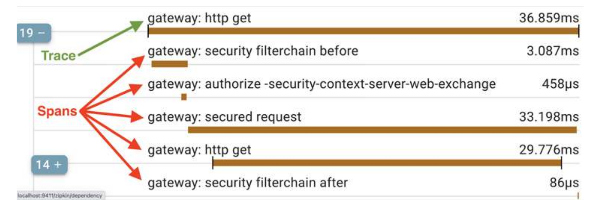

# Distributed Tracing

## Micrometer Tracing and Zipkin
To understand what is going on in a distributed system such as a system landscape of cooperating
microservices, it is crucial to be able to track and visualize how requests and messages flow between microservices when processing an external call to the system landscape.

[Micrometer Tracing](https://github.com/micrometer-metrics) is used to collect trace information, propagate trace contexts (for example, trace and span IDs) in calls to other microservices and export the trace information into trace analysis tools like Zipkin. Micrometer
supports auto-configuration of tracers based on [OpenTelemetry](https://opentelemetry.io/) or
[OpenZipkin Brave](https://github.com/openzipkin/brave).

By default, trace headers are propagated between microservices using [W3C trace context headers](https://www.w3.org/TR/trace-context/). A sample W3C trace context traceparent header looks like this:

```
traceparent:"00-2425f26083814f66c985c717a761e810-fbec8704028cfb20-01"
```

The value of the traceparent header contains four parts, separated by a -:

* 00 indicates the version used. Will always be 00 using the current specification.
* 2425f26083814f66c985c717a761e810 is the trace ID.
* fbec8704028cfb20 is the span ID.
* 01 indicates various flags. Will always be 01 using the current specification.

[Zipkin](http://zipkin.io) is a distributed tracing system that Micrometer Tracing can send tracing data to for storage and visualization. Zipkin comes with native support for storing trace information either in memory, or in a database such as Apache Cassandra, Elasticsearch, or MySQL. Added to this, a number of extensions are available. For details, refer to https://zipkin.io/pages/extensions_choices.html. 

The infrastructure for handling distributed tracing information in Micrometer Tracing and Zipkin is
originally based on Google Dapper (https://ai.google/research/pubs/pub36356). **The tracing information from a complete workflow is called a trace tree, and sub-parts of the tree, such
as the basic units of work, are called spans. A correlation ID is called TraceId, and a span is identified by its own unique SpanId, along with the TraceId of the trace tree it belongs to.**



From the preceding screenshot, we can see that an HTTP GET request is sent to the gateway service which subsequently engages in a sequence of security-related activities.

## Maven dependencies
To enable distributed tracing, add to *ALL* services within our ecosystem the *micrometer-tracing-bridge-otel*, and *opentelemetry-exporter-zipkin* dependencies.

```
    <dependency>
        <groupId>io.micrometer</groupId>
        <artifactId>micrometer-tracing-bridge-otel</artifactId>
    </dependency>
    <dependency>
        <groupId>io.opentelemetry</groupId>
        <artifactId>opentelemetry-exporter-zipkin</artifactId>
    </dependency>
```

## Configuration

As above, *ALL* services within our ecosystem can be configured to send traces to Zipkin as described below:

```
management.zipkin.tracing.endpoint: http://localhost:9411/api/v2/spans
management.tracing.sampling.probability: 1.0
logging.pattern.level: "%5p [${spring.application.name:},%X{traceId:-},%X{spanId:-}]"
```

This specifies:
* that traces will be sent to Zipkin at http://localhost:9411/api/v2/spans
* that all traces are sent to Zipkin (the default is 0.1 or 10 percent)
* an alternative log format which includes *traceID* and *spanID*

With the above log format, the log output will look like:

```
2024-05-18T19:18:44.399+02:00  INFO [composite-service,d1f4e74e0a6cd241c68ceaae73d1e50a,1579ffdacf5fcfe2] ...
```

Where: 
* product-composite is the name of the microservice
* d1f4e74e0a6cd241c68ceaae73d1e50a is the trace ID
* 1579ffdacf5fcfe2 is the span ID.

### Gateway service configuration
In order to expose Zipkin via our gateway service (this is particularly useful when the ecosystem is run inside a Docker environment), can can update its routing rules. Using the following configuration Zipkin will be available at: http://localhost:8080/zipkin/web.

```
spring.cloud.gateway.routes:
- id: composite-service
  uri: lb://composite-service
  predicates:
    - Path=/time/**
- id: zipkin-web-start
  uri: http://${app.zipkin-server}:9411
  predicates:
    - Path=/zipkin/web
      filters:
    - SetPath=/
- id: zipkin-web-other
  uri: http://${app.zipkin-server}:9411
  predicates:
    - Path=/zipkin/**
```


## Docker configuration

```
services:
  zipkin:
    image: openzipkin/zipkin:3.0.5
    restart: always
    mem_limit: 512m
    environment:
      - STORAGE_TYPE=mem

  eureka:
    build: eureka-server
    mem_limit: 512m
    environment:
      - SPRING_PROFILES_ACTIVE=docker

  gateway:
    build: gateway-service-end
    mem_limit: 512m
    ports:
      - "8080:8080"
    environment:
      - SPRING_PROFILES_ACTIVE=docker

  composite:
    build: composite-service-end
    mem_limit: 512m
    environment:
      - SPRING_PROFILES_ACTIVE=docker

  time:
    build: time-service-end
    mem_limit: 512m
    environment:
      - SPRING_PROFILES_ACTIVE=docker
```

## Trying out distributed tracing

## Resources
* https://opentelemetry.io/