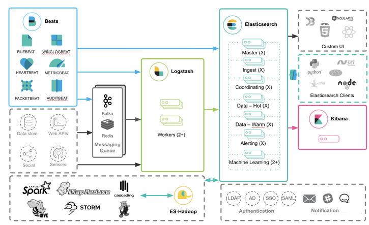
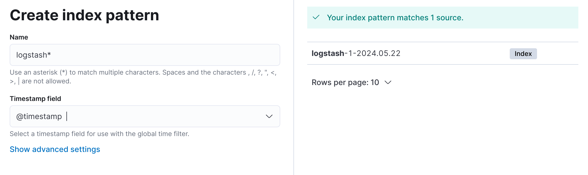
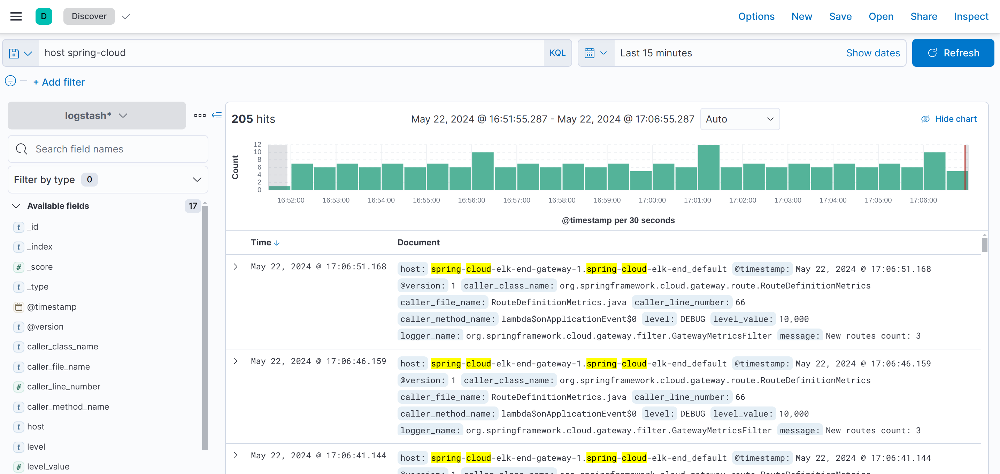

# Log Aggregation

Having a good log monitoring infrastructure is a key feature to have while developing any software. For instance, in a microservices architecture, any single operation triggers a chain of API calls making it challenging to debug the entire application in case an error comes.

This is where Logs act as essential information that allows us to investigate better and diagnose the errors. They can help sysadmins, support teams, and even developers to follow the different operations carried out by the different services of the system.

But it becomes very complex to maintain this critical data in a distributed environment where many applications, services, and systems are running. As a solution for this problem, we're going to look at the ELK stack, a useful tool for centralized log aggregation and analysis.

ELK is a collection of three open-source applications: 
* [Elasticsearch](https://www.elastic.co/) — Elasticsearch stores and indexes the data. It is a NoSQL database based on the [Lucene](https://lucene.apache.org/) engine. Elasticsearch excels is indexing streams of data such as logs.
* [Logstash](https://www.elastic.co/logstash) — Logstash is a tool that integrates with a variety of deployments. It is used to collect, parse, transform, and buffer data from a variety of sources. The data collected by Logstash can be shipped to one or more backends like Elasticsearch.
* [Kibana](https://www.elastic.co/kibana) — Kibana acts as an analytics and visualization layer on top of Elasticsearch. Kibana can be used to search, view, and interpret the data stored in Elasticsearch.



## Maven dependencies

To enable log aggregation, add to *ALL* services within the ecosystem the following dependencies. They include the classes needed for sending logs remotely via TCP.

```
    <dependency>
        <groupId>net.logstash.logback</groupId>
        <artifactId>logstash-logback-encoder</artifactId>
        <version>7.4</version>
    </dependency>
    <dependency>
        <groupId>ch.qos.logback</groupId>
        <artifactId>logback-classic</artifactId>
        <version>1.5.6</version>
    </dependency>
    <dependency>
        <groupId>ch.qos.logback</groupId>
        <artifactId>logback-core</artifactId>
        <version>1.5.6</version>
    </dependency>
```

## Logback configuration

Next, you have to configure the *logback.xml* file inside the *resources* folder of your services. This configuration file setup *logback* to use three *appenders* for sending logs the console, to a local file, and to a remote instance logstash (TCP). It also defines *INFO* as the default level for all three *appenders*.

```
<?xml version="1.0" encoding="UTF-8"?>
<configuration>
    
    <appender name="STDOUT" class="ch.qos.logback.core.ConsoleAppender">
        <encoder>
            <pattern> %d{dd-MM-yyyy HH:mm:ss.SSS} [%thread] %-5level %logger{36}.%M - %msg%n </pattern>
        </encoder>
    </appender>
    
    <appender name="FILE" class="ch.qos.logback.core.FileAppender">
        <file>logs/application.log</file>
        <encoder>
            <Pattern> %d{dd-MM-yyyy HH:mm:ss.SSS} [%thread] %-5level %logger{36}.%M - %msg%n </Pattern>
        </encoder>
    </appender>
    
    <appender name="LOGSTASH" class="net.logstash.logback.appender.LogstashTcpSocketAppender">
        <destination>localhost:4560</destination>
        <encoder charset="UTF-8" class="net.logstash.logback.encoder.LoggingEventCompositeJsonEncoder">
            <providers>
                <timestamp>
                    <timeZone>UTC</timeZone>
                </timestamp>
                <pattern>
                    <pattern>
                        {
                        "logLevel": "%level",
                        "serviceName": "${springAppName:-}",
                        "pid": "${PID:-}",
                        "thread": "%thread",
                        "class": "%logger{40}",
                        "rest": "%message"
                        }
                    </pattern>
                </pattern>
            </providers>
        </encoder>

        <encoder class="net.logstash.logback.encoder.LogstashEncoder">
            <includeCallerData>true</includeCallerData>
        </encoder>
    </appender>

    <root level="INFO">
        <appender-ref ref="STDOUT" />
        <appender-ref ref="FILE" />
        <appender-ref ref="LOGSTASH" />
    </root>
</configuration>
```

Appenders (also known as Handlers in some logging frameworks) are responsible for documenting the log events to a destination. Inside appenders you can also define custom log pattern:

```
%d{dd-MM-yyyy HH:mm:ss.SSS} [%thread] %-5level %logger{36}.%M - %msg%n
```

* **%d** – Returns the time when the log message occurred.
* **%thread** – Returns the name of the thread in which the log message occurred.
* **%-5level** – Returns the logging level of the log message (ERROR, WARN, INFO, DEBUG, and TRACE).
* **%logger{64}** – Returns the package with the package and class name where the log message occurred. The number 64 inside the brackets represents the maximum length of the package and class name combined. You can change this number as per your need.
* **%M** – Returns the name of the method where the log message has occurred.
* **%msg** – Returns the actual log message.
* **%n** – Line break.

Loggers are responsible for capturing events and passing them to the appender. 

## Logstash configuration

The Logstash event processing pipeline has three stages: **inputs → filters → outputs**. 


Inputs generate events, filters modify them, and outputs ship them elsewhere. You use inputs to get data into Logstash. Some of the more commonly-used inputs are:

* **file**: reads from a file on the filesystem, much like the UNIX command `tail -0F`
* **syslog**: listens on the well-known port 514 for syslog messages and parses according to the RFC3164 format
* **redis**: reads from a redis server, using both redis channels and redis lists. Redis is often used as a "broker" in a centralized Logstash installation, which queues Logstash events from remote Logstash "shippers".
* **beats**: processes events sent by [Beats](https://www.elastic.co/downloads/beats).

For more information about the available inputs, see [Input Plugins](https://www.elastic.co/guide/en/logstash/current/input-plugins.html "Input plugins").


Filters are intermediary processing devices in the Logstash pipeline. You can combine filters with conditionals to perform an action on an event if it meets certain criteria. Some useful filters include:

* **grok**: parse and structure arbitrary text. Grok is currently the best way in Logstash to parse unstructured log data into something structured and queryable. With 120 patterns built-in to Logstash, it's more than likely you'll find one that meets your needs!
* **mutate**: perform general transformations on event fields. You can rename, remove, replace, and modify fields in your events.
* **drop**: drop an event completely, for example, *debug* events.
* **clone**: make a copy of an event, possibly adding or removing fields.
* **geoip**: add information about geographical location of IP addresses (also displays amazing charts in Kibana!)

For more information about the available filters, see [Filter Plugins](https://www.elastic.co/guide/en/logstash/current/filter-plugins.html "Filter plugins").

Outputs are the final phase of the Logstash pipeline. An event can pass through multiple outputs, but once all output processing is complete, the event has finished its execution. Some commonly used outputs include:

* **elasticsearch**: send event data to Elasticsearch. If you're planning to save your data in an efficient, convenient, and easily queryable format...Elasticsearch is the way to go. 
* **file**: write event data to a file on disk.
* **graphite**: send event data to graphite, a popular open source tool for storing and graphing metrics. <http://graphite.readthedocs.io/en/latest/>
* **statsd**: send event data to statsd, a service that "listens for statistics, like counters and timers, sent over UDP and sends aggregates to one or more pluggable backend services". 

For more information about the available outputs, see [Output Plugins](https://www.elastic.co/guide/en/logstash/current/output-plugins.html "Output plugins").

```
input {
	tcp {
		mode => "server"
		port => 4560
		codec => json_lines
  	}

	file {
            type => "java"
            path => "/var/log/logs/library/application.log"
            codec => multiline {
            pattern => "^%{YEAR}-%{MONTHNUM}-%{MONTHDAY} %{TIME}.*"
            negate => "true"
            what => "previous"
         }
    }
}

output {
	stdout {
		codec => rubydebug
	}
	elasticsearch {
		index => "logstash-1-%{+YYYY.MM.dd}"
		hosts => "elasticsearch:9200"
		user => "elastic"
		password => "password"
		ecs_compatibility => disabled
	}
}

```

## Docker configuration

```
services:

  elasticsearch:
    image: docker.elastic.co/elasticsearch/elasticsearch:7.15.2
    mem_limit: 512m
    volumes:
      - elasticsearch:/usr/share/elasticsearch/data
    ports:
      - "9200:9200"
      - "9300:9300"
    environment:
      ELASTIC_PASSWORD: password
      discovery.type: single-node

  logstash:
    image: docker.elastic.co/logstash/logstash:7.15.2
    mem_limit: 512m
    volumes:
      - ./data/logstash:/usr/share/logstash/pipeline:ro
    ports:
      - "5044:5044"
      - "5000:5000/tcp"
      - "5000:5000/udp"
      - "9600:9600"
      - "4560:4560"
    depends_on:
      - elasticsearch

  kibana:
    image: docker.elastic.co/kibana/kibana:7.15.2
    mem_limit: 512m
    ports:
      - "5601:5601"
    depends_on:
      - elasticsearch

  eureka:
    build: eureka-server-end
    mem_limit: 512m
    environment:
      - SPRING_PROFILES_ACTIVE=docker
    depends_on:
      - logstash

  gateway:
    build: gateway-service-end
    mem_limit: 512m
    ports:
      - "8080:8080"
    environment:
      - SPRING_PROFILES_ACTIVE=docker
    depends_on:
      - logstash

  composite:
    build: composite-service-end
    mem_limit: 512m
    environment:
      - SPRING_PROFILES_ACTIVE=docker
    depends_on:
      - logstash

  time:
    build: time-service-end
    mem_limit: 512m
    environment:
      - SPRING_PROFILES_ACTIVE=docker
    depends_on:
      - logstash

volumes:
  elasticsearch:
```

You can run the whole ecosystem with:

```
$ mvn clean package -Dmaven.test.skip=true
$ docker compose build
$ docker compose up -d
```

To make sure the Elasticsearch cluster is up and working fine, open the browser at http://localhost:9200. You must see something similar to this:

```
{
        "name": "77caf134accb",
        "cluster_name": "docker-cluster",
        "cluster_uuid": "uLh1pf_0ROSRTrqrBvzU0Q",
        "version": {
            "number": "7.15.2",
            "build_flavor": "default",
            "build_type": "docker",
            "build_hash": "93d5a7f6192e8a1a12e154a2b81bf6fa7309da0c",
            "build_date": "2021-11-04T14:04:42.515624022Z",
            "build_snapshot": false,
            "lucene_version": "8.9.0",
            "minimum_wire_compatibility_version": "6.8.0",
            "minimum_index_compatibility_version": "6.0.0-beta1"
        },
        "tagline": "You Know, for Search"
        }
```

You can also invoke *TimeService* at http://localhost:8080/time.

A log similar to the one below should appear in the service console:

```
22-05-2024 13:53:15.228 [reactor-http-epoll-4] INFO  com.baeldung.time.TimeController.time - Returning 13:53:15.228612561...

```

A log similar to the one below should appear in the *logstash* console showing that it is successfully receiving logs and forwarding them to *elasticsearch*.

```
2024-05-22 13:53:15 {
2024-05-22 13:53:15                   "host" => "gateway",
2024-05-22 13:53:15     "caller_method_name" => "time",
2024-05-22 13:53:15             "@timestamp" => 2024-05-22T11:53:15.228Z,
2024-05-22 13:53:15     "caller_line_number" => 22,
2024-05-22 13:53:15                "message" => "Returning 13:53:15.228612561...",
2024-05-22 13:53:15                   "port" => 59024,
2024-05-22 13:53:15       "caller_file_name" => "TimeController.java",
2024-05-22 13:53:15            "logger_name" => "com.baeldung.time.TimeController",
2024-05-22 13:53:15            "thread_name" => "reactor-http-epoll-4",
2024-05-22 13:53:15            "level_value" => 20000,
2024-05-22 13:53:15               "@version" => "1",
2024-05-22 13:53:15                  "level" => "INFO",
2024-05-22 13:53:15      "caller_class_name" => "com.baeldung.time.TimeController"
2024-05-22 13:53:15 }
```

## Visualizing logs in Kibana 

Open Kibana at http://localhost:5601. Kibana uses index patterns for retrieving data from Elasticsearch. As it's the first time we are using Kibana, we must create an index pattern to explore our data. 

For this, navigate to http://localhost:9200/_cat/indices; it will display all the indexes that have ever been created inside elasticsearch. Here you will see an index name starting with "logstash-". This is the index that has been created by Logstash.

```
green  open .geoip_databases                mgWmYbj3QBSjmVAh9Wc7ZQ 1 0   34    0  31.3mb  31.3mb
green  open .apm-custom-link                UwB_cLnbSj-8FzC7brlwZA 1 0    0    0    208b    208b
yellow open metricsapp-2024-05              zop2fAFeRKy1DXTfUdwVtA 1 1  158    0 201.2kb 201.2kb
yellow open logstash-1-2024.05.22           PBiWfWJ2QV-N_2mBDKLGQg 1 1 1124    0   768kb   768kb
green  open .apm-agent-configuration        W1Q2GrpTRoe06ytMyeiyNg 1 0    0    0    208b    208b
green  open .kibana-event-log-7.15.2-000001 CKePGtOzRcOG0sm8ZkpScQ 1 0    1    0     6kb     6kb
green  open .async-search                   LQecZoV6SrS4QHu_p3frkg 1 0    0    0    231b    231b
green  open .kibana_7.15.2_001              hNMrvd2fTJOk5mQ0fps90w 1 0   36    0   4.7mb   4.7mb
green  open .kibana_task_manager_7.15.2_001 yj2qygQOQzuqnX2typco7g 1 0   15 2913 443.2kb 443.2kb
```


* Goto to *Stack Management -> Index Patterns -> Create index pattern*
* Create a pattern for matching the Logstash indexes using `logstash-*`
* Choose `@timestamp` and click the *Create index pattern* button.



The index pattern will be created. Click again in the *Discover* icon and the log events of all services start up will be shown:



## Resources
- [Getting to know Kibana](https://www.youtube.com/watch?v=l2b04Sz8vTw&list=PLhLSfisesZItoCPKxNHhttGkCTgCrAW2I&index=1)