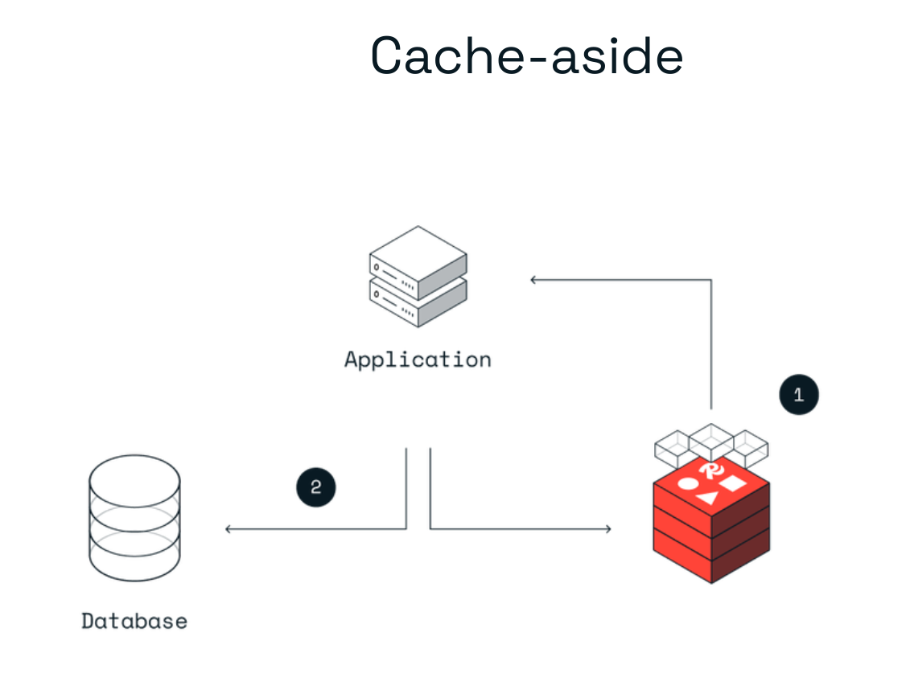
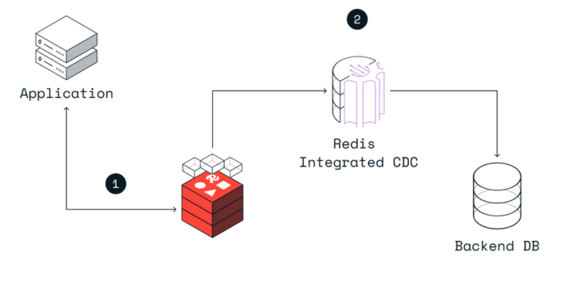
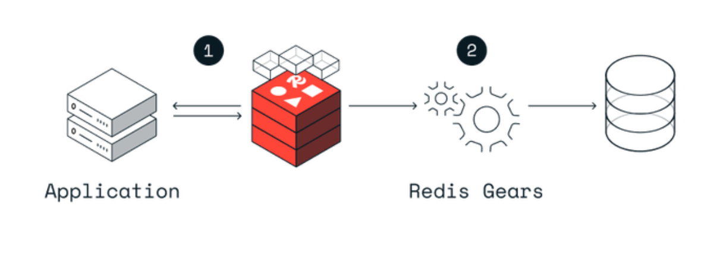

# Distributed caching

Distributed caching has emerged as a pivotal solution for modern applications that demand high performance, scalability, and real-time data access. By storing frequently accessed data across multiple servers, distributed caching reduces the strain on primary data sources, ensuring rapid data retrieval and enhanced user experiences.

## Different types of caching

Caching can be broadly categorized into two types: local caching and distributed caching.

* **Local caching** refers to storing data on a single machine or within a single application. It's commonly used in scenarios where data retrieval is limited to one machine or where the volume of data is relatively small. Examples of local caching include browser caches or application-level caches.
* **Distributed caching** involves storing data across multiple machines or nodes, often in a network. This type of caching is essential for applications that need to scale across multiple servers or are distributed geographically. Distributed caching ensures that data is available close to where it's needed, even if the original data source is remote or under heavy load.

**Local caching, while effective for single-machine applications, faces limitations in distributed systems**. As applications scale and serve users from various locations, relying solely on local caching can lead to data inconsistencies, increased latency, and potential bottlenecks. For instance, if one server updates its local cache but other servers remain unaware of this change, users might receive outdated data.

**Distributed caching addresses the limitations of local caching by storing data across multiple machines or nodes in a network**. This approach offers several advantages:

* **Scalability**: As traffic to an application grows, additional cache servers can be added to the distributed cache system without disrupting existing operations.
* **Fault tolerance**: If one cache server fails, requests can be rerouted to another server, ensuring continuous availability of cached data.
* **Performance**: Data is stored closer to the user, reducing the time taken to fetch it and improving response times.

## Key components of distributed caching

**Cache Servers**: Cache servers are the primary components in a distributed caching system. They store temporary data across multiple machines or nodes, ensuring that the data is available close to where it's needed. Each cache server can operate independently, and in case of a server failure, the system can reroute requests to another server, ensuring high availability and fault tolerance.

**Data Partitioning**: In distributed caching, data is partitioned across multiple cache servers to ensure efficient data distribution and retrieval. There are several strategies for data partitioning:

-   **Consistent hashing**: This method ensures that data is evenly distributed across cache servers and minimizes data movement when new servers are added or existing ones are removed.
-   **Virtual nodes**: Virtual nodes are used to handle scenarios where cache servers have varying capacities. They ensure that data distribution remains balanced even if some servers have higher storage capacities than others.

**Data Replication**: Replication is another crucial aspect of distributed caching. By replicating data across multiple cache servers, the system ensures data availability even if a server fails. Common replication strategies include master-slave replication, where one server acts as the master and others as replicas, and peer-to-peer replication, where each server acts both as a primary store and a replica for different data items.

## Distributed caching patterns

### Cache-aside
This is the most common way to use Redis as a cache. Cache-aside is an excellent choice for read-heavy applications when cache misses are acceptable. The application handles all data operations when you use a cache-aside pattern, and it directly communicates with both the cache and database.

### Write-behind caching
Write-behind caching improves write performance. The application writes to only one place – the Redis Enterprise cache – and Redis Enterprise asynchronously updates the backend database. That simplifies development.

### Write-through caching
Write-through caching is similar to the write-behind cache, as the cache sits between the application and the operational data store. However, with write-through caching, the updates to the cache are synchronous and flow through the cache to the database. The write-through pattern favors data consistency between the cache and the data store.

## Distributed caching solutions

Distributed caching solutions have evolved over the years to cater to the growing demands of scalable and high-performance applications:

**Redis** is an open-source, in-memory data structure store that can be used as a cache, [database](https://redis.io/blog/redis-cache-vs-redis-primary-database-in-90-seconds/), and [message broker](https://redis.io/solutions/messaging/). It supports various data structures such as strings, hashes, lists, and sets. Redis is known for its high performance, scalability, and support for data replication and persistence.

**Memcached** is a general-purpose distributed memory caching system. It is designed to speed up dynamic web applications by reducing database load. Memcached is simple yet powerful, supporting a large number of simultaneous connections and offering a straightforward key-value storage mechanism.

**Hazelcast** is an in-memory data grid that offers distributed caching, messaging, and computing. It provides features like data replication, partitioning, and native memory storage. Hazelcast is designed for cloud-native architectures and can be easily integrated with popular [cloud](https://redis.io/redis-enterprise/cloud/) platforms.

**Apache Ignite** is an in-memory computing platform that provides distributed caching, data processing, and [ACID-compliant transactions](https://redis.io/glossary/acid-transactions/). It can be used as a distributed cache, database, and message broker. Apache Ignite supports data replication, persistence, and querying capabilities.

## Resources
