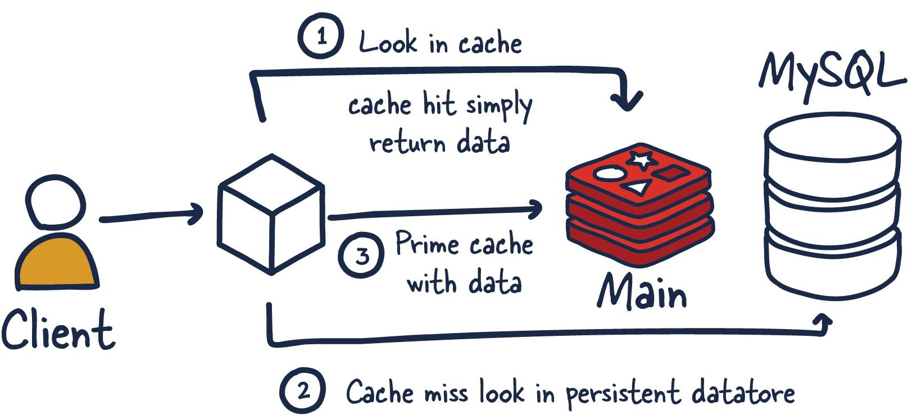

# Distributed caching

## Redis
Remote Dictionary Server, commonly known as Redis, is an open source and in-memory data store, which represents one of the many options for implementing caching in Spring Boot applications. It is a versatile key-value store that supports several data structures, such as Strings, Sorted Sets, Hashes, Lists, Streams, Bitmaps, etc. Redis's support for multiple data structures comes from its NoSQL nature, eliminating the need for a predetermined schema and offering greater flexibility in
data storage and retrieval.

Redis can be used in various ways, including:
1. **In-Memory Database:** Handling a large amount of real-time data is a common challenge. A real-time database is a type of data repository designed to capture, analyze, and increase an incoming stream of data.
2. **Cache:** Many applications struggle with the need to store and retrieve data quickly, especially in systems with high latency. Due to its speed, Redis is the ideal choice for caching API calls, session states, complex computations, and database queries.
3. **Message Broker (MQ):** It has always been difficult to stream data around the organization and make it accessible for various system components. Redis supports messaging functionalities, serving as a message broker for facilitating communication between different system components.


## Introduction to Cache Abstraction

At its essence, **the cache abstraction applies caching to Java methods, effectively reducing the number of executions based on cached information**. Each time a designated method is invoked, the abstraction applies a caching behavior that checks whether the method has been previously invoked for any given argument:

* if it has been invoked (**cache hit**), the cached result is retrieved and returned without having to execute the method again.
* if the method hasn't been previously invoked (**cache miss**), then the method is called, and the result is cached and returned to the user.

With this approach, expensive methods (whether CPU-intensive or IO-intensive) can be invoked only the first time for a given set of parameters and the result reused without having to actually invoke the method again.



**The caching logic is applied transparently without any interference to the invoker**. In fact, the method's invoker does not need to be aware of or explicitly handle caching mechanisms. Instead, the caching abstraction handles these operations behind the scenes, improving performance and reducing unnecessary computational load without requiring additional effort from the developer.

**As with other services in the Spring Framework (e.g., Spring Cloud Stream), the caching service is an abstraction (not a cache implementation) and requires the use of actual storage to store the cache data.** That is, the abstraction frees you from having to write the caching logic but does not provide the actual data store. This abstraction is materialized by the **`org.springframework.cache.Cache`** and **`org.springframework.cache.CacheManager`** interfaces.

**The caching abstraction provides other cache-related operations, such as the ability to update the content of the cache or to remove one or all entries**. These are useful if the cache deals with data that can change during the course of the application.


## About the project

This project is developed using a small set of cooperating microservices, composed of three core services: product, review,
and recommendation. Each of them deals with one type of resource and interacts with a specific database. Additionally,
there is a composite microservice, called the product composite service, which aggregates information from these three core
services. All of this information is stored in three different databases, one for each core microservice, and the Spring Data
project is used to persist data to MongoDB and PostgreSQL databases. Specifically, the product and recommendation microservices
use Spring Data for MongoDB and the review microservice uses Spring Data for the Java Persistence API (JPA) to access a
PostgreSQL database. In addition, the product composite service interacts with a Redis database used as a cache to store
the results of database retrieval operations, allowing subsequent requests to retrieve the data directly from the cache.

At the end of this project, we will have layers inside our microservices that will look like the following:


The Protocol layer handles protocol-specific logic. It is very thin, only consisting of the RestController annotations
in the api project and the common GlobalControllerExceptionHandler in the util project. The main functionality of each
microservice resides in each Service layer. The product composite service contains an Integration layer used to handle
the communication with the three core microservices. The core microservices will all have a Persistence layer used for
communicating with their databases. The cache annotations are integrated into the product composite Service layer, and
it will invoke the Integration layer only after querying the cache and in case the requested data is not found in the cache.

To keep the source code examples easy to understand, they have a minimal amount of business logic. The information model
for the business objects they process is kept minimal for the same reason. In this section, we will go through the information
that's handled by each microservice.

The **product service** manages product information and describes each product with the following attributes:
```
• Product ID
• Name
• Weight
```
The **review service** manages product reviews and stores the following information about each review:
```
• Product ID
• Review ID
• Author
• Subject
• Content
```
The **recommendation service** manages product recommendations and stores the following information about each recommendation:
```
• Product ID
• Recommendation ID
• Author
• Rate
• Content
```
The **product composite service** aggregates information from the three core services and presents information about a product
as follows:
```
• Product information, as described in the product service
• A list of product reviews for the specified product, as described in the review service 
• A list of product recommendations for the specified product, as described in the recommendation service
```

In this tutorial we will skip the different steps to generate the skeleton code for our project, and we will focus our attention
on how to implement a caching system using Redis as a cache provider. But despite this, the full source code is available
in the GitHub repository, so you can consult it anytime.

## Maven dependencies

Add the **spring-boot-starter-cache** and **spring-boot-starter-data-redis** dependencies to the product composite service
  _pom.xml_ file.
```
	<dependencies>
	...
		<dependency>
			<groupId>org.springframework.boot</groupId>
			<artifactId>spring-boot-starter-cache</artifactId>
		</dependency>
		<dependency>
			<groupId>org.springframework.boot</groupId>
			<artifactId>spring-boot-starter-data-redis</artifactId>
		</dependency>
	...
	</dependencies>
```

Add also the **spring-boot-testcontainers** and **testcontainers-redis** dependencies in order to test the cache logic.

```
	<dependencies>
	...
		<dependency>
			<groupId>org.springframework.boot</groupId>
			<artifactId>spring-boot-testcontainers</artifactId>
			<scope>test</scope>
		</dependency>
		<dependency>
			<groupId>com.redis</groupId>
			<artifactId>testcontainers-redis</artifactId>
			<version>2.2.2</version>
			<scope>test</scope>
		</dependency>
	...
	</dependencies>
```

## Docker configuration

Update the _docker-compose.yml_ file by adding a Redis service. This Redis server contains the in-memory database used for caching by the Spring Boot services.

```
services:
  ...
  redis:
    image: redis:latest
    mem_limit: 512m
    ports:
      - "6379:6379"
    healthcheck:
        test: [ "CMD", "redis-cli", "ping" ]
        interval: 5s
        timeout: 2s
        retries: 60
```

## Service configuration
* Update the product composite service _application.yml_ file to configure the Spring Boot application to connect to both MongoDB and Redis.

```
server.port: 7000
server.error.include-message: always

spring:
  cache:
    type: redis
  data:
    redis:
      host: localhost
      port: 6379
    mongodb:
      host: localhost
      port: 27017
      database: products
      auto-index-creation: true

logging:
  level:
    root: INFO
    com.baeldung: DEBUG
    org.springframework.cache: TRACE
    org.springframework.data.mongodb.core.MongoTemplate: DEBUG

---
spring.config.activate.on-profile: docker
server.port: 8080
spring.data.redis.host: redis
spring.data.mongodb.host: mongodb
```

Important parts of the preceding code:

* We set the **type** parameter to **redis**, meaning that our application will automatically make the necessary configurations to use Redis as the cache provider.
* Setting the log level for **org.springframework.cache** to **TRACE** will allow us to see which cache statements are executed in the log.
* When running without Docker using the default Spring profile, the Redis database is expected to be reachable on **localhost:6379**. Instead, When running inside Docker, the Redis database is expected to be reachable on **redis:6379**.

## Service code

### Redis Configuration
To enable Spring Cache in the product microservice, we have to add some configuration. To do that, we create
a class named _RedisCacheConfig_ under the _config_ folder so that the necessary Redis settings can be loaded by Spring.

```
@EnableCaching
@Configuration
public class RedisCacheConfig {
    @Bean
    public RedisCacheManager cacheManager(RedisConnectionFactory connectionFactory) {
        RedisCacheConfiguration cacheConfiguration = RedisCacheConfiguration.defaultCacheConfig()
                .entryTtl(Duration.ofMinutes(60))
                .disableCachingNullValues()
                .serializeValuesWith(RedisSerializationContext.SerializationPair.fromSerializer(new GenericJackson2JsonRedisSerializer()));

        return RedisCacheManager.builder(connectionFactory)
                .cacheDefaults(cacheConfiguration)
                .transactionAware()
                .build();
    }
}
```

Now let's examine the above class in detail:

* `@EnableCaching`: This annotation is used to enable caching support in the Spring application. It will trigger a post-processor that inspects every Spring Bean for the presence of caching annotations on public methods.
* `@Configuration`: This annotation indicates that the class is a configuration class and its methods are defined as a Spring Bean.
* The configuration of Redis Cache created by RedisCacheManager is defined with `RedisCacheConfiguration`. This specifies the default configuration for all caches, including default TTL, that is key expiration time, and serialization settings for converting to and from the binary storage format. It also disables caching of null values.

### Using the @Cacheable annotation

You can use `@Cacheable` to demarcate methods that are cacheable - that is, methods for which the result is stored in the cache so that, on subsequent invocations (with the same arguments), the value in the cache is returned without having to actually invoke the method again.

```
@Cacheable(cacheNames = "products", key = "#productId")
public ProductAggregateDto getProduct(int productId) {...}
```

The `cacheNames` attribute establishes a cache with a specific name, while the `key` attribute permits the use of Spring Expression Language to compute the key dynamically. Consequently, the method result is stored in the 'products' cache, where _productId_ serves as the unique key. This approach optimizes caching by associating each result with a distinct key.

The cache abstraction allows not just population of a cache store but also eviction. This process is useful for removing stale or unused data from the cache. `@CacheEvict` annotation demarcates methods that perform cache eviction, that is methods that act as triggers for removing data from the cache. As for `@Cacheable` annotation, we can use `cacheNames` and `key` attributes to remove a specific data from the cache specified.

```
@CacheEvict(cacheNames = "products", key = "#productId")
public void deleteProduct(int productId) {...}
```

## Testing Redis Cache with Testcontainers

**Testcontainers** is a Java library that simplifies running automated integration tests by running resource managers like a
database or a message broker as a Docker container. Testcontainers can be configured to automatically start up Docker containers
when JUnit tests are started and tear down the containers when the tests are completed.

To enable Testcontainers in an existing test class for a Spring Boot application, we can add the `@Testcontainers` annotation
to the test class. A disadvantage of this approach is that each test class will use its own Docker container, each of them
taking time to bring up the database in the container. Running multiple test classes that use the same type of test container
will add this latency for each test class. To avoid this extra latency, we can use the **Single Container Pattern**. Following
this pattern, a base class is used to launch a single Docker container for Redis.

The base class, _RedisCacheTestBase_, used in the Product composite microservice looks like this:
```
public abstract class RedisCacheTestBase {

    @ServiceConnection
    private static final RedisContainer cache = new RedisContainer("redis:latest");

    @BeforeAll
    static void beforeAll() {
        cache.start();
    }

    @AfterAll
    static void afterAll() {
        cache.stop();
    }

    @DynamicPropertySource
    static void setProperties(DynamicPropertyRegistry registry) {
        registry.add("spring.data.redis.host", cache::getHost);
        registry.add("spring.data.redis.port", cache::getFirstMappedPort);
    }
}
```

Explanations for the preceding source code:
* The cache container is declared as a RedisContainer and annotated with `@ServiceConnection` to indicate that this field
  provides a service that can be connected to.
* A static method annotated with `@BeforeAll` is used to start the cache container before any JUnit code is invoked.
* A static method annotated with `@AfterAll` is used to stop the cache container after any JUnit code is executed.
* The cache container will get some properties defined when started up, such as which port to use. To register these
  dynamically created properties in the application context, a static method setProperties() is defined. The method is annotated
  with `@DynamicPropertySource` to override the cache configuration in the application context.

The test class, _ProductCompositeServiceApplicationTests_, use the base class as follows:
```
@SpringBootTest(webEnvironment = RANDOM_PORT)
class ProductCompositeServiceApplicationTests extends RedisCacheTestBase {...}
```

This test class declares a method, setUp(), annotated with `@BeforeEach`, which is executed before each test method. The setup
method, among other things, removes any entities from previous tests in the cache. In this way, every time we start a new
test, the cache is completely empty ensuring that each test case starts in a consistent state, reducing the likelihood
of unexpected interactions between tests due to shared cached data.
```
@Autowired
private CacheManager cacheManager;

@BeforeEach
void setUp() {
    ...
    cacheManager.getCacheNames().forEach(cacheName -> Objects.requireNonNull(cacheManager.getCache(cacheName)).clear());
}
```

To ensure that the cache works correctly, we define two test cases which test two different cache operations:
* The first test verify that the second time we call the GET operation for the same productId, it will retrieve the result
  from the cache without invoking the getProduct method.
```
@Test
void getProductByIdFromCache() {
    getAndVerifyProduct(PRODUCT_ID_OK, OK);
    getAndVerifyProduct(PRODUCT_ID_OK, OK);
    verify(compositeIntegration, times(1)).getProduct(PRODUCT_ID_OK);
}
```

* The second test verify that if we call the GET operation for a product after deleting it from the database, it will invoke
  the getProduct method since no entries are found in the cache.
```
@Test
void deleteCompositeProductFromCache() {
    getAndVerifyProduct(PRODUCT_ID_OK, OK);
    deleteAndVerifyProduct(PRODUCT_ID_OK, OK);
    getAndVerifyProduct(PRODUCT_ID_OK, OK);
    verify(compositeIntegration, times(2)).getProduct(PRODUCT_ID_OK);
}
```

## Trying out Redis Cache

Once everything is set up, we can start the system landscape with the following commands:
```
$ ./mvnw clean package
$ docker-compose build && docker-compose up
```

After running the application you can visit http://localhost:8080/openapi/webjars/swagger-ui/index.html to test and use
the different operations defined in the project.


## Resources
* [Microservices with Spring Boot 3 and Spring Cloud - Third Edition](https://www.packtpub.com/product/microservices-with-spring-boot-3-and-spring-cloud-third-edition-third-edition/9781805128694)
* [Cache Abstraction](https://docs.spring.io/spring-framework/reference/integration/cache.html)
* [Spring Redis Cache](https://docs.spring.io/spring-data/redis/reference/redis/redis-cache.html)


