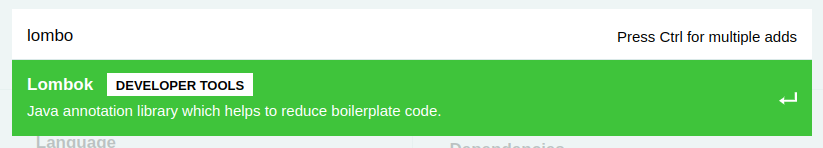

# Reducing boilerplate code (Lombok)

## Introduction

In this guide we'll see how is possibile to drastically reduce the amount of boilerplate code.
Java is a great language, but it can sometimes get too verbose for common tasks we have to do in our code or compliance with some framework practices. This often doesn’t bring any real value to the business side of our programs, and that’s where Lombok comes in to make us more productive. The idea is to auto-generate code fragments in building process throw a very simple and intuitive way: **annotations**.

## Project dependencies

To include Lombok in our project we can choose to ways:

* if you're creating a new project you can simply add the dependency throw the [spring boot initializr](https://start.spring.io/);
  
  
  
* If you want to add the dependency in an existing project (and you're using Maven) you have simply add the following dependency

  ```xml
  <dependency>
  		<groupId>org.projectlombok</groupId>
  		<artifactId>lombok</artifactId>
  		<optional>true</optional>
  </dependency>
  ```

That's all! Now you're ready to use Lombok annotations in your project.

## Hands on

Lets suppose we need to define an event in a class. Specifically, our event is defined by the following:

* The type of event, for example, a create or delete event
* A key that identifies the data (e.g., a message ID)
* A data element, that is, the actual data in the event
* A timestamp, which describes when the event occurred

and we are supposed to implement constructors, getters, setters and so on. What we'll obtain is something like this:

```java
public class Event<K, T> {
    public enum Type {CREATE, DELETE, UPDATE}
    private Type eventType;
    private K key;
    private T data;
    private ZonedDateTime eventCreatedAt;

    public Event() {
    }

    public Event(Type eventType, K key, T data) {
        this.eventType = eventType;
        this.key = key;
        this.data = data;
        this.eventCreatedAt = ZonedDateTime.now();
    }
    
    public Type getEventType() {
        return eventType;
    }

    public K getKey() {
        return key;
    }

    public T getData() {
        return data;
    }

    public ZonedDateTime getEventCreatedAt() {
        return eventCreatedAt;
    }

    @Override
    public String toString() {
        return "Event{" + "eventType=" + eventType + ", key=" + key + ", data=" + data + ", eventCreatedAt=" + eventCreatedAt + '}';
    }
  
    @Override
    public boolean equals(Object o) {
        if (this == o) return true;
        if (o == null || getClass() != o.getClass()) return false;
        Event<?, ?> event = (Event<?, ?>) o;
        return eventType == event.eventType &&
                Objects.equals(key, event.key) &&
                Objects.equals(data, event.data) &&
                Objects.equals(eventCreatedAt, event.eventCreatedAt);
    }

    @Override
    public int hashCode() {
        return Objects.hash(eventType, key, data, eventCreatedAt);
    }
}
```

Obviously, object creation will be:

```java
int index = RANDOM.nextInt(Event.Type.class.getEnumConstants().length);
        Event<String, Integer> event = new Event(
                Event.Type.class.getEnumConstants()[index],
                UUID.randomUUID().toString(),
                RANDOM.nextInt(100)
        );
```

Quite tricky and tremendously boring, isn't it?
One available solution is to make use of IDE's tool for code auto-generation, but one problem remains: all this boilerplate code make our life difficult in terms of code readability.

### @NoArgsConstructor, @AllArgsConstructor and @RequiredArgsConstructor

Firstly we can avoid to write down explicitly our constructors. In particolar:

* @NoArgsConstructor&rarr;will generate a constructor with no parameters. If this is not possible (because of final fields), a compiler error will result instead, unless @NoArgsConstructor(force = true) is used, then all final fields are initialized with 0 / false / null. For fields with constraints, such as @NonNull (we'll see later) fields, no check is generated,so be aware that these constraints will generally not be fulfilled until those fields are properly initialized later.
* @AllArgsConstructor&rarr;generates a constructor with 1 parameter for each field in your class. Fields marked with @NonNull result in null checks on those parameters.
* @RequiredArgsConstructor&rarr;​generates a constructor with 1 parameter for each field that requires special handling. All non-initialized final fields get a parameter, as well as any fields that are marked as @NonNull that aren't initialized where they are declared. For those fields marked with @NonNull, an explicit null check is also generated.

Thw following show how our code changes:

```java
@NoArgsConstructor
@AllArgsConstructor
public class Event<K, T> {
    public enum Type {CREATE, DELETE, UPDATE}
    private Type eventType;
    private K key;
    private T data;
    private ZonedDateTime eventCreatedAt;
    
    public Type getEventType() {
        return eventType;
    }

    public K getKey() {
        return key;
    }

    public T getData() {
        return data;
    }

    public ZonedDateTime getEventCreatedAt() {
        return eventCreatedAt;
    }

    @Override
    public String toString() {
        return "Event{" + "eventType=" + eventType + ", key=" + key + ", data=" + data + ", eventCreatedAt=" + eventCreatedAt + '}';
    }
  
    @Override
    public boolean equals(Object o) {
        if (this == o) return true;
        if (o == null || getClass() != o.getClass()) return false;
        Event<?, ?> event = (Event<?, ?>) o;
        return eventType == event.eventType &&
                Objects.equals(key, event.key) &&
                Objects.equals(data, event.data) &&
                Objects.equals(eventCreatedAt, event.eventCreatedAt);
    }

    @Override
    public int hashCode() {
        return Objects.hash(eventType, key, data, eventCreatedAt);
    }
}
```

Obviously we don't need @RequiredArgsConstructor because we do not have any @NonNull annotated or final field.

### @Getter and @Setter

Exactly as you imagine, those annotations generate for us getter and setter methods for each field making our code even leaner:

```java
@NoArgsConstructor
@AllArgsConstructor
@Getter
@Setter
public class Event<K, T> {
    public enum Type {CREATE, DELETE, UPDATE}
    private Type eventType;
    private K key;
    private T data;
    private ZonedDateTime eventCreatedAt;

    @Override
    public String toString() {
        return "Event{" + "eventType=" + eventType + ", key=" + key + ", data=" + data + ", eventCreatedAt=" + eventCreatedAt + '}';
    }
  
    @Override
    public boolean equals(Object o) {
        if (this == o) return true;
        if (o == null || getClass() != o.getClass()) return false;
        Event<?, ?> event = (Event<?, ?>) o;
        return eventType == event.eventType &&
                Objects.equals(key, event.key) &&
                Objects.equals(data, event.data) &&
                Objects.equals(eventCreatedAt, event.eventCreatedAt);
    }

    @Override
    public int hashCode() {
        return Objects.hash(eventType, key, data, eventCreatedAt);
    }
}	
```

### @ToString and @EqualsAndHashCode

No needs of further explanation:

```java
@NoArgsConstructor
@AllArgsConstructor
@Getter
@Setter
@EqualsAndHashCode
@ToString
public class Event<K, T> {
    public enum Type {CREATE, DELETE, UPDATE}
    private Type eventType;
    private K key;
    private T data;
    private ZonedDateTime eventCreatedAt;
}	
```

See? Now our class is just 4 annotations and fields declaration, done!

### @Data

If you're not satisfied enough, hold on, because that's not all.
This annotation includes all together @ToString, @EqualsAndHashCode, @Getter and @Setter for all non-final and non-@NonNull annotated fields! Moreover, it includes @RequiredArgsConstructor for all remaining fields!
So we can rewrite our class like:

```java
@NoArgsConstructor
@AllArgsConstructor
@Data
public class Event<K, T> {
    public enum Type {CREATE, DELETE, UPDATE}
    @NonNull private Type eventType;
    private final K key;
    private T data;
    private ZonedDateTime eventCreatedAt;
}	
```

While in the previous example adding @NonNull annotated or final fields would have implied adding @RequiredArgsConstructor annotation, now we can freely annotate the fields because everything needed will be automatically generated!

### @Builder and @Builder.Default

The last annotation we'll see makes code more readable non in class declaration, but during object creation. Defining a builder for a class make possible to create objects in a very comfortable way such as:

```java
Event event = Event.Builder()
  .eventType(Event.Type.class.getEnumConstants()[index])
  .key(UUID.randomUUID.toString())
  .data(RANDOM.nextInt(100))
  .ZonedDateTime(ZonedDateTime.now())
  .build()
```

Even better, you can configure default values in this way:

```java
@NoArgsConstructor
@AllArgsConstructor
@Data
@Builder
public class Event<K, T> {
    public enum Type {CREATE, DELETE, UPDATE};
    @Builder.Default private Type eventType = Type.CREATE;
    @Builder.Default private K key = UUID.randomUUID.toString();
    private T data;
    @Builder.Default private ZonedDateTime eventCreatedAt = ZonedDateTime.now();
}	
```

So that you can create objects overwriting default values or maintaining them:

```java
Event event = Event.Builder()
  .data(RANDOM.nextInt(100))
  .build()
```

## Conclusions

In this guide we've explored some of Lombok capabilities and we noticed also how useful it could be. Obviously it helps us for default implementations, but if you need something strictly customized you can smoothly add all other implementations you need.

To delve more specifically into all the features that Lombok offers (both to further explore those already covered in this guide and to discover those not mentioned), refer to the [official documentation](https://projectlombok.org/features/).
