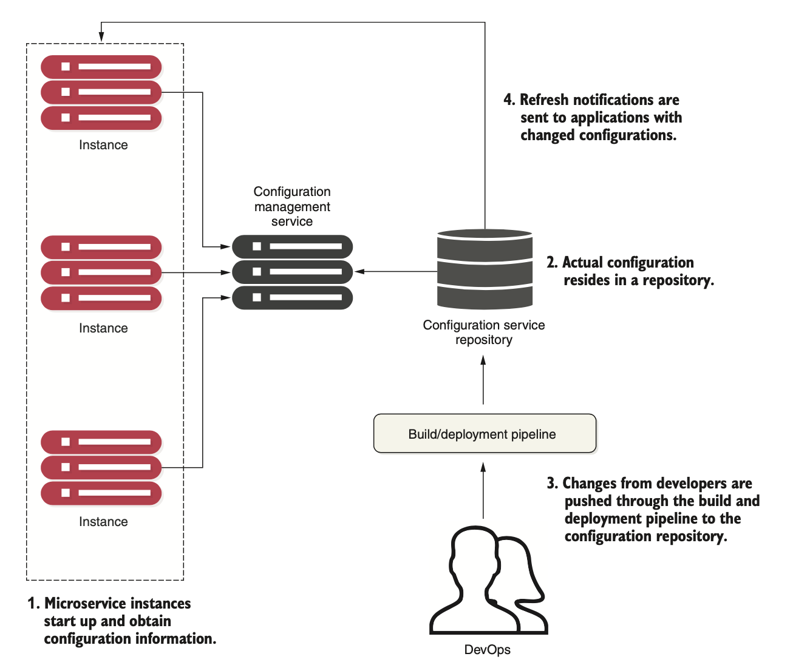

# Service configuration

Sources: Spring Microservices in Action (Chapter 5)

## Introduction

**Completely separating the configuration information from the application code allows developers and operations to make changes to their configurations without going through a recompile process**. It also introduces complexity, because now developers have another artifact to manage and deploy with the application.

**Many developers turn to property files** to store their configuration information. Configuring your application in these files becomes a simple task, so easy that most developers never do more than placing their configuration file under source control.

**This approach might work with a small number of applications, but it quickly falls apart when dealing with cloud-based applications that can contain hundreds of microservices**, where each microservice might have multiple service instances running.

To avoid this catastrophic scenario, as a best practice for cloud-based microservices development, we should consider the following:
* Completely separate the configuration of an application from the actual code being deployed.
* Build immutable application images that never change as these are promoted through your environments.
* Inject any application configuration information at server startup through either environment variables or a centralized repository that the microservices read on startup.

## Key principles
* **Segregate**: We need to completely separate the service configuration information from the actual physical deployment of a service. In fact, application configuration shouldn’t be deployed with the service instance. Instead, configuration information should either be passed as environment variables to the starting service or read from a centralized repository when the service starts.
* **Abstract**: We also need to abstract access to configuration data behind a service interface. Instead of writing code that directly reads the service repository, whether file-based or a JDBC database, we should use a REST-based JSON service to retrieve the application’s configuration data.
* **Centralize**: Because a cloud-based application might literally have hundreds of services, it’s critical to minimize the number of different repositories used to hold configuration data. Centralize your application configuration into as few repositories as possible.
* **Harden**: Because your application configuration information is going to be completely segregated from your deployed service and centralized, it’s critical that the solution you utilize and implement be highly available and redundant.

## Configuration management architecture

## Implementation choices

**etcd**

Written in Go. Used for service discovery and key-value management. Uses the raft protocol (https://raft.github.io/) for its distributed computing model.

* Very fast and scalable 
* Distributable 
* Command-line driven 
* Easy to use and set up

**Eureka**

Written by Netflix. Extremely battle-tested. Used for both service discovery and key-value management.

* Distributed key-value store
* Flexible but takes some effort to set up 
* Offers dynamic client refresh out of the box

**Consul**

Written by HashiCorp. Similar to etcd and Eureka but uses a different algorithm for its distributed computing model.

* Fast
* Offers native service discovery with the option to integrate directly with DNS
* Doesn’t offer client dynamic refresh out of the box

**Zookeeper**

An Apache project. Offers distrib- uted locking capabilities. Often used as a configuration management solution for accessing key-value data.

* Oldest, most battle-tested of the solutions * Most complex to use
* Can be used for configuration management, but consider only if you’re already using Zookeeper in other pieces of your architecture

**Spring Cloud Configuration Server**

An open source project. Offers a general configuration management solution with different backends.

* Non-distributed key-value store
* Offers tight integration for Spring and non-Spring services
* Can use multiple backends for storing configuration data including a shared filesystem, Eureka, Consul, or Git

## Using the Spring Cloud Config Server with a filesystem

## Setting up the configuration files for a service