<!-- PROJECT LOGO -->
<br />
<div align="center">
  
  <h1 align="center">MLOps</h1>
  <h3 align="center">Practices to deploy Machine Learning models into production</h3>
  <p align="center">
  A practical implementation of MLOps process.
  </p>
</div>

<!-- TABLE OF CONTENTS -->
<details>
  <summary>Table of Contents</summary>
  <ol>
    <li><a href="#short-description">Short Description</a></li>
    <li><a href="#mlops">MLOps</a></li>
    <li>
      <a href="#develop-phase">Develop Phase</a>
      <ul>
        <li><a href="#dp-step-01">DP Step 01</a></li>
        <li><a href="#dp-step-02">DP Step 02</a></li>
        <li><a href="#dp-step-03">DP Step 03</a></li>
        <li><a href="#dp-step-04">DP Step 04</a></li>
        <li><a href="#dp-step-05">DP Step 05</a></li>
        <li><a href="#dp-step-06">DP Step 06</a></li>
        <li><a href="#dp-step-07">DP Step 07</a></li>
        <li><a href="#dp-step-08">DP Step 08</a></li>
        <li><a href="#dp-getting-started">DP Getting Started </a></li>
        <ul>
          <li><a href="#dp-parameters">DP Parameters  </a></li>
          <li><a href="#dp-installation">DP Installation</a></li>
        </ul>
        <li><a href="#dp-usage">DP Usage</a></li>
      </ul>
    </li>
    <li>
      <a href="#production-phase">Production Phase</a>
      <ul>
        <li><a href="#pp-step-01">PP Step 01</a></li>
        <li><a href="#pp-step-02">PP Step 02</a></li>
        <li><a href="#pp-step-03">PP Step 03</a></li>
        <li><a href="#pp-step-04">PP Step 04</a></li>
        <li><a href="#pp-step-05">PP Step 05</a></li>
        <li><a href="#pp-step-06">PP Step 06</a></li>
        <li><a href="#pp-step-07">PP Step 07</a></li>
        <li><a href="#pp-getting-started">PP Getting Started</a>
        <ul>
          <li><a href="#pp-parameters">PP Parameters</a></li>
          <li><a href="#pp-prerequisites">PP Prerequisites</a></li>
          <li><a href="#pp-installation">PP Installation</a></li>
        </ul>
        </li>
        <li><a href="#pp-usage">PP Usage</a></li>
      </ul>
    <li><a href="#acknowledgments">Acknowledgments</a></li>
  </ol>
</details>

# Short description
The project is a practical implementation of MLOps practices. There are two projects that represent the phases throughout the entire life cycle of ML: develop and production.

# MLOps
MLOps is designed to facilitate the installation of ML software in a production environment. 
Machine Learning Operations (MLOps).

The term MLOps is defined as
> “the extension of the DevOps methodology to include Machine Learning and Data Science assets as first-class citizens within the DevOps ecology”

> “the ability to apply DevOps principles to Machine Learning applications”

by [MLOps SIG](https://github.com/cdfoundation/sig-mlops/blob/main/roadmap/2020/MLOpsRoadmap2020.md)

# Develop Phase

Themes implemented: data ingestion, data preparation, model building & training, experimentation, model deploy and model serving.

The following image illustrates how the Develop phase works.
<div align="center">
  
</div>

## DP Step 01

<div align="center">
  
</div>

To build the basic structure of this project, I installed [Kedro](https://kedro.readthedocs.io/en/stable/) and initialized a project generated by this tool. 

Install and initialize a Kedro project, with the commands:
```
pip install kedro
```
```
kedro new
```
Folders and files of Kedro are automatic creted. The most important of these are as follows:
* `conf/base/`
  * `catalog.yml` file
  * `parameters/` folder, with the parameters for each pipelines
* `data/` folder, with all data sets and other output, separate for additional named folders, as: `01_raw`, `02_intermediate`, `06_models`, `08_reporting`
* `logs/` folder
* `src/kedro_ml/`
  * `pipeline_registry.py` file, with the pipeline names
  * `pipelines/` folder, with specified each pipelines
* `src/requirements.txt` file, with needed models

So I started with a software that was already organized in folders and capable of creating pipelines of functions and executing them in sequence.

## DP Step 02

To begin, I created a dataset that will be manipulated and then used to train and evaluate the model. This dataset should be saved in Kedro folder referring to raw data (`data/01_raw/`) and marked in Kedro Data Catalog. 

In the project Data Catalog is implemented in `conf/base/catalog.yml`. Documentation for this file format can be found at link: [Data Catalog Doc](https://kedro.readthedocs.io/en/stable/data/data_catalog.html).

To register dataset, in `conf/base/catalog.yml`:
``` yaml
activities:
  type: pandas.CSVDataSet
  filepath: data/01_raw/DATA.csv
```

<div align="center">
  
</div>

I also stored it on Google Drive, to allow reproducibility of the ML model, with the help of [DVC](https://dvc.org/doc). To let the software know the destination, I set a Google personal Drive folder as remote storage in the DVC configuration file. Each time I add and push the file with DVC commands, Drive gets updated.

Install and initialize dvc setting:
```
pip install dvc
```
```
dvc init
```
Now `.dvc` folder appear.

You set remote storage url:
```
dvc remote add -d storage [url]
```
And in `.dvc/config` file have the url to remote destination, where save the data.
``` yaml
[core]
    remote = storage
    autostage = true
['remote "storage"']
    url = gdrive://****
```

For save the original dataset:
```
dvc add data/01_raw/[dataset_name]
```
so DVC create the file `data/01_raw/[dataset_name].dvc`. Now you can save it in remote storage with the command:
```
dvc push data/01_raw/DATA.csv
```
Now in Google Drive appear a new folder with the new data version.

Note: If the data to save is not changed (and also saved), the file `.dvc` is not update and not appear another folder in Google Drive.

*Note: DVC is a more usefull tool. As Data manager, we can also create data pipeline and specify the metrics, parameters and plots. DVC is also a Experiment manager, providing comparison and visualize experiment results.* 

## DP Step 03

<div align="center">
  
</div>

Moving on, the first macro step of MLOps to implement is data engineering. I then created a Kedro pipeline having the functions of exploration, validation, and data wrangling in this order. 
```
kedro pipeline create data_processing
```
This generates `src/kedro_ml/pipelines/data_processing` folder with useful files and `conf/base/parameters/data_processing.yml` for its parameters.

To simplify the implementation of these three nodes, as Kedro calls them, I installed [pandas](https://pandas.pydata.org/docs/) library, which contains many useful methods for manipulating data tables using its DataFrames, which are widely used in Machine Learning. 

Install Pandas library:
```
pip install pandas
```

**Pipeline Data Engineering**
In `src/kedro_ml/pipelines/data_processing/nodes.py` write the functions about exploration, validation, and data wrangling.
``` python 
import pandas as pd
from typing import Tuple, Dict

def _validation(apps: pd.DataFrame) -> pd.DataFrame:
    # Check data Format
    if 'Date' in apps.columns:
        apps['Date'] = pd.to_datetime(apps['Date'])
    # Check value ranges
    for x in apps.index:
        if apps.loc[x, "Distance (km)"] > 30:
            apps.loc[x, "Distance (km)"] = 30
        if apps.loc[x, "Average Heart rate (tpm)"] < 60:
            apps.loc[x, "Average Heart rate (tpm)"] = 60
    apps.drop_duplicates(inplace = True)
    return apps

def _wrangling(apps: pd.DataFrame) -> pd.DataFrame:
    # Drop duplicates
    apps.drop_duplicates(inplace = True)

    # Calculate the MEAN, and replace any empty values with it
    x = apps["Average Heart rate (tpm)"].mean()
    apps["Average Heart rate (tpm)"].fillna(x, inplace = True)

    # Clean rows that contain empty cells
    apps.dropna(inplace = True)

    # Rename 'Other' type to 'Walking'
    if 'Type' in apps.columns:
        apps['Type'] = apps['Type'].str.replace('Other', 'Walking')

    return apps

def preprocess_activities(activities: pd.DataFrame) -> Tuple[pd.DataFrame, Dict]:
    """Preprocesses the data for activities.
    Args:
        activities: Raw data.
    Returns:
        Preprocessed data and JSON file.
    """
    activities = _validation(activities)
    activities = _wrangling(activities)
    
    return activities, {"columns": activities.columns.tolist(), "data_type": "activities"}

def exploration_activities(activities: pd.DataFrame) -> Dict[str, float]:
    """exploration the data for activities.
    Args:
        activities: Raw data.
    Returns:
        File JSON.
    """
    totalNumber = activities.size
    maxDistance = activities["Distance (km)"].max()
    meanAverageSpeed = activities["Average Speed (km/h)"].mean()
    minAverageHeartRate = activities["Average Heart rate (tpm)"].min()
    
    return {"total number of values":  totalNumber, "max distance": maxDistance, "mean average speed": meanAverageSpeed, "min average heart rate": minAverageHeartRate}

def create_model_input_table(activities: pd.DataFrame, parameters: Dict) -> pd.DataFrame:
    """Delete unnecessary columns.
    Args:
        activities: Preprocessed data for activities.
        parameters: usefull columns names.
    Returns:
        model input table.
    """

    for column in activities.columns:
        if column not in parameters["header"]:
            activities.drop(column, axis=1, inplace=True)

    return activities
```

To register their output, these are write in `conf/base/catalog.yml`:
```yaml
exploration_activities:
  type: tracking.MetricsDataSet
  filepath: data/02_intermediate/exploration_activities.json
  versioned: true

preprocessed_activities:
  type: pandas.CSVDataSet
  filepath: data/03_primary/preprocessed_activities.csv
  versioned: true

model_input_table:
  type: pandas.CSVDataSet
  filepath: data/04_feature/model_input_table.csv
  versioned: true
```

To put these nodes in the pipeline, importing the functions, in `src/kedro_ml/pipelines/data_processing/pipeline.py`:
```python
from kedro.pipeline import Pipeline, node, pipeline

from .nodes import exploration_activities, create_model_input_table, preprocess_activities

def create_pipeline(**kwargs) -> Pipeline:
    return pipeline(
        [
            node(
                func=preprocess_activities,
                inputs="activities",
                outputs=["preprocessed_activities", "activities_columns"],
                name="preprocess_activities_node",
            ),
            node(
                func=exploration_activities,
                inputs="activities",
                outputs="exploration_activities",
                name="exploration_activities_node",
            ),
            node(
                func=create_model_input_table,
                inputs=["preprocessed_activities", "params:table_columns"],
                outputs="model_input_table",
                name="create_model_input_table_node",
            ),
        ]
    )
```
At the end of this I obtained the processed dataset containing the useful information for building the model, also noted in Kedro data catalog.

Now in `src/kedro_ml/pipeline_registry.py` you registe the pipeline:
``` python
from kedro_ml.pipelines import data_processing as dp

def register_pipelines() -> Dict[str, Pipeline]:
    """Register the project's pipeline.

    Returns:
        A mapping from a pipeline name to a ``Pipeline`` object.
    """
    data_processing_pipeline = dp.create_pipeline()

    return {
        "__default__": data_processing_pipeline
        "dp": data_processing_pipeline,
    }
```

Now you can run the Kedro project with the command:
```
kedro run
```
At every run the regitered data are save in a new version, so the `data/` folder is populate.

To see the Kedro-Viz:
```
kedro viz
```
To see the kedro ui go to the `270.0.0.1:4141` browser page.

## DP Step 04

The next macro step to be implemented is model engineering, which consists of construction, training and evaluation of the ML model. 
First I created an additional Kedro pipeline with new nodes.
```
kedro pipeline create data_science
```

To implement these functions, I used the [scikit-learn](https://scikit-learn.org/stable/getting_started.html) tool for model fitting, evaluation and calculation of model metrics.
<div align="center">
  
</div>

Install scikit-learn:
```
pip install -U scikit-learn
```

I started from the previously manipulated dataset, which is always divided by it into the three validation, testing and training datasets. Related to this, I filled a Kedro file of parameters with hyperparameters used by the sk-learn methods.

**Pipeline Model Engineering**

Write `src/kedro_ml/pipelines/data_science/nodes.py` with help of scikit-learn:

``` python
def split_data(data: pd.DataFrame, parameters: Dict) -> Tuple:
    """Splits data into features and targets training (60%), test (20%) and validation (20%) sets.
    Args:
        data: Data containing features and target.
        parameters: Parameters defined in parameters/data_science.yml.
    Returns:
        Split data.
    """
    [...]
    return X_train, X_test, X_val, y_train, y_test, y_val

def train_model(X_train: pd.DataFrame, y_train: pd.Series, parameters: Dict) -> RandomForestRegressor:
    """Trains the model.
    Args:
        X_train: Training data of independent features.
        y_train: Training data for price.
    Returns:
        Trained model.
    """
    [...]
    return regressor, {"test_size": parameters["test_size"], "val_size": parameters["val_size"], "max_depth": parameters["max_depth"], "random_state": parameters["random_state"]}

def evaluate_model(regressor: RandomForestRegressor, X_val: pd.DataFrame, y_val: pd.Series) -> Dict[str, float]:
    """Calculates and logs the coefficient of determination.
    Args:
        regressor: Trained model.
        X_val: Valuate data of independent features.
        y_val: Valuate data for quality.
    Returns:
        Values from predict.
    """
    [...]
    return {"accurancy": score, "mean_absolute_error": mae, "mean_squared_error": mse, "max_error": me}

def testing_model(regressor: RandomForestRegressor, X_test: pd.DataFrame, y_test: pd.Series) -> RandomForestRegressor:
    """Diagnose the source issue when they fail. Testing code, data, models.
        Unit testing, integration testing.
        Performing the final “Model Acceptance Test” by using the hold backtest dataset to estimate the generalization error
        compare the model with its previous version
     Args:
        regressor: Trained model.
        X_test: Test data of independent features.
        y_test: Test data for quality.
    Returns:
        Values from testing versions.
    """
    [...]
    return versions_differnce

def plot_feature_importance(regressor: RandomForestRegressor, data: pd.DataFrame) -> pd.DataFrame:
    """Create plot of feature importance and save into png
     Args:
        regressor: Trained model.
        data: Data containing features and target.
    """
    [...]
    return feature_data

def plot_residuals(regressor: RandomForestRegressor, X_test: pd.DataFrame, y_test: pd.Series) -> pd.DataFrame:
    """Create plot of residuals and save into png
    A residual is a measure of how far away a point is vertically from the regression line. 
    Simply, it is the error between a predicted value and the observed actual value.
     Args:
        regressor: Trained model.
        X_test: Testing data of independent features.
        y_test: Testing data for price.
    """
    [...]
    return res_df

def plot_differences(test_difference: json) -> pd.DataFrame:
    """ In development.
     Args:
        test_difference: Test data in json.
    """
    [...]
    return diff_df
```

To set the parameters, update `conf/base/parameters/data_science.yml` file with settings use during model management.
``` yaml
model_options:
  test_size: 0.2
  val_size: 0.25
  random_state: 42
  max_depth: 2
  features:
    - Distance (km)
    - Average Speed (km/h)
    - Calories Burned
    - Climb (m)
    - Average Heart rate (tpm)
```

To manage the input and output, update `conf/base/catalog.yml`:
``` yaml
regressor:
  type: pickle.PickleDataSet
  filepath: data/06_models/regressor.pickle
  versioned: true

plot_feature_importance_img:
  type: plotly.PlotlyDataSet
  filepath: data/08_reporting/plot_feature_importance_img.json
  versioned: true
  plotly_args:
    type: bar
    fig:
      x: importance
      y: feature
      orientation: h
    layout:
      xaxis_title: importance
      yaxis_title: feature
      title: Importance for feature

plot_residuals_img:
  type: plotly.PlotlyDataSet
  filepath: data/08_reporting/plot_residuals_img.json
  versioned: true
  plotly_args:
    type: scatter
    fig:
      x: true_
      y: pred
      orientation: h
    layout:
      xaxis_title: True activities quality
      yaxis_title: Predicted activities quality
      title: Residuals

hyperparameters:
  type: tracking.JSONDataSet
  filepath: data/09_tracking/hyperparameters.json
  versioned: true

metrics:
  type: tracking.MetricsDataSet
  filepath: data/09_tracking/metrics.json
  versioned: true

activities_columns:
  type: tracking.JSONDataSet
  filepath: data/09_tracking/activities_columns.json
  versioned: true

test_difference:
  type: tracking.JSONDataSet
  filepath: data/10_testing/test_difference.json
  versioned: true

plot_differences_img:
  type: plotly.PlotlyDataSet
  filepath: data/10_testing/plot_differences_img.json
  versioned: true
  plotly_args:
    type: scatter
    fig:
      x: versions
      y: accurancy
      orientation: h
    layout:
      xaxis_title: versions
      yaxis_title: accurancy
      title: Accurancies between versions
```
Note: the plot are registered in a more complex form, so they are showed also in the Kedro interactive visualization platform [Kedro-Viz](https://kedro.readthedocs.io/en/0.17.4/03_tutorial/06_visualise_pipeline.html).
As you can see:

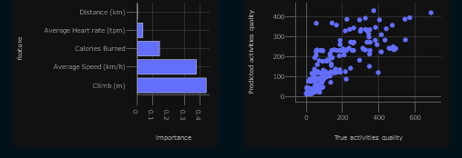

To put these nodes in the pipeline, importing the functions, in `src/kedro_ml/pipelines/data_science/pipeline.py`:
``` python
from kedro.pipeline import Pipeline, node, pipeline

from .nodes import evaluate_model, plot_differences, split_data, train_model, testing_model, plot_feature_importance, plot_residuals

def create_pipeline(**kwargs) -> Pipeline:
    return pipeline(
        [
            node(
                func=split_data,
                inputs=["model_input_table", "params:model_options"],
                name="split_data_node",
                outputs=["X_train", "X_test", "X_val", "y_train", "y_test", "y_val"],
            ),
            node(
                func=train_model,
                inputs=["X_train", "y_train", "params:model_options"],
                name="train_model_node",
                outputs=["regressor", "hyperparameters"],
            ),
            node(
                func=evaluate_model,
                inputs=["regressor", "X_val", "y_val"],
                name="evaluate_model_node",
                outputs="metrics",
            ),
            node(
                func=testing_model,
                inputs=["regressor", "X_test", "y_test"],
                name="testing_model_node",
                outputs="test_difference",
            ),
            node(
                func=plot_feature_importance,
                inputs=["regressor", "model_input_table"],
                name="plot_feature_importance_node", 
                outputs="plot_feature_importance_img",
            ),
            node(
                func=plot_residuals,
                inputs=["regressor", "X_test", "y_test"],
                name="plot_residuals_node", 
                outputs="plot_residuals_img",
            ),
            node(
                func=plot_differences,
                inputs=["test_difference"],
                name="plot_differences_node", 
                outputs="plot_differences_img",
            ),
        ]
    )
```

Now I register the new pipeline, in `src/kedro_ml/pipelines_registry.py`:
``` python
from kedro_ml.pipelines import data_processing as dp
from kedro_ml.pipelines import data_science as ds

def register_pipelines() -> Dict[str, Pipeline]:
    """Register the project's pipeline.

    Returns:
        A mapping from a pipeline name to a ``Pipeline`` object.
    """
    data_processing_pipeline = dp.create_pipeline()
    data_science_pipeline = ds.create_pipeline()

    return {
        "__default__": data_processing_pipeline + data_science_pipeline,
        "dp": data_processing_pipeline,
        "ds": data_science_pipeline,
    }
```

At this point I was able to run the two Kedro pipelines, built in sequence, and I obtained a trained and ready-to-use Machine Learning model.

Kedro is enable to create `session_store.db` SQLiteStore file in `data/`. To do this, set up the session store in the `src/kedro_ml/settings.py`:
``` python
from kedro_viz.integrations.kedro.sqlite_store import SQLiteStore
from pathlib import Path

SESSION_STORE_CLASS = SQLiteStore
SESSION_STORE_ARGS = {"path": str(Path(__file__).parents[2] / "data")}
```

***GitHub Actions***

*To implement a Continuous Integration, I write the workflows with GitHub Actions. In `.github/workflows/ci.yaml`:*
``` yaml
name: model-activities-kedro
on: [push]
jobs:
  build:
    runs-on: ubuntu-latest
    container: docker://dvcorg/cml-py3:latest

    steps:
    - uses: actions/checkout@v2
    - name: Set up Python 3.7.9
      uses: actions/setup-python@v2
      with:
        python-version: 3.7.9

    - uses: actions/cache@v2
      with:
        path: ${{ env.pythonLocation }}
        key: ${{ env.pythonLocation }}-${{ hashFiles('src/requirements.txt') }}
        
    - name: Install dependencies
      run: |
        python -m pip install --upgrade pip
        pip install -r src/requirements.txt
        
    - name: Run Kedro Pipeline
      env:
          REPO_TOKEN: ${{ secrets.GITHUB_TOKEN }}
      run: |
        kedro run
                
    - name: Create CML report - metrics
      env:
          REPO_TOKEN: ${{ secrets.GITHUB_TOKEN }}
      run: |        
        echo "## Data metrics" > report.md
        cat "data/09_tracking/metrics.json/$( cat data/last_version.txt )/metrics.json" >> report.md   
        cml-send-comment report.md
               
    - name: Create CML report - Columns
      env:
          REPO_TOKEN: ${{ secrets.GITHUB_TOKEN }}
      run: | 
        echo "## Columns" > report.md
        cat "data/09_tracking/activities_columns.json/$( cat data/last_version.txt )/activities_columns.json" >> report.md   
        cml-send-comment report.md
        
    - name: Create CML report - plots
      env:
          REPO_TOKEN: ${{ secrets.GITHUB_TOKEN }}
      run: |        
        echo "## Data viz" > report.md
        cml-publish data/08_reporting/feature_importance.png --md >> report.md
        cml-publish data/08_reporting/residuals.png --md >> report.md        
        cml-send-comment report.md
```
*To each commit it is run from the `Pull request` that show the results and plots. An example of a success pull request:*

<div align="center">
  
</div>

## DP Step 05

To keep track of all the machine learning models built, I installed [MLflow](https://mlflow.org/docs/latest/index.html).
<div align="center">
  
</div>

```
pip install mlflow
```

This creates an additional folder in the project (`mlruns/`), to save all the model versions and their information. In the pipeline of  model engineering I specified MLflow logs referring to the model, parameters, metrics values, and other useful tags that I want to archive. 

**MLflow logs**

To log file:
``` python
mlflow.log_artifact(local_path=os.path.join("data", "01_raw", "DATA.csv"))
```
``` python
mlflow.log_artifact(local_path=os.path.join("data", "04_feature", "model_input_table.csv", dirname ,"model_input_table.csv"))
mlflow.log_artifact(local_path=os.path.join("data", "08_reporting", "feature_importance.png"))
mlflow.log_artifact(local_path=os.path.join("data", "08_reporting", "residuals.png")) 
```

To log model:
``` python
mlflow.sklearn.log_model(sk_model=regressor, artifact_path="model")
```

To log key-value param:
``` python
mlflow.log_param('test_size', parameters["test_size"])
mlflow.log_param('val_size', parameters["val_size"])
mlflow.log_param('max_depth', parameters["max_depth"])
mlflow.log_param('random_state', parameters["random_state"])
```

To log key-value metric:
``` python
mlflow.log_metric("accuracy", score)
mlflow.log_metric("mean_absolute_erro", mae)
mlflow.log_metric("mean_squared_error", mse)
mlflow.log_metric("max_error", me)
```

To set key-value tag:
``` python
mlflow.set_tag("Model Type", "Random Forest")
```

To achieve this, in the MLflow configuration file I set up the entry point to run Kedro, so now it is possible directly from MLflow run command to launch the Kedro pipelines (`kedro run`).

Set the option in `MLproject` file:
``` yaml
name: kedro mlflow
conda_env: conda.yaml
entry_points:
  main:
    command: "kedro run"
```

To run MLflow, you need to these configuration:

- **Before activate conda environment** 

  Need Python version 3.7. Using conda:
  ```
  conda create -n env_name python=3.7
  ```
  ```
  conda activate env_name
  ```

- **To run MLflow project** 
  ```
  mlflow run . --experiment-name activities-example
  ```
- **To run mlflow project in Windows**
  ```
  mlflow run . --experiment-name activities-example --no-conda
  ```

- **To vizualize MLflow project** 

  From the MLflow interface we can now see all the experiments done. You can run ui as follows:
  ```
  mlflow ui
  ```
  To see the mlflow ui go to the `270.0.0.1:5000` browser page.

## DP Step 06

I now want to package the model and create its prediction service, so I installed [BentoML](https://docs.bentoml.org/en/latest/).
<div align="center">
  
</div>

```
pip install bentoml
```
BentoML stores all packaged model files under the `~/bentoml/repository/{service_name}/{service_version}` directory by default.

I then imported the model into BentoML through one of its explicit methods, and created a service that uses that model. 

**Import the model**

To save the model is used to help MLflow, included in BentoML module, so update `src/pipeline/data_science/nodes.py` file with:
``` python
import bentoml

bentoml.mlflow.import_model("my_model", model_uri= os.path.join(os.getcwd(), 'my_model', dirname))
```
All imported model version are saved in the BentoML folder `my_model/`.

**Prediction Service**

To implement the service, in `service.py` file:
``` python
def predict(input_data: pd.DataFrame):
  with open(os.path.join("conf", "base", "parameters", "data_science.yml"), "r") as f:
    configuration = yaml.safe_load(f)    
  with open('temp.json', 'w') as json_file:
    json.dump(configuration, json_file)    
  output = json.load(open('temp.json'))
  
  parameters = {"header":output["model_options"]["features"]}
  input_data = create_model_input_table(input_data, parameters)
  input_data, dict_col = preprocess_activities(input_data)
  
  print("Start the prediction...")
  return model_runner.predict.run(input_data)
```

So when I run the BentoML build command, it creates a bento, that is a file with model, service, source code, dependency configurations and other useful information to start the service. To deploy the bento, I packed this through a simple BentoML method, and I got a docker image of the bento. 

Bento is crete with the command:
```
bentoml build
```
To prevent conflicts with ports already in use, I changed it in the `bentofile.yaml` configuration file.
``` yaml
service: "service:svc"
include:
  - "service.py"
  - "src/kedro_ml/pipelines/data_processing/nodes.py"
conda:
  environment_yml: "./conda.yaml"
docker:
  env:
  - BENTOML_PORT=3005
```

**BentoML Commands**

To see all bento models:
```
bentoml models list
```

To see more about a bento model:
```
bentoml models get <name_model>:<number_version>
```

To start Bento model in production:
```
bentoml serve <name_model>:latest --production
```

If use Windows run Bento Server without `-- reload`:

```
bentoml serve service:svc --reload
```

or more general:
```
bentoml serve
```

Sending the command  BentoML serve, turns on the service.
Uou can open a web page `127.0.0.1:3000` to have a model serving.

**Deploy**

The three most common deployment options with BentoML are:
* 🐳 Generate container images from Bento for custom docker deployment
* 🦄️ Yatai: Model Deployment at scale on Kubernetes
* 🚀 bentoctl: Fast model deployment on any cloud platform

We containerize Bentos as Docker images allows users to easily distribute and deploy bentos. With the command:
```
bentoml containerize activities_model:latest
```

## DP Step 07

Finally I installed the [kedro-docker](https://github.com/quantumblacklabs/kedro-docker) plugin, to make Kedro pipelines distributable and to make it available to users quickly and accurately

```
pip install kedro-docker
```

I adjusted the settings in the Dockerfile, such as the port and the command to execute, in `Dockerfile` file.
``` python
EXPOSE 3030
```
Note: by default the bento port is 3000, but it is also the same port as granafa, another tool used in Production phase.

Set the command, one of these:
``` python
CMD ["kedro", "run"]
```
``` python
CMD [ "python3", "-m" , "flask", "run", "--host=0.0.0.0", "--port=3030"]
```
Note: if we want it to be just the kedro pipeline then we use CMD ["kedro", "run"], otherwise if we want it to also be capable of more interactivity with production pahse we use the second CMD, thus activating the apllication.

Now it is possible to create a Docker image and run the Kedro project in a Docker environment.

**To create and run Docker image**

For create docker image of Kedro pipeline.
```
kedro docker build --image pipeline-ml
```

To run the docker model:
```
docker run <name_model>
```
or to production:
```
docker run <name_model> serve --production
```

Or to run the project in a Docker environment:
```
kedro docker run --image <image-name>
```

## DP Step 08

To simplify the execution I wrote a Python script (`run.py`) that answers to command lines in order to interact with pipeline and all steps. It makes it easier to fulfill tasks, such as opening tool GUI, creating a new model and its bento (with a unique TAG), and updating dataset. The available command lines are:

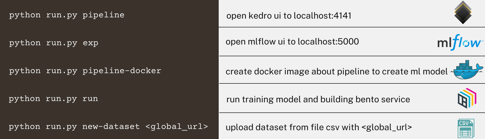

## DP Getting Started

### DP Parameters
For change the parameters, there are `config/base/parameters/[pipeline_name].yml` file.

In `config/base/parameters/data_processing.yml`:
``` yaml
table_columns:
  header:
    - Distance (km)
    - Average Speed (km/h)
    - Calories Burned
    - Climb (m)
    - Average Heart rate (tpm)
    - Quality
```

In `config/base/parameters/data_science.yml`:
``` yaml
model_options:
  test_size: 0.2
  val_size: 0.25
  random_state: 42
  max_depth: 2
  features:
    - Distance (km)
    - Average Speed (km/h)
    - Calories Burned
    - Climb (m)
    - Average Heart rate (tpm)
```

### DP Installation
All necessary installations are present at the `src/requirements.txt`

``` yaml
kedro
kedro[pandas.CSVDataSet, pandas.ExcelDataSet, pandas.ParquetDataSet]
kedro-viz                                                          
scikit-learn
matplotlib
seaborn
numpy
mlflow
bentoml
dvc
kedro-docker
requests
flask
```

## DP Usage

### Kedro Platform 
At `270.0.0.1:4141` browser page.


From here we can also see and compare the experiments, that are the versions created runned the kedro project.


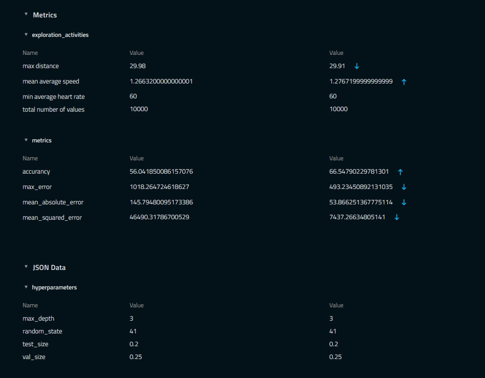

### MLflow Platform 

At `270.0.0.1:5000` browser page.

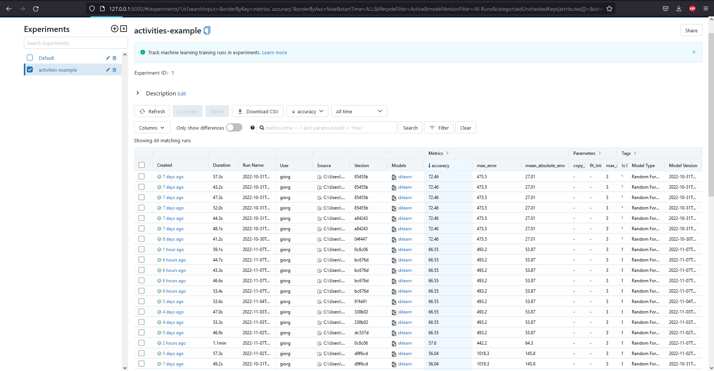

From this page we can select a single experiment and see more information about it.

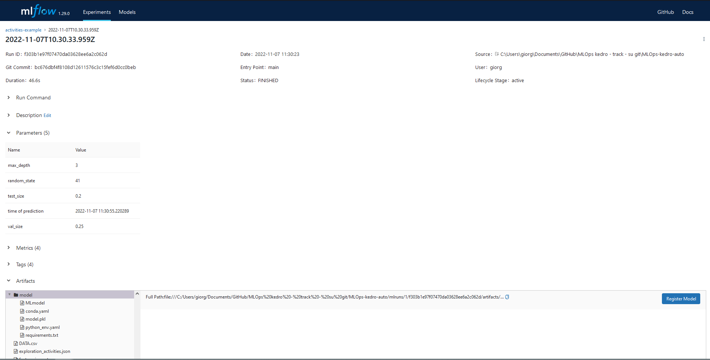

### BentoML Platform

At web page `127.0.0.1:3000`.


# Production Phase

Themes implemented: prediction service, monitoring, alerting and application & trigger. 

The following image illustrates how the Production phase works. 


## PP Step 01
This project starts using the prediction service in the bento built in the previous phase. Then by running the service from Docker we can interact with it and send it prediction requests.

My most relevant metrics are data drift and output drift. In fact, these allow the technician to know when it is necessary to create a new model because the current one has become too dated and distant from the current world. These metrics need to know and compare with the dataset on which the model was previously trained. I then extracted the requested dataset using DVC from my personal Google Drive where it was stored.

To use DVC:
```
dvc init
```
```
dvc remote add -d storage [url]
```
```
dvc add datasets/DATA.csv
```
To download the dataset from Google Drive:
```
dvc pull --force
```

## PP Step 02

<div align="center">
  
</div>

To write the code, I used the [Evidently](https://www.evidentlyai.com/) tool and its methods and classes to implement functions that calculate drift values and other information about the input dataset.

```
pip install evidently
```

To start I write `scripts/monitoring.py` file:

**Importing**

``` python
from evidently.report import Report
from evidently.metric_preset import DataDrift, NumTargetDrift
 
from evidently.test_suite import TestSuite
from evidently.test_preset import DataStability
from evidently.tests import *
```

**Data Stability**

``` python
def data_stability_test(reference: pd.DataFrame, current: pd.DataFrame):
    logging.info("Data stability test. Test suite.")
     # A test suite contains several individual tests. Each test compares a specific metric against a defined condition and returns a pass/fail result. 
    # DataStability run several checks for data quality and integrity

    data_stability = TestSuite(tests=[DataStability(),])
    data_stability.run(reference_data=reference, current_data=current)
    data_stability.save_html(os.path.join("metrics_app", "templates", "data_stability.html"))
```

**Report**

``` python
def drift_report(reference: pd.DataFrame, current: pd.DataFrame):
    logging.info("DataDrift and NumTargetDrift. Drift report.")
    # Reports calculate various metrics and generate a dashboard with rich visuals.

    drift_report = Report(metrics=[DataDrift(), NumTargetDrift()])
    drift_report.run(reference_data=reference, current_data=current)
    drift_report.save_html(os.path.join("metrics_app", "templates", "drift_report.html"))
```

**Test Suite**

``` python
def data_tests(reference: pd.DataFrame, current: pd.DataFrame):
    logging.info("DataDrift and NumTargetDrift. Drift report.")
    # Data drift and feature drift

    data_drift_tests = TestSuite(tests=[
        TestNumberOfColumnsWithNulls(),
        TestNumberOfRowsWithNulls(),
        TestNumberOfConstantColumns(),
        TestNumberOfDuplicatedRows(),
        TestNumberOfDuplicatedColumns(),
        TestNumberOfDriftedFeatures(),
        TestShareOfDriftedFeatures(),
    ])
    data_drift_tests.run(reference_data=reference, current_data=current)
    data_drift_tests.save_html(os.path.join("metrics_app", "templates", "data_drift_tests.html"))
```

Applying Evidently collection of tests and reports, I exported the results in HTML format, which can then in the future be archived or distributed to other areas depending on the needs of the company. These are saved in `metrics_app/templates/` folder and are named `data_drift_tests.html`, `data_stability.html` and `drift_report.html`.
Example of created html pages:

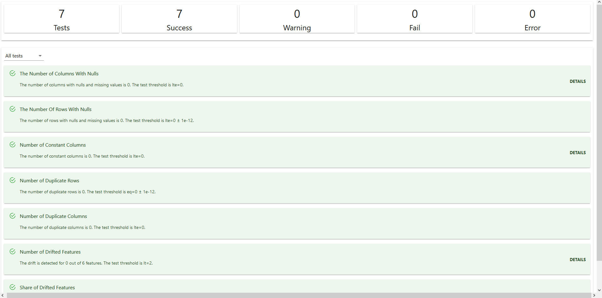


## PP Step 03

To have real-time monitoring of the model and services I need the Grafana tool. I noticed that there is an integration of Evidently with Grafana and Prometheus, but still in development, so I started from this integration project ([Real-time ML monitoring with Evidently and Grafana](https://github.com/evidentlyai/evidently/tree/main/examples/integrations/grafana_monitoring_service))available at the official Evidently documentation, by adapting it to my experience.

<div align="center">
  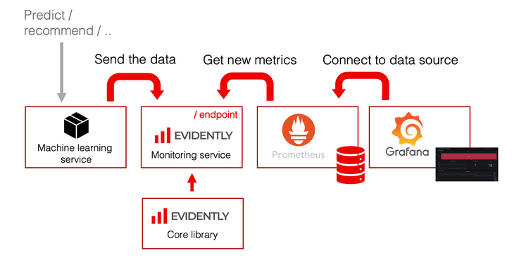
</div>

There are several scripts that allow a chain of operations, one of which (`example_run_request.py`) allows interaction with the bento service, where it sends row by row from the table with production data and then wait for the result. The submitted table is first manipulated and cleaned, by another script, to be accepted by the prediction service.

**scripts/example_run_request.py**

The function that interact with bento service:
``` python 
def send_data_row(dataset_name: str, data: Dict) -> None:
    print(f"Send a data item for {dataset_name}")

    try:
        response = requests.post(
            f"http://localhost:8085/iterate",
            data=json.dumps([data], cls=NumpyEncoder),
            headers={"content-type": "application/json"},
        )

        if response.status_code == 200:
            print(f"Success.")

        else:
            print(
                f"Got an error code {response.status_code} for the data chunk. "
                f"Reason: {response.reason}, error text: {response.text}"
            )

    except requests.exceptions.ConnectionError as error:
        print(f"Cannot reach a metrics application, error: {error}, data: {data}")
```

**scripts/prepare_data.py**

For the comparing, in this file are adapted the two dataset, of training and of request. The path of these are in the parameters file `parameters/params.json`. 
``` python 
def take_datasets():
    logging.info("Take datasets")
    reference_data = pd.read_csv(os.path.join(dataset_path, params["file_name_training_data"]))
    production_data = pd.read_csv(os.path.join(dataset_path, params["file_name_request_data"]))
    
    logging.info("Reference dataset was created with %s rows", reference_data.shape[0])
    logging.info("Production dataset was created with %s rows", production_data.shape[0])

    for single in [reference_data, production_data]:
        for column in single.columns:
            if column not in header_params["header"]:
                single.drop(column, axis=1, inplace=True)

    logging.info("Save datasets to %s", dataset_path)
    reference_data.to_csv(os.path.join(dataset_path, params["file_name_training_data_clean"]), index=False)
    production_data.to_csv(os.path.join(dataset_path, params["file_name_request_data_clean"]), index=False)
```

**scripts/run_example.py**

To manage and coordinate the scripts for each request for prediction, I update the file `scripts/run_example.py`.
``` python
def setup_logger():
    logging.basicConfig(
        level=logging.INFO, format="%(asctime)s [%(levelname)s] %(message)s", handlers=[logging.StreamHandler()]
    )

def check_docker_installation():
    logging.info("Check docker version")
    docker_version_result = os.system("docker -v")

    if docker_version_result:
        exit("Docker was not found. Try to install it with https://www.docker.com")

def check_dataset(
    force: bool,
    datasets_path: str,
    dataset_name: str,
) -> None:
    logging.info("Check dataset %s", dataset_name)
    dataset_path = os.path.join(datasets_path, dataset_name)

    if os.path.exists(dataset_path):
        if force:
            logging.info("Remove dataset directory %s", dataset_path)
            shutil.rmtree(dataset_path)
            os.makedirs(dataset_path)

        else:
            logging.info("Dataset %s already exists", dataset_name)
            return

    logging.info("Download dataset %s", dataset_name)

    os.system("python scripts/prepare_data.py")

def download_test_datasets(force: bool):
    datasets_path = os.path.abspath("datasets")
    logging.info("Check datasets directory %s", datasets_path)

    if not os.path.exists(datasets_path):
        logging.info("Create datasets directory %s", datasets_path)
        os.makedirs(datasets_path)

    else:
        logging.info("Datasets directory already exists")

    dataset_name = "model_input_table"
    check_dataset(force, datasets_path, dataset_name)

def send_data_requests():
    logging.info("Run scripts/example_run_request.py")
    os.system("python scripts/example_run_request.py")

def run_monitoring_html():
    logging.info("Run scripts/monitoring.py")
    os.system("python scripts/monitoring.py")

def main(force: bool):
    setup_logger()
    check_docker_installation()
    download_test_datasets(force=force)
    send_data_requests()
    run_monitoring_html()
    logging.info("Terminate. Attend next request...")
```

<div align="center">
  
</div>

A key element for monitoring is the Flask application (`metrics_app/app.py`) that encapsulates the interaction and data exchange between the Evidently and [Prometheus](https://prometheus.io/docs/introduction/overview/) tools. As mentioned above, Evidently calculates drifts, based on the request and prediction result, and collects them in "monitors", which are then collected by Prometheus.

**metrics_app/app.py**

``` python
# Add prometheus wsgi middleware to route /metrics requests
app.wsgi_app = DispatcherMiddleware(app.wsgi_app, {"/metrics": prometheus_client.make_wsgi_app()})

@dataclasses.dataclass
class MonitoringServiceOptions:
    min_reference_size: int
    use_reference: bool
    moving_reference: bool
    window_size: int
    calculation_period_sec: int

@dataclasses.dataclass
class LoadedDataset:
    name: str
    references: pd.DataFrame
    monitors: List[str]
    column_mapping: ColumnMapping

EVIDENTLY_MONITORS_MAPPING = {
    "cat_target_drift": CatTargetDriftMonitor,
    "data_drift": DataDriftMonitor,
    "data_quality": DataQualityMonitor,
    "num_target_drift": NumTargetDriftMonitor,
    "regression_performance": RegressionPerformanceMonitor,
    "classification_performance": ClassificationPerformanceMonitor,
    "prob_classification_performance": ProbClassificationPerformanceMonitor,
}

class MonitoringService:
    # names of monitoring datasets
    datasets: LoadedDataset
    metric: prometheus_client.Gauge
    # collection of reference data
    reference: pd.DataFrame
    # collection of current data
    current: Dict[str, pd.DataFrame]
    # collection of monitoring objects
    monitoring: ModelMonitoring
    calculation_period_sec: float = 15
    window_size: int

    def __init__(self, datasets: LoadedDataset, window_size: int):
      [...]

    def iterate(self, new_rows: pd.DataFrame):
      """Add data to current dataset for specified dataset"""
      [...]

SERVICE: Optional[MonitoringService] = None

@app.before_first_request
def configure_service():
    # pylint: disable=global-statement
    global SERVICE    
    [...]
```

## PP Step 04

Knowing that Prometheus collects data from various sources, I updated its configurations with the services that contain the metrics. The analyzed services are the bento prediction service, the Evidently service and the Alertmanager service.

Update `config/prometheus.yml` file: 
``` yaml
global:
  scrape_interval:     15s # By default, scrape targets every 15 seconds.
  evaluation_interval: 15s # By default, scrape targets every 15 seconds.
  # scrape_timeout is set to the global default (10s).

  # Attach these labels to any time series or alerts when communicating with
  # external systems (federation, remote storage, Alertmanager).
  external_labels:
      monitor: 'my-project'
      
# Load and evaluate rules in this file every 'evaluation_interval' seconds.
rule_files:
  - "prometheus_rules.yml"
      
# Here it's Prometheus itself.
scrape_configs:
  # The job name is added as a label `job=<job_name>` to any timeseries scraped from this config.
  - job_name: 'prometheus'

    # Override the global default and scrape targets from this job every 5 seconds.
    scrape_interval: 5s
    static_configs:
         - targets: ['localhost:9090']

  - job_name: 'service'
    scrape_interval: 10s
    static_configs:
      - targets: ['evidently_service.:8085']

  - job_name: 'bentoml'
    scrape_interval: 10s
    static_configs:
      - targets: ['bentoml.:3005']

  - job_name: 'alertmanager'
    scrape_interval: 10s
    static_configs:
      - targets: ['alertmanager.:9093']
```

It is important that the software warns the user of anomalies and drift, so I have provided the prometheus rules, in the appropriate prometheus file. For example, I have written multiple rules, such as in the case of dataset drift, feature drift, and a service gone down.

Update `config/prometheus_rules.yml` file: 
``` yaml
groups:
  - name: alert_rules
    rules:
      - alert: InstanceDown
        expr: up == 0
        for: 1m
        labels:
          severity: critical
        annotations:
          summary: "Instance [{{ $labels.instance }}] down"
          description: "[{{ $labels.instance }}] of job [{{ $labels.job }}] has been down for more 1 minute"

      - alert: DatabaseDrift
        expr: evidently:data_drift:dataset_drift == 1
        for: 1m
        labels:
          severity: critical
        annotations:
          summary: "Dataset drifting from (instance {{ $labels.instance }})"
          description: "Dataset used by job [{{ $labels.job }}] drifted"

      - alert: FeaturesDrift
        expr: evidently:data_drift:n_drifted_features > 0
        for: 1m
        labels:
          severity: critical
        annotations:
          summary: "Features drifting from (instance {{ $labels.instance }})"
          description: "The number of feature drifted is {{ $value }}"
      
      - alert: TargetDrift
        expr: evidently:cat_target_drift:drift > 0
        for: 1m
        labels:
          severity: critical
        annotations:
          summary: "Target drifting from (instance {{ $labels.instance }})"
          description: "Target by job [{{ $labels.job }}] drifted"
```

## PP Step 05

I also want the occurrence of an anomaly or drift to be notified and then sent to the user to other destinations, in addition to the Prometheus interface. I used [Alertmanager](https://prometheus.io/docs/alerting/latest/overview/).
<div align="center">
  
</div>

Then I set up the config file `alertmanager.yml` in which I specified the url api of my Slack chat where I want to receive such alerts. I exanded `title` and `text` to more explain the problem.
``` yaml
global:
  resolve_timeout: 5m

route:
  group_by: [ alertname  ]
  receiver: slack_notifications

receivers:
    - name: slack_notifications
      slack_configs:
      - api_url: 'https://hooks.slack.com/services/[ID]'
        channel: '#monitoring'
        send_resolved: true
        icon_url: https://avatars3.githubusercontent.com/u/3380462
        title: |-
          [{{ .Status | toUpper }}{{ if eq .Status "firing" }}:{{ .Alerts.Firing | len }}{{ end }}] {{ .CommonLabels.alertname }} for {{ .CommonLabels.job }}
          {{- if gt (len .CommonLabels) (len .GroupLabels) -}}
            {{" "}}(
            {{- with .CommonLabels.Remove .GroupLabels.Names }}
              {{- range $index, $label := .SortedPairs -}}
                {{ if $index }}, {{ end }}
                {{- $label.Name }}="{{ $label.Value -}}"
              {{- end }}
            {{- end -}}
            )
          {{- end }}
        text: >-
          {{ range .Alerts -}}
          *Alert:* {{ .Annotations.title }}{{ if .Labels.severity }} - `{{ .Labels.severity }}`{{ end }}

          *Description:* {{ .Annotations.description }}

          *Details:*
            {{ range .Labels.SortedPairs }} • *{{ .Name }}:* `{{ .Value }}`
            {{ end }}
          {{ end }}
```

Also, add in `config/prometheus.yml` file: 

``` yaml
alerting:
  alertmanagers:
  - scheme: http
    static_configs:
    - targets: [ 'alertmanager:9093' ]
```
## PP Step 06

<div align="center">
  
</div>

To finally have the interface with realtime data, there are two more [Grafana](https://grafana.com/) configuration files, one where Prometheus is specified as the datasource and one with pre-created dashboards. 

Update `config/grafana_datasource.yaml` file with the data sources.
``` yaml
# list of datasources that should be deleted from the database
deleteDatasources:
  - name: Prometheus
    orgId: 1

# list of datasources to insert/update depending
# what's available in the database
datasources:
  - name: Prometheus
    type: prometheus
    access: proxy
    url: http://prometheus.:9090
```

So the user from the Grafana interface has the dashboards already in the project but can also create his own dashboards customizing them to his needs.

The dashboards, for example, are collected in `dashboards/` folder, and such as examples are `my_evidently.json` and `my_prometheus.json`. This folder is specified in the configuration `grafana_dashboards.yaml` file:
``` yaml
providers:
  # <string> an unique provider name. Required
  - name: 'Evidently Dashboards'
    # <int> Org id. Default to 1
    orgId: 1
    # <string> name of the dashboard folder.
    folder: ''
    # <string> folder UID. will be automatically generated if not specified
    folderUid: ''
    # <string> provider type. Default to 'file'
    type: file
    # <bool> disable dashboard deletion
    disableDeletion: false
    # <int> how often Grafana will scan for changed dashboards
    updateIntervalSeconds: 10
    # <bool> allow updating provisioned dashboards from the UI
    allowUiUpdates: false
    options:
      # <string, required> path to dashboard files on disk. Required when using the 'file' type
      path: /opt/grafana/dashboards
      # <bool> use folder names from filesystem to create folders in Grafana
      foldersFromFilesStructure: true
```

## PP Step 07
<div align="center">
  
</div>

Thinking that this project is a support for technicians in companies to monitor production models, I also wrote an application (`metrics_app/streamlit_app.py`) using the [Streamlit](https://streamlit.io/) library.

Install Streamlit library:
```
pip install streamlit
```

With this application I use the bento service, I can ask to pull down the training dataset from Drive, and I can make multiple requests to the development phase project. On the opposite side there is a Flask application which reacts to requests from Streamlit application. In `metrics_app/streamlit_app.py`:

``` python
st.title("Production platform")

st.header("Welcome, the model is ready!")

flag = True

tab1, tab2, tab3, tab4 = st.tabs(["Predictions", "Monitor", "Complete Retrain", "Single actions"])

with tab1:    
    st.subheader("Upload file csv")
    [...]

with tab2:
    st.subheader("Can you monitor from:")
    [...]

with tab3:
    st.subheader("Is drift verified?")
    [...]

with tab4:
    st.subheader("Retrain model?")
    [...]
```


I created a few example pages to show how the Streamlit application can best be suited to the needs or type of user who is going to use it. From the first page you can request a forecast from the ML model. From the second, the user can conveniently connect to the various interfaces to help monitor. From the third, it is possible to request a new model for the development phase from production. From the fourth page, the technician can request the development phase of the less complex actions, and the available API of [Flask](https://flask.palletsprojects.com/en/2.2.x/) application are:

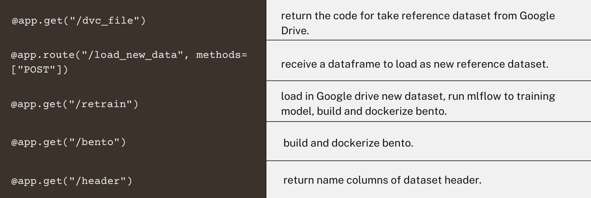

In Development phase, `app.py`:
``` python
from flask import Flask
import flask
import pandas as pd
import os
import yaml
import json

from run import update_data, run_retrain, bentoml_set


app = Flask(__name__)

@app.get("/dvc_file")
def get_dvc_file():
    str = open('data/01_raw/DATA.csv.dvc', 'r').read()
    return str

@app.route("/load_new_data", methods=["POST"])
def load_new_data():
    item = flask.request.json
    df_data = pd.DataFrame.from_dict(item)
    print(df_data.head())
    update_data(df_data)
    run_retrain()
    return "ok"

@app.get("/retrain")
def retrain():
    run_retrain()
    return "ok"

@app.get("/bento")
def bento():
    bentoml_set()
    return "ok"

@app.get("/header")
def header():    
    with open(os.path.join("conf", "base", "parameters", "data_processing.yml"), "r") as f:
        configuration = yaml.safe_load(f)    
    with open('temp.json', 'w') as json_file:
        json.dump(configuration, json_file)    
    output = json.load(open('temp.json'))

    return output["table_columns"]
```

To run Flask application, usefull for Production phase: 
```
flask run --host=0.0.0.0 --port=3030
```

## PP Getting Started

To run the streamlit app:
```
streamlit run .\metrics_app\streamlit_app.py
```

To run all the services in the production phase, is used docker compose.

In `docker-compose` file, these services are specified with their ports and volumes:
``` python
services:
  evidently_service:
    build:
      context: .
      dockerfile: Dockerfile
    ports:
      - "8085:8085"
    [...]

  prometheus:
    image: prom/prometheus
    ports:
      - "9090:9090"
    [...]

  grafana:
    image: grafana/grafana
    user: "472"
    depends_on:
      - prometheus
    ports:
      - "3000:3000"
    [...]

  bentoml:
    image: activities_model:${TAG}
    ports:
      - "3005:3005"
    [...]

  alertmanager:
    image: prom/alertmanager:v0.23.0
    ports:
      - "9093:9093"
    [...]
```
*Note: in bentoml image is used {TAG}, so it run the latest ml model. This value is take from `.env` file.*

``` python
TAG=adxlqlc6v6p3rgbm
```

So, to up and start all docker images:
```
docker compose up
```

In Docker desktop appear/run these images: `prom/prometheus`, `grafana/grafana`, `mlops-observability-evidently_service`, `prom/alertmanager`. Also this command run `bento` image about the ml model.

### PP Parameters
For change the parameters, there is `parameters/params.json`.
``` json
{
    "file_name_request_data": "request_data.csv",
    "file_name_training_data": "DATA.csv",
    "file_name_request_data_clean": "request_data_clean.csv",
    "file_name_training_data_clean": "training_data_clean.csv",
    "numerical_features_names": [
        "Distance (km)",
        "Average Speed (km/h)" ,
        "Calories Burned",
        "Climb (m)",
        "Average Heart rate (tpm)"
    ],
    "window_size": 500,
    "monitors_name": [
        "cat_target_drift",
        "data_drift", 
        "data_quality", 
        "num_target_drift",
        "regression_performance"
    ]
}
```

Instead `parameters/header_params.json` is automatically update with the header params of Develop Phase.
``` json
{"header":
  ["Distance (km)",
    "Average Speed (km/h)",
    "Calories Burned",
    "Climb (m)",
    "Average Heart rate (tpm)",
    "Quality"]
}
```

**Ports**
| Tool | Port |
| --- | --- |
| Bento | `localhost:3005` |
| Service | `localhost:8085` |
| Prometheus | `localhost:9090` |
| Alertmanager | `localhost:9093` |
| Grafana | `localhost:3000` |
| Streamlit App | `localhost:8501` |

### PP Prerequisites

For the first time:
1. you need to update TAG as environment variable, to have the latest built model.
    * From streamlit app, in the fourth tab "Single actions" there is the button "Update model in monitoring sector?" to update the model that is the TAG.
2. you need to specify your destination of notifications.
    * In `config/alermanager.yml` file:
      ``` yaml
      slack_configs:
      - api_url: ****
        channel: '#monitoring'
      ```

### PP Installation

The necessary installations are present at the `metrics_app/requirements.txt`:
``` yaml
Flask~=2.0.1
pandas~=1.1.5
requests~=2.26.0
prometheus_client~=0.11.0
pyyaml~=5.4.1
evidently
dvc
```

The installations are execute through `Dockerfile`:
``` python
COPY metrics_app/requirements.txt requirements.txt

RUN pip3 install -r requirements.txt

RUN pip3 install evidently

COPY metrics_app .

CMD [ "python3", "-m" , "flask", "run", "--host=0.0.0.0", "--port=8085"]
```

To run streamlit app. it is necessary:
```
pip install streamlit
```

## PP Usage

### Streamlit App

From this application the users can:

- require predictions;

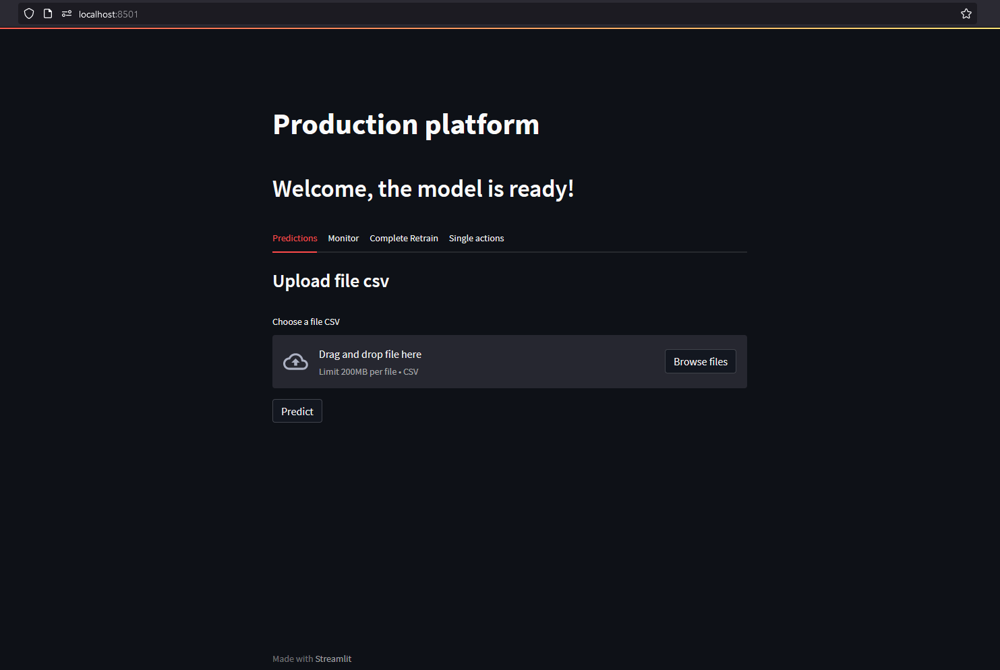

- find directly link to observation tools;

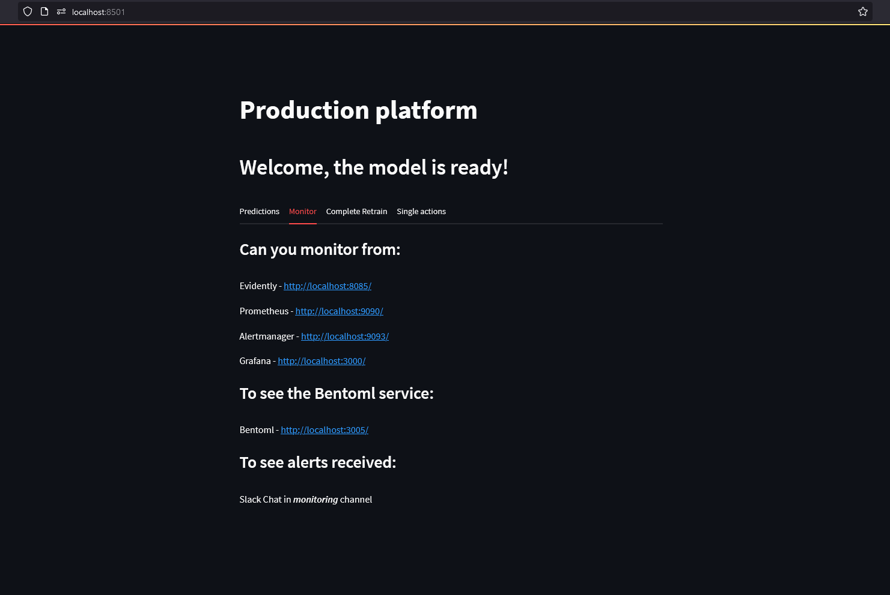

- run to retrain the ml model;


- run single actions usefull.


### Prometheus Dashboard
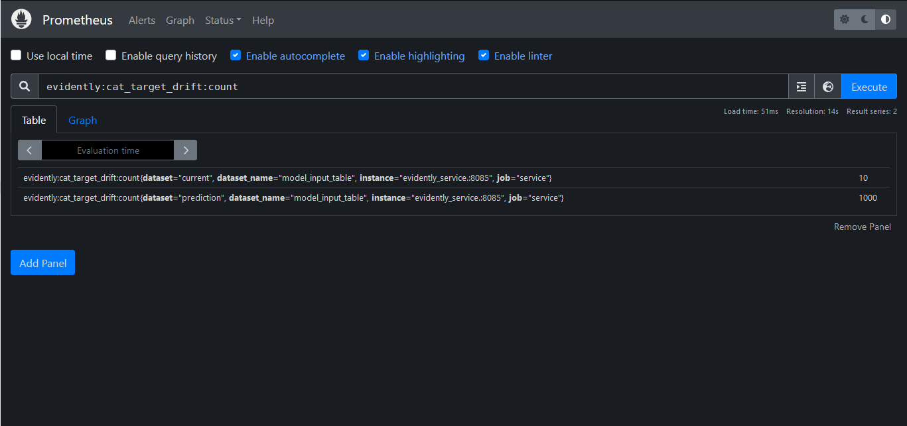

From its `/alerts` the user can see the alert active and which is verified.


### AlertManager Dashboard


In the next image you can see a example of an alert message sent to a chat Slack. Show a example of chat where Alertmanager send alert, with details.

<div align="center">
  
</div>

### Grafana Dashboard

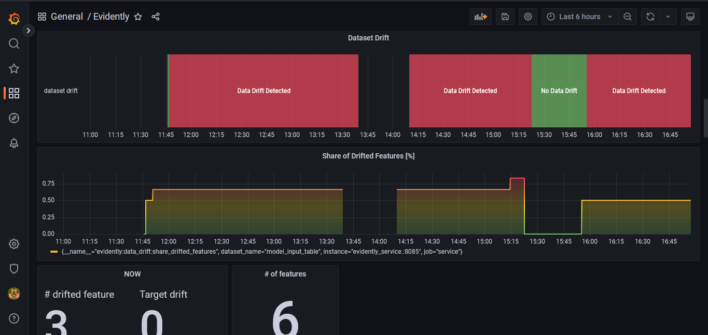

# Acknowledgments

* [ml-ops.org](https://ml-ops.org/)
* [neptune.ai](https://neptune.ai/blog/mlops)
* [mlebook.com](http://www.mlebook.com/wiki/doku.php)
* [cloud.google.com about MLOps](https://cloud.google.com/architecture/mlops-continuous-delivery-and-automation-pipelines-in-machine-learning)
* [Made With ML](https://madewithml.com/courses/mlops/)
* Book "Introducing MLOps How to Scale Machine Learning in the Enterprise (Mark Treveil, Nicolas Omont, Clément Stenac etc.)"
